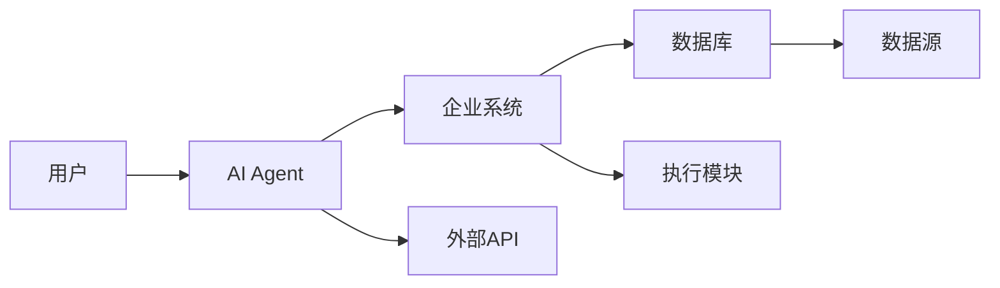
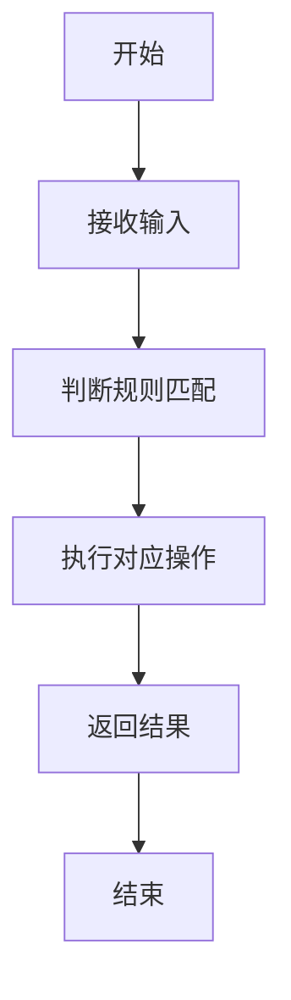
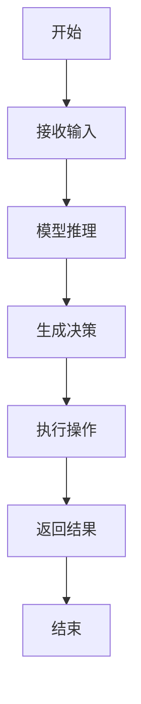
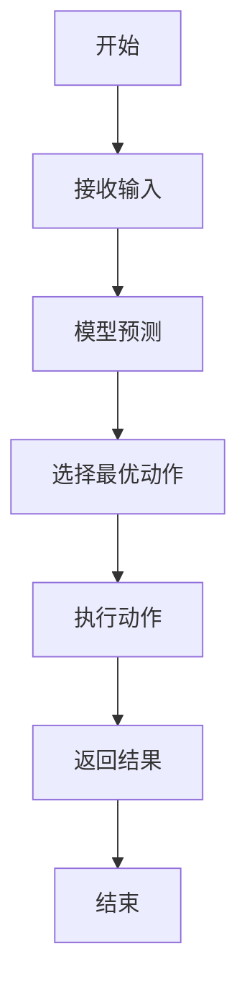
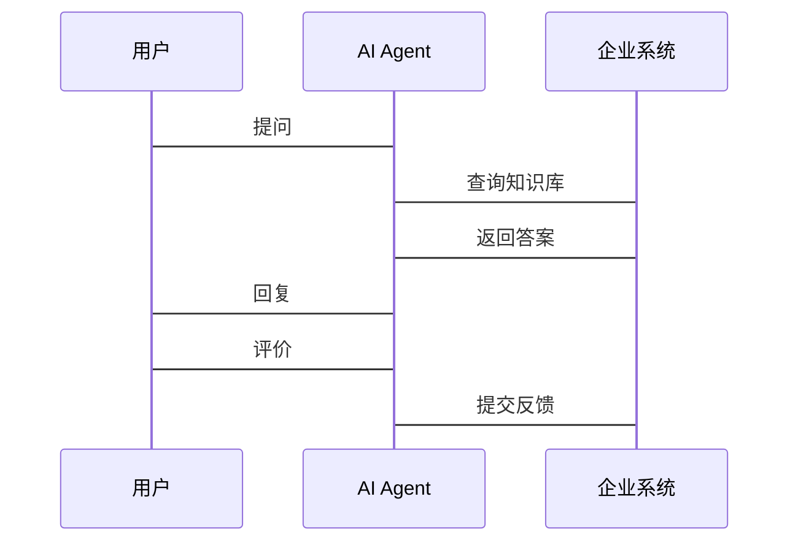

                 


---

# AI Agent在企业数字化转型中的战略定位与实施路径

## 关键词：AI Agent、企业数字化转型、战略定位、实施路径、人工智能

## 摘要：AI Agent作为人工智能技术的重要组成部分，在企业数字化转型中扮演着越来越重要的角色。本文从AI Agent的核心概念、算法原理、系统架构到实际应用场景进行了全面分析，并提出了企业在数字化转型中的实施路径和最佳实践，为企业的技术决策者和管理人员提供了有价值的参考。

---

# 第一部分: AI Agent在企业数字化转型中的战略定位

# 第1章: AI Agent与企业数字化转型概述

## 1.1 AI Agent的核心概念

### 1.1.1 什么是AI Agent
AI Agent（人工智能代理）是一种能够感知环境、自主决策并执行任务的智能实体。它可以理解为一种智能系统，通过接收输入、分析数据、做出决策并执行操作，以达到预定的目标。AI Agent的核心在于其智能化和自动化能力，能够适应复杂的环境变化并优化任务执行效率。

### 1.1.2 AI Agent的特点与优势
AI Agent具有以下特点：
- **自主性**：能够在没有外部干预的情况下自主运行。
- **反应性**：能够根据环境变化实时调整行为。
- **学习性**：通过数据和经验不断优化决策能力。
- **可扩展性**：能够适应不同规模和复杂度的任务。

### 1.1.3 AI Agent与传统自动化工具的区别
与传统的自动化工具相比，AI Agent具有以下优势：
- **智能化**：能够理解和处理非结构化数据。
- **自适应性**：能够根据环境变化动态调整策略。
- **决策能力**：能够基于数据和模型做出复杂决策。

## 1.2 企业数字化转型的背景与趋势

### 1.2.1 数字化转型的定义与目标
数字化转型是指企业利用数字技术（如人工智能、大数据、云计算等）重构业务模式、流程、组织架构和文化的过程。其目标是提高企业效率、增强客户体验、优化资源配置并推动创新。

### 1.2.2 企业数字化转型的驱动力
企业数字化转型的驱动力包括：
- **市场竞争压力**：企业需要通过数字化转型提升竞争力。
- **技术进步**：人工智能、大数据等技术的快速发展为企业提供了新的工具。
- **客户需求变化**：客户期望更高的服务质量和效率。

### 1.2.3 AI Agent在数字化转型中的作用
AI Agent在企业数字化转型中发挥着关键作用：
- **自动化与智能化**：通过自动化处理重复性任务，提升效率。
- **数据驱动决策**：基于数据分析提供智能决策支持。
- **优化流程**：通过优化企业流程降低成本，提高效率。

## 1.3 AI Agent在企业中的应用场景

### 1.3.1 智能客服与客户关系管理
AI Agent可以通过自然语言处理技术（NLP）与客户进行交互，解决客户问题并提供个性化服务。

### 1.3.2 供应链优化与库存管理
AI Agent可以通过实时数据分析优化供应链管理，降低库存成本并提高交付效率。

### 1.3.3 智能决策支持系统
AI Agent可以通过数据建模和预测分析，为企业提供智能决策支持。

### 1.3.4 智慧办公与企业流程自动化
AI Agent可以自动化处理企业内部流程，提高办公效率并降低人工成本。

---

# 第2章: AI Agent的核心原理与架构

## 2.1 AI Agent的感知与决策机制

### 2.1.1 感知层：数据采集与处理
AI Agent通过传感器、数据库或API等途径采集数据，并对数据进行清洗、转换和分析。

### 2.1.2 决策层：基于数据的智能决策
AI Agent基于感知层提供的数据，结合预设规则或机器学习模型进行决策。

### 2.1.3 执行层：任务执行与反馈
AI Agent根据决策结果执行任务，并通过反馈机制不断优化自身的决策和执行过程。

## 2.2 AI Agent的类型与分类

### 2.2.1 基于规则的AI Agent
基于规则的AI Agent通过预设的规则进行决策和执行。例如，简单的条件判断逻辑。

### 2.2.2 基于模型的AI Agent
基于模型的AI Agent通过构建数学模型进行决策。例如，基于回归分析的预测模型。

### 2.2.3 基于学习的AI Agent
基于学习的AI Agent通过机器学习算法（如深度学习、强化学习等）进行自主学习和优化。

### 2.2.4 AI Agent类型对比表
| 类型             | 特点                           | 适用场景                         |
|------------------|--------------------------------|----------------------------------|
| 基于规则的       | 依赖预设规则，简单且易于理解   | 适用于规则明确的简单任务         |
| 基于模型的       | 依赖数学模型，计算复杂度较高   | 适用于复杂的数据分析和预测任务     |
| 基于学习的       | 通过学习优化决策，适应性强     | 适用于需要自适应和优化的复杂任务   |

## 2.3 AI Agent的实体关系图



---

# 第3章: AI Agent的算法原理

## 3.1 基于规则的AI Agent算法

### 3.1.1 算法流程图


### 3.1.2 算法实现代码
```python
def rule_based_agent(input_data):
    if input_data['temperature'] > 30:
        return "建议开启空调"
    elif input_data['temperature'] < 20:
        return "建议关闭空调"
    else:
        return "空调状态无需调整"
```

## 3.2 基于模型的AI Agent算法

### 3.2.1 算法流程图


### 3.2.2 算法实现代码
```python
class ModelBasedAgent:
    def __init__(self, model):
        self.model = model

    def decide(self, input_data):
        prediction = self.model.predict(input_data)
        return prediction
```

## 3.3 基于学习的AI Agent算法

### 3.3.1 算法流程图


### 3.3.2 算法实现代码
```python
class LearningBasedAgent:
    def __init__(self, learning_model):
        self.learning_model = learning_model

    def learn_and_decide(self, input_data):
        # 假设learning_model是一个强化学习模型
        action = self.learning_model.predict(input_data)
        return action
```

---

# 第4章: AI Agent的系统架构与设计

## 4.1 系统分析与架构设计

### 4.1.1 问题场景介绍
以智能客服为例，企业需要通过AI Agent实现客户咨询、问题解决和客户满意度提升。

### 4.1.2 系统功能设计
设计一个智能客服AI Agent系统，包括以下功能模块：
- **知识库**：存储常见问题及其答案。
- **对话管理**：处理客户与AI Agent之间的对话。
- **执行引擎**：根据对话内容调用相关系统执行操作。
- **反馈优化**：收集用户反馈优化系统性能。

### 4.1.3 系统架构设计
使用分层架构，包括：
- **感知层**：接收客户输入并进行初步处理。
- **决策层**：基于知识库或模型进行决策。
- **执行层**：调用相关系统执行操作。
- **反馈层**：收集反馈并优化系统。

### 4.1.4 系统交互设计


---

# 第5章: AI Agent的项目实战

## 5.1 项目背景与目标
以智能客服AI Agent为例，目标是实现一个能够处理客户咨询、解决问题并提供个性化服务的AI Agent系统。

## 5.2 环境安装与配置
- **Python**：安装Python 3.8以上版本。
- **深度求索（DeepSeek）AI平台**：安装DeepSeek SDK。
- **依赖库**：安装Numpy、Pandas、Scikit-learn等。

## 5.3 系统核心实现

### 5.3.1 知识库构建
```python
import pandas as pd

def build_knowledge_base():
    data = {
        '问题': ['常见问题1', '常见问题2', '问题3'],
        '答案': ['答案1', '答案2', '答案3']
    }
    knowledge_base = pd.DataFrame(data)
    return knowledge_base
```

### 5.3.2 对话管理
```python
def handle_customer_query(query, knowledge_base):
    # 这里可以实现自然语言处理逻辑
    return "这是一个示例回复"
```

### 5.3.3 系统交互
```python
def main():
    knowledge_base = build_knowledge_base()
    while True:
        query = input("请输入您的问题：")
        response = handle_customer_query(query, knowledge_base)
        print(response)
        feedback = input("请对回复进行评价（输入任意键继续）：")
        # 提交反馈到企业系统
```

## 5.4 项目总结与经验分享
通过实际案例分析，总结了AI Agent在项目中的关键点：
- **数据质量**：高质量的数据是AI Agent性能的基础。
- **模型选择**：选择适合业务需求的模型至关重要。
- **用户体验**：良好的用户体验设计可以提升客户满意度。

---

# 第6章: AI Agent的最佳实践与未来展望

## 6.1 最佳实践
- **数据治理**：确保数据的准确性和完整性。
- **模型优化**：定期优化模型以适应业务需求。
- **用户教育**：对员工进行AI Agent使用的培训。

## 6.2 小结
AI Agent作为企业数字化转型的重要工具，正在改变企业的运作方式。通过合理规划和实施，企业可以利用AI Agent提升效率、降低成本并增强竞争力。

## 6.3 注意事项
- **数据隐私**：确保数据处理符合相关法律法规。
- **系统稳定性**：确保AI Agent系统的稳定运行。
- **团队协作**：跨部门协作是成功实施的关键。

## 6.4 拓展阅读
- **书籍**：《人工智能：一种现代方法》
- **技术博客**：深入理解AI Agent的实现原理与应用

---

# 结语

通过本文的详细讲解，我们了解了AI Agent在企业数字化转型中的战略定位和实施路径。AI Agent作为一种智能化工具，正在为企业带来前所未有的变革。未来，随着人工智能技术的不断发展，AI Agent将在更多领域发挥重要作用。

