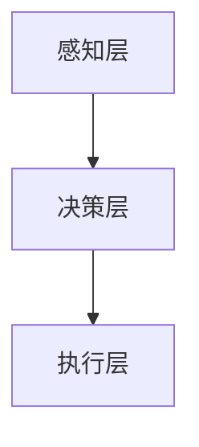

                 


# AI Agent在企业数字化转型中的角色：从战略到执行

## 关键词：AI Agent、企业数字化转型、智能自动化、战略规划、执行落地、效率提升

## 摘要：AI Agent作为人工智能领域的创新技术，正在成为企业数字化转型的重要推动力。本文将从AI Agent的核心概念、技术原理、应用场景到战略规划、系统架构、项目实战等方面进行深入分析，探讨其在企业数字化转型中的角色和价值，从战略到执行的全过程，为企业提供系统化的指导和建议。

---

# 第1章: AI Agent的核心概念与背景

## 1.1 什么是AI Agent

### 1.1.1 AI Agent的定义与核心特征

AI Agent（人工智能代理）是一种能够感知环境、自主决策并执行任务的智能系统。其核心特征包括：

- **自主性**：能够在没有外部干预的情况下独立执行任务。
- **反应性**：能够实时感知环境变化并做出响应。
- **目标导向**：基于预设的目标或学习到的目标进行决策和行动。
- **可扩展性**：能够适应不同规模和复杂度的任务。

### 1.1.2 AI Agent与传统自动化工具的区别

| 特性         | AI Agent                          | 传统自动化工具                  |
|--------------|-----------------------------------|---------------------------------|
| 智能性       | 高，能够学习和适应                | 低，基于固定规则和流程          |
| 决策能力     | 强，能够自主决策                 | 弱，依赖预设规则和逻辑          |
| 适应性       | 高，能够适应环境变化             | 低，难以应对复杂或异常情况      |
| 可扩展性     | 高，适用于多种场景               | 低，通常针对特定任务设计        |

### 1.1.3 AI Agent在企业中的潜在价值

AI Agent能够显著提升企业的效率和决策能力，优化资源配置，降低运营成本，并为企业创造新的竞争优势。

---

## 1.2 企业数字化转型的背景与挑战

### 1.2.1 数字化转型的定义与目标

数字化转型是指通过数字技术的广泛应用和深度整合，重塑企业业务模式、运营方式和组织结构，以实现更高效、灵活和创新的业务目标。

### 1.2.2 企业数字化转型中的主要挑战

1. **数据孤岛**：企业内部数据分散，难以实现高效协同。
2. **技术复杂性**：数字化转型涉及多种技术的集成和优化。
3. **组织变革**：数字化转型需要组织文化的转变和员工能力的提升。
4. **安全风险**：数字化转型过程中面临数据泄露和系统攻击的风险。

### 1.2.3 AI Agent在数字化转型中的角色定位

AI Agent作为数字化转型的核心工具，能够通过智能化的决策和执行能力，帮助企业实现业务流程的优化、数据的深度分析和决策的自动化。

---

## 1.3 AI Agent在企业数字化转型中的作用

### 1.3.1 提高企业效率与决策能力

AI Agent能够通过实时数据分析和智能化决策，显著提高企业的运营效率和决策质量。

### 1.3.2 优化业务流程与资源配置

AI Agent能够自动化处理复杂的业务流程，优化资源配置，降低运营成本。

### 1.3.3 支持企业创新与竞争优势

AI Agent通过智能化的创新应用，帮助企业构建差异化竞争优势。

---

## 1.4 成功案例分析

### 1.4.1 金融行业的AI Agent应用

在金融行业，AI Agent可以用于实时监控市场动态、自动执行交易指令和风险管理。

### 1.4.2 零售行业的AI Agent实践

在零售行业，AI Agent可以用于智能库存管理、个性化客户服务和精准营销。

### 1.4.3 制造业的AI Agent案例

在制造业，AI Agent可以用于智能生产调度、设备预测性维护和质量控制。

---

## 1.5 本章小结

本章介绍了AI Agent的核心概念、企业数字化转型的背景与挑战，以及AI Agent在数字化转型中的重要作用和成功案例。

---

# 第2章: AI Agent的核心概念与原理

## 2.1 AI Agent的基本原理

### 2.1.1 AI Agent的感知与决策机制

AI Agent通过感知环境、分析信息并基于预设或学习的目标进行决策。

### 2.1.2 基于强化学习的AI Agent行为模型

强化学习是一种通过试错机制优化AI Agent行为的算法。其核心公式为：

$$ Q(s, a) = r + \gamma \max_{a'} Q(s', a') $$

其中：
- \( Q(s, a) \)：状态 \( s \) 下动作 \( a \) 的价值。
- \( r \)：奖励。
- \( \gamma \)：折扣因子。
- \( s' \)：下一个状态。

### 2.1.3 AI Agent的自主学习与进化能力

AI Agent可以通过强化学习、模仿学习和对抗学习等方式不断优化自身的决策能力。

---

## 2.2 AI Agent的技术架构

### 2.2.1 分层架构设计

AI Agent的分层架构通常包括感知层、决策层和执行层。



### 2.2.2 模块化设计与功能划分

AI Agent的模块化设计包括感知模块、决策模块和执行模块。

### 2.2.3 交互式架构与用户反馈机制

AI Agent可以通过用户反馈不断优化自身的决策模型。

---

## 2.3 AI Agent与相关技术的对比

### 2.3.1 AI Agent与传统规则引擎的区别

| 特性         | AI Agent                          | 传统规则引擎                  |
|--------------|-----------------------------------|---------------------------------|
| 智能性       | 高，能够学习和适应                | 低，基于固定规则和流程          |
| 决策能力     | 强，能够自主决策                 | 弱，依赖预设规则和逻辑          |
| 适应性       | 高，能够适应环境变化             | 低，难以应对复杂或异常情况      |

### 2.3.2 AI Agent与RPA（机器人流程自动化）的对比

| 特性         | AI Agent                          | RPA（机器人流程自动化）          |
|--------------|-----------------------------------|---------------------------------|
| 智能性       | 高，能够学习和适应                | 低，基于固定规则和流程          |
| 决策能力     | 强，能够自主决策                 | 弱，依赖预设规则和逻辑          |
| 适应性       | 高，能够适应环境变化             | 低，难以应对复杂或异常情况      |

---

## 2.4 AI Agent的数学模型与算法

### 2.4.1 基于马尔可夫决策过程的AI Agent模型

马尔可夫决策过程（MDP）是一种描述决策过程的数学模型，广泛应用于强化学习。

$$ V(s) = \max_{a} \left( r + \gamma \sum_{s'} P(s' | s, a) V(s') \right) $$

其中：
- \( V(s) \)：状态 \( s \) 的价值。
- \( r \)：奖励。
- \( \gamma \)：折扣因子。
- \( P(s' | s, a) \)：从状态 \( s \) 执行动作 \( a \) 后转移到状态 \( s' \) 的概率。

### 2.4.2 强化学习算法在AI Agent中的应用

强化学习算法，如Q-Learning，通过试错机制优化AI Agent的行为策略。

### 2.4.3 贝叶斯网络在AI Agent决策中的应用

贝叶斯网络通过概率推理帮助AI Agent做出更可靠的决策。

---

## 2.5 本章小结

本章深入讲解了AI Agent的基本原理、技术架构、数学模型和相关技术的对比，为后续章节奠定了理论基础。

---

# 第3章: AI Agent在企业数字化转型中的应用场景

## 3.1 企业数字化转型中的AI Agent应用场景

### 3.1.1 智能客服

AI Agent可以用于智能客服系统，实现24/7的客户支持。

### 3.1.2 智能供应链管理

AI Agent可以优化供应链管理，实现预测性维护和库存优化。

### 3.1.3 智能营销

AI Agent可以通过数据分析实现精准营销和客户画像。

---

## 3.2 AI Agent在企业数字化转型中的具体案例

### 3.2.1 智能客服系统

AI Agent通过自然语言处理技术，实现智能客服的自动化响应。

### 3.2.2 智能供应链优化

AI Agent通过预测性维护和库存优化，降低供应链成本。

### 3.2.3 智能营销

AI Agent通过数据分析和预测，实现精准营销和客户画像。

---

## 3.3 本章小结

本章通过具体案例展示了AI Agent在企业数字化转型中的广泛应用场景。

---

# 第4章: AI Agent的系统架构与技术实现

## 4.1 系统架构设计

### 4.1.1 分层架构设计

AI Agent的系统架构通常包括感知层、决策层和执行层。


### 4.1.2 模块化设计与功能划分

系统架构包括感知模块、决策模块和执行模块。

### 4.1.3 交互式架构与用户反馈机制

系统通过用户反馈不断优化AI Agent的决策模型。

---

## 4.2 技术实现细节

### 4.2.1 AI Agent的核心算法实现

AI Agent的核心算法包括强化学习和贝叶斯网络。

### 4.2.2 系统接口设计

系统接口包括感知接口、决策接口和执行接口。

### 4.2.3 系统交互设计

系统交互包括用户输入、AI Agent处理和结果输出。

---

## 4.3 本章小结

本章详细介绍了AI Agent的系统架构和关键技术实现，为后续章节的项目实战奠定了基础。

---

# 第5章: AI Agent的项目实战

## 5.1 环境配置与工具安装

### 5.1.1 系统环境

- 操作系统：Linux/Windows/MacOS
- Python版本：3.6+

### 5.1.2 工具安装

- Python库：numpy、pandas、scikit-learn、tensorflow

```bash
pip install numpy pandas scikit-learn tensorflow
```

---

## 5.2 核心代码实现

### 5.2.1 感知模块

```python
def感知模块():
    # 从环境中获取输入数据
    return 数据
```

### 5.2.2 决策模块

```python
def决策模块(数据):
    # 基于强化学习的决策逻辑
    return 动作
```

### 5.2.3 执行模块

```python
def执行模块(动作):
    # 执行具体动作并返回结果
    return 结果
```

---

## 5.3 项目案例分析

### 5.3.1 智能客服系统的实现

AI Agent通过自然语言处理技术实现智能客服的自动化响应。

### 5.3.2 智能供应链优化的实现

AI Agent通过预测性维护和库存优化，降低供应链成本。

### 5.3.3 智能营销的实现

AI Agent通过数据分析和预测，实现精准营销和客户画像。

---

## 5.4 项目总结与经验分享

### 5.4.1 项目总结

本项目通过AI Agent实现了智能客服、智能供应链管理和智能营销。

### 5.4.2 经验分享

- 确保数据质量，避免错误决策。
- 定期更新模型，保持AI Agent的适应性。
- 与企业实际需求结合，最大化应用价值。

---

## 5.5 本章小结

本章通过实际案例展示了AI Agent的项目实战过程，包括环境配置、代码实现和案例分析。

---

# 第6章: AI Agent在企业数字化转型中的最佳实践

## 6.1 战略规划与实施路径

### 6.1.1 明确目标与范围

在实施AI Agent之前，企业需要明确目标和范围。

### 6.1.2 制定实施计划

包括技术选型、团队组建和项目管理。

### 6.1.3 风险管理与应对策略

识别潜在风险并制定应对策略。

---

## 6.2 关键成功因素

### 6.2.1 企业支持与资源投入

企业的支持和资源投入是成功的关键。

### 6.2.2 人才与技术能力

具备AI Agent开发和应用能力的人才是成功的关键。

### 6.2.3 数据质量和完整性

高质量的数据是AI Agent发挥价值的基础。

---

## 6.3 未来展望与发展趋势

### 6.3.1 技术发展趋势

AI Agent将更加智能化和自主化。

### 6.3.2 应用场景扩展

AI Agent将在更多行业和领域中得到广泛应用。

### 6.3.3 伦理与安全挑战

随着AI Agent的广泛应用，伦理和安全问题将更加突出。

---

## 6.4 本章小结

本章总结了AI Agent在企业数字化转型中的最佳实践，并展望了未来的发展趋势。

---

# 第7章: 总结与展望

## 7.1 本文总结

本文全面探讨了AI Agent在企业数字化转型中的角色和作用，从理论到实践，为企业提供了系统的指导和建议。

## 7.2 未来展望

随着技术的不断发展，AI Agent将在企业数字化转型中发挥越来越重要的作用，推动企业实现更高效的运营和更创新的业务模式。

---

## 7.3 最佳实践 Tips

- 企业应根据自身需求选择适合的AI Agent解决方案。
- 在实施过程中，应注重数据质量和技术能力的培养。
- 定期评估和优化AI Agent的应用效果。

---

## 7.4 本章小结

本章总结了全文内容，并提出了未来的发展方向和最佳实践建议。

---

# 参考文献

- Russell, S., & Norvig, P. (2010). Artificial Intelligence: A Modern Approach.
- Sutton, R. S., & Barto, A. G. (2018). Reinforcement Learning: An Introduction.
- Goodfellow, I., Bengio, Y., & Courville, A. (2016). Deep Learning.

---

通过以上章节的详细分析，本文全面探讨了AI Agent在企业数字化转型中的角色和作用，从理论到实践，为企业提供了系统的指导和建议。

