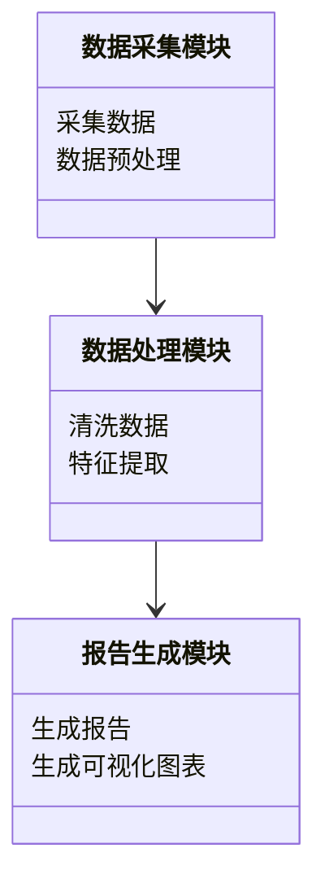
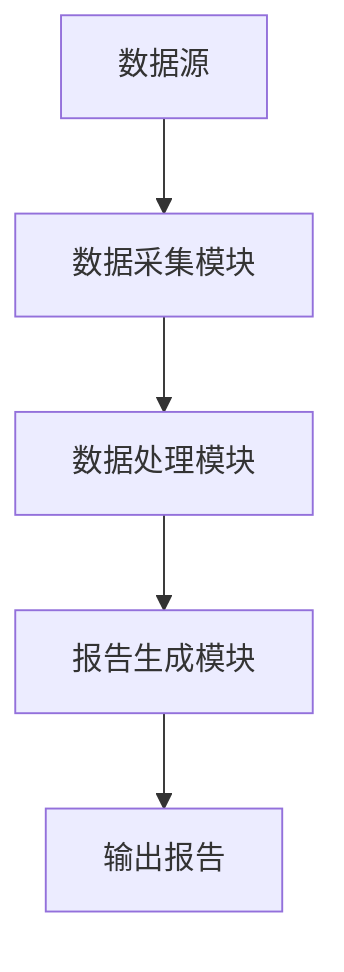
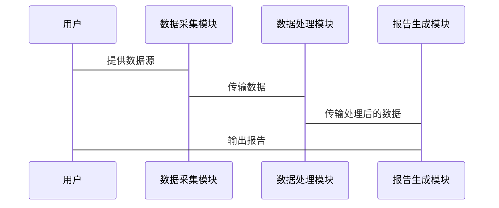

                 


# AI Agent在企业数据可视化与报告生成中的应用

## 关键词
AI Agent, 数据可视化, 报告生成, 机器学习, 自然语言处理, 系统架构

## 摘要
随着企业对数据驱动决策的需求不断增加，AI Agent在数据可视化和报告生成中的应用变得越来越重要。本文详细探讨了AI Agent的核心概念、技术原理、系统架构以及实际应用。通过分析AI Agent在感知、决策和执行过程中的作用，结合具体的算法实现和项目案例，展示了如何利用AI Agent提高数据处理效率和优化报告生成流程。文章最后总结了AI Agent在企业中的最佳实践和未来发展趋势。

---

# 第1章 AI Agent的定义与核心概念

## 1.1 AI Agent的基本概念
AI Agent（人工智能代理）是一种能够感知环境、做出决策并执行任务的智能系统。它通过数据处理、模型训练和生成式推理，帮助企业在数据可视化和报告生成中实现自动化和智能化。

### 1.1.1 什么是AI Agent
AI Agent是一种能够自主执行任务的智能实体，它能够根据输入的数据生成有意义的输出，例如报告或可视化图表。

### 1.1.2 AI Agent的核心特征
- **自主性**：能够在没有人工干预的情况下执行任务。
- **反应性**：能够实时感知环境并做出反应。
- **学习能力**：通过数据训练不断优化性能。

### 1.1.3 AI Agent与传统数据处理工具的区别
传统数据处理工具通常依赖固定的规则和模板，而AI Agent能够根据数据动态调整处理策略，提供更灵活和智能的解决方案。

---

## 1.2 AI Agent在企业中的应用背景

### 1.2.1 企业数据可视化的挑战
企业在数据可视化过程中面临数据量大、类型多样、处理复杂等问题，传统的工具难以满足高效处理的需求。

### 1.2.2 报告生成的传统流程与痛点
传统报告生成流程依赖人工操作，效率低下且容易出错。AI Agent的引入可以显著优化这一过程。

### 1.2.3 AI Agent如何解决这些问题
AI Agent通过自动化数据处理、智能生成报告和可视化图表，帮助企业提高效率、降低成本并增强决策能力。

---

## 1.3 AI Agent在数据可视化与报告生成中的优势

### 1.3.1 提高数据处理效率
AI Agent能够快速处理大量数据，显著提高数据处理效率。

### 1.3.2 优化报告生成流程
通过自动化生成报告，AI Agent减少了人工干预，优化了报告生成流程。

### 1.3.3 提供智能化的决策支持
AI Agent能够根据数据生成有价值的洞察，为企业的决策提供支持。

---

# 第2章 AI Agent的核心原理与技术

## 2.1 AI Agent的感知与理解

### 2.1.1 数据采集与预处理
AI Agent通过采集企业数据并进行预处理，确保数据的质量和一致性。

### 2.1.2 自然语言处理技术
AI Agent利用自然语言处理技术理解文本数据，提取关键信息。

### 2.1.3 数据分析与建模
AI Agent通过数据分析和建模，发现数据中的规律和模式。

---

## 2.2 AI Agent的决策与推理

### 2.2.1 基于规则的决策
AI Agent根据预定义的规则进行决策，适用于简单的场景。

### 2.2.2 基于知识图谱的推理
AI Agent通过知识图谱进行推理，能够处理复杂的关系和语义信息。

### 2.2.3 基于大模型的生成式推理
AI Agent利用生成式模型，根据上下文生成有意义的输出。

---

## 2.3 AI Agent的执行与反馈

### 2.3.1 报告自动生成
AI Agent根据分析结果自动生成报告，显著提高效率。

### 2.3.2 可视化图表生成
AI Agent能够根据数据生成多种类型的可视化图表，帮助用户更好地理解数据。

### 2.3.3 系统优化与反馈机制
AI Agent通过反馈机制不断优化自身的性能，提高准确性。

---

# 第3章 AI Agent的算法原理与实现

## 3.1 AI Agent的算法基础

### 3.1.1 机器学习算法
机器学习算法是AI Agent的核心，包括监督学习、无监督学习和强化学习。

### 3.1.2 深度学习算法
深度学习算法通过多层神经网络处理复杂的数据，提升模型的准确性。

### 3.1.3 自然语言处理模型
自然语言处理模型帮助AI Agent理解文本数据，提取关键信息。

---

## 3.2 AI Agent的核心算法实现

### 3.2.1 数据处理与特征提取
数据处理包括清洗和转换，特征提取则是从数据中提取有用的特征。

### 3.2.2 模型训练与优化
通过训练模型并不断优化，提升模型的准确性和鲁棒性。

### 3.2.3 报告生成与可视化
AI Agent根据模型生成报告和可视化图表，提供用户友好的输出。

---

## 3.3 AI Agent的数学模型与公式

### 3.3.1 概率分布模型
概率分布模型用于描述数据的分布情况，例如高斯分布。

$$ P(x) = \frac{1}{\sqrt{2\pi\sigma^2}} e^{-\frac{(x-\mu)^2}{2\sigma^2}} $$

### 3.3.2 损失函数与优化算法
损失函数用于衡量模型的预测误差，优化算法用于最小化损失函数。

$$ \text{损失函数} = \frac{1}{n}\sum_{i=1}^{n}(y_i - \hat{y_i})^2 $$

### 3.3.3 生成模型的数学表达
生成模型通过生成式算法生成数据，例如变分自编码器（VAE）。

---

# 第4章 AI Agent的系统架构与设计

## 4.1 系统功能模块设计

### 4.1.1 数据采集模块
负责采集企业数据并进行预处理。

### 4.1.2 数据处理模块
对数据进行清洗、转换和特征提取。

### 4.1.3 报告生成模块
根据数据生成报告和可视化图表。

---

## 4.2 系统架构设计

### 4.2.1 领域模型类图
展示系统的各个模块及其关系。



---

## 4.3 系统架构图



---

## 4.4 系统交互流程图



---

# 第5章 项目实战

## 5.1 环境安装
安装必要的Python库，例如numpy、pandas、matplotlib等。

## 5.2 核心代码实现

### 5.2.1 数据处理代码
```python
import pandas as pd
import numpy as np

# 数据采集
data = pd.read_csv('data.csv')

# 数据预处理
data.dropna(inplace=True)
data['new_feature'] = data['feature1'] + data['feature2']
```

### 5.2.2 模型训练代码
```python
from sklearn.model import Model

model = Model()
model.train(data)
```

### 5.2.3 报告生成代码
```python
from report_generator import ReportGenerator

generator = ReportGenerator(model)
report = generator.generate_report(data)
```

## 5.3 案例分析
通过具体案例分析AI Agent在实际项目中的应用效果，验证其优势和不足。

---

# 第6章 最佳实践

## 6.1 小结
总结AI Agent在企业数据可视化与报告生成中的应用价值和优势。

## 6.2 注意事项
在实际应用中，需要注意数据质量和模型优化等问题。

## 6.3 未来趋势
预测AI Agent在企业中的未来发展和潜在应用。

## 6.4 拓展阅读
推荐相关的书籍和技术资料，帮助读者进一步深入学习。

---

通过以上结构和内容的详细展开，这篇文章将全面、系统地探讨AI Agent在企业数据可视化与报告生成中的应用，为读者提供丰富的理论和实践指导。

