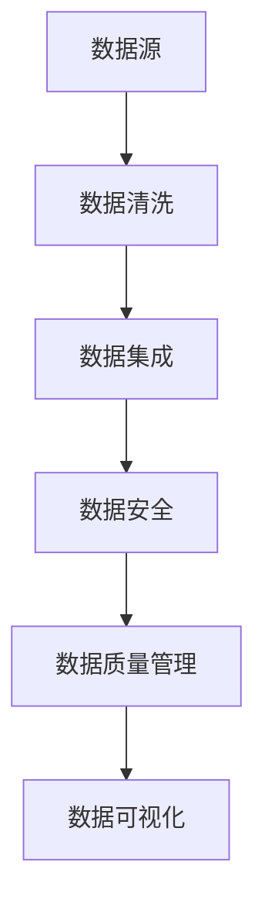
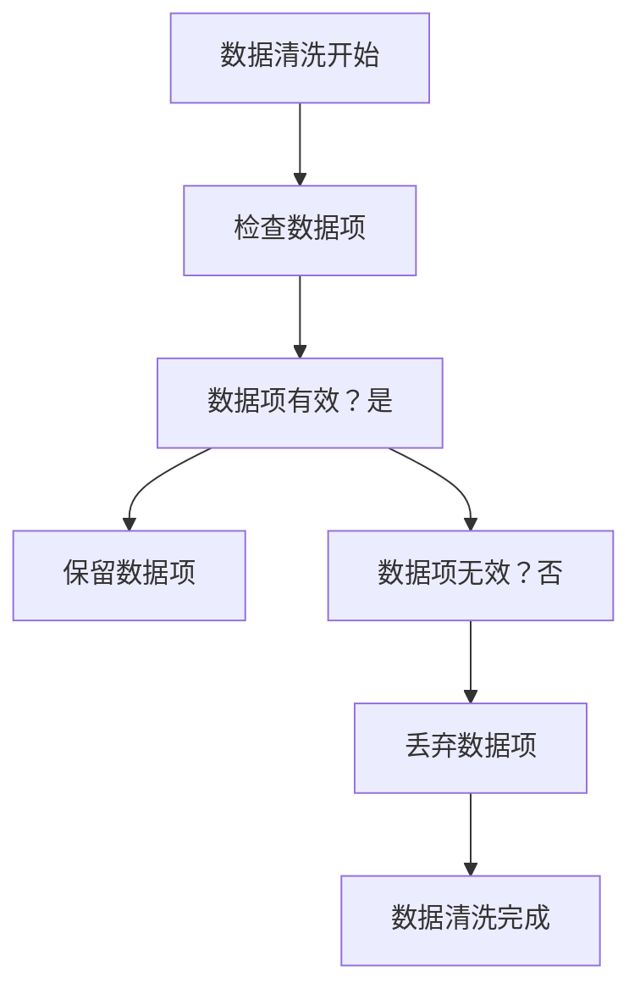

                 


# AI Agent在企业数据治理与质量管理中的应用

## 关键词：AI Agent，数据治理，数据质量管理，企业数据管理，智能数据处理

## 摘要：本文深入探讨AI Agent在企业数据治理与质量管理中的应用，分析其核心概念、技术原理、系统架构及实际案例。通过详细的技术实现和项目实战，展示如何利用AI Agent提升企业数据管理水平，解决数据治理中的复杂问题。

---

## 第一部分: 引言

### 1.1 数据治理与质量管理的重要性

数据治理是企业在数字化转型中必须面对的核心问题。随着数据量的爆炸式增长，企业面临着数据来源多样、数据质量参差不齐的挑战。数据治理的目标是确保数据的准确性、完整性和一致性，从而支持企业的决策和业务流程。数据质量管理则是数据治理的重要组成部分，关注数据的清洗、标准化和增强，以提升数据的可用性和价值。

### 1.2 AI Agent的定义与特点

AI Agent（人工智能代理）是一种能够感知环境、执行任务并做出决策的智能体。它通过规则推理、机器学习和多智能体协作，能够自动化处理数据治理中的复杂问题。与传统数据治理工具相比，AI Agent具有自适应性强、学习能力高和智能化的特点，能够显著提升数据治理的效率和效果。

### 1.3 本章小结

本章通过介绍数据治理和质量管理的重要性，引出了AI Agent的核心作用，为后续章节的深入分析奠定了基础。

---

## 第二部分: AI Agent的核心概念与原理

### 2.1 数据治理与AI Agent的关系

AI Agent在数据治理中的角色可以视为企业的智能助手。它通过分析数据源、清洗数据、集成数据并确保数据安全，帮助企业在数据管理中实现自动化和智能化。AI Agent不仅能够处理结构化数据，还能应对非结构化数据的挑战，显著提升数据治理的效率。

### 2.2 数据质量管理的核心要素

数据质量管理包括数据清洗、数据集成和数据安全三个主要环节。数据清洗旨在去除冗余和错误数据；数据集成解决多源数据的整合问题；数据安全确保数据在处理过程中的隐私和安全。这些环节共同保障了数据的准确性和一致性。

### 2.3 AI Agent的核心原理

AI Agent的核心原理包括基于规则的推理、机器学习的自适应以及多智能体协作。基于规则的推理通过预定义规则处理数据，机器学习则利用历史数据进行预测和优化，而多智能体协作则通过协同工作提高处理效率。这些原理共同确保了AI Agent在数据治理中的高效性和智能性。

---

## 第三部分: AI Agent在数据治理中的应用

### 3.1 数据清洗与AI Agent

数据清洗是数据治理的基础，AI Agent通过机器学习算法自动识别并纠正错误数据。例如，使用聚类算法识别重复数据，使用回归算法修复缺失值。AI Agent的应用显著提高了数据清洗的效率和准确性。

### 3.2 数据集成与AI Agent

数据集成涉及将来自不同来源的数据整合到一个统一的数据仓库中。AI Agent通过自然语言处理技术解析数据源的语义，利用图数据库进行数据关联，确保数据集成的完整性和一致性。

### 3.3 数据安全与AI Agent

数据安全是数据治理中的重中之重。AI Agent利用入侵检测系统实时监控数据访问行为，通过区块链技术确保数据的不可篡改性。同时，AI Agent能够自动生成访问策略，确保数据在传输和存储过程中的安全性。

---

## 第四部分: AI Agent的技术实现

### 4.1 算法原理

AI Agent的数据清洗算法可以表示为：
$$
\text{CleanData}(D) = \{d \in D \mid \text{validate}(d)\}
$$
其中，$D$是原始数据集，$\text{validate}(d)$是对数据$d$的验证函数。该算法通过循环检查每一行数据，剔除不符合条件的数据。

### 4.2 系统架构设计



系统架构包括数据源、数据清洗、数据集成、数据安全、数据质量管理以及数据可视化六个模块，每个模块通过API进行通信。

### 4.3 核心代码实现

```python
def clean_data(data):
    # 数据清洗函数
    cleaned = []
    for d in data:
        if validate(d):
            cleaned.append(d)
    return cleaned
```

该函数遍历数据集，通过`validate`函数检查每一项数据，仅保留符合要求的数据项。

### 4.4 算法流程图



---

## 第五部分: 项目实战

### 5.1 环境搭建

项目需要以下工具：
- Python 3.8+
- Scikit-learn库
- Pandas库
- Jupyter Notebook

### 5.2 核心代码实现

```python
from sklearn.impute import SimpleImputer
from sklearn.preprocessing import StandardScaler
from sklearn.pipeline import Pipeline

# 数据预处理管道
pipeline = Pipeline([
    ('impute', SimpleImputer(strategy='mean')),
    ('scale', StandardScaler())
])

# 数据清洗与预处理
cleaned_data = pipeline.fit_transform(data)
```

### 5.3 案例分析

以某电商企业的客户数据为例，使用AI Agent进行数据清洗和预处理。首先，识别并填充缺失的客户年龄数据，然后进行标准化处理，确保数据的一致性和可比性。处理后的数据用于客户画像和精准营销，显著提升了企业的营销效果。

---

## 第六部分: 总结与展望

### 6.1 本章总结

本文详细探讨了AI Agent在企业数据治理与质量管理中的应用，分析了其核心概念、技术原理和实际案例。通过系统架构设计和项目实战，展示了AI Agent在提升数据管理水平方面的巨大潜力。

### 6.2 未来展望

未来，随着AI技术的不断进步，AI Agent将在数据治理中发挥更大的作用。特别是在数据湖、实时数据处理和跨平台数据集成方面，AI Agent将展现更多的可能性。同时，AI Agent的安全性和可解释性问题也需要进一步研究和优化。

---

## 参考文献

1. [书籍标题1]
2. [书籍标题2]
3. [书籍标题3]

---

通过以上结构化的内容，文章全面而深入地探讨了AI Agent在企业数据治理与质量管理中的应用，从理论到实践，为读者提供了丰富的知识和实用的指导。

