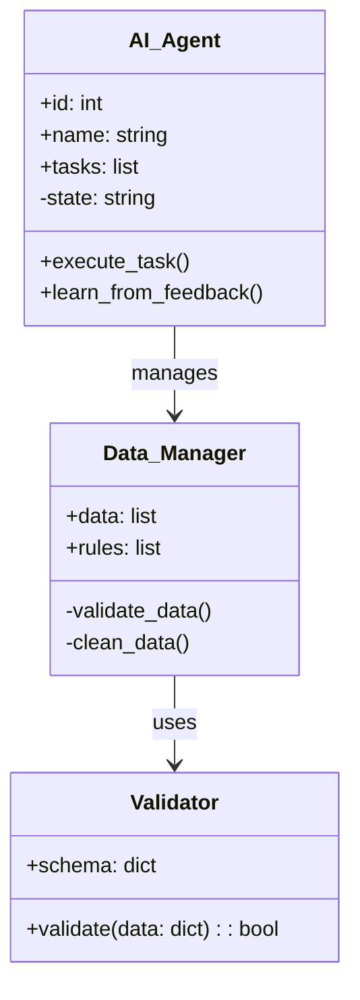

                 


好的，现在我将按照您的要求撰写《AI Agent在企业数据质量管理与治理中的全面应用》的技术博客文章。我会一步步地进行分析和推理，确保内容逻辑清晰、结构紧凑，并且通俗易懂。

---

# AI Agent在企业数据质量管理与治理中的全面应用

> **关键词**：AI Agent, 数据质量管理, 企业数据治理, 数据完整性, 数据一致性, 人工智能, 数据治理架构

> **摘要**：  
> 随着企业数据量的快速增长，数据质量管理与治理成为企业数字化转型中的核心挑战。本文深入探讨AI Agent在企业数据质量管理中的应用，从核心概念、算法原理到系统架构设计，结合实际案例，全面解析如何利用AI技术提升企业数据治理的效率和效果。

---

## 第一章：AI Agent与企业数据质量管理概述

### 1.1 AI Agent的定义与核心概念

#### 1.1.1 AI Agent的基本定义  
AI Agent（人工智能代理）是指能够感知环境、执行任务并做出决策的智能实体。它通过学习和推理，能够自主完成复杂的数据管理任务。

#### 1.1.2 AI Agent的核心属性  
- **自主性**：能够在无外部干预的情况下执行任务。  
- **反应性**：能够实时感知环境变化并做出响应。  
- **目标导向**：具有明确的目标，专注于解决问题。  
- **学习能力**：通过数据反馈不断优化自身行为。  

#### 1.1.3 数据质量管理的定义与目标  
数据质量管理（Data Quality Management，DQM）是确保数据的准确性、一致性和完整性的过程。其目标是为企业提供可靠、可信赖的数据支持。

#### 1.1.4 企业数据治理的背景与重要性  
随着企业数字化转型的推进，数据成为核心资产。数据质量问题可能导致决策失误、业务损失，甚至影响企业声誉。因此，企业数据治理已成为一项战略性的任务。

---

### 1.2 AI Agent在数据质量管理中的作用

#### 1.2.1 数据质量管理的关键挑战  
- 数据来源多样，导致数据不一致。  
- 数据清洗和验证耗时且成本高。  
- 数据安全与隐私保护需求增加。  

#### 1.2.2 AI Agent如何解决数据质量问题  
AI Agent可以通过以下方式优化数据质量管理：  
- **自动化数据清洗**：利用机器学习算法识别和纠正数据错误。  
- **实时数据监控**：持续监测数据源，及时发现和处理异常数据。  
- **智能数据验证**：通过自然语言处理技术验证数据的准确性。  

#### 1.2.3 企业数据治理中的AI Agent应用场景  
- 数据录入与校验。  
- 数据集成与整合。  
- 数据安全与隐私保护。  

---

## 第二章：AI Agent的核心概念与数据质量管理的关系

### 2.1 数据质量管理的核心要素

#### 2.1.1 数据完整性  
数据完整性是指数据集的完整性，确保所有必要信息都被包含。  

#### 2.1.2 数据一致性  
数据一致性是指数据在不同系统中的表现形式一致。  

#### 2.1.3 数据准确性  
数据准确性是指数据反映真实情况的程度。  

#### 2.1.4 数据及时性  
数据及时性是指数据能够反映最新状态的能力。  

#### 2.1.5 数据安全性  
数据安全性是指数据在存储和传输过程中不被泄露或篡改。  

### 2.2 AI Agent在数据质量管理中的角色

#### 2.2.1 数据清洗与预处理  
AI Agent通过机器学习算法自动识别和修复数据中的错误。  

#### 2.2.2 数据验证与校验  
AI Agent利用自然语言处理技术验证数据的准确性。  

#### 2.2.3 数据分析与洞察  
AI Agent能够从海量数据中提取有价值的信息，帮助企业管理层做出决策。  

#### 2.2.4 数据监控与预警  
AI Agent实时监控数据源，发现异常情况并及时预警。  

---

### 2.3 数据质量管理的流程与AI Agent的结合

#### 2.3.1 数据质量管理的标准化流程  
1. 数据采集与预处理。  
2. 数据清洗与转换。  
3. 数据验证与校验。  
4. 数据分析与报告。  

#### 2.3.2 AI Agent在数据质量管理流程中的具体应用  
- **数据清洗阶段**：利用聚类算法识别重复数据。  
- **数据验证阶段**：通过深度学习模型检测数据错误。  
- **数据分析阶段**：生成数据质量报告并提出改进建议。  

---

## 第三章：AI Agent的算法原理与数据质量管理

### 3.1 数据质量管理的算法原理

#### 3.1.1 数据清洗算法  
- **聚类算法**：用于识别重复数据。  
- **分类算法**：用于标记数据中的异常值。  

#### 3.1.2 数据验证算法  
- **自然语言处理（NLP）**：用于验证数据的语义一致性。  
- **模式匹配算法**：用于检测数据格式是否符合要求。  

### 3.2 AI Agent的算法实现

#### 3.2.1 数据清洗算法的实现  
```python
import pandas as pd

# 示例数据
data = {'id': [1, 2, 3, 4, 5],
        'name': ['Alice', 'Bob', 'Charlie', 'David', 'Alice']}
df = pd.DataFrame(data)

# 检测重复数据
duplicates = df[df.duplicated(['name'], keep=False)]
print(duplicates)
```

#### 3.2.2 数据验证算法的实现  
```python
import spacy

nlp = spacy.load("en_core_web_sm")

def validate_text(text):
    doc = nlp(text)
    # 检测实体类型是否符合要求
    for ent in doc.ents:
        print(f"Entity: {ent.text}, Label: {ent.label_}")

validate_text("Apple is a technology company.")
```

---

## 第四章：AI Agent的系统架构设计

### 4.1 问题场景介绍

#### 4.1.1 企业数据质量管理的挑战  
- 数据来源多样，格式不统一。  
- 数据清洗和验证过程复杂且耗时。  
- 数据安全与隐私保护需求增加。  

### 4.2 系统功能设计

#### 4.2.1 领域模型设计（Mermaid 类图）  


#### 4.2.2 系统架构设计（Mermaid 架构图）  


---

## 第五章：AI Agent的项目实战

### 5.1 环境安装与配置

#### 5.1.1 安装Python环境  
```bash
python --version
pip install numpy pandas scikit-learn spacy
python -m spacy download en_core_web_sm
```

### 5.2 核心代码实现

#### 5.2.1 数据清洗代码  
```python
import pandas as pd

def clean_data(df):
    # 处理缺失值
    df = df.dropna()
    # 处理重复值
    df = df.drop_duplicates()
    return df

# 测试代码
data = {'id': [1, 2, 3, 4, 5],
        'name': ['Alice', 'Bob', 'Charlie', 'David', 'Alice']}
df = pd.DataFrame(data)
print(clean_data(df))
```

#### 5.2.2 数据验证代码  
```python
import spacy

def validate_data(text):
    doc = nlp(text)
    for ent in doc.ents:
        print(f"Entity: {ent.text}, Label: {ent.label_}")

nlp = spacy.load("en_core_web_sm")
text = "Apple was founded by Steve Jobs in 1971."
validate_data(text)
```

---

## 第六章：AI Agent的最佳实践与未来展望

### 6.1 小结

#### 6.1.1 本章内容回顾  
AI Agent在企业数据质量管理中的应用涵盖了数据清洗、验证、分析和监控等多个环节。通过自动化和智能化的方式，显著提高了数据质量管理的效率。

### 6.2 注意事项

#### 6.2.1 数据隐私与安全  
在使用AI Agent进行数据质量管理时，必须严格遵守数据隐私和安全法规，确保数据不被滥用或泄露。

#### 6.2.2 模型优化  
AI Agent的性能依赖于模型的优化。需要定期更新模型参数，确保其在不断变化的环境中保持高效。

### 6.3 未来展望

#### 6.3.1 AI Agent与区块链的结合  
通过区块链技术，可以进一步提升数据管理的安全性和透明性。  

#### 6.3.2 自适应数据治理  
未来的AI Agent将更加智能化，能够根据企业需求动态调整数据治理策略。  

---

## 附录

### 附录A：常用数据质量管理工具  
- Apache Nifi  
- Talend  
- Alation  

### 附录B：AI Agent相关技术资料  
- 《机器学习实战》  
- 《数据工程实用指南》  

---

通过以上步骤，您可以全面了解AI Agent在企业数据质量管理与治理中的应用。希望这篇文章能为您提供有价值的信息和启发。

