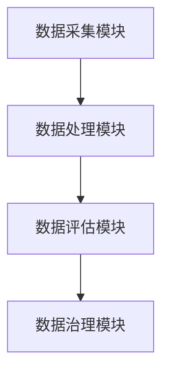
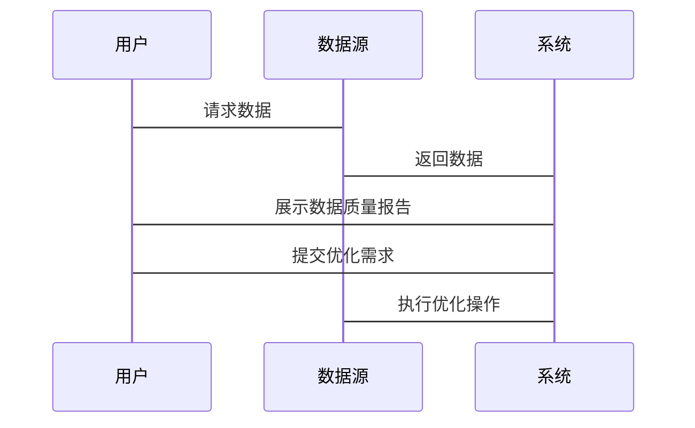

                 


# AI Agent在企业数据质量评估与自动化治理中的应用

## 关键词：AI Agent，企业数据质量，数据治理，自动化评估，机器学习，数据清洗

## 摘要：本文详细探讨了AI Agent在企业数据质量评估与自动化治理中的应用。通过分析数据质量管理的背景、挑战以及AI Agent的核心概念和算法，本文展示了AI Agent如何利用机器学习和自动化技术提升数据质量评估和治理的效率与效果。文章还包括实际案例分析和系统架构设计，为读者提供了全面的技术指导和实践参考。

---

# 第1章: 数据质量管理与AI Agent概述

## 1.1 数据质量管理的背景与挑战

### 1.1.1 数据质量管理的定义与重要性
数据质量管理（Data Quality Management）是指通过一系列方法和技术，确保数据的准确性、完整性、一致性和及时性。在企业中，数据是核心资产，数据质量直接影响决策的准确性和业务的效率。然而，随着数据量的爆炸式增长，传统的数据质量管理方法已难以应对复杂的数据环境。

### 1.1.2 企业数据质量管理的常见挑战
企业在数据质量管理中面临以下挑战：
- 数据来源多样化，导致数据格式和结构的不一致。
- 数据清洗和预处理耗时耗力，且容易出错。
- 数据质量问题难以量化，缺乏统一的评估标准。
- 数据治理缺乏自动化，依赖人工干预。

### 1.1.3 AI Agent在数据质量管理中的作用
AI Agent（人工智能代理）是一种能够自主感知环境、执行任务并优化结果的智能系统。在数据质量管理中，AI Agent可以：
- 自动识别和清洗低质量数据。
- 基于机器学习算法预测数据质量风险。
- 自动生成数据治理策略并优化执行流程。

## 1.2 AI Agent的基本概念与特点

### 1.2.1 AI Agent的定义与分类
AI Agent是一种智能实体，能够通过感知环境和执行操作来实现特定目标。根据应用场景的不同，AI Agent可以分为以下几类：
- **基于规则的AI Agent**：通过预定义的规则执行任务。
- **基于模型的AI Agent**：利用机器学习模型进行预测和决策。
- **基于知识图谱的AI Agent**：通过知识图谱理解上下文并执行任务。

### 1.2.2 AI Agent的核心能力与优势
AI Agent的核心能力包括：
- **自主学习能力**：能够通过数据和反馈不断优化自身的模型。
- **智能决策能力**：基于实时数据和上下文信息做出最优决策。
- **自动化执行能力**：能够在没有人工干预的情况下完成复杂任务。

AI Agent的优势在于其能够快速适应数据环境的变化，并通过自动化流程提高数据治理的效率。

### 1.2.3 AI Agent与传统数据治理工具的区别
与传统数据治理工具相比，AI Agent具有以下特点：
- **智能化**：能够自主学习和优化。
- **自动化**：能够自动执行复杂任务。
- **实时性**：能够实时感知数据环境的变化。

---

# 第2章: 数据质量评估的维度与指标

## 2.1 数据质量的五个核心维度

### 2.1.1 完整性
完整性是指数据的完整性和无缺失性。数据中的某些字段或记录可能缺失，导致数据无法被有效利用。

### 2.1.2 准确性
准确性是指数据的正确性和真实性。数据中的某些值可能不准确或错误，影响数据的可信度。

### 2.1.3 一致性
一致性是指数据在不同系统或数据库中的统一性。数据中的某些字段可能在不同的系统中表示方式不同，导致数据不一致。

### 2.1.4 及时性
及时性是指数据的更新频率和相关性。数据中的某些信息可能已经过时，无法反映当前的业务状况。

### 2.1.5 合规性
合规性是指数据是否符合相关的法律法规和企业内部政策。数据中的某些信息可能违反法律或企业规定，导致合规风险。

## 2.2 数据质量评估的指标体系

### 2.2.1 数据完整性评估指标
- **缺失值比例**：数据中缺失值的比例。
- **唯一值比例**：数据中唯一值的比例。

### 2.2.2 数据准确性评估指标
- **错误值比例**：数据中错误值的比例。
- **数据验证通过率**：数据通过验证的比例。

### 2.2.3 数据一致性评估指标
- **字段一致性比例**：不同系统中字段一致性比例。
- **数据格式一致性比例**：数据格式一致性比例。

### 2.2.4 数据及时性评估指标
- **数据更新延迟**：数据更新的延迟时间。
- **数据过时比例**：数据过时的比例。

### 2.2.5 数据合规性评估指标
- **合规性通过率**：数据合规性通过的比例。
- **违规数据比例**：数据违规的比例。

## 2.3 数据质量评估的流程与方法

### 2.3.1 数据预处理阶段
- **数据清洗**：处理缺失值、重复值和错误值。
- **数据转换**：将数据转换为一致的格式。
- **数据标准化**：将数据标准化为统一的尺度。

### 2.3.2 数据分析阶段
- **数据统计分析**：计算数据的基本统计指标。
- **数据可视化分析**：通过图表展示数据分布和异常值。
- **数据关联分析**：分析数据之间的关联性。

### 2.3.3 数据评估阶段
- **数据质量评分**：根据指标体系对数据进行评分。
- **数据质量报告生成**：生成数据质量评估报告。

### 2.3.4 数据反馈与优化阶段
- **数据优化策略生成**：根据评估结果生成优化策略。
- **数据优化执行**：执行优化策略并反馈结果。

## 2.4 本章小结

---

# 第3章: AI Agent在数据预处理与特征提取中的应用

## 3.1 数据预处理的核心步骤

### 3.1.1 数据清洗
数据清洗是数据预处理的第一步，主要包括处理缺失值、重复值和错误值。例如，可以通过插值法填充缺失值，通过数据验证检测错误值。

### 3.1.2 数据转换
数据转换是将数据转换为一致的格式。例如，将日期格式统一为ISO标准格式。

### 3.1.3 数据标准化
数据标准化是将数据标准化为统一的尺度。例如，使用归一化方法将数据缩放到0-1范围。

## 3.2 特征提取的关键方法

### 3.2.1 基于统计的方法
基于统计的方法通过计算数据的统计指标提取特征。例如，使用均值、方差和标准差等指标。

### 3.2.2 基于机器学习的方法
基于机器学习的方法通过训练模型提取特征。例如，使用主成分分析（PCA）提取主成分。

### 3.2.3 基于自然语言处理的方法
基于自然语言处理的方法用于文本数据的特征提取。例如，使用TF-IDF提取关键词。

## 3.3 数据特征选择的优化策略

### 3.3.1 基于过滤的方法
基于过滤的方法通过统计指标筛选特征。例如，使用卡方检验筛选与目标变量相关的特征。

### 3.3.2 基于嵌入的方法
基于嵌入的方法通过深度学习模型提取特征。例如，使用Word2Vec提取词向量。

### 3.3.3 基于包装的方法
基于包装的方法通过包裹式方法评估特征的重要性。例如，使用随机森林模型评估特征的重要性。

## 3.4 本章小结

---

# 第4章: AI Agent在数据分类与预测中的算法实现

## 4.1 基于K-means算法的数据聚类

### 4.1.1 K-means算法的原理
K-means是一种无监督学习算法，通过将数据点聚类为K个簇来发现数据的结构。其数学公式如下：
$$
\text{目标函数} = \sum_{i=1}^{K} \sum_{j=1}^{n_i} ||x_j - c_i||^2
$$
其中，$K$是簇的数量，$n_i$是第$i$个簇中的数据点数量，$x_j$是数据点，$c_i$是第$i$个簇的中心。

### 4.1.2 K-means算法的实现步骤
1. **初始化**：随机选择K个初始簇中心。
2. **聚类分配**：将每个数据点分配到最近的簇中心。
3. **更新簇中心**：计算每个簇的新中心。
4. **收敛判断**：检查是否收敛，若未收敛，重复步骤2和3。

### 4.1.3 K-means算法的优缺点
- **优点**：简单高效，易于实现。
- **缺点**：对初始中心敏感，可能陷入局部最优。

## 4.2 基于随机森林算法的数据分类

### 4.2.1 随机森林算法的原理
随机森林是一种基于决策树的集成学习算法，通过构建多棵决策树并进行投票或平均来提高模型的准确性和鲁棒性。其数学公式如下：
$$
y = \text{argmax}_{i} \sum_{j=1}^{n} \text{weight}(i, j)
$$
其中，$y$是预测结果，$\text{weight}(i, j)$是第$j$棵树对类别$i$的权重。

### 4.2.2 随机森林算法的实现步骤
1. **数据预处理**：对数据进行清洗和标准化。
2. **特征选择**：选择重要的特征。
3. **构建决策树**：随机选择部分特征，构建决策树。
4. **集成预测**：对所有决策树进行投票或平均。

### 4.2.3 随机森林算法的优缺点
- **优点**：高准确率，强鲁棒性。
- **缺点**：计算复杂度较高。

## 4.3 本章小结

---

# 第5章: 系统架构与设计实现

## 5.1 系统整体架构

### 5.1.1 系统功能模块
- **数据采集模块**：负责采集数据。
- **数据处理模块**：负责数据清洗、转换和标准化。
- **数据评估模块**：负责数据质量评估和报告生成。
- **数据治理模块**：负责数据优化和反馈。

### 5.1.2 系统架构图


## 5.2 系统接口设计

### 5.2.1 系统接口
- **数据接口**：与数据库或数据源对接。
- **用户接口**：与用户交互，展示数据质量报告和优化策略。

### 5.2.2 接口交互流程图


## 5.3 本章小结

---

# 第6章: 项目实战与案例分析

## 6.1 项目背景与目标

### 6.1.1 项目背景
以某零售企业为例，该企业面临数据来源多样、数据清洗耗时、数据质量问题难以量化等问题。

### 6.1.2 项目目标
通过AI Agent实现数据质量的自动化评估与治理，提高数据的准确性和一致性。

## 6.2 核心代码实现

### 6.2.1 数据清洗代码
```python
import pandas as pd

def clean_data(df):
    # 处理缺失值
    df = df.dropna()
    # 处理重复值
    df = df.drop_duplicates()
    # 处理错误值
    df = df[df['price'].apply(lambda x: x > 0)]
    return df
```

### 6.2.2 数据评估代码
```python
import numpy as np

def assess_data_quality(df):
    # 完整性评估
   完整性评分 = df.isna().sum() / len(df)
    # 准确性评估
    准确性评分 = np.mean([abs(x - y) for x, y in zip(df['predicted_price'], df['actual_price'])])
    # 一致性评估
    一致性评分 = np.mean([1 if x == y else 0 for x, y in zip(df['category'], df['subcategory'])])
    return {
        '完整性评分': 完整性评分,
        '准确性评分': 准确性评分,
        '一致性评分': 一致性评分
    }
```

## 6.3 实际案例分析

### 6.3.1 数据清洗与增强
- 原始数据：包含缺失值、重复值和错误值。
- 清洗后数据：数据完整、一致且准确。

### 6.3.2 模型训练与优化
- 训练模型：使用随机森林算法训练数据分类模型。
- 模型优化：调整超参数，提高模型的准确率。

### 6.3.3 优化策略与结果
- 优化策略：根据评估结果生成数据清洗和增强策略。
- 实施结果：数据质量显著提高，业务决策的准确率提升。

## 6.4 本章小结

---

# 第7章: 总结与展望

## 7.1 本文总结
本文详细探讨了AI Agent在企业数据质量评估与自动化治理中的应用。通过分析数据质量管理的背景与挑战，AI Agent的核心概念与算法，以及实际案例的分析，展示了AI Agent在数据质量管理中的巨大潜力。

## 7.2 未来展望
未来，随着AI技术的不断发展，AI Agent在数据质量管理中的应用将更加广泛和深入。可能的研究方向包括：
- 更加智能的数据清洗和特征提取方法。
- 更加高效的机器学习算法。
- 更加灵活的数据治理策略。

## 7.3 注意事项
在实际应用中，需要注意数据隐私和安全问题，确保数据在处理和传输过程中的安全性。

## 7.4 拓展阅读
建议读者进一步阅读相关领域的书籍和论文，如《Data Quality: The Fifth Dimension》和《Machine Learning: A Probabilistic Perspective》。

## 7.5 本章小结

---

# 结语

AI Agent作为数据质量管理的重要工具，正在为企业数据质量的提升带来革命性的变化。通过本文的探讨，希望能够为读者提供理论指导和实践参考，帮助企业在数据质量管理中实现自动化、智能化的目标。

