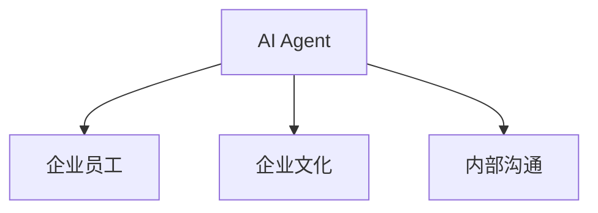
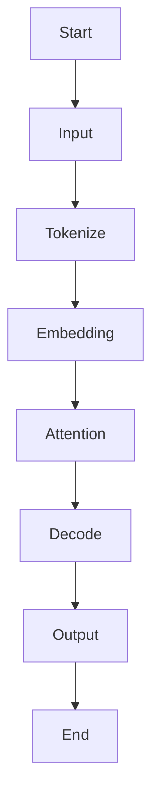
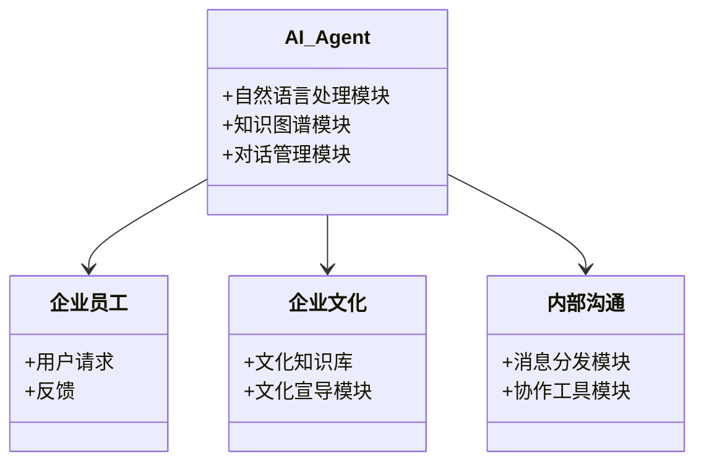
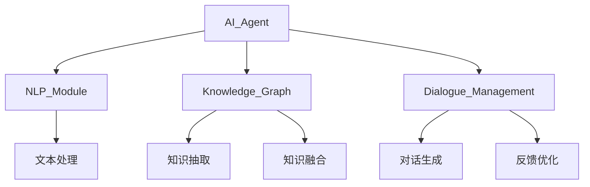

                 


# AI Agent在企业文化建设与内部沟通中的应用

## 关键词：AI Agent，企业文化，内部沟通，自然语言处理，知识图谱，系统架构

## 摘要：  
本文探讨了AI Agent在企业文化建设与内部沟通中的应用，分析了AI Agent的核心概念、技术原理、系统架构及其在企业内部沟通中的具体应用场景。文章从背景介绍、核心概念、算法原理、系统架构、项目实战等多方面展开，结合实际案例和代码实现，详细阐述了AI Agent在企业文化管理中的潜力与价值。

---

## 第1章 AI Agent与企业文化的背景介绍

### 1.1 AI Agent的基本概念
#### 1.1.1 AI Agent的定义
AI Agent（人工智能代理）是指能够感知环境、自主决策并执行任务的智能系统。它通过自然语言处理（NLP）、机器学习（ML）和知识图谱等技术，实现与人类的交互，并为企业提供智能化的解决方案。

#### 1.1.2 AI Agent的核心要素
- **感知能力**：通过NLP技术理解用户输入的文本。
- **决策能力**：基于上下文和知识库生成最优响应。
- **执行能力**：通过API或其他系统接口完成任务。
- **学习能力**：通过反馈机制优化自身性能。

#### 1.1.3 AI Agent与传统企业沟通工具的区别
| 特性 | AI Agent | 传统沟通工具 |
|------|-----------|---------------|
| 智能性 | 高         | 低             |
| 可扩展性 | 高         | 低             |
| 个性化 | 高         | 低             |

### 1.2 企业文化建设的挑战与机遇
#### 1.2.1 传统企业文化管理的痛点
- 信息传递不畅，文化宣导效果不佳。
- 员工参与度低，文化认同感弱。
- 知识共享不足，企业文化难以沉淀。

#### 1.2.2 AI Agent在企业文化建设中的潜在价值
- 提供个性化的文化宣导，增强员工参与感。
- 实现知识自动化整理和共享，助力企业文化沉淀。
- 通过智能问答和反馈机制优化企业文化管理。

#### 1.2.3 企业文化数字化转型的趋势
随着企业数字化转型的推进，AI Agent为企业文化的智能化管理提供了新的可能。

### 1.3 AI Agent在内部沟通中的应用场景
#### 1.3.1 提升内部沟通效率
- 自动化处理员工咨询，减少人工干预。
- 智能分发通知，确保信息及时传达。

#### 1.3.2 优化企业文化传播
- 个性化文化宣导，增强员工文化认同。
- 自动化知识整理，促进企业文化沉淀。

#### 1.3.3 支持团队协作与知识共享
- 提供协作工具，优化团队工作效率。
- 实现知识库自动化管理，促进知识共享。

## 第2章 AI Agent的核心概念与技术原理

### 2.1 AI Agent的核心概念原理
#### 2.1.1 自然语言处理（NLP）技术
- **文本预处理**：包括分词、词干提取、去除停用词等。
- **语义理解**：基于BERT等预训练模型实现语义理解。
- **对话生成**：通过生成式模型生成自然语言回复。

#### 2.1.2 知识图谱构建
- **知识抽取**：从企业文档中提取实体、关系和属性。
- **知识融合**：整合多源数据，消除冲突。
- **知识存储**：构建企业知识图谱，支持快速查询。

#### 2.1.3 智能对话系统
- **对话管理**：基于DQN算法实现对话策略优化。
- **多轮对话**：支持上下文记忆，保持对话连贯性。

### 2.2 核心概念属性对比表
| 概念 | 属性 | 描述 |
|------|------|------|
| AI Agent | 智能性 | 基于AI算法实现自动化决策 |
|        | 学习能力 | 能够通过数据优化自身行为 |
|        | 可扩展性 | 支持多种企业应用场景 |

### 2.3 ER实体关系图


## 第3章 AI Agent的算法原理与数学模型

### 3.1 基于NLP的对话生成算法
#### 3.1.1 Transformer模型概述
- **编码器**：将输入文本转换为固定长度的向量。
- **解码器**：基于编码器输出生成响应。

#### 3.1.2 解码器的注意力机制
- **自注意力机制**：计算输入序列中每个词的重要性。
- **前馈网络**：对输入进行非线性变换。

#### 3.1.3 对话生成的损失函数
$$ \text{损失函数} = -\sum_{i=1}^{n} \log P(y_i | y_{<i}) $$

### 3.2 算法流程图


### 3.3 数学模型与公式
#### 3.3.1 Transformer模型公式
$$ \text{Attention}(Q,K,V) = \text{softmax}\left(\frac{QK^T}{\sqrt{d_k}}\right)V $$

## 第4章 系统架构与设计方案

### 4.1 系统功能设计
- **领域模型类图**


### 4.2 系统架构设计
- **系统架构图**


## 第5章 项目实战与案例分析

### 5.1 环境配置
- **Python版本**：3.8及以上
- **依赖库**：transformers, numpy, pandas

### 5.2 核心代码实现
```python
from transformers import AutoModelForSeq2Seq, AutoTokenizer

class AI_Agent:
    def __init__(self):
        self.tokenizer = AutoTokenizer.from_pretrained('facebook/bart-large')
        self.model = AutoModelForSeq2Seq.from_pretrained('facebook/bart-large')

    def generate_response(self, input_text):
        inputs = self.tokenizer(input_text, return_tensors='np')
        outputs = self.model.generate(inputs.input_ids, max_length=50)
        return self.tokenizer.decode(outputs[0], skip_special_tokens=True)
```

### 5.3 案例分析
- **案例场景**：企业文化宣导
- **具体实现**：
  ```python
  agent = AI_Agent()
  input_text = "我们的企业使命是什么？"
  response = agent.generate_response(input_text)
  print(response)  # 输出：我们致力于为客户创造价值。
  ```

## 第6章 总结与展望

### 6.1 最佳实践 tips
- **数据质量**：确保训练数据多样化且高质量。
- **模型优化**：定期更新模型参数，提升对话质量。
- **用户反馈**：及时收集用户反馈，优化AI Agent性能。

### 6.2 小结
AI Agent在企业文化建设与内部沟通中的应用为企业提供了智能化的解决方案，通过NLP、知识图谱等技术，显著提升了内部沟通效率和企业文化管理能力。

### 6.3 注意事项
- **数据隐私**：确保企业数据安全，避免信息泄露。
- **用户体验**：设计友好界面，提升用户使用体验。

### 6.4 拓展阅读
- 推荐阅读《自然语言处理入门》和《知识图谱构建与应用》。

---

通过以上内容，我们详细探讨了AI Agent在企业文化建设与内部沟通中的应用，从理论到实践，为企业的智能化管理提供了新的思路和解决方案。

