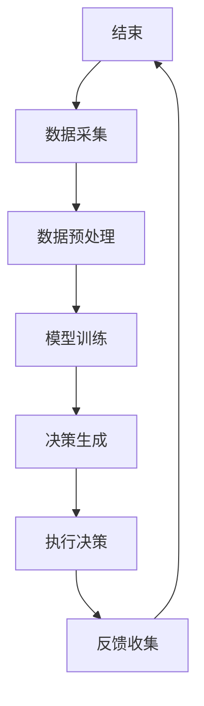
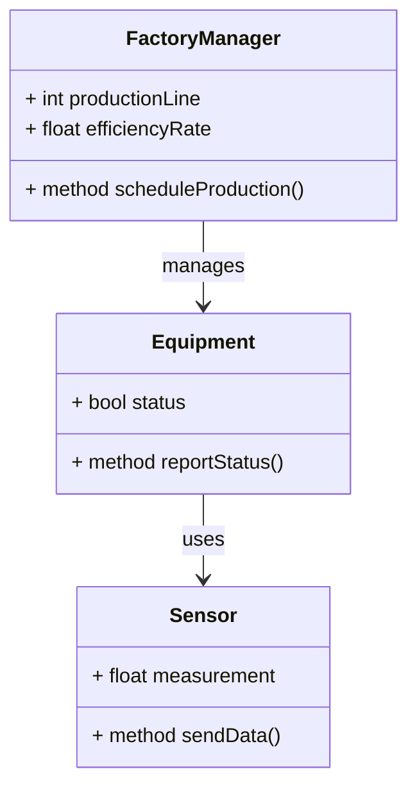
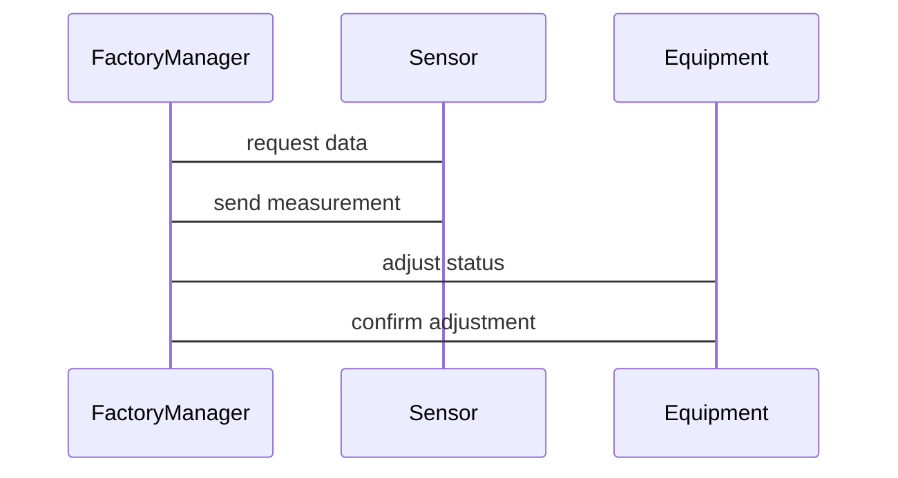

                 


# AI Agent在企业智能工厂管理中的全面应用

> 关键词：AI Agent、智能工厂、工业4.0、数字化转型、智能决策、生产优化

> 摘要：本文全面探讨了AI Agent在企业智能工厂管理中的应用，涵盖背景分析、核心原理、算法实现、系统架构、项目实战及最佳实践。通过详细的技术分析和实际案例，展示了AI Agent如何提升工厂管理效率和优化资源配置，实现智能化决策。

---

# 第1章: 企业智能工厂管理的背景与挑战

## 1.1 传统工厂管理的挑战
### 1.1.1 传统工厂管理的痛点
传统工厂管理面临效率低、资源浪费、决策滞后等问题，主要表现在以下几个方面：
- **人工依赖高**：依赖大量人工操作，效率低下且易出错。
- **数据孤岛**：各部门数据分散，难以有效整合和分析。
- **决策滞后**：依赖人工分析，难以快速响应市场变化。
- **资源浪费**：设备利用率低，能源浪费明显。

### 1.1.2 数字化转型的必要性
随着工业4.0的推进，数字化转型已成为企业提升竞争力的关键。AI Agent通过智能化手段，帮助企业实现管理升级。

### 1.1.3 AI Agent在管理中的作用
AI Agent能够实时感知、分析和决策，显著提升工厂管理效率和决策能力。

### 1.1.4 AI Agent的应用范围和边界
AI Agent主要应用于生产调度、设备维护、库存管理等领域，边界在于其数据采集和决策能力的限制。

### 1.1.5 核心要素与概念结构
AI Agent的核心要素包括感知、决策、行动和反馈，形成闭环系统，推动工厂智能化管理。

---

## 1.2 AI Agent的基本概念
### 1.2.1 AI Agent的定义
AI Agent是能够感知环境、自主决策并执行任务的智能体，具备学习和自适应能力。

### 1.2.2 AI Agent的核心特征
- 智能性：基于数据和模型进行决策。
- 自主性：无需人工干预，自主完成任务。
- 适应性：能根据环境变化调整策略。

### 1.2.3 AI Agent与传统自动化的区别
AI Agent具备智能化、自主性和学习能力，而传统自动化仅限于固定流程的执行。

### 1.2.4 AI Agent的分类与场景
AI Agent分为单一智能体和多智能体，适用于实时监控、预测性维护等场景。

---

## 1.3 AI Agent在智能工厂中的应用价值
### 1.3.1 提高管理效率
通过自动化和智能化手段，显著提升工厂运营效率。

### 1.3.2 优化资源配置
AI Agent能够实时优化资源配置，降低浪费，提升设备利用率。

### 1.3.3 实现智能化决策
基于实时数据和机器学习模型，提供精准的决策支持。

---

## 1.4 AI Agent的应用范围与边界
### 1.4.1 应用场景概述
涵盖生产调度、质量控制、设备维护、供应链管理等领域。

### 1.4.2 AI Agent的边界
受限于数据质量和模型精度，AI Agent的应用需与人工协同完成。

### 1.4.3 外延与扩展
AI Agent可与其他技术（如IoT、大数据）结合，扩展应用场景。

---

## 1.5 核心要素与概念结构
### 1.5.1 核心要素分析
- 感知层：数据采集与分析。
- 决策层：模型训练与策略制定。
- 行动层：执行决策并反馈结果。

### 1.5.2 概念结构图
通过Mermaid绘制的概念结构图展示了AI Agent在智能工厂中的各层关系。

---

# 第2章: AI Agent的核心原理与属性

## 2.1 AI Agent的原理分析
### 2.1.1 感知与决策机制
AI Agent通过传感器和数据源获取信息，利用机器学习模型进行分析和决策。

### 2.1.2 行动与反馈循环
AI Agent执行决策后，系统会收集反馈信息，用于优化模型和策略调整。

### 2.1.3 多智能体协作原理
在复杂的工厂环境中，多个AI Agent协作完成任务，确保整体效率最大化。

---

## 2.2 AI Agent的属性特征对比
### 2.2.1 属性特征表
通过表格对比AI Agent与传统自动化的差异，包括自主性、学习能力、适应性等方面。

### 2.2.2 属性对比分析
详细分析AI Agent在各属性上的优势及其对应用场景的影响。

### 2.2.3 实体关系图
通过Mermaid绘制的实体关系图展示了工厂中的各个实体及其交互关系。

---

## 2.3 实体关系图
```mermaid
erDiagram
    actor "工厂管理层" {
    }
    actor "设备" {
    }
    actor "传感器" {
    }
    actor "系统" {
    }
    actor "数据源" {
    }
    "工厂管理层" -- "设备": 控制
    "设备" -- "传感器": 监测
    "传感器" -- "系统": 传输数据
    "系统" -- "数据源": 分析
```

---

# 第3章: AI Agent的算法原理

## 3.1 AI Agent的算法流程图
通过Mermaid绘制的算法流程图展示了AI Agent从数据采集到决策执行的完整流程。



---

## 3.2 AI Agent的数学模型与公式
### 3.2.1 损失函数
$$ L = \frac{1}{2m}\sum_{i=1}^{m}(y_i - \hat{y_i})^2 $$

### 3.2.2 优化算法
$$ \theta = \theta - \alpha \frac{\partial L}{\partial \theta} $$

---

## 3.3 AI Agent的Python实现代码
### 3.3.1 核心代码
```python
import numpy as np
import tensorflow as tf

# 定义模型
model = tf.keras.Sequential([
    tf.keras.layers.Dense(64, activation='relu'),
    tf.keras.layers.Dense(1, activation='sigmoid')
])

# 编译模型
model.compile(optimizer='adam', loss='binary_crossentropy', metrics=['accuracy'])

# 训练模型
model.fit(X_train, y_train, epochs=10, batch_size=32)
```

---

## 3.4 应用案例分析
通过一个设备故障预测的案例，详细讲解AI Agent如何实现预测和决策。

---

# 第4章: 系统分析与架构设计

## 4.1 问题场景介绍
详细描述工厂中的具体问题场景，例如生产调度优化。

## 4.2 系统功能设计
### 4.2.1 领域模型
通过Mermaid绘制的类图展示系统中的各个实体及其关系。



## 4.3 系统架构设计
### 4.3.1 架构图
通过Mermaid绘制的系统架构图展示各模块的交互关系。


## 4.4 系统接口设计
详细描述各模块之间的接口和交互协议。

## 4.5 系统交互图
通过Mermaid绘制的交互图展示系统的运行流程。



---

# 第5章: 项目实战

## 5.1 环境安装
详细说明安装Python、TensorFlow等工具的步骤。

## 5.2 核心代码实现
提供完整的Python代码实现，包括数据预处理、模型训练和部署。

## 5.3 案例分析
通过具体案例分析AI Agent在实际项目中的应用效果。

## 5.4 项目总结
总结项目成果、经验教训和未来改进方向。

---

# 第6章: 最佳实践与总结

## 6.1 小结
回顾全文，总结AI Agent在智能工厂管理中的关键作用。

## 6.2 注意事项
提醒读者在实施AI Agent时需要注意的事项，如数据质量、模型选择等。

## 6.3 拓展阅读
推荐相关的书籍和资源，供读者深入学习。

---

通过以上结构，文章全面探讨了AI Agent在企业智能工厂管理中的应用，从理论到实践，为读者提供了丰富的知识和实用的指导。

