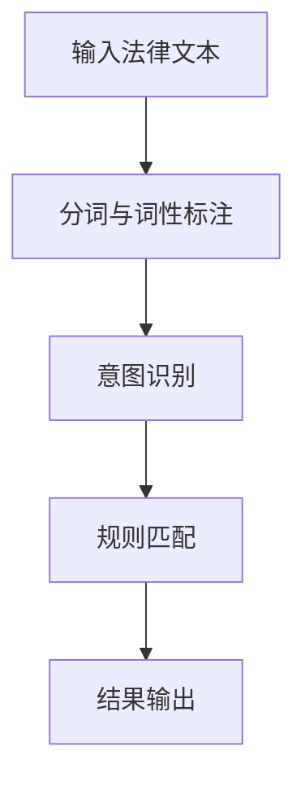
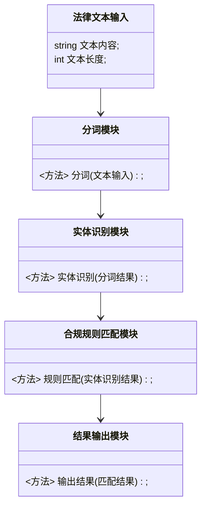
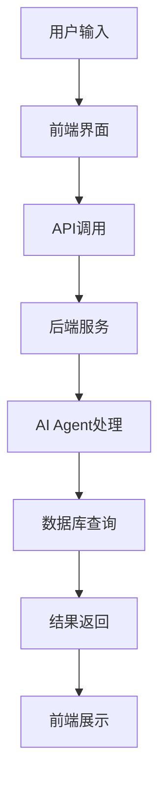
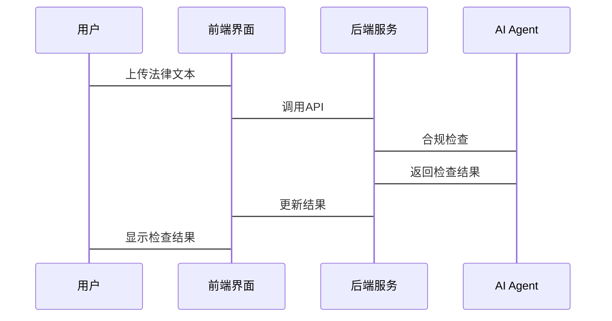

                 


# AI Agent在企业法律合规检查中的应用

> **关键词**：AI Agent，法律合规，企业合规，人工智能，NLP，知识图谱

> **摘要**：  
本文详细探讨了AI Agent在企业法律合规检查中的应用，从背景介绍到技术实现，再到系统设计与项目实战，结合实际案例和最佳实践，全面分析了AI Agent如何利用自然语言处理、知识图谱和规则引擎等技术，提升企业法律合规检查的效率与准确性。通过本文的分析，读者可以深入了解AI Agent在法律合规领域的核心原理与实际应用价值。

---

## 第一部分: AI Agent与企业法律合规检查的背景介绍

### 第1章: AI Agent的基本概念与法律合规检查的重要性

#### 1.1 AI Agent的定义与核心原理

- **AI Agent的基本概念**  
  AI Agent（人工智能代理）是一种能够感知环境、执行任务并做出决策的智能系统。它通过与环境交互，利用传感器获取信息，并通过执行器完成目标。AI Agent的核心在于其智能性，能够处理复杂任务并适应动态变化的环境。

- **AI Agent的核心原理与技术特点**  
  AI Agent的核心技术包括自然语言处理（NLP）、机器学习（ML）、知识图谱和规则引擎。通过这些技术，AI Agent能够理解、分析和处理复杂的法律文本，从而实现高效的合规检查。

- **AI Agent在企业中的应用场景**  
  在企业中，AI Agent可以用于合同审查、合规性分析、风险评估等场景。例如，在合同审查中，AI Agent可以通过NLP技术快速识别合同中的关键条款，帮助法务人员高效完成合规检查。

#### 1.2 法律合规检查的必要性

- **企业法律合规的基本概念**  
  法律合规是指企业行为符合相关法律法规的要求，避免因违规行为导致的法律风险。合规检查是企业内部管理的重要环节，涉及合同审查、数据隐私保护、反腐败等多个方面。

- **法律合规检查对企业的重要性**  
  合规检查能够帮助企业规避法律风险，提升企业形象，同时确保企业在经营过程中符合相关法规要求。然而，传统的人工合规检查效率低、成本高，且容易受到主观因素的影响。

- **AI Agent在法律合规检查中的优势**  
  AI Agent通过自动化处理和高效的信息处理能力，能够显著提高合规检查的效率和准确性。同时，AI Agent可以7x24小时工作，为企业提供实时的合规监控服务。

### 第2章: AI Agent在企业法律合规中的问题背景

#### 2.1 传统法律合规检查的痛点

- **人工检查效率低**  
  传统合规检查依赖人工审查，效率低下，尤其在处理大量法律文本时，人工检查的时间成本较高。

- **信息处理复杂**  
  法律文本通常复杂且冗长，人工检查需要逐字逐句分析，容易出现遗漏或错误。

- **易受主观因素影响**  
  人工检查的结果可能受到检查人员的经验、情绪和主观判断的影响，导致结果不一致。

#### 2.2 AI Agent如何解决这些问题

- **自动化处理的优势**  
  AI Agent能够自动化处理法律文本，快速识别关键条款和风险点，显著提高检查效率。

- **高效信息处理的能力**  
  通过NLP技术，AI Agent可以快速理解法律文本的语义，提取关键信息并进行分类，帮助法务人员快速定位问题。

- **提高检查的客观性与准确性**  
  AI Agent基于预设的规则和模型进行分析，减少了主观因素的影响，提高了检查结果的客观性和准确性。

---

## 第二部分: AI Agent的核心概念与原理

### 第3章: AI Agent的核心原理与技术实现

#### 3.1 自然语言处理技术

- **NLP的基本原理**  
  NLP（自然语言处理）是人工智能的重要分支，旨在让计算机能够理解、处理和生成人类语言。NLP的核心技术包括分词、句法分析、实体识别和情感分析等。

- **分析法律文本的关键技术**  
  在法律合规检查中，NLP技术用于提取法律文本中的关键信息，例如合同条款、风险点等。通过分词和实体识别技术，AI Agent能够准确识别合同中的关键条款。

- **NLP在法律合规中的应用案例**  
  例如，在合同审查中，AI Agent可以通过NLP技术识别合同中的违约条款、保密条款等关键信息，并将其与预设的合规规则进行对比，快速发现潜在风险。

#### 3.2 知识图谱与规则引擎

- **知识图谱的构建与应用**  
  知识图谱是一种以图结构形式表示知识的技术，能够将法律文本中的实体、关系和属性进行结构化表示。通过构建法律知识图谱，AI Agent可以快速查询和推理法律信息。

- **规则引擎的工作原理**  
  规则引擎是一种用于定义和执行业务规则的系统。在法律合规检查中，规则引擎可以根据预设的合规规则，对法律文本进行自动分析和判断。

- **知识图谱与规则引擎的结合**  
  通过结合知识图谱和规则引擎，AI Agent能够实现对法律文本的智能分析。例如，在合规检查中，AI Agent可以根据知识图谱中的实体关系，匹配预设的合规规则，快速识别潜在风险。

### 第4章: AI Agent的算法原理与数学模型

#### 4.1 基于深度学习的模型

- **预训练模型的基本原理**  
  预训练模型是通过大规模数据训练得到的通用模型，能够在多种任务中表现出色。例如，BERT模型通过预训练技术，能够在多种NLP任务中达到较高的准确率。

- **微调模型的实现过程**  
  在法律合规检查中，预训练模型需要通过微调技术进行优化。微调模型是通过在特定任务数据上进行进一步训练，使模型适应特定任务的需求。

- **模型训练的数学公式**  
  模型训练的目标是最小化损失函数。常用的损失函数包括交叉熵损失和均方误差损失。例如，交叉熵损失的公式为：
  $$ L = -\sum_{i=1}^{n} y_i \log(p_i) + (1-y_i)\log(1-p_i) $$

  其中，$y_i$ 是真实标签，$p_i$ 是模型预测的概率。

- **模型优化器**  
  常用的优化器包括随机梯度下降（SGD）、Adam和Adagrad等。Adam优化器的公式为：
  $$ \theta_{t+1} = \theta_t - \eta \frac{v_{t}}{s_{t}+\epsilon} $$
  其中，$\theta$ 是参数，$\eta$ 是学习率，$v_t$ 是动量项，$s_t$ 是自适应学习率，$\epsilon$ 是防止除零的常数。

#### 4.2 算法流程图



---

## 第三部分: AI Agent的系统分析与架构设计

### 第5章: 系统功能设计与架构

#### 5.1 领域模型设计



#### 5.2 系统架构设计



#### 5.3 系统接口设计

- **API接口**  
  系统提供RESTful API接口，用于接收法律文本输入并返回合规检查结果。接口包括：
  - POST /api/input
  - GET /api/result

- **交互流程**  
  用户通过前端界面上传法律文本，系统通过API调用后端服务，后端服务调用AI Agent进行处理，并将结果返回给用户。

#### 5.4 系统交互流程图



---

## 第四部分: 项目实战与案例分析

### 第6章: 项目实战

#### 6.1 环境安装与配置

- **安装Python环境**  
  需要安装Python 3.8或更高版本，并安装必要的库，例如：
  ```bash
  pip install numpy pandas transformers
  ```

- **安装NLP库**  
  安装常用的NLP库，例如：
  ```bash
  pip install spacy
  ```

#### 6.2 系统核心实现

- **分词模块**  
  使用spaCy库进行分词和词性标注：
  ```python
  import spacy

  nlp = spacy.load("en_core_web_sm")
  doc = nlp(text)
  for token in doc:
      print(token.text, token.pos_)
  ```

- **实体识别模块**  
  使用spaCy进行实体识别：
  ```python
  for ent in doc.ents:
      print(ent.text, ent.label_)
  ```

- **规则匹配模块**  
  通过正则表达式匹配特定法律条款：
  ```python
  import re

  pattern = r"\bclause\b"
  matches = re.findall(pattern, text)
  ```

- **结果输出模块**  
  将匹配结果输出为JSON格式：
  ```python
  result = {
      "clause": matches,
      "risk": risk_level
  }
  print(json.dumps(result, indent=2))
  ```

#### 6.3 案例分析与解读

- **案例背景**  
  某企业需要审查一份长期合同，合同内容涉及多个法律条款。

- **案例分析**  
  AI Agent通过分词、实体识别和规则匹配，快速识别合同中的关键条款，并与预设的合规规则进行对比，发现潜在风险。

- **案例结果**  
  AI Agent帮助法务人员快速定位合同中的潜在风险，并提供合规建议，显著提高了审查效率。

---

## 第五部分: 最佳实践与总结

### 第7章: 最佳实践与总结

#### 7.1 小结

- AI Agent通过NLP、知识图谱和规则引擎等技术，显著提高了企业法律合规检查的效率和准确性。
- AI Agent的应用能够帮助企业规避法律风险，提升内部管理效率。

#### 7.2 注意事项

- 在实际应用中，需要确保AI Agent的模型和规则库不断更新，以适应法律法规的变化。
- 需要注意数据隐私保护，避免敏感信息泄露。

#### 7.3 拓展阅读

- 推荐阅读《自然语言处理实战》和《知识图谱构建与应用》等相关书籍，深入理解AI Agent的核心技术。

---

## 结语

通过本文的详细分析，我们可以看到，AI Agent在企业法律合规检查中的应用具有巨大的潜力。随着技术的不断进步，AI Agent将能够更好地帮助企业应对复杂的法律合规挑战，为企业创造更大的价值。

