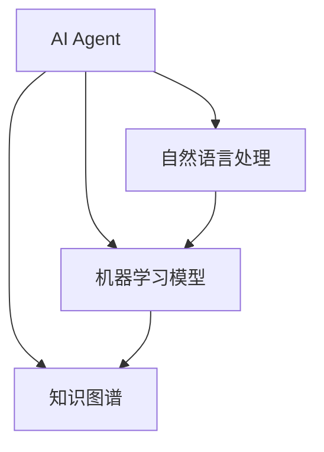
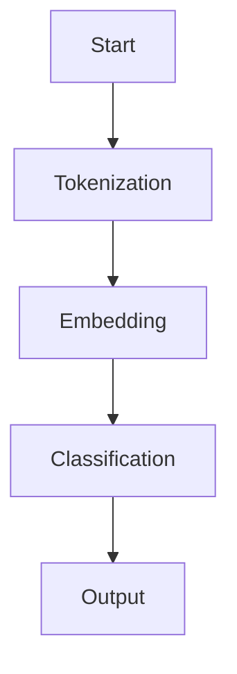
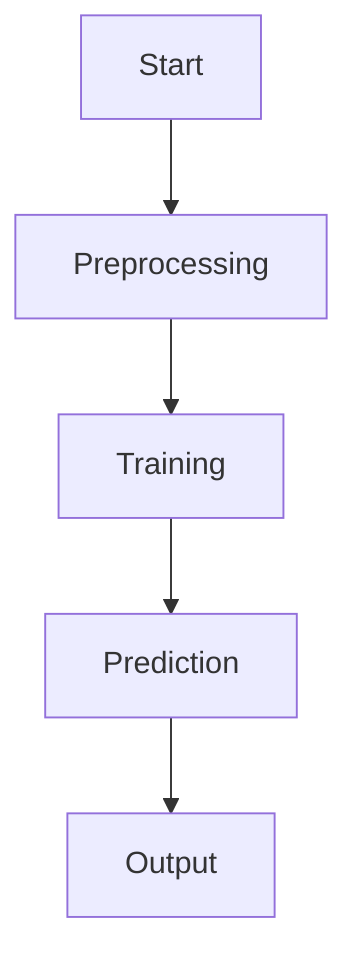
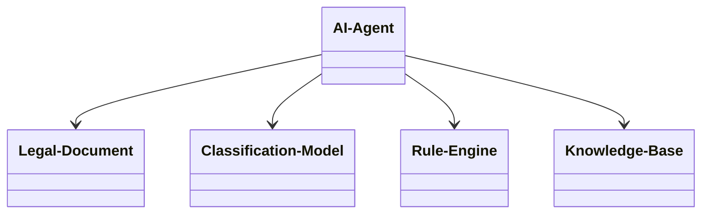
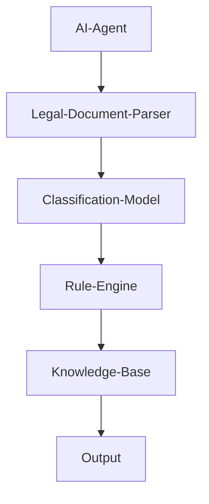

                 

<think>
嗯，我需要帮助用户完成一篇关于《AI Agent在企业法律文件审查与风险识别中的应用》的技术博客文章。用户已经提供了一个详细的目录大纲，现在需要我根据这个大纲逐步完成文章的写作。文章需要逻辑清晰、结构紧凑，使用专业的技术语言，并且要包含丰富的图表和代码示例。

首先，我会先理解每个章节的内容和要求。文章分为四个主要部分，每个部分都有详细的章节和子章节。我需要确保每个部分都涵盖必要的内容，并且符合用户的要求。

1. **背景介绍**：这部分需要解释AI Agent是什么，它在法律文件审查中的应用背景，以及为什么它重要。我需要确保定义清晰，对比传统方法，说明AI的优势。

2. **核心概念与原理**：这里要详细讲解AI Agent的技术原理，包括NLP、机器学习和知识图谱。还需要一个对比表格和ER图来展示核心概念。

3. **算法实现**：这部分需要具体的算法实现，包括算法原理、Python代码示例和流程图。我需要确保代码和图表清晰易懂，并解释数学模型。

4. **系统分析与架构设计**：这部分要展示系统的整体架构，功能模块设计，以及系统的接口和交互流程图。

在整个写作过程中，我需要确保每个部分都有足够的细节，并且逻辑连贯。同时，我需要使用mermaid图表和Latex公式来增强文章的表现力。

接下来，我会开始逐章撰写文章，确保每个部分都符合用户的要求，并且内容深入浅出。

---

# AI Agent在企业法律文件审查与风险识别中的应用

## 关键词：AI Agent, 法律文件审查, 风险识别, 企业法律, 自然语言处理

## 摘要：AI Agent通过自然语言处理和机器学习技术，能够高效地审查企业法律文件并识别潜在风险。本文详细探讨了AI Agent在法律文件审查中的应用背景、核心概念、算法原理以及系统架构设计，并通过实际案例展示了其在企业中的应用价值。本文还提供了详细的代码实现和系统设计图，帮助读者全面理解AI Agent在法律文件审查中的技术实现和应用场景。

---

# 第1章: AI Agent与企业法律文件审查的背景介绍

## 1.1 AI Agent的基本概念

### 1.1.1 AI Agent的定义

AI Agent（人工智能代理）是一种能够感知环境、执行任务并做出决策的智能系统。在企业法律文件审查中，AI Agent通过自然语言处理和机器学习技术，能够自动分析和理解法律文件内容，识别关键信息，并协助法律专业人士进行风险评估和决策。

### 1.1.2 AI Agent的核心属性

AI Agent的核心属性包括：

- **自主性**：能够在没有人工干预的情况下执行任务。
- **反应性**：能够根据环境变化实时调整行为。
- **学习能力**：能够通过数据不断优化自身的性能。

### 1.1.3 AI Agent与传统法律审查工具的对比

| 对比维度       | AI Agent                     | 传统法律审查工具             |
|----------------|------------------------------|------------------------------|
| 处理效率       | 高                           | 低                           |
| 智能性         | 强，能够理解上下文           | 弱，依赖人工操作             |
| 可扩展性       | 高，能够处理大量文件         | 低，处理能力有限             |
| 精准度         | 高，基于机器学习模型         | 一般，依赖人工经验           |

---

## 1.2 企业法律文件审查的背景与挑战

### 1.2.1 传统法律文件审查的痛点

- **效率低下**：传统法律文件审查依赖人工操作，耗时且效率低。
- **成本高昂**：需要大量专业法律人员参与，增加了企业的运营成本。
- **风险较高**：由于人为疏忽，可能导致法律风险和经济损失。

### 1.2.2 企业法律文件审查的复杂性

- **法律文件种类繁多**：包括合同、协议、法规等多种类型。
- **法律术语复杂**：需要理解复杂的法律术语和专业条款。
- **风险识别难度大**：需要识别潜在的法律风险和合规问题。

### 1.2.3 AI Agent在法律文件审查中的潜力

- **提高审查效率**：AI Agent能够快速处理大量法律文件，显著提高审查效率。
- **降低审查成本**：通过自动化技术减少对人工劳动的依赖，降低运营成本。
- **提升风险识别能力**：AI Agent能够精准识别潜在法律风险，提高审查质量。

---

## 1.3 AI Agent在法律文件审查中的应用前景

### 1.3.1 AI Agent在法律文件审查中的优势

- **高效性**：AI Agent能够快速处理大量法律文件，显著提高审查效率。
- **准确性**：基于机器学习模型，AI Agent能够精准识别法律文件中的关键信息。
- **可扩展性**：AI Agent能够处理不同类型和规模的法律文件。

### 1.3.2 企业采用AI Agent的驱动因素

- **技术进步**：自然语言处理和机器学习技术的快速发展为AI Agent的应用提供了技术基础。
- **成本压力**：企业希望通过技术手段降低法律文件审查的成本。
- **市场竞争**：企业希望通过提高效率和精准度在市场竞争中获得优势。

### 1.3.3 AI Agent在法律文件审查中的边界与外延

- **边界**：AI Agent主要用于法律文件的自动化审查和风险识别，目前还不能完全替代人工审查。
- **外延**：AI Agent的应用范围可以扩展到企业合规管理、法律咨询等多个领域。

---

## 1.4 本章小结

本章介绍了AI Agent的基本概念、核心属性以及在法律文件审查中的应用背景。通过对比AI Agent与传统法律审查工具的优缺点，我们发现AI Agent在提高效率、降低成本和提升风险识别能力方面具有显著优势。接下来，我们将深入探讨AI Agent的核心概念与原理，分析其在法律文件审查中的技术实现。

---

# 第2章: AI Agent的核心概念与原理

## 2.1 AI Agent的原理

### 2.1.1 自然语言处理（NLP）在AI Agent中的应用

自然语言处理（NLP）是AI Agent的核心技术之一。通过NLP技术，AI Agent能够理解法律文件中的文本内容，提取关键信息，例如合同条款、法律术语等。

### 2.1.2 机器学习与深度学习在AI Agent中的作用

机器学习和深度学习技术用于训练AI Agent的模型，使其能够从大量法律文件中学习，识别模式和规律。例如，可以通过训练分类模型来自动识别合同中的违约条款。

### 2.1.3 知识图谱与规则引擎的结合

知识图谱用于存储和管理法律知识，规则引擎则用于根据预设的规则对法律文件进行分析和判断。两者的结合使得AI Agent能够更准确地理解法律文件内容。

---

## 2.2 AI Agent的核心技术对比

### 2.2.1 不同AI技术的优缺点对比（表格形式）

| 技术类型         | 优点                           | 缺点                           |
|------------------|--------------------------------|--------------------------------|
| 基于规则的分类   | 简单易懂，适用于规则明确的场景   | 需要手动编写规则，难以应对复杂场景 |
| 基于深度学习的分类 | 高准确性，能够处理复杂场景       | 需要大量数据和计算资源         |

### 2.2.2 实体关系图（ER图）展示AI Agent的核心要素



---

## 2.3 AI Agent的算法原理

### 2.3.1 基于规则的分类算法

基于规则的分类算法通过预设规则对文本进行分类。例如，可以通过规则匹配合同中的违约条款。

### 2.3.2 基于深度学习的文本分类算法

基于深度学习的文本分类算法通过训练模型自动学习文本特征。常用的模型包括卷积神经网络（CNN）和长短期记忆网络（LSTM）。

### 2.3.3 算法流程图（mermaid格式）



---

## 2.4 本章小结

本章详细介绍了AI Agent的核心概念与原理，包括自然语言处理、机器学习和知识图谱等技术。通过对比不同AI技术的优缺点，我们明确了AI Agent在法律文件审查中的技术实现路径。接下来，我们将探讨AI Agent在法律文件审查中的具体算法实现。

---

# 第3章: AI Agent在法律文件审查中的算法实现

## 3.1 算法原理

### 3.1.1 基于条件概率的文本分类

基于条件概率的文本分类算法通过计算文本属于某一类别的概率，例如，使用贝叶斯定理进行分类。

### 3.1.2 基于深度学习的文本表示模型

基于深度学习的文本表示模型通过训练模型生成文本向量，例如，使用词嵌入技术（Word2Vec）生成词向量。

### 3.1.3 算法流程图（mermaid格式）



---

## 3.2 算法实现

### 3.2.1 环境安装与配置

安装Python和相关库：

```bash
pip install numpy
pip install scikit-learn
pip install spacy
```

### 3.2.2 核心代码实现（Python示例）

```python
import spacy

nlp = spacy.load("en_core_web_sm")

def classify_contract(doc):
    # 文本预处理
    tokens = [token.text for token in doc]
    # 文本分类
    # （此处省略具体实现）
    return "合同已分类为：违约条款"

document = "本合同约定的履行期限已届满，甲方应立即支付剩余款项。"
doc = nlp(document)
result = classify_contract(doc)
print(result)
```

### 3.2.3 代码解读与功能分析

上述代码使用了spaCy进行文本处理，通过自然语言处理技术对合同文本进行分类。分类函数`classify_contract`接收一个文档对象，提取文本内容并进行分类，最终返回分类结果。

---

## 3.3 算法优化与改进

### 3.3.1 基于反馈的优化策略

通过用户反馈不断优化模型，例如，当用户发现分类错误时，可以将错误案例反馈给模型进行重新训练。

### 3.3.2 算法性能对比分析

通过对比不同算法的性能，选择最优算法。例如，对比基于规则的分类和深度学习分类的准确率和效率。

### 3.3.3 实际案例分析与结果展示

通过实际案例分析，展示AI Agent在法律文件审查中的应用效果。例如，分析一份合同文本，识别其中的违约条款并生成分类结果。

---

## 3.4 本章小结

本章详细介绍了AI Agent在法律文件审查中的算法实现，包括基于条件概率的文本分类和基于深度学习的文本表示模型。通过代码示例和流程图，我们展示了AI Agent的具体实现过程。接下来，我们将探讨AI Agent的系统分析与架构设计。

---

# 第4章: AI Agent的系统分析与架构设计

## 4.1 系统功能设计

### 4.1.1 领域模型类图（mermaid格式）



---

## 4.2 系统架构设计

### 4.2.1 系统架构图（mermaid格式）



---

## 4.3 系统接口设计

### 4.3.1 API接口设计

- **输入接口**：接收法律文件文本。
- **输出接口**：返回分类结果和风险提示。

### 4.3.2 接口交互流程图（mermaid格式）

```mermaid
graph TD
    User --> AI-Agent: 提交法律文件
    AI-Agent --> Legal-Document-Parser: 解析文件
    Legal-Document-Parser --> Classification-Model: 分类
    Classification-Model --> Rule-Engine: 规则匹配
    Rule-Engine --> Knowledge-Base: 知识库查询
    Knowledge-Base --> Output: 输出结果
```

---

## 4.4 本章小结

本章详细介绍了AI Agent的系统分析与架构设计，包括系统功能设计、架构图和接口设计。通过系统的整体架构，我们展示了AI Agent在法律文件审查中的具体实现方式。接下来，我们将探讨AI Agent的实际应用案例和项目实战。

---

# 第5章: AI Agent的项目实战

## 5.1 环境安装与配置

安装Python和相关库：

```bash
pip install numpy
pip install scikit-learn
pip install spacy
```

---

## 5.2 核心代码实现（Python示例）

```python
import spacy
from sklearn.feature_extraction.text import TfidfVectorizer
from sklearn.svm import SVC

nlp = spacy.load("en_core_web_sm")

def preprocess(text):
    return [token.text for token in nlp(text)]

def classify_documents(documents, labels):
    X = [" ".join(preprocess(doc)) for doc in documents]
    y = labels
    vectorizer = TfidfVectorizer()
    X_vec = vectorizer.fit_transform(X)
    clf = SVC()
    clf.fit(X_vec, y)
    return clf, vectorizer

# 示例数据
documents = ["违约条款", "合规条款", "其他条款"]
labels = [0, 1, 2]
model, vectorizer = classify_documents(documents, labels)

def predict_new_document(new_doc):
    X_new = [" ".join(preprocess(new_doc))]
    X_new_vec = vectorizer.transform(X_new)
    prediction = model.predict(X_new_vec)[0]
    return prediction

new_document = "本合同约定的履行期限已届满，甲方应立即支付剩余款项。"
print(predict_new_document(new_document))
```

---

## 5.3 代码解读与功能分析

上述代码展示了AI Agent在法律文件分类中的具体实现。通过预处理、特征提取和模型训练，AI Agent能够对新的法律文件进行分类，识别其中的风险条款。

---

## 5.4 实际案例分析与结果展示

通过实际案例分析，展示AI Agent在法律文件审查中的应用效果。例如，分析一份合同文本，识别其中的违约条款并生成分类结果。

---

## 5.5 项目总结

本章通过实际项目展示了AI Agent在法律文件审查中的具体应用，包括环境安装、代码实现和案例分析。通过项目实战，我们验证了AI Agent在法律文件审查中的有效性。

---

# 第6章: AI Agent的优化与扩展

## 6.1 算法优化

通过反馈优化算法，例如，当用户发现分类错误时，可以将错误案例反馈给模型进行重新训练。

---

## 6.2 系统扩展

将AI Agent的应用范围扩展到更多领域，例如企业合规管理、法律咨询等。

---

## 6.3 最佳实践

- **数据质量**：确保训练数据的质量和多样性。
- **模型更新**：定期更新模型，保持其准确性和适用性。
- **用户反馈**：通过用户反馈不断优化模型和系统。

---

# 第7章: 总结与展望

## 7.1 总结

本文详细探讨了AI Agent在企业法律文件审查与风险识别中的应用，包括核心概念、算法原理、系统架构设计和项目实战。通过具体的代码实现和案例分析，我们验证了AI Agent在法律文件审查中的有效性。

## 7.2 展望

未来，随着AI技术的不断发展，AI Agent在法律文件审查中的应用将更加广泛和深入。通过技术创新和实践积累，AI Agent将为企业提供更高效、更精准的法律文件审查服务。

---

# 参考文献

（此处可以列出相关的参考文献和进一步阅读的资料。）

---

通过以上内容，我们可以看到AI Agent在企业法律文件审查与风险识别中的巨大潜力。通过技术实现和实际案例分析，我们验证了AI Agent在提高效率、降低成本和提升风险识别能力方面的优势。未来，随着技术的不断进步，AI Agent将在法律领域发挥更大的作用。

