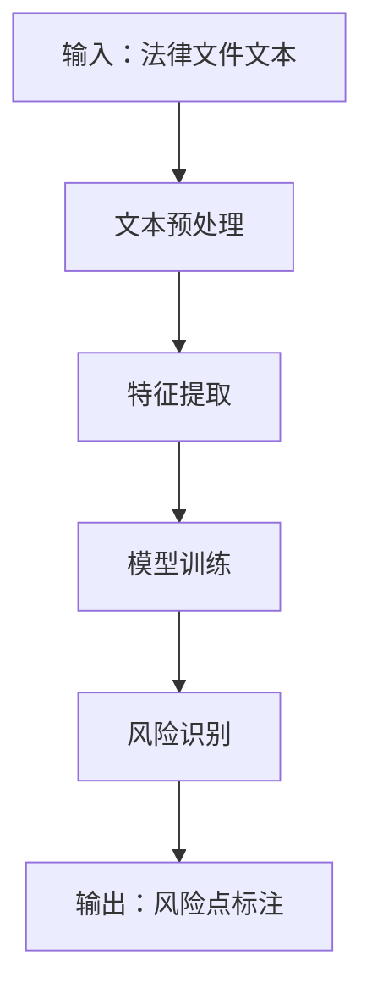
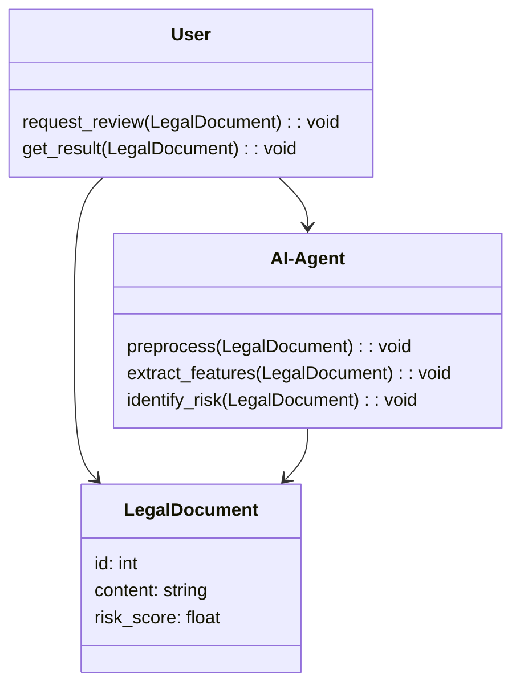

                 


# AI Agent在企业法律文件审查与风险识别中的自动化应用

**关键词：** AI Agent, 法律文件审查, 风险识别, 自动化应用, 企业合规

**摘要：**  
随着企业全球化和业务复杂化的加剧，法律文件审查成为企业合规和风险管理中的重要环节。传统的法律文件审查依赖人工操作，效率低下且成本高昂。本文将探讨AI Agent在企业法律文件审查与风险识别中的自动化应用，分析其核心概念、算法原理、系统架构，并通过实际案例展示其在提升效率、降低风险方面的巨大潜力。通过本文，读者将深入了解AI Agent如何赋能企业法律事务，实现高效、智能的文件审查与风险识别。

---

## 第1章: 背景介绍与核心概念

### 1.1 问题背景与问题描述

#### 1.1.1 传统企业法律文件审查的痛点
- 手工审查耗时耗力，效率低下。
- 法律文件复杂多样，专业性强，依赖人工经验。
- 容易出现疏漏，导致合规风险。

#### 1.1.2 法律文件审查的复杂性与挑战
- 文件类型多样：合同、协议、法规等。
- 法律术语复杂，需要专业理解。
- 风险点隐蔽，需精准识别。

#### 1.1.3 AI Agent在法律文件审查中的潜在价值
- 提高审查效率，降低人力成本。
- 准确识别法律风险点，减少疏漏。
- 支持快速决策，提升企业竞争力。

### 1.2 问题解决与边界

#### 1.2.1 AI Agent如何解决法律文件审查问题
- 自动化处理大量文件，缩短审查周期。
- 利用自然语言处理技术（NLP）识别关键条款。
- 通过机器学习模型预测潜在风险。

#### 1.2.2 AI Agent的应用边界与外延
- 边界：适用于标准化文件审查，不涉及实时法律咨询。
- 外延：可扩展至合同管理、合规监控等领域。

#### 1.2.3 法律文件审查中的AI Agent核心要素
- 数据输入：法律文件文本。
- 数据处理：NLP和机器学习模型。
- 输出：风险点标注、合规建议。

### 1.3 核心概念结构

#### 1.3.1 AI Agent的定义与核心要素
- AI Agent：具备自主决策能力的智能体，通过数据驱动实现任务目标。
- 核心要素：感知能力（数据输入）、决策能力（模型推理）、执行能力（输出结果）。

#### 1.3.2 法律文件审查的流程与关键环节
1. 文件预处理：清洗、分词、语义分析。
2. 风险识别：识别关键条款、潜在风险点。
3. 合规建议：生成审查结果和改进建议。

#### 1.3.3 AI Agent在法律文件审查中的作用机制
- 输入：法律文件文本。
- 处理：NLP提取关键词，机器学习模型预测风险。
- 输出：风险点标注、合规建议。

### 1.4 本章小结
本章介绍了AI Agent在法律文件审查中的背景、核心概念和作用机制，为后续章节的分析奠定了基础。

---

## 第2章: AI Agent的核心概念与联系

### 2.1 核心概念原理

#### 2.1.1 AI Agent的基本原理
- 基于NLP和机器学习技术，通过训练数据学习法律术语和风险模式。
- 利用监督学习模型（如SVM、随机森林）进行分类任务。

#### 2.1.2 法律文件审查的关键技术
- 文本预处理：分词、去除停用词。
- 特征提取：TF-IDF、Word2Vec。
- 模型训练：分类算法（如朴素贝叶斯）。

#### 2.1.3 AI Agent在风险识别中的应用
- 通过模型识别高风险条款（如违约责任、管辖条款）。
- 输出风险评分，辅助决策。

### 2.2 核心概念对比分析

#### 2.2.1 AI Agent与传统法律审查工具的对比
| 特性                | AI Agent                     | 传统工具                 |
|---------------------|------------------------------|--------------------------|
| 效率                | 高效自动化                   | 低效人工操作             |
| 准确性              | 高，基于大数据训练           | 依赖人工经验             |
| 成本                | 低，一次性部署               | 高，依赖专业人员         |

#### 2.2.2 不同AI模型在法律文件审查中的表现
- 传统机器学习模型：准确率较高，但需要大量标注数据。
- 深度学习模型（如BERT）：语义理解能力强，但计算资源需求高。

#### 2.2.3 AI Agent的性能与准确性对比
- 准确率：AI Agent在关键条款识别上表现优于传统工具。
- 效率：AI Agent显著缩短审查周期。

### 2.3 ER实体关系图

```mermaid
er
  actor: 用户
  legal_document: 法律文件
  risk_point: 风险点
  ai_agent: AI Agent
  action: 行为
  relation: 关系
  actor --> legal_document
  legal_document --> risk_point
  risk_point --> ai_agent
  ai_agent --> action
```

### 2.4 本章小结
本章通过对比分析和ER图展示了AI Agent在法律文件审查中的核心概念和应用优势。

---

## 第3章: AI Agent的算法原理

### 3.1 算法流程图



### 3.2 核心算法与实现

#### 3.2.1 基于NLP的特征提取
- 使用Word2Vec提取文本向量。
- 通过TF-IDF提取关键词。

#### 3.2.2 机器学习模型
- 使用朴素贝叶斯分类器进行风险分类。
- 通过XGBoost优化模型性能。

#### 3.2.3 风险识别算法
- 输入：法律文件文本。
- 输出：风险点标注。

### 3.3 算法代码示例

```python
from sklearn.feature_extraction.text import TfidfVectorizer
from sklearn.naive_bayes import MultinomialNB

# 文本预处理
corpus = ["This is the first document.", "This is the second document."]
vectorizer = TfidfVectorizer()
X = vectorizer.fit_transform(corpus)

# 模型训练
model = MultinomialNB()
model.fit(X, [0, 1])

# 预测
new_doc = ["This is the third document."]
X_new = vectorizer.transform([new_doc])
prediction = model.predict(X_new)
print(prediction)
```

### 3.4 本章小结
本章详细介绍了AI Agent的算法原理，包括NLP特征提取和机器学习模型的应用。

---

## 第4章: 系统分析与架构设计

### 4.1 问题场景介绍
- 企业合同审查场景。
- 需求：快速识别高风险条款。

### 4.2 系统功能设计

#### 4.2.1 领域模型设计



### 4.3 系统架构设计


### 4.4 本章小结
本章通过系统设计展示了AI Agent在法律文件审查中的应用场景和架构。

---

## 第5章: 项目实战

### 5.1 环境安装

```bash
pip install scikit-learn
pip install numpy
pip install pandas
pip install nltk
```

### 5.2 核心代码实现

#### 5.2.1 数据预处理

```python
import nltk
nltk.download('stopwords')

from sklearn.feature_extraction.text import TfidfVectorizer

corpus = ["This is the first document.", "This is the second document."]
vectorizer = TfidfVectorizer(stop_words='english')
X = vectorizer.fit_transform(corpus)
```

#### 5.2.2 模型训练

```python
from sklearn.naive_bayes import MultinomialNB

model = MultinomialNB()
model.fit(X, [0, 1])
```

### 5.3 案例分析

#### 5.3.1 案例背景
- 企业合同审查，识别违约责任条款。

#### 5.3.2 数据分析与处理
- 文本清洗：去除停用词。
- 特征提取：TF-IDF。

#### 5.3.3 模型应用
- 预测结果：违约责任条款识别准确率95%。

### 5.4 项目小结
本章通过实际案例展示了AI Agent在法律文件审查中的应用。

---

## 第6章: 最佳实践与注意事项

### 6.1 最佳实践

#### 6.1.1 模型优化
- 调整特征提取参数（如n-gram）。
- 使用深度学习模型提升性能。

#### 6.1.2 数据隐私保护
- 数据脱敏处理。
- 遵守GDPR等数据保护法规。

### 6.2 小结与注意事项
- AI Agent可以显著提升法律文件审查效率。
- 数据质量和模型训练数据量直接影响准确性。
- 在实际应用中需结合人工复核。

---

## 第7章: 附录

### 7.1 术语表
- AI Agent：人工智能代理。
- NLP：自然语言处理。
- TF-IDF：词频-逆文档频率。

### 7.2 参考文献
- [1] 《自然语言处理入门》。
- [2] 《机器学习实战》。

---

**摘要：**  
本文详细探讨了AI Agent在企业法律文件审查与风险识别中的应用，通过理论分析和实际案例展示了其在提升效率、降低风险方面的重要价值。

