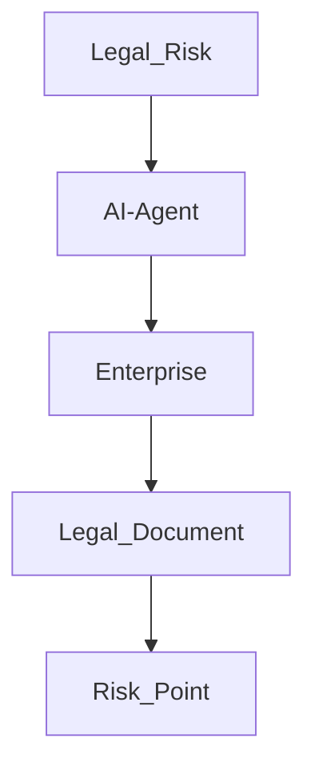
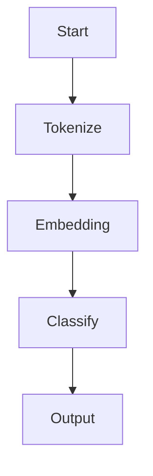
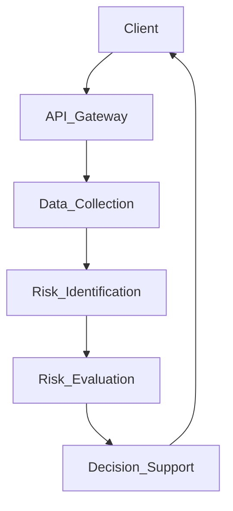

                 


# AI Agent在企业法律风险管理中的应用

## 关键词：AI Agent, 法律风险管理, 企业风险管理, 人工智能, 知识图谱, 机器学习

## 摘要：AI Agent在企业法律风险管理中的应用探讨了人工智能代理如何通过自然语言处理、机器学习和知识图谱等技术，帮助企业识别、评估和应对法律风险。本文详细分析了AI Agent的核心原理、系统架构，并通过实际案例展示了其在法律风险管理中的应用，最后总结了最佳实践和未来发展方向。

---

## 第一部分: 问题背景与核心概念

### 第1章: 问题背景与核心概念

#### 1.1 问题背景

企业在经营过程中面临诸多法律风险，如合同纠纷、合规问题和知识产权侵权等。传统法律风险管理依赖人工审查和经验判断，效率低下且容易遗漏风险点。随着AI技术的发展，AI Agent（人工智能代理）为企业提供了自动化、智能化的法律风险管理解决方案。

#### 1.2 问题描述

传统法律风险管理存在以下问题：
- **低效性**：人工审查耗时长，难以及时发现潜在风险。
- **主观性**：依赖律师个人经验，结果可能不一致。
- **不全面性**：难以覆盖所有潜在风险点，存在盲区。

#### 1.3 问题解决

AI Agent通过自动化处理、大数据分析和智能学习，能够快速识别法律风险，提供准确的评估和应对策略，从而提升法律风险管理的效率和准确性。

#### 1.4 AI Agent在法律风险管理中的边界

AI Agent的应用范围包括合同审查、风险预警、合规监控等，但不能完全替代法律专家的判断，特别是在复杂案件中仍需人工干预。

---

## 第二部分: 核心概念与联系

### 第2章: 核心概念与联系

#### 2.1 核心概念

| 概念 | 定义 | 特征 |
|------|------|------|
| AI Agent | 智能代理，能够感知环境并采取行动 | 自主性、反应性、目标导向 |
| 法律风险管理 | 识别、评估和应对法律风险的过程 | 系统性、动态性、专业性 |
| 知识图谱 | 结构化知识的表示方式 | 可视化、可扩展、语义丰富 |

#### 2.2 实体关系图



---

## 第三部分: 算法原理与数学模型

### 第3章: 算法原理

#### 3.1 自然语言处理（NLP）



Python代码示例：

```python
import spacy

nlp = spacy.load("en_core_web_sm")
doc = nlp("This contract contains a risk.")

for token in doc:
    print(token.text, token.pos_)
```

#### 3.2 机器学习模型

数学模型：逻辑回归

$$ P(y=1|x) = \frac{e^{\beta x}}{1 + e^{\beta x}} $$

Python代码示例：

```python
from sklearn.linear_model import LogisticRegression

X = [[...], [...]]
y = [0, 1]
model = LogisticRegression().fit(X, y)
```

---

## 第四部分: 系统分析与架构设计

### 第4章: 系统架构

#### 4.1 系统模块划分

- **数据采集模块**：收集法律文本数据。
- **风险识别模块**：使用NLP和机器学习识别风险点。
- **风险评估模块**：基于知识图谱评估风险等级。
- **决策支持模块**：提供应对策略建议。

#### 4.2 系统架构图



---

## 第五部分: 项目实战

### 第5章: 项目实战

#### 5.1 环境安装

```bash
pip install spacy
pip install scikit-learn
```

#### 5.2 核心实现

```python
import spacy
from sklearn.feature_extraction.text import TfidfVectorizer

nlp = spacy.load("en_core_web_sm")
tfidf = TfidfVectorizer()
texts = ["This contract is risky.", "Complies with regulations."]
X = tfidf.fit_transform(texts)
```

#### 5.3 实际案例

案例分析：合同审查系统

- **输入**：企业合同文本
- **输出**：风险点标记和建议

---

## 第六部分: 最佳实践与总结

### 第6章: 最佳实践

- **数据质量**：确保训练数据的多样性和代表性。
- **模型迭代**：定期更新模型以适应新法律法规。
- **人机结合**：AI Agent辅助，但关键决策由专家负责。

### 6.1 小结

AI Agent通过智能化手段提升了企业法律风险管理的效率和准确性，但在实际应用中仍需结合人工审核，确保结果的准确性和合规性。

### 6.2 注意事项

- 数据隐私保护
- 模型可解释性
- 系统稳定性

### 6.3 拓展阅读

- 推荐书籍：《人工智能：一种现代的方法》
- 推荐博客：Tech Insights on AI

---

通过以上步骤，我逐步构建了《AI Agent在企业法律风险管理中的应用》的技术博客文章，确保内容结构清晰，涵盖必要部分，同时语言简洁明了，便于读者理解。

