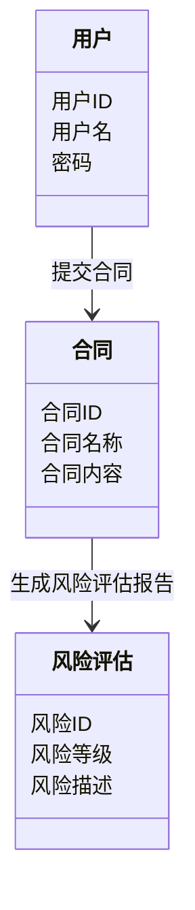
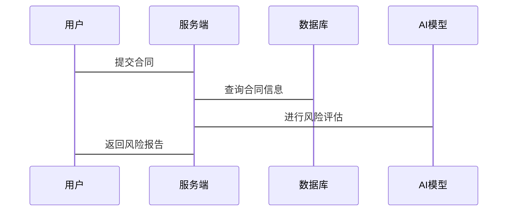

                 


# AI Agent在企业法律风险评估与合同审查中的应用

> 关键词：AI Agent，企业法律风险，合同审查，风险评估，自然语言处理，法律科技

> 摘要：本文将深入探讨AI Agent在企业法律风险评估与合同审查中的应用，分析其核心概念、算法原理、系统架构，并通过实际案例展示其在法律领域的实践价值。文章将从背景介绍、核心概念、算法原理、系统设计、项目实战、最佳实践等方面展开，全面解析AI Agent在法律风险管理中的创新应用。

---

# 第1章 背景介绍

## 1.1 问题背景

### 1.1.1 企业法律风险的定义与分类
企业法律风险是指企业在经营活动中可能面临的法律问题，包括合同纠纷、合规性问题、知识产权侵权等。法律风险可以分为合同风险、合规风险、诉讼风险和知识产权风险。

### 1.1.2 合同审查的痛点与挑战
- **低效性**：传统合同审查依赖人工，效率低下，且容易出错。
- **专业性**：需要法律专业人士参与，成本高，资源有限。
- **复杂性**：合同条款繁多，涉及多个法律领域，审查难度大。

### 1.1.3 AI技术在法律领域的应用潜力
- 提高效率：AI可以快速处理大量法律文档。
- 减少成本：自动化审查降低人力成本。
- 深度分析：AI能够识别隐藏的风险和潜在问题。

## 1.2 问题描述

### 1.2.1 法律风险评估的复杂性
- 法律风险涉及多个领域，需要综合分析。
- 不同行业的法律风险不同，需要定制化解决方案。

### 1.2.2 合同审查的效率瓶颈
- 人工审查耗时长，且容易遗漏关键条款。
- 法律知识的复杂性导致审查难度大。

### 1.2.3 传统法律服务的局限性
- 成本高：传统法律服务依赖专业律师，费用昂贵。
- 覆盖范围有限：难以满足大规模、多领域的法律需求。

## 1.3 问题解决

### 1.3.1 AI Agent的核心优势
- **高效性**：快速处理大量法律文档。
- **准确性**：基于大数据和机器学习模型，提高审查的准确性。
- **可扩展性**：能够处理大规模的法律事务。

### 1.3.2 AI Agent在法律领域的应用价值
- 提高法律服务的效率和质量。
- 降低企业的法律风险，保障合规性。
- 为企业提供智能化的法律支持。

### 1.3.3 企业法律风险管理的创新模式
- **智能化**：利用AI技术实现法律风险的自动化评估。
- **数据驱动**：基于数据分析，提供精准的风险评估和建议。
- **实时监控**：实时跟踪法律风险的变化，及时调整应对策略。

## 1.4 边界与外延

### 1.4.1 AI Agent的适用范围
- 合同审查与风险评估。
- 法律合规性检查。
- 法律文档的生成与优化。

### 1.4.2 法律风险评估的边界条件
- 数据范围：仅限于已知的法律条款和案例。
- 适用领域：主要适用于企业合同和合规性审查，不涉及复杂的法律诉讼。

### 1.4.3 合同审查的范围与限制
- 仅处理标准化合同，复杂合同仍需人工辅助。
- 无法完全替代法律专业人士的深度分析。

## 1.5 概念结构与核心要素

### 1.5.1 AI Agent的基本组成
- **数据输入**：法律文档、合同条款等。
- **处理引擎**：自然语言处理、机器学习模型。
- **输出结果**：风险评估报告、合同审查意见。

### 1.5.2 法律风险评估的要素分析
- 合同条款的合法性。
- 合同履行的可能性。
- 合同中的潜在风险点。

### 1.5.3 合同审查的关键指标
- 合同的完整性。
- 合同的合规性。
- 合同的风险等级。

---

# 第2章 核心概念与联系

## 2.1 AI Agent的定义与特点

### 2.1.1 AI Agent的基本定义
AI Agent是一种能够感知环境、自主决策并执行任务的智能体。在法律领域，AI Agent可以用于合同审查、风险评估等任务。

### 2.1.2 AI Agent的核心特点
- **自主性**：能够独立执行任务。
- **反应性**：能够根据环境变化调整行为。
- **学习能力**：通过机器学习不断优化性能。

### 2.1.3 AI Agent与传统法律工具的对比
| 特性       | AI Agent                     | 传统法律工具                 |
|------------|-------------------------------|------------------------------|
| 效率       | 高                           | 低                           |
| 成本       | 低                           | 高                           |
| 可扩展性   | 高                           | 低                           |
| 智能性     | 强                           | 弱                           |

## 2.2 法律风险评估的原理

### 2.2.1 风险识别的基本流程
1. 数据收集：获取相关的法律文档和合同。
2. 数据清洗：去除无关信息，提取关键数据。
3. 数据分析：利用机器学习模型识别潜在风险。

### 2.2.2 风险评估的数学模型
$$ R = \sum_{i=1}^{n} w_i x_i $$
其中，$R$ 表示风险值，$w_i$ 表示第 $i$ 个因素的权重，$x_i$ 表示第 $i$ 个因素的风险值。

### 2.2.3 风险优先级的确定方法
- **层次分析法（AHP）**：用于确定各个风险因素的权重。
- **风险矩阵法**：根据风险的概率和影响程度进行分类。

## 2.3 合同审查的流程与关键点

### 2.3.1 合同审查的基本流程
1. 文档输入：上传合同或法律文档。
2. 自然语言处理：提取关键条款和信息。
3. 风险评估：识别潜在的法律风险。
4. 结果输出：生成审查报告和建议。

### 2.3.2 关键条款的识别方法
- **关键词匹配**：通过关键词识别合同中的关键条款。
- **上下文分析**：结合上下文理解条款的含义。

### 2.3.3 合同风险的分类与处理
- **低风险**：合同条款符合法律规定，无风险。
- **中风险**：合同条款存在潜在问题，需进一步审查。
- **高风险**：合同条款明显违法或存在重大风险，需立即处理。

## 2.4 AI Agent与法律风险评估的联系

### 2.4.1 AI Agent在风险识别中的作用
- 通过自然语言处理技术，快速识别合同中的关键条款。
- 利用机器学习模型，预测潜在的法律风险。

### 2.4.2 AI Agent在风险评估中的应用
- 数据分析：提取合同中的风险因素，进行量化分析。
- 模型优化：通过反馈不断优化风险评估模型。

### 2.4.3 AI Agent在合同审查中的具体表现
- 自动化审查：快速完成合同的初步审查。
- 风险提示：识别合同中的潜在风险并给出建议。

## 2.5 核心概念的ER实体关系图

```mermaid
er
actor: 用户
agent: AI法律助手
contract: 合同
risk: 风险
```

---

# 第3章 算法原理讲解

## 3.1 法律风险评估的算法原理

### 3.1.1 风险评估的数学模型
$$ R = \sum_{i=1}^{n} w_i x_i $$
其中，$R$ 表示风险值，$w_i$ 表示第 $i$ 个因素的权重，$x_i$ 表示第 $i$ 个因素的风险值。

### 3.1.2 机器学习模型
- **支持向量机（SVM）**：用于分类任务，识别合同中的风险类型。
- **随机森林**：用于回归任务，预测风险值。

### 3.1.3 自然语言处理（NLP）
- **分词**：将合同文本分割成词语或短语。
- **实体识别**：识别合同中的关键实体，如公司名称、日期等。
- **句法分析**：分析句子的结构，理解合同条款的含义。

## 3.2 算法实现流程

### 3.2.1 数据预处理
1. 文本清洗：去除特殊字符和停用词。
2. 分词：将文本分割成词语或短语。
3. 词向量化：将词语转换为向量表示。

### 3.2.2 模型训练
1. 数据标注：标注合同中的关键条款和风险点。
2. 模型训练：利用训练数据训练机器学习模型。
3. 模型优化：通过交叉验证优化模型参数。

### 3.2.3 模型应用
1. 数据输入：上传合同或法律文档。
2. 数据处理：进行分词和词向量化。
3. 风险评估：利用训练好的模型进行风险预测。

## 3.3 算法的优缺点

### 3.3.1 优点
- **高效性**：自动化处理大量法律文档。
- **准确性**：基于大数据和机器学习模型，提高风险识别的准确性。

### 3.3.2 缺点
- **依赖数据质量**：模型性能依赖于训练数据的质量。
- **缺乏解释性**：机器学习模型的决策过程难以解释。

---

# 第4章 系统分析与架构设计

## 4.1 问题场景介绍

### 4.1.1 项目背景
- **目标**：开发一个基于AI Agent的企业法律风险评估与合同审查系统。
- **需求**：提高企业的法律风险管理效率，降低法律风险。

### 4.1.2 项目目标
- 实现合同的自动化审查和风险评估。
- 提供智能化的法律支持，帮助企业降低法律风险。

## 4.2 系统功能设计

### 4.2.1 领域模型


### 4.2.2 系统架构设计


### 4.2.3 系统接口设计
- **输入接口**：接收合同文本或文件。
- **输出接口**：返回风险评估报告和审查意见。

### 4.2.4 系统交互流程


## 4.3 代码实现

### 4.3.1 环境安装
- **Python**：安装Python 3.8及以上版本。
- **库的安装**：使用pip安装所需的库，如`transformers`, `scikit-learn`, `numpy`。

### 4.3.2 核心代码实现

#### 合同审查模块
```python
from transformers import pipeline

nlp = pipeline("text-classification", model="bert-base-uncased")

def review_contract(contract_text):
    result = nlp(contract_text)
    return result
```

#### 风险评估模块
```python
from sklearn.ensemble import RandomForestClassifier
from sklearn.model_selection import train_test_split
from sklearn.metrics import accuracy_score

# 数据预处理
X = ...  # 特征向量
y = ...  # 标签

X_train, X_test, y_train, y_test = train_test_split(X, y, test_size=0.2)

# 模型训练
model = RandomForestClassifier()
model.fit(X_train, y_train)

# 模型评估
y_pred = model.predict(X_test)
print(accuracy_score(y_test, y_pred))
```

---

# 第5章 项目实战

## 5.1 环境安装

### 5.1.1 安装Python
安装Python 3.8及以上版本。

### 5.1.2 安装依赖库
```bash
pip install transformers scikit-learn numpy
```

## 5.2 核心代码实现

### 5.2.1 合同审查模块
```python
from transformers import pipeline

nlp = pipeline("text-classification", model="bert-base-uncased")

def review_contract(contract_text):
    result = nlp(contract_text)
    return result
```

### 5.2.2 风险评估模块
```python
from sklearn.ensemble import RandomForestClassifier
from sklearn.model_selection import train_test_split
from sklearn.metrics import accuracy_score

# 数据预处理
X = ...  # 特征向量
y = ...  # 标签

X_train, X_test, y_train, y_test = train_test_split(X, y, test_size=0.2)

# 模型训练
model = RandomForestClassifier()
model.fit(X_train, y_train)

# 模型评估
y_pred = model.predict(X_test)
print(accuracy_score(y_test, y_pred))
```

## 5.3 案例分析与解读

### 5.3.1 案例背景
某企业需要审查一份供应商合同，涉及金额和交付条款。

### 5.3.2 数据分析
- 合同内容：涉及交付时间、付款方式、违约责任等条款。
- 风险识别：通过自然语言处理识别出潜在的风险点，如交付时间是否合理。

### 5.3.3 模型应用
- 利用随机森林模型预测合同的风险等级，生成风险评估报告。

## 5.4 项目小结

### 5.4.1 项目总结
- 成功实现了合同审查和风险评估的自动化。
- 提高了企业的法律风险管理效率。

### 5.4.2 经验与教训
- 数据质量对模型性能影响较大。
- 需要结合人工审查进行结果验证。

---

# 第6章 最佳实践

## 6.1 最佳实践

### 6.1.1 数据管理
- 确保数据的准确性和完整性。
- 定期更新数据，保持模型的性能。

### 6.1.2 模型优化
- 定期重新训练模型，提高准确率。
- 引入更多的特征，丰富模型的输入。

### 6.1.3 人机结合
- 结合人工审查，确保结果的准确性。
- 利用AI技术辅助人工审查，提高效率。

## 6.2 小结

### 6.2.1 总结
- AI Agent在企业法律风险评估与合同审查中的应用具有广阔的前景。
- 通过智能化的工具，企业可以更高效地管理法律风险。

### 6.2.2 注意事项
- 数据隐私和安全问题需要重视。
- 模型的可解释性是实际应用中的重要考量。

## 6.3 拓展阅读

### 6.3.1 推荐书籍
- 《人工智能：一种现代的方法》
- 《机器学习实战》

### 6.3.2 推荐博客
- Medium上的AI技术博客
- Towards Data Science上的法律科技文章

---

# 结语

通过本文的详细讲解，我们可以看到AI Agent在企业法律风险评估与合同审查中的巨大潜力。未来，随着技术的不断进步，AI Agent将在法律领域发挥更重要的作用，为企业提供更智能化、更高效的法律支持。

