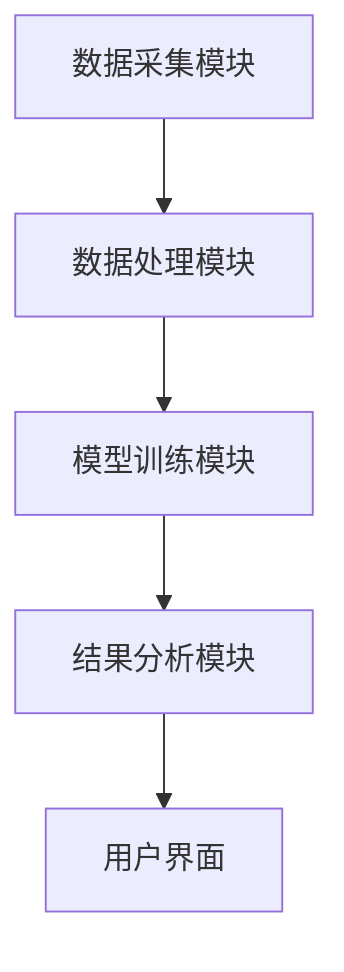

                 


# AI Agent在企业知识产权价值评估中的应用

> 关键词：AI Agent, 知识产权, 价值评估, 机器学习, 系统架构

> 摘要：本文深入探讨了AI Agent在企业知识产权价值评估中的应用，从理论基础到实际应用，详细分析了AI Agent的核心功能、知识产权评估的关键指标、算法原理以及系统架构设计。通过实际案例分析，展示了AI Agent如何提升知识产权评估的效率和准确性。

---

# 第一部分: AI Agent与知识产权价值评估的背景与基础

## 第1章: AI Agent与知识产权价值评估的背景

### 1.1 知识产权的基本概念与价值评估的重要性

#### 1.1.1 知识产权的定义与主要类型

知识产权是企业的重要资产之一，主要包括专利权、商标权、著作权、商业秘密等。知识产权的价值不仅体现在法律保护上，还体现在其市场应用和经济收益上。随着企业竞争的加剧，知识产权的价值评估变得尤为重要。

#### 1.1.2 知识产权价值评估的意义与应用场景

知识产权价值评估是企业在并购、融资、诉讼等场景中的关键环节。例如，在企业并购中，知识产权的价值直接影响交易价格；在融资过程中，知识产权作为无形资产，其价值评估决定了融资额度。传统的方法主要依赖人工评估，效率低且容易受到主观因素的影响。

#### 1.1.3 传统知识产权评估方法的局限性

传统评估方法主要包括成本法、市场法和收益法。然而，这些方法在处理复杂知识产权（如专利组合）时存在以下问题：

- 数据收集困难：需要大量市场交易数据支持。
- 评估周期长：人工分析耗时耗力。
- 主观因素影响大：评估结果容易受到评估师的经验和判断影响。

---

### 1.2 AI Agent的基本概念与技术特点

#### 1.2.1 AI Agent的定义与核心功能

AI Agent（人工智能代理）是一种能够感知环境、自主决策并执行任务的智能系统。其核心功能包括：

- 数据采集与处理：通过API、爬虫等方式获取知识产权相关数据。
- 智能分析：利用机器学习模型对数据进行分析和预测。
- 自动决策：基于分析结果做出评估决策。
- 自适应优化：根据反馈不断优化评估模型和策略。

#### 1.2.2 AI Agent在知识产权评估中的技术特征

- **数据处理能力**：支持多源异构数据的采集与清洗。
- **智能分析能力**：采用深度学习模型进行复杂模式识别。
- **自适应优化**：基于反馈不断调整评估策略。
- **可扩展性**：能够处理海量数据并快速响应。

#### 1.2.3 AI Agent在企业中的应用现状

目前，AI Agent在知识产权评估中的应用主要集中在专利分析、风险预警和价值评估等领域。例如，一些企业已经在利用AI Agent进行专利组合的价值评估，显著提高了评估效率和准确性。

---

### 1.3 AI Agent与知识产权价值评估的结合

#### 1.3.1 知识产权价值评估中的数据处理需求

知识产权价值评估需要处理大量非结构化数据，如专利文件、法律文本等。这些数据通常分布在不同的数据源中，数据清洗和预处理是评估的关键步骤。

#### 1.3.2 AI Agent在知识产权评估中的优势

- **高效性**：AI Agent能够快速处理大量数据，显著缩短评估周期。
- **准确性**：通过机器学习模型，AI Agent能够识别复杂模式，提高评估结果的准确性。
- **可扩展性**：AI Agent能够处理海量数据，适用于大规模知识产权评估。

#### 1.3.3 当前研究与实践中的挑战

- 数据隐私问题：知识产权数据 often涉及企业机密，数据处理需要确保隐私保护。
- 模型可解释性：复杂的深度学习模型往往缺乏可解释性，影响企业对评估结果的信任。
- 技术成熟度：AI Agent在知识产权评估中的应用仍处于发展阶段，需要进一步完善。

---

## 第2章: 知识产权价值评估的核心概念与方法

### 2.1 知识产权价值评估的理论基础

#### 2.1.1 知识产权价值的构成要素

知识产权的价值由多个要素构成，包括技术先进性、市场竞争力、法律保护力度等。这些要素需要通过数据量化后进行综合评估。

#### 2.1.2 知识产权价值评估的模型与方法

常用的评估方法包括：

- **层次分析法（AHP）**：用于确定各评估指标的权重。
- **模糊综合评价法**：适用于处理模糊信息的情况。
- **机器学习模型**：如随机森林、神经网络等，用于复杂场景下的评估。

#### 2.1.3 知识产权价值评估的关键指标

关键指标包括：

- 技术指标：如专利的引用次数、同族专利数量。
- 法律指标：如专利的法律状态、权利稳定性。
- 市场指标：如市场占有率、竞争对手分析。

---

### 2.2 AI Agent在知识产权评估中的核心作用

#### 2.2.1 数据收集与处理能力

AI Agent能够通过多种数据源（如专利数据库、法律文本库）获取知识产权数据，并进行清洗和预处理。

#### 2.2.2 智能分析与决策能力

AI Agent利用机器学习模型对数据进行分析，识别潜在的价值点和风险因素。

#### 2.2.3 自适应与优化能力

AI Agent能够根据评估结果和反馈不断优化评估模型，提高评估准确率。

---

### 2.3 知识产权价值评估的核心流程

#### 2.3.1 数据收集与清洗

通过爬虫、API等方式获取知识产权数据，并进行去重、格式转换等预处理。

#### 2.3.2 数据分析与特征提取

利用自然语言处理（NLP）技术提取文本特征，如关键词、主题模型等。

#### 2.3.3 价值评估与结果输出

基于机器学习模型进行评估，并输出结果报告。

---

## 第3章: AI Agent在知识产权价值评估中的应用框架

### 3.1 知识产权价值评估的流程与步骤

#### 3.1.1 数据收集与清洗

通过多种数据源获取知识产权数据，并进行预处理。

#### 3.1.2 数据分析与特征提取

利用NLP技术提取文本特征，构建评估模型所需的输入数据。

#### 3.1.3 价值评估与结果输出

基于机器学习模型进行评估，并输出结果报告。

---

### 3.2 AI Agent在评估框架中的角色分配

#### 3.2.1 数据处理模块

负责数据的采集、清洗和预处理。

#### 3.2.2 模型构建与训练模块

负责特征提取、模型训练和优化。

#### 3.2.3 结果分析与优化模块

负责评估结果的分析、反馈和模型优化。

---

### 3.3 应用框架的系统架构设计

#### 3.3.1 系统功能模块划分

- 数据采集模块
- 数据处理模块
- 模型训练模块
- 结果分析模块

#### 3.3.2 系统交互流程设计

1. 用户输入评估需求。
2. 数据采集模块获取相关数据。
3. 数据处理模块进行预处理。
4. 模型训练模块构建评估模型。
5. 结果分析模块输出评估结果。

#### 3.3.3 系统性能优化策略

- 数据存储优化：使用分布式存储和索引技术。
- 模型优化：采用增量学习和在线优化策略。

---

## 第4章: 知识产权价值评估的算法原理与实现

### 4.1 知识产权价值评估的算法选择

#### 4.1.1 传统机器学习算法的适用性

- 线性回归：适用于线性关系的评估。
- 支持向量机（SVM）：适用于分类问题。
- 随机森林：适用于特征重要性分析。

#### 4.1.2 深度学习算法的优势

- 卷积神经网络（CNN）：适用于图像和文本数据的处理。
- 循环神经网络（RNN）：适用于时间序列数据的处理。
- Transformer：适用于长文本的处理。

#### 4.1.3 混合算法的应用场景

结合传统算法和深度学习算法，充分利用各自的优势。

---

### 4.2 AI Agent驱动的评估模型构建

#### 4.2.1 数据预处理与特征工程

- 数据清洗：去除噪声数据。
- 特征提取：利用NLP技术提取文本特征。

#### 4.2.2 模型训练与优化

- 模型选择：根据数据特点选择合适的算法。
- 参数调优：通过网格搜索优化模型参数。

#### 4.2.3 模型评估与部署

- 评估指标：如准确率、召回率、F1分数。
- 模型部署：将模型部署到生产环境，提供API接口。

---

### 4.3 知识产权价值评估的数学模型与公式

#### 4.3.1 线性回归模型

$$ y = \beta_0 + \beta_1 x_1 + \beta_2 x_2 + \dots + \beta_n x_n $$

其中，$y$ 是预测值，$\beta_0$ 是截距，$\beta_i$ 是回归系数，$x_i$ 是特征变量。

#### 4.3.2 支持向量机模型

$$ \text{目标函数}：\max \sum \alpha_i y_i (w \cdot x_i + b) $$

其中，$\alpha_i$ 是拉格朗日乘子，$y_i$ 是标签，$w$ 是权重向量，$b$ 是偏置项。

---

## 第5章: 知识产权价值评估的系统架构设计

### 5.1 系统功能设计

- 数据采集模块：通过API和爬虫获取知识产权数据。
- 数据处理模块：进行数据清洗和特征提取。
- 模型训练模块：构建和优化评估模型。
- 结果分析模块：输出评估结果并提供反馈。

---

### 5.2 系统架构设计

#### 5.2.1 系统架构图



#### 5.2.2 系统交互流程

1. 用户输入评估需求。
2. 数据采集模块获取相关数据。
3. 数据处理模块进行预处理。
4. 模型训练模块构建评估模型。
5. 结果分析模块输出评估结果。

---

### 5.3 系统接口设计

- 数据接口：提供API接口供其他系统调用。
- 模型接口：提供评估模型的调用接口。
- 用户接口：提供友好的用户界面供用户操作。

---

### 5.4 系统优化策略

- 数据存储优化：使用分布式存储和索引技术。
- 模型优化：采用增量学习和在线优化策略。

---

## 第6章: 项目实战与案例分析

### 6.1 项目环境配置

- 数据库：MySQL或MongoDB。
- 开发工具：Python、Jupyter Notebook。
- 框架：TensorFlow、Scikit-learn。

---

### 6.2 系统核心实现源代码

#### 6.2.1 数据采集模块

```python
import requests
from bs4 import BeautifulSoup

def fetch_patent_data(url):
    response = requests.get(url)
    soup = BeautifulSoup(response.text, 'html.parser')
    # 提取数据
    return data
```

#### 6.2.2 数据处理模块

```python
from sklearn.preprocessing import StandardScaler

def preprocess_data(data):
    # 数据清洗和特征提取
    scaler = StandardScaler()
    data_scaled = scaler.fit_transform(data)
    return data_scaled
```

---

### 6.3 代码应用解读与分析

- 数据采集模块：通过爬虫获取专利数据。
- 数据处理模块：对数据进行标准化处理，为模型训练做准备。

---

### 6.4 实际案例分析

以某企业的专利评估为例，展示AI Agent如何快速准确地完成评估。

---

## 第7章: 总结与展望

### 7.1 总结

AI Agent在知识产权价值评估中的应用显著提高了评估效率和准确性。通过自动化数据处理和智能分析，AI Agent能够帮助企业更好地管理知识产权资产。

### 7.2 展望

未来，随着AI技术的不断发展，AI Agent在知识产权评估中的应用将更加广泛和深入。例如，结合区块链技术，可以实现知识产权评估的全流程透明化和可信化。

---

## 第8章: 最佳实践与注意事项

### 8.1 最佳实践 tips

- 数据隐私保护：在处理知识产权数据时，必须遵守相关法律法规。
- 模型可解释性：选择合适的模型，确保评估结果的可解释性。
- 持续优化：定期更新模型，保持评估结果的准确性。

---

### 8.2 注意事项

- 数据安全：防止数据泄露和滥用。
- 技术风险：在采用新技术时，需充分评估其风险和可行性。
- 人员培训：确保相关人员具备必要的技术能力。

---

## 第9章: 拓展阅读与参考文献

### 9.1 拓展阅读

建议读者阅读以下书籍和论文：

- 《机器学习实战》
- 《深度学习》
- 相关学术论文：如《基于机器学习的知识产权价值评估研究》。

---

## 附录: 知识产权价值评估的数学公式汇总

### 附录A: 线性回归模型

$$ y = \beta_0 + \beta_1 x_1 + \beta_2 x_2 + \dots + \beta_n x_n $$

### 附录B: 支持向量机模型

$$ \text{目标函数}：\max \sum \alpha_i y_i (w \cdot x_i + b) $$

---

通过以上章节的详细讲解，我们全面探讨了AI Agent在企业知识产权价值评估中的应用，从理论基础到实际应用，为读者提供了丰富的知识和实践指导。

