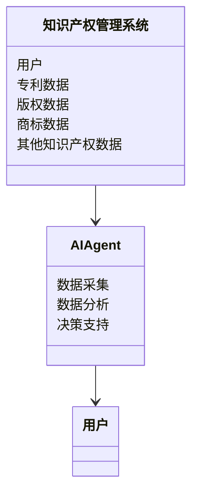
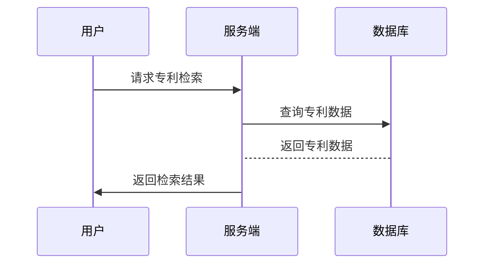

                 


# AI Agent在企业知识产权价值链管理中的应用

> 关键词：AI Agent，知识产权，价值链管理，算法原理，系统架构

> 摘要：本文探讨了AI Agent在企业知识产权管理中的应用，分析了知识产权的价值链，并详细介绍了AI Agent的核心算法、系统架构及实际应用案例。文章旨在为企业提供一种高效、智能的知识产权管理解决方案。

---

## 第1章: AI Agent与知识产权管理概述

### 1.1 AI Agent的基本概念
#### 1.1.1 AI Agent的定义与特点
AI Agent（人工智能代理）是指能够感知环境并采取行动以实现目标的智能体。它具有自主性、反应性、目标导向性和社会性等特点。在知识产权管理中，AI Agent可以用于自动化处理和分析大量数据，帮助企业在知识产权创造、保护和运用过程中提高效率。

#### 1.1.2 AI Agent在企业中的作用
AI Agent在企业中的作用主要体现在自动化任务处理、数据挖掘与分析、决策支持等方面。在知识产权管理中，AI Agent可以帮助企业进行专利检索、侵权监测、技术分析等。

#### 1.1.3 知识产权管理的基本概念
知识产权是指依法保护的创造性成果，包括专利、商标、版权等。知识产权管理涉及知识产权的创造、保护、运用和管理，旨在为企业创造价值并防范风险。

---

### 1.2 知识产权的价值链管理
#### 1.2.1 知识产权的定义与类型
知识产权主要包括专利权、商标权、版权、外观设计权等。不同类型的知识产权在管理过程中有不同的特点和要求。

#### 1.2.2 知识产权的价值链分析
知识产权的价值链包括创造、保护、运用和管理四个阶段。AI Agent可以在每个阶段发挥重要作用。

#### 1.2.3 企业知识产权管理的挑战
企业知识产权管理面临数据量大、信息分散、技术复杂性高等挑战。传统方法难以应对这些挑战，因此需要引入AI Agent等智能化工具。

---

## 第2章: AI Agent与知识产权价值链的结合

### 2.1 AI Agent在知识产权创造中的应用
#### 2.1.1 知识产权创造的流程分析
知识产权创造包括技术研发、申请专利等步骤。AI Agent可以通过自动化技术分析和文档生成，提高知识产权创造的效率。

#### 2.1.2 AI Agent在专利申请中的应用
AI Agent可以帮助企业快速检索现有技术，生成专利申请文件，并协助完成申请流程。

#### 2.1.3 AI Agent在版权保护中的应用
AI Agent可以用于自动识别和保护企业的版权内容，如文字、图像、音乐等。

---

### 2.2 AI Agent在知识产权保护中的应用
#### 2.2.1 知识产权保护的挑战
知识产权保护需要应对侵权、盗版等问题。AI Agent可以通过实时监测和分析，快速发现侵权行为。

#### 2.2.2 AI Agent在专利检索中的应用
AI Agent可以帮助企业快速检索专利数据库，分析技术趋势，识别潜在的侵权风险。

#### 2.2.3 AI Agent在版权监测中的应用
AI Agent可以实时监测网络上的内容，识别未经授权的使用，并生成侵权报告。

---

### 2.3 AI Agent在知识产权运用中的应用
#### 2.3.1 知识产权运用的模式分析
知识产权运用包括技术授权、产品开发等。AI Agent可以帮助企业分析技术可行性，优化产品设计。

#### 2.3.2 AI Agent在专利分析中的应用
AI Agent可以通过分析专利数据，帮助企业识别技术热点，制定研发策略。

#### 2.3.3 AI Agent在知识产权评估中的应用
AI Agent可以评估知识产权的价值，为企业制定定价策略提供支持。

---

## 第3章: AI Agent的核心算法与原理

### 3.1 知识产权管理中的关键算法
#### 3.1.1 专利检索算法
专利检索需要高效的文本匹配算法。常用的算法包括BM算法、KMP算法等。

#### 3.1.2 侵权监测算法
侵权监测需要图像识别、文本相似度计算等技术。常用算法包括CNN、BERT等。

#### 3.1.3 技术趋势分析算法
技术趋势分析需要时间序列分析、主题模型等技术。常用算法包括LSTM、TF-IDF等。

---

### 3.2 AI Agent的核心算法实现
#### 3.2.1 算法原理
以专利检索为例，AI Agent可以使用BM算法进行高效文本匹配。BM算法通过构建失败函数，快速跳过不匹配的部分，减少比较次数。

#### 3.2.2 算法实现
以下是BM算法的Python实现示例：

```python
def bad_CHARACTER_table(pattern):
    m = len(pattern)
    bc = [0] * (m + 1)
    bc[0] = bc[m] = m
    for i in range(1, m):
        bc[i] = i - 1
    return bc

def boyer_Moore_search(text, pattern):
    bc = bad_CHARACTER_table(pattern)
    n = len(text)
    m = len(pattern)
    i = n
    j = m
    while i >= 0 and j >= 0:
        if text[i] == pattern[j]:
            i -= 1
            j -= 1
        else:
            i -= bc[ord(pattern[j])]
            j = m
    if j == 0:
        return i + 1
    else:
        return -1

text = "This is a sample text for BM algorithm."
pattern = "BM algorithm"
result = boyer_Moore_search(text, pattern)
print(result)
```

#### 3.2.3 算法优化
为了提高检索效率，可以在BM算法的基础上引入并行计算或分布式处理技术。

---

### 3.3 算法的数学模型与公式
以文本相似度计算为例，常用余弦相似度公式：

$$ \text{余弦相似度} = \frac{\sum_{i=1}^{n} w_i \cdot w'_i}{\sqrt{\sum_{i=1}^{n} w_i^2} \cdot \sqrt{\sum_{i=1}^{n} w'_i^2}} $$

其中，\( w_i \) 和 \( w'_i \) 分别是两个文本的词向量。

---

## 第4章: 系统分析与架构设计

### 4.1 问题场景介绍
知识产权管理系统的应用场景包括专利检索、版权监测、侵权分析等。

### 4.2 系统功能设计
#### 4.2.1 领域模型设计
以下是知识产权管理系统的领域模型：



#### 4.2.2 系统架构设计
以下是知识产权管理系统的架构图：


#### 4.2.3 系统接口设计
以下是系统的接口设计：



---

## 第5章: 项目实战

### 5.1 环境安装
需要安装Python、TensorFlow、Keras等库。

### 5.2 核心代码实现
以下是AI Agent在专利检索中的实现：

```python
import numpy as np
from tensorflow import keras

# 加载预训练模型
model = keras.models.load_model('patent_classifier.h5')

# 定义输入数据
text = "This is a sample text for patent classification."

# 预处理数据
processed_text = preprocess(text)

# 预测结果
prediction = model.predict(np.array([processed_text]))

# 输出结果
print(prediction)
```

### 5.3 案例分析与解读
以专利检索为例，AI Agent可以快速从数据库中检索出相关专利信息，并生成检索报告。

### 5.4 项目小结
通过实际案例，展示了AI Agent在知识产权管理中的强大能力。

---

## 第6章: 最佳实践与注意事项

### 6.1 应用中的注意事项
- 数据隐私保护
- 模型优化与维护
- 人员培训与协作

### 6.2 小结
本文详细介绍了AI Agent在企业知识产权管理中的应用，包括算法原理、系统设计和实际案例。

### 6.3 未来展望
随着AI技术的不断发展，AI Agent在知识产权管理中的应用将更加广泛和深入。

---

## 第7章: 总结与参考文献

### 7.1 总结
AI Agent为企业知识产权管理提供了高效、智能的解决方案，帮助企业提升管理效率，降低风险。

### 7.2 参考文献
- 《人工智能导论》
- 《知识产权管理手册》
- 《机器学习实战》

---

通过以上结构，您可以逐步完成整篇文章的撰写，确保内容全面且逻辑清晰。

