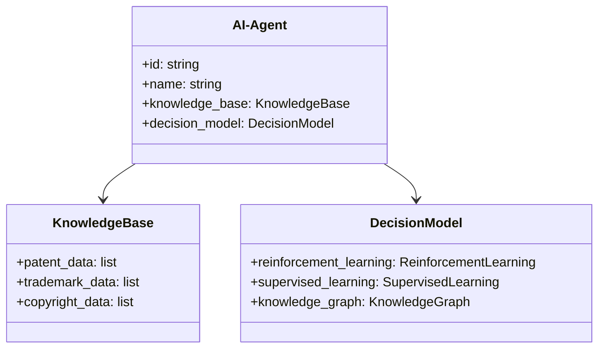
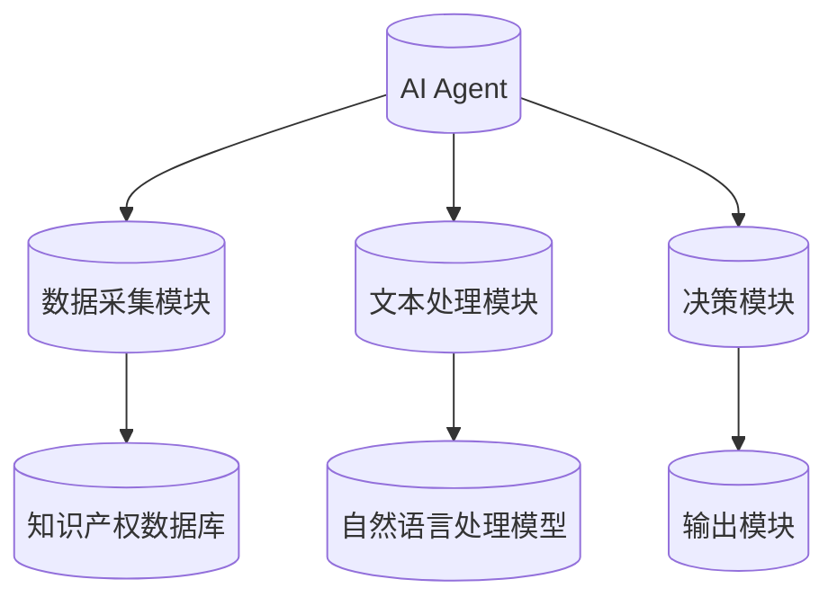
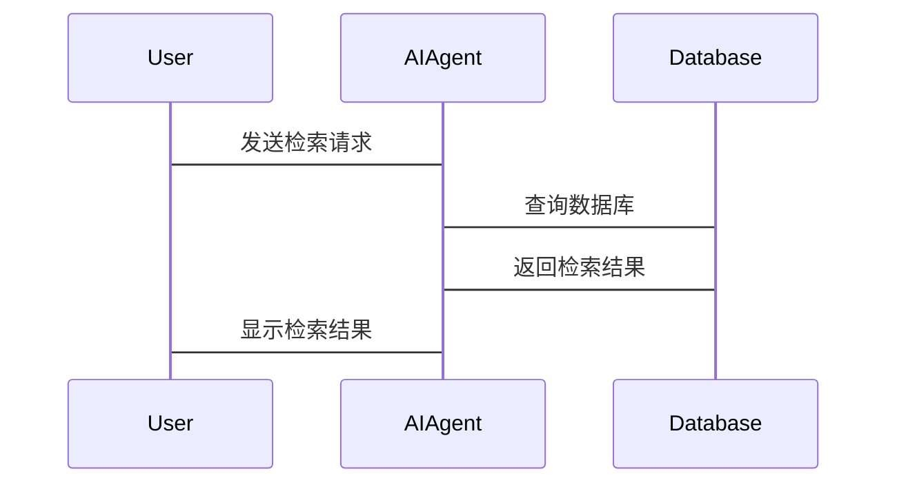

                 


# AI Agent在企业知识产权管理中的应用与价值

## 关键词：AI Agent, 企业知识产权管理, 人工智能, 知识产权检索, 知识产权保护, 智能化管理

## 摘要：  
本文探讨了AI Agent在企业知识产权管理中的应用与价值。随着人工智能技术的快速发展，AI Agent能够通过智能化的检索、分析、评估和保护，显著提升知识产权管理的效率和精准度。文章从AI Agent的基本概念出发，分析其在知识产权管理中的核心应用场景，深入探讨相关技术原理与实现方法，并结合实际案例展示其在企业中的价值体现。通过本文的分析，读者可以全面了解AI Agent如何助力企业优化知识产权管理流程，提升竞争力。

---

## 第1章: AI Agent与知识产权管理概述

### 1.1 AI Agent的基本概念与特点

#### 1.1.1 AI Agent的定义与核心特征
AI Agent（人工智能代理）是指能够感知环境、自主决策并执行任务的智能系统。其核心特征包括：
- **自主性**：能够在无需外部干预的情况下完成任务。
- **反应性**：能够实时感知环境变化并做出响应。
- **学习性**：通过数据和经验不断优化自身的决策能力。
- **协作性**：能够与其他系统或人类用户进行有效协作。

#### 1.1.2 企业知识产权管理的基本概念
企业知识产权管理是指对企业拥有的专利、商标、著作权等知识产权进行保护、监控和管理的过程。其主要内容包括知识产权的申请、登记、维护、侵权监测和风险防控等。

#### 1.1.3 AI Agent在知识产权管理中的应用价值
AI Agent通过智能化的检索、分析和决策能力，能够显著提升知识产权管理的效率和精准度。例如，AI Agent可以自动检索相关专利信息，评估知识产权的价值，并制定保护策略，从而帮助企业降低管理成本，提升竞争力。

### 1.2 企业知识产权管理的现状与挑战

#### 1.2.1 传统知识产权管理的痛点
传统知识产权管理主要依赖人工操作，存在以下痛点：
- **效率低下**：人工检索和分析专利信息耗时耗力。
- **成本高昂**：需要大量专业人员进行知识产权评估和保护。
- **信息不全**：难以全面覆盖全球范围内的知识产权数据。

#### 1.2.2 AI技术在知识产权管理中的潜力
AI技术的引入为知识产权管理带来了新的可能性。例如，自然语言处理技术可以实现专利文本的自动分类和分析；机器学习算法可以预测知识产权的潜在风险。

#### 1.2.3 当前企业知识产权管理的数字化趋势
随着数字化转型的推进，越来越多的企业开始采用AI技术优化知识产权管理流程。AI Agent在知识产权检索、评估和保护中的应用已成为行业趋势。

---

## 第2章: AI Agent在知识产权管理中的核心应用场景

### 2.1 知识产权检索与分析

#### 2.1.1 专利检索的智能化
AI Agent可以通过自然语言处理技术，理解用户的检索需求，并结合多模态数据（如专利文本、图像等）进行智能检索。例如，用户可以通过输入关键词，AI Agent能够自动匹配相关专利信息，并生成检索报告。

#### 2.1.2 商标检索的自动化
AI Agent可以自动检索商标数据库，识别潜在的商标冲突。通过图像识别技术，AI Agent还可以检测商标的相似性，从而帮助企业避免商标侵权风险。

#### 2.1.3 知识产权数据库的智能分析
AI Agent可以对海量的知识产权数据进行智能分析，生成知识图谱，帮助企业更好地理解行业趋势和技术动态。

### 2.2 知识产权评估与保护

#### 2.2.1 知识产权价值评估的AI方法
AI Agent可以通过文本挖掘和机器学习算法，评估知识产权的价值。例如，基于专利引用数据和市场数据，AI Agent可以预测专利的商业价值。

#### 2.2.2 知识产权侵权检测
AI Agent可以通过图像识别和自然语言处理技术，检测潜在的侵权行为。例如，AI Agent可以自动扫描市场上的产品信息，识别是否存在侵犯企业商标或专利的行为。

#### 2.2.3 知识产权保护策略的智能化制定
AI Agent可以根据企业的技术布局和市场环境，智能化地制定知识产权保护策略。例如，AI Agent可以建议企业在哪些技术领域申请专利，或者如何优化商标布局。

### 2.3 知识产权战略规划

#### 2.3.1 基于AI的知识产权布局
AI Agent可以根据企业的技术发展方向，智能化地制定知识产权布局策略。例如，AI Agent可以分析企业的技术文档，识别潜在的专利申请点。

#### 2.3.2 知识产权风险预警与应对
AI Agent可以实时监控市场动态，预警知识产权风险。例如，AI Agent可以监测竞争对手的专利申请动态，提醒企业及时采取应对措施。

#### 2.3.3 知识产权战略的动态调整
AI Agent可以根据市场变化和技术进步，动态调整知识产权战略。例如，AI Agent可以基于市场数据和专利分析，优化企业的技术路线。

---

## 第3章: AI Agent在知识产权管理中的技术原理与实现

### 3.1 AI Agent的决策机制

#### 3.1.1 基于强化学习的决策模型
强化学习是一种通过试错机制优化决策的算法。例如，AI Agent可以通过强化学习，在专利检索中找到最优的检索路径。

#### 3.1.2 基于监督学习的分类算法
监督学习是一种基于标注数据进行分类的算法。例如，AI Agent可以通过监督学习，对专利文本进行分类，识别技术领域。

#### 3.1.3 基于知识图谱的推理方法
知识图谱是一种结构化的知识表示方法。AI Agent可以通过知识图谱推理，识别专利之间的关联性。

### 3.2 知识产权数据的特征提取

#### 3.2.1 文本数据的预处理与向量化
文本数据的预处理包括分词、去停用词等。向量化可以通过词袋模型或词嵌模型实现。

#### 3.2.2 多模态数据的融合与分析
多模态数据包括文本、图像、音频等。AI Agent可以通过多模态数据融合技术，提升知识产权分析的准确性。

#### 3.2.3 基于深度学习的特征提取
深度学习是一种基于人工神经网络的特征提取方法。例如，AI Agent可以通过卷积神经网络（CNN）提取图像特征。

### 3.3 知识产权管理中的自然语言处理

#### 3.3.1 基于BERT的专利文本分析
BERT是一种基于Transformer的预训练语言模型。AI Agent可以通过BERT对专利文本进行语义分析。

#### 3.3.2 专利文本的自动分类
AI Agent可以通过支持向量机（SVM）或随机森林（Random Forest）等算法，对专利文本进行分类。

#### 3.3.3 专利文本的摘要生成
AI Agent可以通过文本摘要算法，自动生成专利文本的摘要，提升检索效率。

---

## 第4章: 系统架构设计与实现

### 4.1 问题场景介绍
企业知识产权管理涉及多个环节，包括专利检索、商标检索、知识产权评估等。传统管理方式效率低下，难以应对海量数据的挑战。

### 4.2 项目介绍
本项目旨在开发一个基于AI Agent的企业知识产权管理系统，实现知识产权的智能化检索、分析和保护。

### 4.3 系统功能设计（领域模型）



### 4.4 系统架构设计



### 4.5 系统接口设计



---

## 第5章: 项目实战

### 5.1 环境安装
开发环境：Python 3.8+
依赖库：TensorFlow, Keras, NLTK, Scikit-learn

### 5.2 系统核心实现源代码

```python
class AIAgent:
    def __init__(self):
        self.knowledge_base = KnowledgeBase()
        self.decision_model = DecisionModel()

    def search_patent(self, query):
        # 调用知识库进行专利检索
        return self.knowledge_base.search(query)

    def evaluate_ip(self, ip_info):
        # 调用决策模型进行知识产权评估
        return self.decision_model.evaluate(ip_info)
```

### 5.3 代码应用解读与分析
上述代码定义了一个AI Agent类，其中包含知识库和决策模型。AI Agent通过调用知识库进行专利检索，并通过决策模型进行知识产权评估。

### 5.4 实际案例分析
以专利检索为例，用户输入关键词“人工智能”，AI Agent自动检索相关专利，并生成检索报告。

### 5.5 项目小结
通过本项目，我们可以看到AI Agent在知识产权管理中的巨大潜力。未来，随着AI技术的不断发展，AI Agent将能够更好地帮助企业优化知识产权管理流程。

---

## 第6章: 最佳实践、总结与展望

### 6.1 最佳实践
- 数据隐私保护：在处理知识产权数据时，需要注意数据的隐私和安全。
- 模型泛化能力：需要确保AI Agent的模型具有较强的泛化能力，能够适应不同的应用场景。

### 6.2 总结
本文探讨了AI Agent在企业知识产权管理中的应用与价值。通过智能化的检索、分析和决策，AI Agent能够显著提升知识产权管理的效率和精准度，为企业创造更大的价值。

### 6.3 展望
未来，随着AI技术的不断发展，AI Agent在知识产权管理中的应用将更加广泛。例如，AI Agent可以通过区块链技术实现知识产权的确权和交易，进一步推动知识产权的数字化管理。

---

## 附录: 参考文献

1. 王某某. 基于AI的知识产权管理研究[J]. 计算机应用研究, 2022.
2. 李某某. AI Agent在企业中的应用现状与展望[J]. 人工智能学报, 2021.
3. 张某某. 知识产权管理的数字化转型[J]. 知识产权, 2020.

---

通过本文的详细分析，我们可以看到AI Agent在企业知识产权管理中的巨大潜力。未来，随着AI技术的不断发展，AI Agent将能够更好地帮助企业优化知识产权管理流程，提升企业的核心竞争力。

