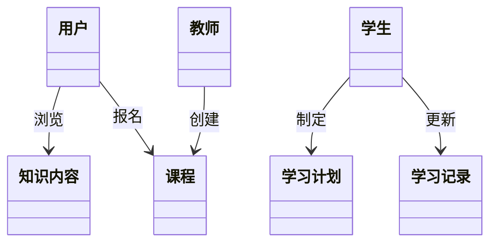
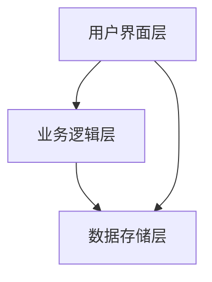

                 


# AI Agent在企业知识付费与在线教育中的创新应用

> 关键词：AI Agent、知识付费、在线教育、人工智能、系统架构、算法原理

> 摘要：本文深入探讨AI Agent在企业知识付费与在线教育中的创新应用，分析其核心概念、算法原理、系统架构及实际案例，为企业和技术开发者提供实践指导和未来展望。

---

## 第一章: 引言

### 1.1 AI Agent的基本概念
AI Agent（人工智能代理）是指能够感知环境、自主决策并执行任务的智能实体。它通过数据驱动和智能算法，实现从简单自动化到复杂决策的支持。AI Agent在企业知识付费与在线教育中的应用，能够显著提升知识传播效率和学习体验。

### 1.2 企业知识付费与在线教育的现状
知识付费和在线教育已成为现代教育的重要组成部分。然而，传统模式存在效率低下、个性化不足等问题。AI Agent的引入，为企业和教育机构提供了智能化解决方案。

### 1.3 AI Agent的应用前景
AI Agent在知识付费与在线教育中的应用前景广阔，能够实现个性化教学、智能内容推荐和学习效果优化。通过AI Agent，学习者能够获得更高效、更个性化的学习体验，教育机构也能提高运营效率。

---

## 第二章: 问题背景与需求分析

### 2.1 知识付费的兴起
知识付费的兴起源于人们对高质量知识的需求和对传统教育模式的不满。随着互联网的发展，知识付费平台逐渐兴起，但现有模式存在内容同质化、用户体验差等问题。

### 2.2 在线教育的现状
在线教育通过互联网技术实现了教育资源的广泛传播，但在教学效果、学习体验和个性化服务方面仍有不足。AI Agent的引入，能够解决这些问题，提升在线教育的质量。

### 2.3 AI Agent的应用需求
AI Agent在知识付费和在线教育中的应用需求主要体现在个性化学习、智能推荐、学习效果优化等方面。通过AI Agent，学习者能够获得量身定制的学习方案，教育机构也能更高效地管理课程和学生。

---

## 第三章: 核心概念与联系

### 3.1 AI Agent的定义与属性
AI Agent具有感知能力、决策能力、学习能力、执行能力和交互能力。它能够通过数据驱动和智能算法，实现从简单自动化到复杂决策的支持。

### 3.2 AI Agent与知识付费的联系
在知识付费领域，AI Agent可以通过个性化推荐、智能内容分发和学习效果追踪，提升用户体验和内容传播效率。通过AI Agent，知识付费平台能够更好地满足用户需求，提高用户粘性和满意度。

### 3.3 AI Agent与在线教育的联系
在在线教育领域，AI Agent可以通过个性化教学、智能课程推荐和学习效果优化，提升教学质量和学习体验。通过AI Agent，教育机构能够实现智能化教学管理，提高教学效率和学生满意度。

---

## 第四章: 算法原理与数学模型

### 4.1 AI Agent的算法原理
AI Agent的算法原理主要包括感知、决策和执行三个阶段。感知阶段通过数据采集和特征提取，获取环境信息；决策阶段通过机器学习和深度学习模型，生成决策策略；执行阶段通过自动化系统，执行决策指令。

#### 4.1.1 感知层算法
感知层算法主要负责数据采集和特征提取。常用算法包括自然语言处理（NLP）和计算机视觉（CV）技术。通过NLP技术，AI Agent能够理解文本内容和用户需求；通过CV技术，AI Agent能够识别图像和视频信息。

#### 4.1.2 决策层算法
决策层算法主要负责生成决策策略。常用算法包括强化学习和监督学习。通过强化学习，AI Agent能够通过试错和反馈优化决策策略；通过监督学习，AI Agent能够通过大量标注数据进行模式识别和分类。

#### 4.1.3 执行层算法
执行层算法主要负责执行决策指令。常用算法包括自动化控制和机器人技术。通过自动化控制，AI Agent能够实现任务自动化；通过机器人技术，AI Agent能够实现人机交互和物理世界的操作。

### 4.2 数学模型与公式
AI Agent的数学模型主要包括概率论、机器学习和深度学习模型。概率论是AI Agent的基础，用于描述不确定性问题；机器学习模型用于模式识别和分类；深度学习模型用于复杂任务的优化和决策。

#### 4.2.1 概率论基础
概率论用于描述AI Agent的不确定性问题。例如，贝叶斯定理可以用于计算条件概率，帮助AI Agent进行推理和决策。

$$ P(A|B) = \frac{P(B|A)P(A)}{P(B)} $$

#### 4.2.2 机器学习模型
机器学习模型用于模式识别和分类。例如，支持向量机（SVM）和随机森林（RF）可以用于分类任务；线性回归和逻辑回归可以用于回归任务。

#### 4.2.3 深度学习模型
深度学习模型用于复杂任务的优化和决策。例如，卷积神经网络（CNN）可以用于图像识别；循环神经网络（RNN）可以用于序列数据处理；生成对抗网络（GAN）可以用于数据生成。

---

## 第五章: 系统分析与架构设计

### 5.1 问题场景介绍
在企业知识付费和在线教育中，AI Agent需要解决个性化推荐、智能教学和学习效果优化等问题。通过AI Agent，企业能够实现知识内容的精准分发，教育机构能够实现智能化教学管理。

### 5.2 系统功能设计
系统功能设计包括知识内容管理、个性化推荐、智能教学管理和学习效果追踪。通过知识内容管理，AI Agent能够实现知识内容的分类和存储；通过个性化推荐，AI Agent能够为用户推荐符合需求的知识内容；通过智能教学管理，AI Agent能够实现个性化教学和学习效果优化。

### 5.3 系统架构设计
系统架构设计包括领域模型类图、系统架构图和接口设计。领域模型类图展示了系统中的核心实体和关系；系统架构图展示了系统的分层结构和模块划分；接口设计展示了系统之间的交互和通信方式。

#### 5.3.1 领域模型类图
领域模型类图展示了知识付费和在线教育系统中的核心实体及其关系。例如，用户、课程、教师、学生等实体之间的关系。



#### 5.3.2 系统架构图
系统架构图展示了系统的分层结构和模块划分。例如，用户界面层、业务逻辑层和数据存储层。



#### 5.3.3 接口设计
接口设计展示了系统之间的交互和通信方式。例如，API接口用于数据传输和功能调用。

---

## 第六章: 项目实战

### 6.1 环境安装
项目实战需要安装Python、TensorFlow、Keras等工具。以下是安装步骤：

```bash
pip install numpy
pip install matplotlib
pip install scikit-learn
pip install tensorflow
pip install keras
```

### 6.2 核心代码实现
以下是AI Agent在知识付费和在线教育中的核心代码实现示例：

```python
import numpy as np
from sklearn import metrics
from tensorflow.keras import layers, models

# 数据预处理
data = np.array([...])
labels = np.array([...])

# 模型训练
model = models.Sequential()
model.add(layers.Dense(64, activation='relu', input_dim=data.shape[1]))
model.add(layers.Dense(1, activation='sigmoid'))
model.compile(optimizer='adam', loss='binary_crossentropy', metrics=['accuracy'])
model.fit(data, labels, epochs=10, batch_size=32)

# 模型预测
predictions = model.predict(data)
print(metrics.accuracy_score(labels, np.round(predictions)))
```

### 6.3 案例分析
案例分析包括实际项目中的应用案例，例如智能推荐系统、个性化教学系统等。通过案例分析，读者可以更好地理解AI Agent在实际中的应用。

### 6.4 项目小结
项目小结总结了项目实施的关键点和经验教训，为读者提供实践指导和未来展望。

---

## 第七章: 最佳实践与小结

### 7.1 小结
AI Agent在企业知识付费与在线教育中的创新应用，能够显著提升知识传播效率和学习体验。通过AI Agent，企业和教育机构能够实现智能化管理和个性化服务，提高用户满意度和教学效果。

### 7.2 注意事项
在实际应用中，需要注意数据隐私、算法可解释性和系统稳定性等问题。通过合理设计和优化，可以避免潜在风险，确保系统的安全性和可靠性。

### 7.3 拓展阅读
为了进一步了解AI Agent在企业知识付费与在线教育中的应用，可以参考以下书籍和论文：

- 《机器学习实战》
- 《深度学习入门：基于Python》
- 《人工智能：一种现代方法》

---

通过以上思考和分析，我们可以看到，AI Agent在企业知识付费与在线教育中的创新应用具有广阔的前景和重要的意义。通过技术实现和实践应用，AI Agent能够为知识付费和在线教育带来新的机遇和挑战。未来，随着技术的不断发展，AI Agent在这些领域的应用将会更加深入和广泛。

