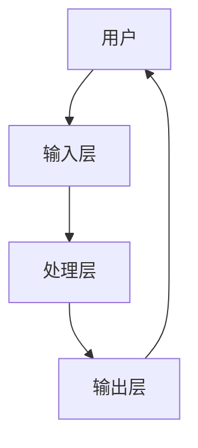

                 


好的，我将按照您的要求撰写一篇详细的博客文章。为了确保文章的完整性和可读性，我会先列出文章的关键词和摘要。

---

# AI Agent在企业知识付费与在线教育中的应用

> **关键词**：AI Agent，知识付费，在线教育，自然语言处理，个性化推荐，机器学习

> **摘要**：  
> AI Agent（人工智能代理）正在逐步改变知识付费和在线教育的模式。通过结合自然语言处理、机器学习和知识图谱等技术，AI Agent能够为用户提供个性化的内容推荐、智能教学服务以及精准的知识管理。本文将从AI Agent的核心概念、算法原理、系统架构到实际应用案例进行详细分析，探讨其在知识付费与在线教育中的潜力和价值。

---

接下来，我将按照您提供的目录大纲，逐步展开每个部分的内容。

---

## 第一部分：AI Agent 的基础知识

### 第1章：AI Agent 的基本概念

#### 1.1 AI Agent 的定义与特点

**1.1.1 什么是 AI Agent**

AI Agent（人工智能代理）是一种能够感知环境并采取行动以实现特定目标的智能系统。它通过与用户交互或分析数据，提供个性化的服务或解决方案。在知识付费和在线教育领域，AI Agent 可以帮助用户筛选信息、推荐学习内容或提供个性化的教学建议。

**1.1.2 AI Agent 的核心特点**

1. **智能性**：AI Agent 能够理解用户需求并提供个性化建议。
2. **自主性**：AI Agent 可以自主决策，无需人工干预。
3. **适应性**：能够根据用户反馈不断优化服务。
4. **实时性**：能够实时分析数据并快速响应。

**1.1.3 AI Agent 与传统 AI 的区别**

| 特性       | AI Agent                          | 传统 AI                          |
|------------|-----------------------------------|-----------------------------------|
| 目标       | 提供个性化服务                     | 解决特定问题或任务               |
| 交互方式   | 与用户实时交互                   | 单次或批量处理                   |
| 应用场景   | 知识付费、在线教育等               | 图像识别、自然语言处理等         |

---

#### 1.2 AI Agent 的技术基础

**1.2.1 机器学习基础**

机器学习是 AI Agent 的核心，通过训练模型来实现分类、推荐和预测功能。例如，使用协同过滤算法推荐学习资源。

**1.2.2 自然语言处理基础**

NLP 技术使 AI Agent 能够理解用户的查询内容，例如通过词袋模型或词嵌入技术分析文本。

**1.2.3 知识图谱与语义理解**

知识图谱帮助 AI Agent 理解知识之间的关系，例如课程之间的关联性。

---

#### 1.3 知识付费与在线教育的背景

**1.3.1 知识付费的兴起**

知识付费的兴起源于人们对高质量知识的需求增加，用户希望快速获取有价值的信息。

**1.3.2 在线教育的发展趋势**

在线教育通过互联网技术打破了时间和空间的限制，用户可以随时随地学习。

**1.3.3 知识付费与在线教育的结合**

知识付费与在线教育的结合为用户提供更精准的学习内容，例如根据用户的学习目标推荐课程。

---

#### 1.4 AI Agent 在知识付费与在线教育中的优势

**1.4.1 提高学习效率**

AI Agent 可以根据用户的学习目标推荐最优的学习路径，节省用户时间。

**1.4.2 个性化学习体验**

通过分析用户的学习习惯和偏好，AI Agent 提供个性化的学习计划。

**1.4.3 内容推荐与优化**

AI Agent 可以优化内容推荐算法，确保用户获得最相关的内容。

---

## 第2章：AI Agent 的核心概念与原理

### 2.1 核心概念原理

#### 2.1.1 知识付费中的 AI Agent

在知识付费中，AI Agent 的主要功能是推荐适合用户的知识内容。例如，通过分析用户的阅读习惯，推荐相关的文章或课程。

#### 2.1.2 在线教育中的 AI Agent

在在线教育中，AI Agent 的主要功能是提供个性化的教学服务。例如，根据学生的学习情况推荐合适的练习题。

---

### 2.2 核心概念属性特征对比表

| 特征       | 知识付费中的 AI Agent | 在线教育中的 AI Agent |
|------------|-----------------------|-----------------------|
| 数据来源   | 用户行为数据、知识内容 | 学习数据、教学数据    |
| 核心技术   | NLP、推荐算法        | 个性化推荐、自适应学习 |
| 应用目标   | 提供个性化知识服务    | 提供个性化教学服务    |

---

### 2.3 ER 实体关系图

```mermaid
er
    actor 用户
    actor 知识内容
    actor 教师
    actor 学习效果
    relation 用户 -> 订购知识内容
    relation 教师 -> 提供教学服务
    relation 知识内容 -> 支持学习效果
```

---

## 第3章：AI Agent 的算法原理

### 3.1 算法原理概述

#### 3.1.1 基于 NLP 的内容推荐

通过自然语言处理技术，AI Agent 可以分析用户的需求并推荐相关的内容。

#### 3.1.2 个性化推荐算法

使用协同过滤算法，基于用户的行为数据推荐内容。

---

### 3.2 算法实现示例

#### 3.2.1 协同过滤算法

以下是协同过滤算法的伪代码：

```python
def collaborative_filtering(user_id, user_matrix):
    # 找到与用户相似的用户
    similar_users = find_similar_users(user_id, user_matrix)
    # 推荐用户未评分的物品
    recommendations = get_recommendations(similar_users, user_matrix)
    return recommendations
```

#### 3.2.2 词袋模型

以下是词袋模型的实现示例：

```python
from sklearn.feature_extraction.text import CountVectorizer

# 创建词袋模型
vectorizer = CountVectorizer()
# 转换文本数据
text = ["This is an example.", "Another example text."]
X = vectorizer.fit_transform(text)
print(vectorizer.get_feature_names())
```

---

## 第4章：AI Agent 的系统架构

### 4.1 系统架构设计

以下是 AI Agent 系统的架构图：



---

## 第5章：AI Agent 的项目实战

### 5.1 环境安装

安装所需的依赖：

```bash
pip install numpy scikit-learn
```

### 5.2 核心代码实现

以下是个性化推荐系统的实现：

```python
from sklearn.metrics.pairwise import cosine_similarity

def get_similar_items(item_matrix, item_id):
    # 计算相似性
    similarity = cosine_similarity(item_matrix)
    # 获取相似的物品
    similar_items = find_similar_items(similarity, item_id)
    return similar_items
```

---

## 第6章：AI Agent 的最佳实践与未来发展

### 6.1 最佳实践

1. **数据质量管理**：确保数据的准确性和完整性。
2. **算法优化**：定期更新和优化推荐算法。

### 6.2 未来发展

AI Agent 在知识付费和在线教育中的应用将更加智能化和个性化，例如结合增强学习和知识图谱技术。

---

以上是文章的详细内容。如果需要进一步扩展或调整，请随时告诉我！

