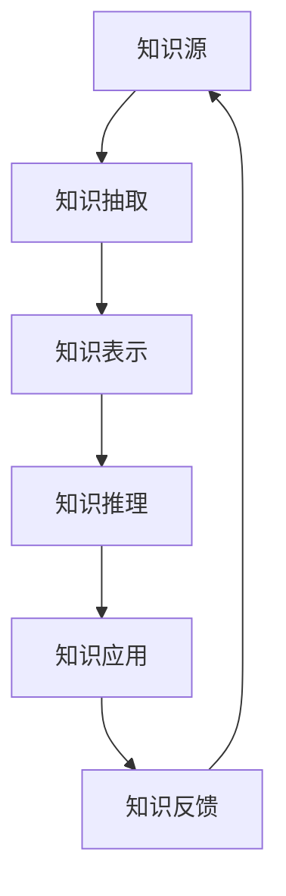

                 


# AI Agent在企业知识管理中的应用

## 关键词：AI Agent，知识管理，企业知识管理，人工智能，知识网络，知识抽取

## 摘要：  
本文探讨AI Agent在企业知识管理中的应用，分析其核心概念、算法原理、系统架构，并通过项目实战展示其实际应用。文章从知识管理的背景与挑战出发，详细讲解AI Agent在知识抽取、表示、推理及共享中的作用，结合系统设计与实现，提供最佳实践和未来展望。

---

# 第1章: AI Agent与知识管理的基本概念

## 1.1 AI Agent的定义与特点

### 1.1.1 AI Agent的定义  
AI Agent（人工智能代理）是能够感知环境、自主决策并执行任务的智能实体。它通过传感器获取信息，利用推理机制处理数据，做出决策，并通过执行器与环境交互。

### 1.1.2 AI Agent的核心特点  
- **自主性**：无需外部干预，自主完成任务。  
- **反应性**：实时感知环境并动态调整行为。  
- **目标导向**：基于目标驱动决策。  
- **学习能力**：通过经验改进性能。

### 1.1.3 AI Agent与传统软件的区别  
| 属性       | AI Agent                | 传统软件              |
|------------|-------------------------|-----------------------|
| 行为方式     | 主动执行任务             | 被动响应请求           |
| 智能水平     | 具备学习和推理能力       | 仅执行预定义逻辑       |
| 环境适应性   | 能自适应复杂环境         | 需人工调整适应环境     |

---

## 1.2 知识管理的定义与特点

### 1.2.1 知识管理的定义  
知识管理（KM）是通过系统方法和技术，收集、整理、存储和应用知识的过程，旨在提升组织的竞争力。

### 1.2.2 知识管理的核心要素  
- **知识表示**：将知识以结构化形式存储。  
- **知识共享**：促进知识在组织内的流通。  
- **知识应用**：将知识转化为实际价值。

### 1.2.3 知识管理与信息管理的区别  
| 属性       | 知识管理               | 信息管理              |
|------------|------------------------|-----------------------|
| 对象       | 高层次知识             | 结构化信息             |
| 目标       | 提升决策能力           | 优化信息处理效率       |
| 技术依赖     | AI、大数据技术         | 数据库、检索技术       |

---

## 1.3 AI Agent在知识管理中的应用前景

### 1.3.1 AI Agent在知识管理中的优势  
- **自动化**：AI Agent能自动抽取、整理和应用知识。  
- **智能化**：通过机器学习提升知识处理的准确性。  
- **实时性**：实时更新和应用知识，提升决策效率。

### 1.3.2 企业知识管理的新趋势  
- **智能化**：利用AI技术提升知识管理的效率。  
- **数据化**：知识的结构化存储和分析。  
- **社交化**：通过社交网络促进知识共享。

### 1.3.3 AI Agent在知识管理中的潜在应用领域  
- **企业内部知识库**：构建智能知识检索系统。  
- **客户关系管理**：利用知识管理优化客户服务。  
- **业务流程优化**：通过知识管理提升流程效率。

---

# 第2章: 企业知识管理的背景与挑战

## 2.1 企业知识管理的背景

### 2.1.1 知识经济时代对企业知识管理的需求  
在知识经济时代，企业的核心竞争力来源于知识的积累和应用。通过有效的知识管理，企业可以快速响应市场变化，提升创新能力。

### 2.1.2 数字化转型对企业知识管理的影响  
数字化转型推动企业将知识管理与信息技术深度融合，AI Agent作为数字化转型的重要工具，为企业知识管理提供了新的可能性。

---

## 2.2 企业知识管理的主要挑战

### 2.2.1 知识孤岛问题  
知识孤岛是指企业内部知识分散在不同部门或系统中，无法有效共享和利用，导致资源浪费。

### 2.2.2 知识更新与共享的困难  
知识更新速度加快，传统知识管理方式难以满足实时更新和共享的需求。

### 2.2.3 知识安全与隐私保护  
知识管理涉及敏感信息，如何在共享过程中保护知识安全和隐私是一个重要挑战。

---

## 2.3 AI Agent在解决知识管理问题中的作用

### 2.3.1 AI Agent如何帮助打破知识孤岛  
通过建立统一的知识管理系统，AI Agent能够整合分散的知识资源，实现知识的统一管理和共享。

### 2.3.2 AI Agent如何提升知识共享效率  
AI Agent可以自动化知识抽取、整理和推荐，提升知识共享的效率和准确性。

### 2.3.3 AI Agent如何保障知识安全  
通过加密技术和访问控制，AI Agent可以确保知识在共享过程中的安全性和隐私性。

---

## 图1-1 知识流的动态管理流程图



---

## 图1-2 知识网络构建与优化的ER实体关系图

```mermaid
entity Knowledge
    [id, content, source, timestamp]
entity User
    [id, name, role]
entity Relationship
    [id, source_id, target_id, relation_type]
```

---

通过以上分析，我们可以看到AI Agent在企业知识管理中的巨大潜力和重要性。下一章将深入探讨AI Agent的核心概念与原理，分析其在知识管理中的具体应用。

