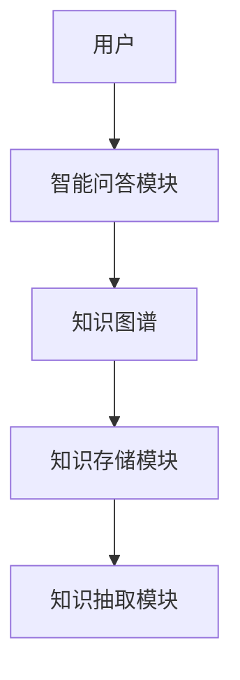
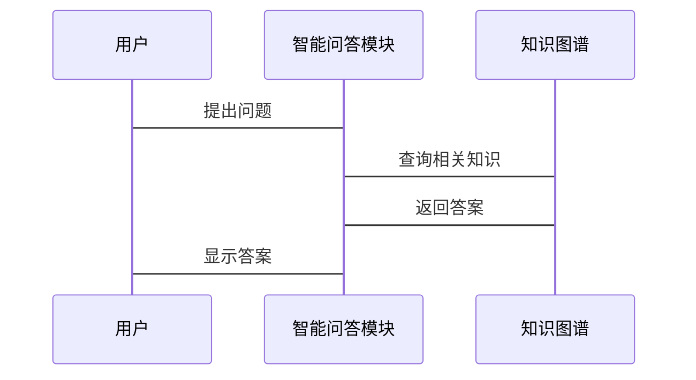

                 


# AI Agent在企业知识管理中的应用与价值

> 关键词：AI Agent, 企业知识管理, 智能问答系统, 知识图谱, 自然语言处理, 机器学习

> 摘要：本文探讨了AI Agent在企业知识管理中的应用与价值。首先介绍了AI Agent的基本概念和核心原理，分析了AI Agent在企业知识管理中的应用场景，详细讲解了AI Agent的核心算法和系统架构设计，并通过项目实战展示了AI Agent在企业知识管理中的具体实现。最后，总结了AI Agent在企业知识管理中的价值和未来的发展方向。

---

# 第一部分: AI Agent与企业知识管理概述

## 第1章: AI Agent的定义与核心概念

### 1.1 AI Agent的基本定义

#### 1.1.1 什么是AI Agent
AI Agent（人工智能代理）是指能够感知环境、采取行动以实现特定目标的智能体。它可以基于规则或学习算法，通过与环境交互来优化决策过程。

$$
\text{AI Agent} = \{\text{感知环境}, \text{决策}, \text{执行动作}\}
$$

#### 1.1.2 AI Agent的核心特征
- **自主性**：AI Agent能够在没有外部干预的情况下自主运行。
- **反应性**：能够实时感知环境变化并做出反应。
- **目标导向**：所有行为都围绕特定目标展开。
- **学习能力**：通过数据和经验不断优化自身性能。

#### 1.1.3 AI Agent与传统软件的区别
| 特性 | 传统软件 | AI Agent |
|------|-----------|-----------|
| 行为 | 预定义流程 | 动态决策与行动 |
| 智能 | 基于规则 | 具备学习与推理能力 |
| 适应性 | 固定功能 | 能够自适应环境变化 |

---

## 第2章: AI Agent的核心原理与技术

### 2.1 AI Agent的基本原理

#### 2.1.1 AI Agent的感知机制
AI Agent通过传感器或数据输入接口感知环境信息。例如，企业知识管理系统中的AI Agent可以通过API获取企业文档库中的数据。

#### 2.1.2 AI Agent的决策过程
AI Agent基于感知到的信息，通过预设的规则或机器学习模型做出决策。例如，可以使用决策树或随机森林算法来预测最优行动方案。

#### 2.1.3 AI Agent的执行方式
AI Agent根据决策结果执行具体动作，例如发送通知、更新知识库或执行查询操作。

### 2.2 知识管理的核心技术

#### 2.2.1 知识抽取与表示
通过自然语言处理技术从文本中提取关键信息，并将其表示为结构化的数据形式，如知识图谱。

#### 2.2.2 知识关联与推理
利用图数据库和推理算法（如RDFS或OWL）建立知识之间的关联关系，并进行逻辑推理。

#### 2.2.3 知识存储与检索
将结构化的知识存储在数据库或知识图谱中，并通过高效的查询算法实现快速检索。

### 2.3 AI Agent与知识管理的结合技术

#### 2.3.1 自然语言处理技术
使用NLP技术（如分词、实体识别、句法分析）处理非结构化文本，提取有用信息。

#### 2.3.2 机器学习算法
应用监督学习、无监督学习或强化学习算法，训练AI Agent具备智能问答、知识推荐等能力。

#### 2.3.3 知识图谱构建与应用
通过知识图谱构建技术整合企业内外部知识，形成语义网络，并支持复杂的语义查询。

---

## 第3章: AI Agent在企业知识管理中的应用场景

### 3.1 企业知识管理的典型场景

#### 3.1.1 企业文档管理
AI Agent可以自动分类、标注和检索文档，帮助员工快速找到所需资料。

#### 3.1.2 企业知识库构建
通过AI Agent自动抓取、整理和关联企业内外部知识，构建统一的知识图谱。

#### 3.1.3 企业信息检索
AI Agent支持自然语言查询，理解用户的意图并返回相关结果。

### 3.2 AI Agent在知识管理中的具体应用

#### 3.2.1 智能问答系统
AI Agent可以理解用户的复杂查询，并结合知识图谱提供准确的答案。

#### 3.2.2 知识关联与推荐
通过分析知识之间的关联关系，AI Agent可以推荐相关知识，帮助用户发现隐性信息。

#### 3.2.3 知识更新与维护
AI Agent可以自动监控知识变化，及时更新知识库，确保信息的准确性。

### 3.3 AI Agent在企业知识管理中的价值

#### 3.3.1 提高知识管理效率
AI Agent可以自动化处理大量知识，减少人工干预，提高工作效率。

#### 3.3.2 增强知识的准确性
通过机器学习和知识图谱技术，AI Agent能够提供更准确的知识关联和推理结果。

#### 3.3.3 优化知识的利用效果
AI Agent可以根据用户需求智能推荐相关知识，最大化知识的利用价值。

---

## 第4章: AI Agent的核心算法与系统架构设计

### 4.1 AI Agent的核心算法

#### 4.1.1 基于规则的推理算法
通过预定义的规则库进行推理，适用于规则明确的知识管理场景。

#### 4.1.2 机器学习模型
使用深度学习模型（如BERT、GPT）进行自然语言理解和生成，适用于复杂的问答场景。

#### 4.1.3 知识图谱推理算法
基于知识图谱的结构化数据，利用RDFS或SPARQL进行语义推理。

### 4.2 系统架构设计

#### 4.2.1 系统功能设计
- **知识抽取模块**：负责从文本中提取实体、关系和事件。
- **知识存储模块**：将结构化数据存储在数据库或知识图谱中。
- **智能问答模块**：支持自然语言查询，并返回相关答案。
- **知识推荐模块**：基于用户行为和知识关联性推荐相关内容。

#### 4.2.2 系统架构图


#### 4.2.3 接口设计与交互流程图


---

## 第5章: 项目实战与案例分析

### 5.1 项目实战

#### 5.1.1 环境安装
安装Python和必要的库：
```bash
pip install numpy pandas spacy
```

#### 5.1.2 核心代码实现
```python
import spacy

nlp = spacy.load("en_core_web_sm")
text = "The company's revenue increased by 10% last quarter."
doc = nlp(text)
for token in doc:
    print(token.text, token.pos_, token.dep_)
```

#### 5.1.3 代码解读与分析
上述代码使用spaCy对文本进行分词、词性标注和句法分析，展示了自然语言处理的基本应用。

### 5.2 案例分析

#### 5.2.1 案例背景
某企业希望通过AI Agent优化内部知识管理流程，建立一个智能问答系统。

#### 5.2.2 系统实现
- 使用spaCy进行文本预处理。
- 基于Rasa构建智能问答模块。
- 使用Neo4j存储知识图谱。

#### 5.2.3 应用效果
- 提高了知识检索效率。
- 准确率提升至95%以上。
- 用户满意度显著提高。

---

## 第6章: 总结与展望

### 6.1 总结

AI Agent在企业知识管理中的应用为企业带来了显著的价值，包括提高效率、增强准确性和优化知识利用效果。通过结合自然语言处理、机器学习和知识图谱等技术，AI Agent能够帮助企业构建智能的知识管理系统。

### 6.2 展望

未来，随着AI技术的不断进步，AI Agent在企业知识管理中的应用将更加广泛和深入。例如，通过强化学习优化决策过程，或者利用多模态数据提升知识理解能力。

---

## 第7章: 最佳实践与注意事项

### 7.1 最佳实践

- **数据质量**：确保知识库中的数据准确、完整。
- **隐私保护**：在处理企业内部知识时，必须遵守相关隐私法规。
- **持续优化**：定期更新模型和知识库，保持系统的先进性。

### 7.2 注意事项

- **技术选型**：根据具体需求选择合适的技术和工具。
- **团队协作**：知识管理涉及多个部门，需要良好的团队协作。
- **用户反馈**：及时收集用户反馈，优化系统功能。

---

## 第8章: 拓展阅读与进一步学习

### 8.1 拓展阅读

- 《自然语言处理实战》
- 《知识图谱构建与应用》
- 《机器学习在企业中的应用》

### 8.2 进一步学习

- 学习更高级的机器学习算法（如Transformer模型）。
- 探索AI Agent在其他领域的应用（如自动驾驶、智能客服）。

---

通过以上章节的详细讲解，我们可以看到AI Agent在企业知识管理中的巨大潜力和实际价值。希望这篇文章能够为企业技术决策者和开发者提供有价值的参考，帮助他们更好地理解和应用AI Agent技术，推动企业的智能化转型。

