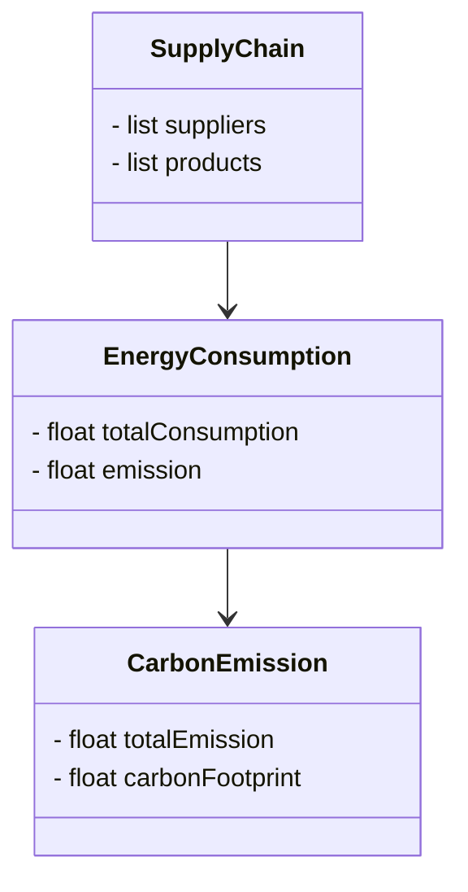

                 

<think>
好的，我将按照您的要求来撰写一篇关于《AI Agent在企业碳中和战略规划与实施中的应用》的技术博客文章。让我们一步步来分析和构建这篇文章。

---

# AI Agent在企业碳中和战略规划与实施中的应用

> 关键词：AI Agent, 碳中和, 企业战略, 人工智能, 可持续发展

> 摘要：随着全球对碳中和目标的关注，企业需要通过智能化手段优化其战略规划和实施。本文探讨了AI Agent在企业碳中和中的应用，分析了其核心概念、算法原理、系统架构，并通过实际案例展示了AI Agent如何助力企业实现碳中和目标。文章还提供了最佳实践和未来发展方向的建议。

---

## 第1章 碳中和与AI Agent的背景概述

### 1.1 碳中和的背景与挑战

#### 1.1.1 碳中和的定义与目标
碳中和是指在一定时间内，通过减少温室气体排放或增加碳汇，使二氧化碳的净排放量为零。企业实现碳中和的目标包括：
1. 减少化石燃料的使用。
2. 提高能源利用效率。
3. 增加可再生能源的使用比例。
4. 优化供应链和生产过程。

#### 1.1.2 当前企业面临的碳中和挑战
企业在实现碳中和过程中面临以下挑战：
1. **复杂性**：涉及能源管理、供应链优化、废物处理等多个方面。
2. **数据不足**：缺乏足够的数据支持决策。
3. **成本高昂**：技术改造和绿色投资需要大量资金。
4. **政策变化**：各国政策不一，增加了不确定性。

#### 1.1.3 AI技术在碳中和中的作用
人工智能（AI）技术可以帮助企业：
1. **优化能源使用**：通过预测和优化算法减少能源浪费。
2. **实时监控**：利用传感器和物联网技术实时监测碳排放。
3. **智能决策**：基于数据驱动的决策支持系统优化生产流程。

### 1.2 AI Agent的基本概念

#### 1.2.1 AI Agent的定义
AI Agent是一种智能实体，能够感知环境、自主决策并执行任务。它可以是一个软件程序或物理设备，具备以下特征：
1. **自主性**：能够自主决策。
2. **反应性**：能够实时感知环境变化并做出反应。
3. **学习能力**：能够通过数据学习和优化。

#### 1.2.2 AI Agent的核心特征
AI Agent的核心特征包括：
1. **感知能力**：通过传感器、数据库等获取环境信息。
2. **决策能力**：基于感知信息做出最优决策。
3. **执行能力**：通过执行机构或接口将决策转化为行动。

#### 1.2.3 AI Agent与传统决策系统的区别
AI Agent与传统决策系统的主要区别在于：
1. **自主性**：AI Agent能够自主决策，而传统系统需要人工干预。
2. **学习能力**：AI Agent能够通过数据学习优化决策，而传统系统依赖固定规则。
3. **实时性**：AI Agent能够实时响应，而传统系统可能需要较长时间处理。

### 1.3 企业碳中和战略中的AI Agent应用

#### 1.3.1 碳中和战略规划的复杂性
碳中和战略规划涉及多个方面，包括：
1. **能源管理**：优化能源使用，减少碳排放。
2. **供应链优化**：减少供应链中的碳足迹。
3. **碳汇开发**：通过植树造林等方式抵消碳排放。

#### 1.3.2 AI Agent在碳中和战略中的优势
AI Agent在碳中和战略中的优势包括：
1. **优化决策**：通过算法优化能源使用和供应链管理。
2. **实时监控**：实时监测碳排放，及时调整策略。
3. **数据驱动**：基于大量数据进行预测和优化。

#### 1.3.3 企业采用AI Agent的必要性
企业采用AI Agent的必要性体现在：
1. **提高效率**：通过智能化手段优化资源配置。
2. **降低成本**：减少能源浪费和不必要的开支。
3. **应对政策变化**：快速响应政策变化，确保合规性。

---

## 第2章 AI Agent的核心概念与联系

### 2.1 AI Agent的核心原理

#### 2.1.1 AI Agent的感知与决策机制
AI Agent的感知与决策机制包括：
1. **感知环境**：通过传感器、数据库等获取环境信息。
2. **分析数据**：利用机器学习算法对数据进行分析。
3. **制定策略**：基于分析结果制定最优策略。
4. **执行决策**：通过执行机构或接口将决策转化为行动。

#### 2.1.2 多智能体协同的基本原理
多智能体协同的基本原理包括：
1. **任务分配**：根据智能体的特长分配任务。
2. **信息共享**：智能体之间共享信息，协调行动。
3. **协同决策**：多个智能体共同制定最优决策。

#### 2.1.3 AI Agent的自主性与适应性
AI Agent的自主性体现在：
1. **自主决策**：无需人工干预，能够自主做出决策。
2. **自适应能力**：能够根据环境变化调整行为。

### 2.2 AI Agent与碳中和战略的关系

#### 2.2.1 AI Agent在碳中和中的应用场景
AI Agent在碳中和中的应用场景包括：
1. **能源管理**：优化能源使用，减少碳排放。
2. **供应链优化**：减少供应链中的碳足迹。
3. **碳汇开发**：通过智能化手段优化碳汇项目。

#### 2.2.2 碳中和目标与AI Agent的结合
碳中和目标与AI Agent的结合体现在：
1. **数据驱动决策**：基于大量数据进行预测和优化。
2. **实时监控**：实时监测碳排放，及时调整策略。
3. **多智能体协同**：通过多智能体协同实现整体优化。

#### 2.2.3 AI Agent如何优化企业碳中和策略
AI Agent通过以下方式优化企业碳中和策略：
1. **预测分析**：预测碳排放趋势，提前制定应对策略。
2. **实时优化**：根据实时数据不断优化能源使用和供应链管理。
3. **多目标优化**：在满足碳中和目标的同时，兼顾经济效益。

### 2.3 AI Agent的核心要素对比

#### 2.3.1 不同AI Agent模型的对比分析
不同AI Agent模型的对比分析包括：
1. **强化学习模型**：通过试错学习优化决策。
2. **监督学习模型**：基于标记数据进行分类和回归。
3. **无监督学习模型**：基于数据聚类和降维。

#### 2.3.2 AI Agent与传统优化算法的对比
AI Agent与传统优化算法的对比体现在：
1. **适应性**：AI Agent能够自适应环境变化，而传统算法需要人工调整。
2. **数据需求**：AI Agent需要大量数据支持决策，而传统算法可能依赖经验规则。
3. **实时性**：AI Agent能够实时响应，而传统算法可能需要较长时间处理。

#### 2.3.3 AI Agent在碳中和中的独特优势
AI Agent在碳中和中的独特优势包括：
1. **智能化决策**：通过机器学习算法优化能源使用和供应链管理。
2. **实时监控**：实时监测碳排放，及时调整策略。
3. **多目标优化**：在满足碳中和目标的同时，兼顾经济效益。

---

## 第3章 AI Agent的算法原理与数学模型

### 3.1 AI Agent的算法原理

#### 3.1.1 强化学习在AI Agent中的应用
强化学习在AI Agent中的应用包括：
1. **状态空间**：定义智能体所处的状态。
2. **动作空间**：定义智能体可以执行的动作。
3. **奖励函数**：定义智能体执行动作后的奖励。
4. **策略优化**：通过试错学习优化策略。

#### 3.1.2 监督学习与无监督学习的结合
监督学习与无监督学习的结合体现在：
1. **监督学习**：用于分类和回归任务。
2. **无监督学习**：用于聚类和降维任务。
3. **结合应用**：在实际场景中结合使用监督和无监督学习。

#### 3.1.3 多智能体协同算法的实现
多智能体协同算法的实现包括：
1. **任务分配**：根据智能体的能力分配任务。
2. **信息共享**：智能体之间共享信息，协调行动。
3. **协同决策**：多个智能体共同制定最优决策。

### 3.2 AI Agent的数学模型

#### 3.2.1 状态空间与动作空间的数学定义
状态空间与动作空间的数学定义如下：
- 状态空间：$S = \{s_1, s_2, \ldots, s_n\}$
- 动作空间：$A = \{a_1, a_2, \ldots, a_m\}$

#### 3.2.2 奖励函数的设计与优化
奖励函数的设计与优化包括：
- 奖励函数：$R(s, a) = r$，其中$r$表示执行动作$a$在状态$s$下的奖励。
- 奖励函数的设计需要考虑任务目标和智能体行为。

#### 3.2.3 动作选择的策略函数
动作选择的策略函数可以表示为：
$$ V(s) = \max_a Q(s,a) $$

---

## 第4章 系统分析与架构设计方案

### 4.1 系统功能设计

#### 4.1.1 领域模型设计
领域模型设计包括：
1. **实体识别**：识别系统中的关键实体，如能源消耗、碳排放、供应链等。
2. **关系建模**：建立实体之间的关系，如能源消耗与碳排放的关系。
3. **功能模块划分**：将系统划分为多个功能模块，如数据采集、数据分析、决策制定等。

#### 4.1.2 领域模型类图


### 4.2 系统架构设计

#### 4.2.1 系统架构图
```mermaid
架构图
graph LR
    IaaS --> PaaS
    PaaS --> SaaS
    SaaS --> AI-Agent
    AI-Agent --> Database
    Database --> Monitor
```

#### 4.2.2 系统接口设计
系统接口设计包括：
1. **数据接口**：与传感器、数据库等进行数据交互。
2. **用户接口**：提供给用户查看和操作系统的界面。
3. **外部接口**：与第三方服务（如碳排放交易平台）进行数据交互。

#### 4.2.3 系统交互设计
系统交互设计包括：
1. **数据采集**：传感器采集环境数据。
2. **数据处理**：AI Agent处理数据并制定决策。
3. **决策执行**：执行机构根据决策执行操作。
4. **反馈机制**：系统根据反馈调整决策。

---

## 第5章 项目实战

### 5.1 环境安装

#### 5.1.1 安装Python环境
```bash
python --version
pip install --upgrade pip
```

#### 5.1.2 安装AI框架
```bash
pip install numpy
pip install tensorflow
pip install scikit-learn
```

### 5.2 系统核心实现源代码

#### 5.2.1 数据预处理代码
```python
import numpy as np
import pandas as pd

# 加载数据
data = pd.read_csv('carbon_emission.csv')

# 数据清洗
data = data.dropna()
data = data.astype(float)
```

#### 5.2.2 AI Agent实现代码
```python
import tensorflow as tf
from tensorflow.keras import layers

# 定义强化学习模型
model = tf.keras.Sequential([
    layers.Dense(64, activation='relu'),
    layers.Dense(1, activation='linear')
])

# 编译模型
model.compile(optimizer='adam', loss='mean_squared_error')
```

### 5.3 案例分析与详细讲解

#### 5.3.1 案例背景
假设某制造企业希望优化其能源使用，减少碳排放。

#### 5.3.2 数据分析
通过对能源使用数据的分析，发现主要的碳排放来源是生产线的能耗。

#### 5.3.3 AI Agent优化
AI Agent通过强化学习优化能源使用，减少碳排放。

---

## 第6章 最佳实践与未来展望

### 6.1 最佳实践 tips

#### 6.1.1 数据质量管理
确保数据的准确性和完整性。

#### 6.1.2 系统安全性
保护系统的安全性，防止数据泄露。

#### 6.1.3 可扩展性
确保系统具备良好的可扩展性，能够适应未来的发展需求。

### 6.2 小结
本文详细探讨了AI Agent在企业碳中和战略规划与实施中的应用，分析了其核心概念、算法原理和系统架构，并通过实际案例展示了AI Agent的优势和应用价值。

### 6.3 注意事项
在实际应用中，需要注意以下几点：
1. **数据隐私**：确保数据的安全性和隐私性。
2. **系统稳定性**：确保系统的稳定运行。
3. **成本控制**：合理控制系统的建设和运行成本。

### 6.4 拓展阅读
1. 《强化学习入门》
2. 《分布式系统设计与实现》
3. 《碳中和与可持续发展》

---

通过以上步骤，我们详细分析了AI Agent在企业碳中和战略规划与实施中的应用，并通过实际案例展示了其优势和价值。希望本文能够为企业实现碳中和目标提供有益的参考和指导。

