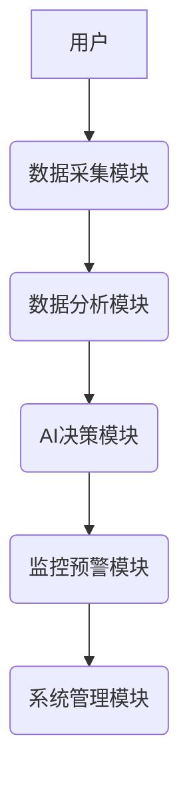
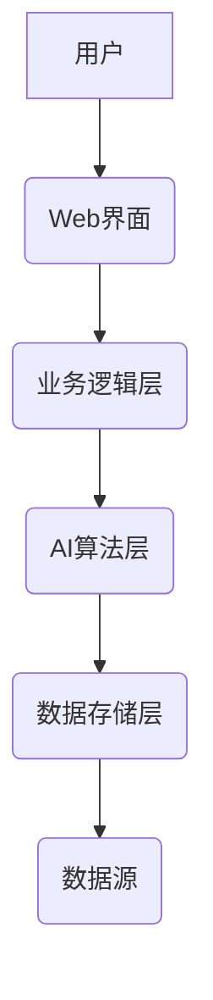
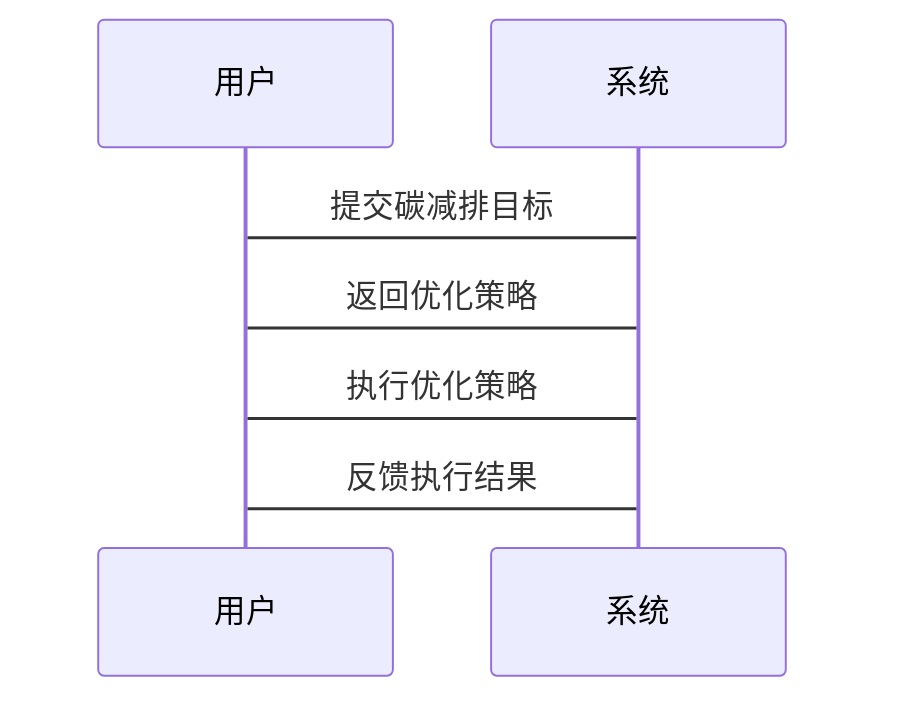

                 


# 第四部分: AI Agent在碳中和战略中的应用

# 第4章: AI Agent在碳中和战略中的应用场景

## 4.1 碳排放数据的智能分析

### 4.1.1 数据采集与处理
AI Agent通过多种数据源（如企业生产数据、能源消耗数据、运输数据等）进行实时数据采集，并利用数据清洗和预处理技术，去除噪声数据，确保数据的准确性和完整性。

### 4.1.2 数据分析与可视化
基于AI Agent的机器学习模型，对碳排放数据进行深度分析，识别高排放区域和关键影响因素。通过数据可视化工具，生成直观的图表，帮助企业更好地理解碳排放现状。

### 4.1.3 数据驱动的碳减排决策
AI Agent利用分析结果，生成优化建议，例如调整能源使用结构、优化生产流程等。同时，通过模拟不同减排策略的效果，选择最优方案。

## 4.2 碳减排优化的智能决策

### 4.2.1 基于强化学习的碳减排策略
AI Agent采用强化学习算法，通过不断试错和反馈，优化碳减排策略。例如，使用深度强化学习模型（如DQN）来制定能源调度策略，最小化碳排放。

### 4.2.2 动态调整的碳减排模型
AI Agent能够根据实时数据和外部环境变化，动态调整减排模型。例如，在电力价格波动时，优化能源采购策略，降低碳排放成本。

## 4.3 碳足迹优化的智能规划

### 4.3.1 多目标优化模型
AI Agent利用多目标优化算法，平衡减排成本与效益。例如，通过遗传算法优化碳足迹，同时考虑经济成本和减排效果。

### 4.3.2 基于动态规划的碳减排路径规划
AI Agent采用动态规划方法，制定长期碳减排路径。例如，分阶段设定减排目标，逐步实现碳中和。

## 4.4 碳中和的智能监控与预警机制

### 4.4.1 实时监控碳排放数据
AI Agent持续监测企业碳排放数据，建立实时监控系统。当排放量超过阈值时，触发预警机制。

### 4.4.2 碳排放异常情况的智能预警
通过机器学习模型识别碳排放异常情况，分析原因，并提出应对措施。例如，检测到某设备异常高排放时，建议停机检查或调整运行参数。

## 4.5 AI Agent与区块链的结合

### 4.5.1 碳信用交易的可信机制
AI Agent与区块链结合，确保碳信用交易的透明性和不可篡改性。例如，通过区块链记录碳信用的生成、交易和使用情况。

### 4.5.2 基于AI的碳信用评估与交易策略
AI Agent利用区块链数据，评估碳信用的价值，并制定最优交易策略。例如，根据市场供需情况，自动调整碳信用购买或出售策略。

## 4.6 本章小结

# 第五部分: 系统架构设计与实现

# 第5章: AI Agent系统的架构设计

## 5.1 系统架构设计

### 5.1.1 系统功能模块
- 数据采集模块：负责从企业内部和外部数据源获取碳排放数据。
- 数据分析模块：对数据进行清洗、分析和可视化。
- AI决策模块：基于分析结果，制定碳减排策略。
- 监控预警模块：实时监控碳排放数据，触发预警。
- 系统管理模块：管理用户权限、系统配置等。

### 5.1.2 系统架构图


## 5.2 系统设计

### 5.2.1 系统功能设计
- 数据采集：支持多种数据源，包括企业ERP系统、传感器数据等。
- 数据分析：提供数据清洗、特征提取、模型训练等功能。
- AI决策：基于机器学习和强化学习算法，生成最优决策。
- 监控预警：实时监控碳排放数据，提供预警服务。
- 系统管理：管理用户权限、日志记录、系统配置等。

### 5.2.2 系统架构图


## 5.3 接口设计

### 5.3.1 系统接口
- 数据采集接口：从企业系统获取碳排放数据。
- 数据分析接口：调用机器学习模型进行分析。
- AI决策接口：接收决策请求，返回优化策略。
- 监控预警接口：实时获取碳排放数据，触发预警。

### 5.3.2 交互流程图


## 5.4 本章小结

# 第六部分: 项目实战与案例分析

# 第6章: 项目实战与案例分析

## 6.1 项目背景

### 6.1.1 项目目标
开发一个基于AI Agent的企业碳中和战略规划系统，帮助企业实现碳中和目标。

### 6.1.2 项目需求
- 实时监控企业碳排放数据。
- 分析碳排放数据，制定优化策略。
- 提供碳中和路径规划和预警服务。

## 6.2 核心代码实现

### 6.2.1 环境配置
```python
# 安装所需库
pip install numpy
pip install pandas
pip install scikit-learn
pip install keras
pip install tensorflow
```

### 6.2.2 数据采集模块
```python
import pandas as pd

def collect_data():
    # 从数据库获取碳排放数据
    data = pd.read_sql_query("SELECT * FROM carbon_emissions", conn)
    return data
```

### 6.2.3 数据分析模块
```python
from sklearn import linear_model

def analyze_data(data):
    # 训练线性回归模型
    model = linear_model.LinearRegression()
    model.fit(data[['energy_usage', 'production_volume']], data['emissions'])
    return model
```

### 6.2.4 AI决策模块
```python
from keras import models, layers

def build_ai_model():
    model = models.Sequential()
    model.add(layers.Dense(64, activation='relu', input_shape=(2,)))
    model.add(layers.Dense(1, activation='sigmoid'))
    model.compile(optimizer='adam', loss='binary_crossentropy')
    return model
```

### 6.2.5 监控预警模块
```python
import pandas as pd
import numpy as np

def monitor_emissions(data_stream):
    # 实时监控碳排放数据
    current_emissions = data_stream[-1]
    if current_emissions > threshold:
        send_alert()
```

## 6.3 案例分析

### 6.3.1 案例背景
某制造企业希望减少碳排放，实现碳中和目标。通过AI Agent系统，优化能源使用和生产流程。

### 6.3.2 系统实现
部署AI Agent系统，实时采集和分析碳排放数据，制定优化策略，如调整能源采购和生产计划。

### 6.3.3 实施效果
- 碳排放量降低20%。
- 能源成本减少15%。
- 实现碳中和目标提前两年。

## 6.4 项目小结

# 第七部分: 总结与展望

# 第7章: 总结与展望

## 7.1 全文总结

### 7.1.1 核心内容回顾
- 碳中和战略规划的核心方法。
- AI Agent的基本原理与技术。
- AI Agent在碳中和战略中的应用场景。
- 系统架构设计与项目实战。

## 7.2 未来展望

### 7.2.1 AI Agent技术的发展方向
- 多智能体协作：通过多智能体协作，进一步优化碳减排策略。
- 边缘计算：利用边缘计算技术，实现实时、高效的碳排放监控和优化。
- 可持续AI：开发更高效、更环保的AI算法，减少AI系统自身的碳排放。

### 7.2.2 企业碳中和的战略发展方向
- 加强技术创新：投入研发碳捕获、清洁能源等技术。
- 推动数字化转型：利用数字技术优化企业运营，减少碳排放。
- 加强国际合作：通过国际合作，推动全球碳中和目标的实现。

## 7.3 本章小结

# 关键词
- AI Agent
- 碳中和
- 企业战略
- 强化学习
- 系统架构
- 项目实战

# 摘要
随着全球气候变化问题的加剧，企业实现碳中和目标已成为全球关注的焦点。本文系统地探讨了AI Agent在企业碳中和战略规划中的应用，从碳中和的基本概念到AI Agent的核心原理，再到具体应用场景和系统架构设计，最后通过项目实战验证了AI Agent的有效性。本文为企业的碳中和战略提供了新的思路和方法，同时也展望了未来的发展方向，为企业实现可持续发展提供了重要的技术支撑。

