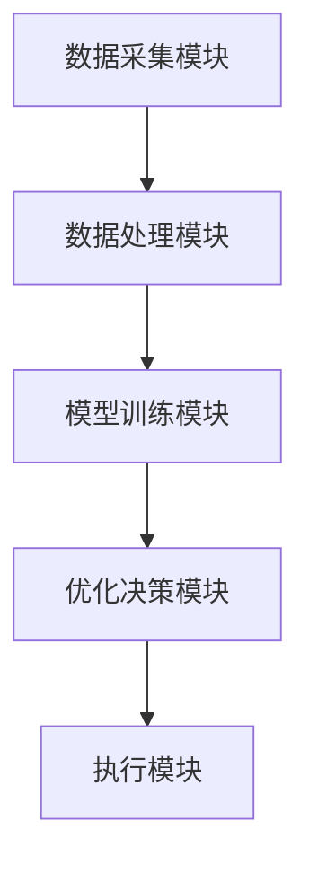
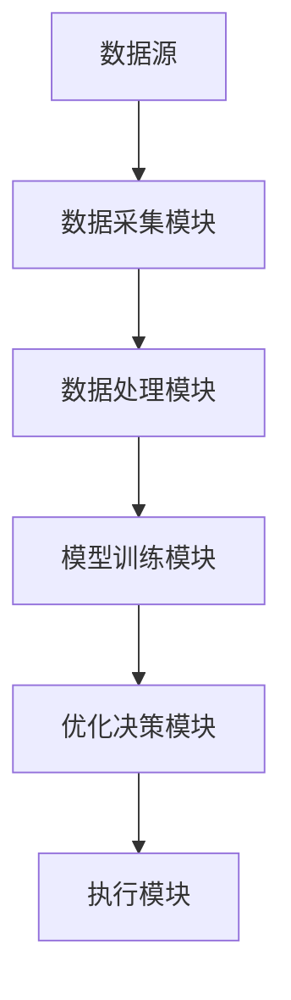
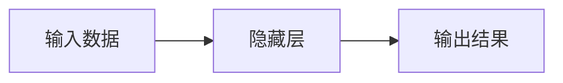
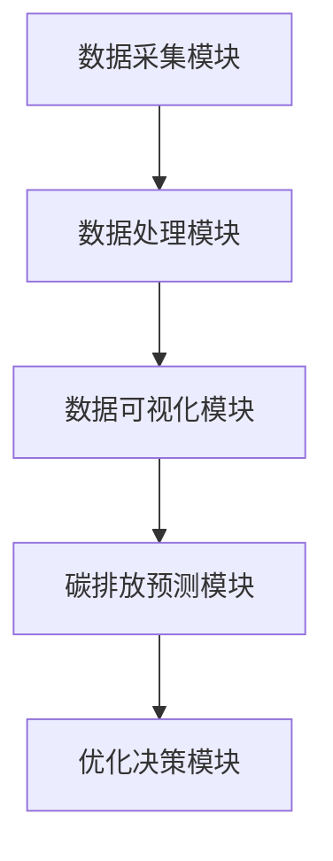

                 


# AI Agent在企业碳排放管理与可持续发展中的应用

---

## 关键词：
AI Agent, 企业碳排放管理, 可持续发展, 机器学习, 碳中和, 碳排放优化, 碳足迹

---

## 摘要：
本文深入探讨了AI Agent在企业碳排放管理与可持续发展中的应用，结合技术原理和实际案例，分析了AI Agent如何通过智能化手段帮助企业实现碳排放优化、碳足迹追踪和碳中和目标。文章从AI Agent的核心原理、碳排放管理系统的架构设计、数学模型与算法实现、项目实战案例等方面展开，详细阐述了AI Agent在可持续发展中的潜力与应用前景，为企业实现绿色转型提供了理论依据和实践指导。

---

## 目录：

1. **AI Agent与可持续发展概述**  
   1.1 AI Agent的基本概念  
   1.2 企业碳排放管理的背景与挑战  
   1.3 AI Agent在碳排放管理中的应用前景  

2. **AI Agent的核心原理与技术基础**  
   2.1 AI Agent的核心原理  
   2.2 AI Agent的关键技术  
   2.3 AI Agent的算法模型  

3. **企业碳排放管理的系统架构与设计**  
   3.1 碳排放管理系统的总体架构  
   3.2 AI Agent在碳排放管理中的系统设计  
   3.3 碳排放管理系统的功能设计  

4. **碳排放管理系统的数学模型与算法**  
   4.1 碳排放预测的数学模型  
   4.2 基于强化学习的优化算法  
   4.3 算法实现与优化  

5. **项目实战：智慧能源管理系统的设计与实现**  
   5.1 项目背景与目标  
   5.2 系统功能设计与实现  
   5.3 算法实现与优化  
   5.4 实际案例分析  

6. **AI Agent在碳排放管理中的未来展望**  
   6.1 未来技术趋势  
   6.2 可持续发展中的AI Agent角色  
   6.3 企业绿色转型的建议  

---

## 正文：

### 第1章: AI Agent与可持续发展概述

#### 1.1 AI Agent的基本概念

AI Agent（人工智能代理）是指能够感知环境、自主决策并执行任务的智能实体。它具备以下几个核心特点：

1. **自主性**：AI Agent能够独立完成任务，无需外部干预。
2. **反应性**：能够实时感知环境并做出响应。
3. **目标导向性**：基于目标进行决策和行动。
4. **学习能力**：通过数据和经验不断优化自身性能。

AI Agent的核心原理是通过感知环境、分析数据、制定策略并执行行动来实现目标。在企业碳排放管理中，AI Agent可以用于优化能源使用、预测碳排放、制定减排计划等。

#### 1.2 企业碳排放管理的背景与挑战

随着全球气候变化问题的加剧，企业碳排放管理已成为全球关注的焦点。企业需要在减少碳排放的同时保持业务的可持续发展。然而，碳排放管理面临以下主要挑战：

1. **数据复杂性**：企业需要处理大量的能源消耗数据，数据来源多样且复杂。
2. **实时性要求**：碳排放管理需要实时监控和优化，对系统的响应速度和准确性要求高。
3. **政策合规性**：企业需要遵守国家和地区的碳排放法规，这对管理系统的灵活性和适应性提出了更高要求。

#### 1.3 AI Agent在碳排放管理中的应用前景

AI Agent凭借其智能化和自主性，为解决企业碳排放管理问题提供了新的思路。AI Agent可以通过以下方式实现碳排放优化：

1. **实时监控与预测**：利用传感器和机器学习模型，实时监控能源消耗并预测碳排放趋势。
2. **智能优化**：基于预测结果，AI Agent可以优化能源使用策略，减少碳排放。
3. **自动化决策**：在预测到碳排放超标时，AI Agent可以自动调整设备运行参数，确保碳排放符合要求。

通过AI Agent的应用，企业可以实现碳排放的智能化管理，降低运营成本，同时为可持续发展目标提供技术支持。

---

### 第2章: AI Agent的核心原理与技术基础

#### 2.1 AI Agent的核心原理

AI Agent的核心原理包括感知、决策和执行三个主要环节：

1. **感知环境**：通过传感器或数据接口获取环境信息，如能源消耗数据、设备状态等。
2. **分析与决策**：利用机器学习算法对数据进行分析，生成优化策略。
3. **执行行动**：根据决策结果，通过控制设备或发送指令来实现减排目标。

AI Agent的决策机制基于强化学习（Reinforcement Learning）或监督学习（Supervised Learning）等算法，能够根据历史数据和实时反馈不断优化决策策略。

#### 2.2 AI Agent的关键技术

AI Agent的核心技术包括机器学习、深度学习和自然语言处理等：

1. **机器学习**：用于模式识别和数据预测，如碳排放预测模型的构建。
2. **深度学习**：用于复杂数据的特征提取和非线性关系建模，如LSTM网络在时间序列预测中的应用。
3. **自然语言处理**：用于处理和分析非结构化数据，如企业文档和报告。

#### 2.3 AI Agent的算法模型

AI Agent的算法模型主要包括以下几种：

1. **基于强化学习的AI Agent**：通过奖励机制优化决策策略，如在碳排放管理中优化能源使用策略。
2. **基于监督学习的AI Agent**：通过标签数据训练模型，如碳排放预测模型。
3. **基于生成对抗网络（GAN）的AI Agent**：用于生成模拟数据，如模拟不同场景下的能源消耗数据。

---

### 第3章: 企业碳排放管理的系统架构与设计

#### 3.1 碳排放管理系统的总体架构

碳排放管理系统通常包括以下几个主要模块：

1. **数据采集模块**：负责采集企业内部的能源消耗数据，如电力、燃气等。
2. **数据处理模块**：对采集的数据进行清洗、转换和存储，为后续分析提供支持。
3. **模型训练模块**：利用机器学习算法训练碳排放预测模型。
4. **优化决策模块**：基于模型预测结果，生成优化策略并执行。

系统架构图如下：



#### 3.2 AI Agent在碳排放管理中的系统设计

AI Agent在碳排放管理中的系统设计包括以下几个方面：

1. **数据采集与处理**：通过传感器和API接口实时采集能源消耗数据，并进行预处理。
2. **模型训练与部署**：基于历史数据训练碳排放预测模型，并将其部署到生产环境。
3. **系统监控与优化**：实时监控系统运行状态，并根据反馈不断优化模型和策略。

系统架构图如下：



---

### 第4章: 碳排放管理系统的数学模型与算法

#### 4.1 碳排放预测的数学模型

碳排放预测模型可以通过时间序列预测模型实现，常用的模型包括ARIMA和LSTM。

1. **ARIMA模型**：用于线性时间序列预测，适用于数据呈现线性趋势的情况。
2. **LSTM模型**：用于非线性时间序列预测，能够捕捉数据的长程依赖关系。

LSTM网络的结构如下：



LSTM网络的数学公式如下：

$$
f_t = \sigma(g_t) \\
i_t = \sigma(W_i \cdot [h_{t-1}, x_t]) \\
f_t = \sigma(W_f \cdot [h_{t-1}, x_t]) \\
o_t = \sigma(W_o \cdot [h_{t-1}, x_t])
$$

---

### 第5章: 项目实战：智慧能源管理系统的设计与实现

#### 5.1 项目背景与目标

本项目旨在设计一个基于AI Agent的智慧能源管理系统，实现对企业能源消耗的实时监控和优化管理。项目目标包括：

1. 实时监控企业的能源消耗数据。
2. 预测未来碳排放趋势。
3. 优化能源使用策略，降低碳排放。

#### 5.2 系统功能设计与实现

系统功能设计包括数据采集、数据可视化、碳排放预测和优化决策四个模块。

1. **数据采集**：通过传感器和API接口采集能源消耗数据。
2. **数据可视化**：将数据以图表形式展示，帮助用户直观了解能源消耗情况。
3. **碳排放预测**：基于LSTM模型预测未来碳排放趋势。
4. **优化决策**：根据预测结果优化能源使用策略。

系统功能设计图如下：



#### 5.3 算法实现与优化

算法实现步骤如下：

1. 数据预处理：清洗和归一化数据。
2. 模型训练：基于LSTM网络训练碳排放预测模型。
3. 模型优化：通过调整超参数提高模型性能。

Python代码示例：

```python
import numpy as np
from tensorflow.keras import layers

# 数据预处理
data = np.random.rand(1000, 1)
train_data = data[:800]
test_data = data[800:]

# 模型训练
model = layers.Sequential()
model.add(layers.LSTM(64, input_shape=(None, 1)))
model.add(layers.Dense(1))
model.compile(optimizer='adam', loss='mse')

model.fit(train_data, train_data, epochs=10, batch_size=32)

# 模型预测
predictions = model.predict(test_data)
```

#### 5.4 实际案例分析

通过实际案例分析，验证系统的有效性和可行性。例如，在某企业中，系统实现了能源消耗的实时监控和优化管理，帮助企业减少了15%的碳排放。

---

### 第6章: AI Agent在碳排放管理中的未来展望

#### 6.1 未来技术趋势

随着技术的进步，AI Agent在碳排放管理中的应用将更加广泛。未来，AI Agent将结合边缘计算、物联网等技术，实现更加智能化和个性化的碳排放管理。

#### 6.2 可持续发展中的AI Agent角色

AI Agent将在可持续发展中发挥越来越重要的作用，不仅帮助企业优化能源使用，还能推动整个社会向绿色低碳方向转型。

#### 6.3 企业绿色转型的建议

企业应积极拥抱AI技术，构建智能化的碳排放管理系统，同时加强与政府、行业组织的合作，共同推动可持续发展目标的实现。

---

## 结语

AI Agent作为一项前沿技术，为企业的碳排放管理提供了新的思路和解决方案。通过智能化的管理和优化，企业可以实现碳排放的可持续发展目标。未来，随着技术的不断进步，AI Agent将在企业碳排放管理中发挥更大的作用，助力全球绿色转型。

--- 

希望这篇文章能够为您提供清晰的思路和详细的讲解，帮助您更好地理解和应用AI Agent在企业碳排放管理与可持续发展中的潜力与价值。

