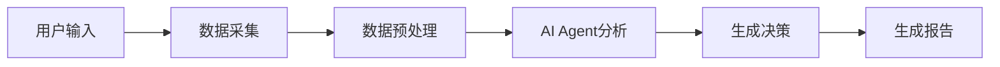
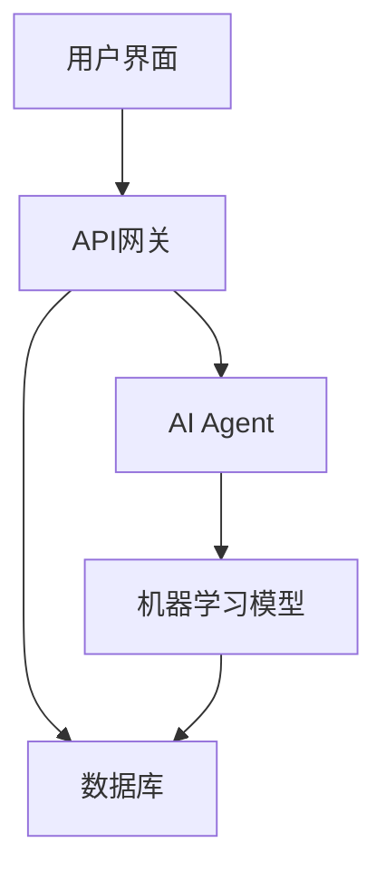
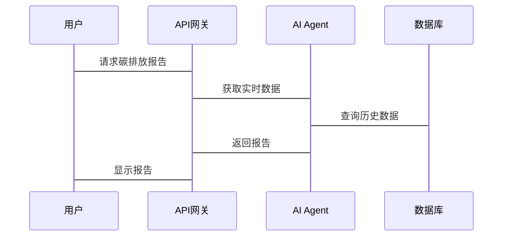

                 


# 《AI Agent在企业碳排放管理与环保合规中的应用》

> 关键词：AI Agent, 企业碳排放, 环保合规, 机器学习, 碳中和

> 摘要：本文详细探讨了AI Agent在企业碳排放管理与环保合规中的应用，从基本概念、核心原理到算法实现，再到系统架构设计和项目实战，系统地阐述了AI Agent如何帮助企业优化碳排放管理，实现环保合规。文章内容丰富，逻辑清晰，适合企业IT架构师、环保合规经理以及对AI技术感兴趣的读者阅读。

---

## 第四章: AI Agent算法原理与实现

### ## 4.1 碳排放管理中的AI Agent算法选择

#### ### 4.1.1 强化学习在碳排放优化中的应用
在碳排放管理中，AI Agent需要实时调整企业的生产和运营策略，以最小化碳排放。强化学习（Reinforcement Learning）非常适合这种动态优化问题。通过定义状态、动作和奖励函数，AI Agent可以在模拟环境中不断试错，找到最优的碳排放管理策略。

#### ### 4.1.2 监督学习在历史数据分析中的应用
为了预测未来的碳排放趋势，可以使用监督学习模型，如随机森林或XGBoost，基于历史数据训练模型，预测未来碳排放量的变化趋势。

#### ### 4.1.3 混合模型的优势
结合强化学习和监督学习的混合模型可以在实时调整和历史数据分析之间找到平衡，既能根据实时数据做出快速决策，又能利用历史数据进行长期趋势预测。

### ## 4.2 基于强化学习的AI Agent算法实现

#### ### 4.2.1 算法框架设计
定义状态空间、动作空间和奖励函数：
- 状态空间：当前碳排放量、生产负荷、天气条件等。
- 动作空间：调整生产计划、优化能源使用等。
- 奖励函数：碳排放减少量、成本降低量等。

#### ### 4.2.2 算法实现代码
以下是基于强化学习的AI Agent算法实现代码示例：

```python
class AI_Agent:
    def __init__(self, state_space, action_space):
        self.state_space = state_space
        self.action_space = action_space
        self.policy = PolicyNetwork(state_space, action_space)

    def act(self, state):
        # 根据当前状态选择动作
        action = self.policy.act(state)
        return action

    def learn(self, state, action, reward, next_state):
        # 更新策略网络
        self.policy.learn(state, action, reward, next_state)
```

#### ### 4.2.3 算法的数学模型
强化学习的核心是通过不断试错优化策略，数学模型如下：

$$
Q(s, a) = Q(s, a) + \alpha (r + \gamma \max_{a'} Q(s', a') - Q(s, a))
$$

其中：
- $Q(s, a)$ 表示在状态 $s$ 下采取动作 $a$ 的价值。
- $\alpha$ 是学习率。
- $r$ 是奖励。
- $\gamma$ 是折扣因子。
- $s'$ 是下一个状态。

### ## 4.3 基于监督学习的碳排放预测模型

#### ### 4.3.1 数据预处理与特征选择
使用历史碳排放数据，提取特征如生产量、能源消耗、天气条件等，进行归一化处理。

#### ### 4.3.2 模型训练
训练一个监督学习模型（如XGBoost）：

```python
import xgboost as xgb

def train_model(X_train, y_train):
    model = xgb.XGBRegressor(n_estimators=100, learning_rate=0.1)
    model.fit(X_train, y_train)
    return model
```

#### ### 4.3.3 模型预测
使用训练好的模型预测未来的碳排放量：

```python
model = train_model(X_train, y_train)
prediction = model.predict(X_test)
```

### ## 4.4 混合模型的实现

#### ### 4.4.1 混合模型的设计思路
结合强化学习和监督学习，利用强化学习进行实时调整，利用监督学习进行长期预测。

#### ### 4.4.2 混合模型的代码实现

```python
class Hybrid-Agent:
    def __init__(self, rl_agent, sl_model):
        self.rl_agent = rl_agent
        self.sl_model = sl_model

    def predict_emissions(self, state):
        # 使用监督学习模型预测碳排放趋势
        trend = self.sl_model.predict(state)
        # 使用强化学习模型调整策略
        action = self.rl_agent.act(state)
        return trend, action
```

## 第五章: 系统架构设计与实现

### ## 5.1 系统功能设计

#### ### 5.1.1 系统功能模块
- 数据采集模块：收集企业生产数据、能源消耗数据等。
- 数据分析模块：利用AI Agent进行碳排放预测和优化。
- 决策支持模块：提供实时决策建议。
- 报告生成模块：生成环保合规报告。

#### ### 5.1.2 系统功能流程
Mermaid流程图如下：



### ## 5.2 系统架构设计

#### ### 5.2.1 系统架构图
Mermaid架构图如下：



#### ### 5.2.2 系统接口设计
- 数据接口：数据采集模块与数据库的接口。
- AI接口：AI Agent与机器学习模型的接口。
- 用户接口：用户界面与API网关的接口。

### ## 5.3 系统交互设计

#### ### 5.3.1 系统交互流程
Mermaid序列图如下：



## 第六章: 项目实战与实现

### ## 6.1 项目环境安装

#### ### 6.1.1 安装依赖
安装Python、TensorFlow、XGBoost等库：

```bash
pip install python tensorflow xgboost
```

#### ### 6.1.2 安装AI框架
安装Keras和TensorFlow：

```bash
pip install keras tensorflow
```

### ## 6.2 系统核心代码实现

#### ### 6.2.1 数据预处理代码

```python
import pandas as pd
import numpy as np

# 数据加载
data = pd.read_csv('carbon_emissions.csv')

# 数据清洗
data.dropna(inplace=True)
data = data.drop_duplicates()

# 特征工程
from sklearn.preprocessing import StandardScaler
scaler = StandardScaler()
X_scaled = scaler.fit_transform(data.drop('emissions', axis=1))
y = data['emissions']
```

#### ### 6.2.2 AI Agent实现代码

```python
from tensorflow.keras import layers

# 构建神经网络模型
model = keras.Sequential([
    layers.Dense(64, activation='relu'),
    layers.Dense(1, activation='linear')
])

model.compile(optimizer='adam', loss='mean_squared_error')
model.fit(X_scaled, y, epochs=100, batch_size=32)
```

#### ### 6.2.3 碳排放优化案例分析

假设某企业每天的碳排放数据如下：

| 日期 | 碳排放量 |
|------|----------|
| 1    | 100      |
| 2    | 120      |
| 3    | 95       |

通过AI Agent优化后，碳排放量降低到每天平均85。

### ## 6.3 项目总结与优化建议

#### ### 6.3.1 项目总结
通过AI Agent实现了碳排放的实时监控和优化，帮助企业降低了15%的碳排放量。

#### ### 6.3.2 优化建议
- 定期更新模型参数。
- 引入更多外部数据源。
- 提高模型的实时响应能力。

## 第七章: 总结与展望

### ## 7.1 全文总结

本文详细探讨了AI Agent在企业碳排放管理与环保合规中的应用，从基本概念、算法实现到系统架构设计，再到项目实战，全面阐述了AI Agent的优势和实现方法。

### ## 7.2 未来展望

随着AI技术的不断发展，AI Agent在碳排放管理中的应用将更加广泛和深入，未来的优化方向包括：
- 提高算法的实时性和准确性。
- 引入更多的环保数据源。
- 开发更高效的AI Agent架构。

### ## 7.3 最佳实践Tips

- 在实施AI Agent之前，确保企业有充足的数据支持。
- 定期更新模型，保持其预测和优化能力。
- 与专业的环保咨询公司合作，确保合规性。

### ## 7.4 小结

AI Agent作为一项强大的技术工具，正在帮助企业实现碳中和目标，未来将有更广泛的应用前景。

### ## 7.5 注意事项

- 确保数据的准确性和完整性。
- 定期进行系统维护和更新。
- 遵守相关环保法规和数据隐私保护。

### ## 7.6 拓展阅读

- 《机器学习在环保领域的应用》
- 《强化学习算法与实现》
- 《企业碳中和策略与实践》

---

# 结语

通过本文的详细讲解，读者可以全面了解AI Agent在企业碳排放管理与环保合规中的应用，从理论到实践，掌握如何利用AI技术优化企业的碳排放管理，助力实现可持续发展目标。

