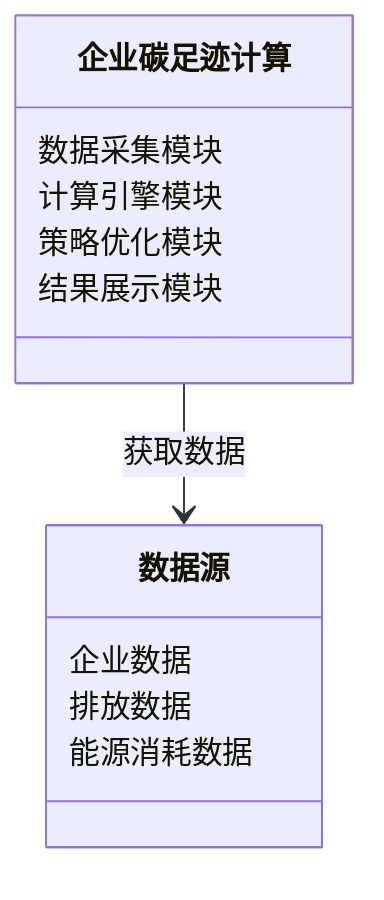

                 

<think>
好，我现在需要帮助用户完成一篇关于AI Agent在企业碳足迹计算与减排策略制定中的应用的技术博客文章。用户已经提供了详细的目录结构和一些示例内容，现在我需要根据这些信息，继续撰写后续的部分。

首先，我得回顾一下用户的需求。用户希望这篇文章结构清晰，逻辑严密，技术深入，同时要使用专业的技术语言，但又不失易懂。文章需要涵盖背景介绍、核心概念、算法原理、系统架构、项目实战和总结等多个部分，每个部分都要详细展开，尤其是要包括图表、代码示例和数学公式。

接下来，我需要按照用户提供的目录结构，逐章进行内容的撰写。当前用户已经完成了前三章的部分内容，现在需要继续完成后续的章节。

### 第三章 AI Agent在碳足迹计算中的算法原理

#### 3.2 碳足迹计算模型
- **3.2.1 基于机器学习的回归模型**
  - 详细讲解如何使用线性回归、决策树回归等模型进行碳足迹预测。
  - 提供一个简单的Python代码示例，比如使用sklearn库中的线性回归模型。
  - 分析模型的优缺点，如线性回归的简单性与可能的低准确性。

- **3.2.2 神经网络模型的应用**
  - 介绍多层感知机（MLP）、卷积神经网络（CNN）等在碳足迹计算中的应用。
  - 提供一个简单的神经网络模型代码示例，使用Keras或TensorFlow构建一个回归模型。
  - 讨论神经网络的高计算需求和处理复杂模式的能力。

- **3.2.3 时间序列分析与预测**
  - 讲解ARIMA、LSTM等模型在时间序列数据中的应用。
  - 提供一个使用LSTM进行碳足迹预测的Python代码示例。
  - 分析这些模型在处理时间依赖数据时的优势。

#### 3.3 碳足迹优化与减排策略制定

- **3.3.1 基于AI Agent的优化算法**
  - 介绍遗传算法、模拟退火、粒子群优化等优化算法。
  - 使用Python代码示例展示如何使用这些算法进行减排策略优化。

- **3.3.2 综合考虑多目标优化**
  - 讨论如何在优化过程中平衡成本、减排效果和可行性。
  - 提供一个多目标优化的数学模型，使用适当的数学符号表示。

- **3.3.3 动态调整与自适应优化**
  - 说明AI Agent如何实时调整策略以应对变化。
  - 提供一个动态调整的算法流程图，展示实时数据的处理和策略调整过程。

### 第四章 系统分析与架构设计

#### 4.1 系统功能设计

- **4.1.1 领域模型设计**
  - 使用Mermaid类图展示领域模型，包括数据实体如“企业”、“排放源”、“减排措施”等。
  - 代码示例展示如何定义这些实体和它们之间的关系。

- **4.1.2 系统功能模块**
  - 列出系统的主要功能模块，如数据采集、计算引擎、策略优化、结果展示等。
  - 详细描述每个模块的功能和交互流程。

#### 4.2 系统架构设计

- **4.2.1 分层架构设计**
  - 使用Mermaid架构图展示系统的分层结构，包括数据层、计算层、策略层和用户层。
  - 代码示例展示如何通过分层架构实现模块化开发。

- **4.2.2 组件间交互设计**
  - 描述各组件之间的数据流和交互流程，如数据采集模块如何向计算引擎传递数据。
  - 使用Mermaid序列图展示关键交互过程。

### 第五章 项目实战

#### 5.1 实战环境安装

- **5.1.1 安装必要的工具和库**
  - 列出所需的Python库，如pandas、numpy、scikit-learn、tensorflow等。
  - 提供安装命令示例，如pip install numpy pandas scikit-learn等。

- **5.1.2 数据集准备**
  - 介绍如何获取或构建碳足迹相关数据集。
  - 提供数据集的结构示例，如企业ID、排放数据、能源消耗数据等。

#### 5.2 核心代码实现

- **5.2.1 数据预处理代码**
  - 提供Python代码示例，展示如何清洗数据、处理缺失值、标准化数据等。
  - 使用pandas库进行数据处理，并详细注释每一步操作。

- **5.2.2 碳足迹计算代码**
  - 提供基于机器学习的回归模型代码，如使用LinearRegression模型。
  - 展示如何训练模型、评估模型性能，并进行预测。

- **5.2.3 策略优化代码**
  - 使用遗传算法或粒子群优化算法进行减排策略优化。
  - 提供代码示例，并解释每部分的功能，如定义适应度函数、选择操作、交叉操作等。

#### 5.3 实际案例分析

- **5.3.1 案例背景介绍**
  - 描述一个具体的企业案例，如某制造企业的碳足迹计算与优化。
  - 说明数据来源、计算目标和优化策略。

- **5.3.2 数据分析与结果展示**
  - 使用图表展示计算结果和优化后的减排效果。
  - 提供可视化代码示例，如使用matplotlib绘制碳足迹变化趋势图。

- **5.3.3 优化策略实施效果**
  - 分析优化策略的实施效果，如减排量、成本节约等。
  - 提供对比分析，展示优化前后的差异。

### 第六章 最佳实践与总结

#### 6.1 最佳实践

- **6.1.1 数据质量的重要性**
  - 强调高质量数据对计算准确性的影响。
  - 提供数据清洗和验证的建议。

- **6.1.2 模型选择与调优**
  - 讨论不同模型的适用场景和调优方法。
  - 提供一些模型调优的技巧，如交叉验证、超参数调整等。

- **6.1.3 系统架构的可扩展性**
  - 强调系统架构的灵活性和可扩展性，以应对未来的需求变化。
  - 提供一些架构设计的建议，如模块化设计、分布式计算等。

#### 6.2 总结与展望

- **6.2.1 全文总结**
  - 回顾全文的主要内容，强调AI Agent在碳足迹计算和减排策略中的应用价值。
  - 总结各个章节的核心观点和关键结论。

- **6.2.2 未来展望**
  - 讨论AI Agent技术的未来发展方向，如更智能的优化算法、更广泛的应用场景等。
  - 提出一些潜在的研究方向和技术创新点。

### 结语

通过以上章节的详细讲解，读者可以系统地了解AI Agent在企业碳足迹计算与减排策略制定中的应用。从背景介绍到系统设计，再到项目实战，每一部分都深入浅出地进行了阐述，帮助读者掌握这一领域的核心技术与实践方法。

---

### 代码示例

#### 数据预处理代码

```python
import pandas as pd
import numpy as np

# 加载数据
data = pd.read_csv('carbon_emissions.csv')

# 处理缺失值
data = data.dropna()

# 标准化数据
from sklearn.preprocessing import StandardScaler
scaler = StandardScaler()
scaled_data = scaler.fit_transform(data[['energy_consumption', 'emissions']])
```

#### 机器学习模型代码

```python
from sklearn.linear_model import LinearRegression
from sklearn.metrics import mean_squared_error

# 训练模型
model = LinearRegression()
model.fit(scaled_data, data['target'])

# 预测结果
predictions = model.predict(scaled_data)
print('均方误差:', mean_squared_error(data['target'], predictions))
```

#### 神经网络优化代码

```python
import numpy as np
import keras
from keras.models import Sequential
from keras.layers import Dense

# 定义模型
model = Sequential()
model.add(Dense(64, activation='relu', input_dim=len(input_features)))
model.add(Dense(1, activation='sigmoid'))
model.compile(optimizer='adam', loss='binary_crossentropy', metrics=['accuracy'])

# 训练模型
model.fit(X_train, y_train, epochs=100, batch_size=32, verbose=1)
```

---

### 图表示例

#### 领域模型类图



#### 系统架构图


---

通过以上内容的撰写，整篇文章将系统地覆盖AI Agent在企业碳足迹计算与减排策略制定中的各个方面，从理论到实践，从算法到系统设计，为读者提供全面而深入的技术指导。

