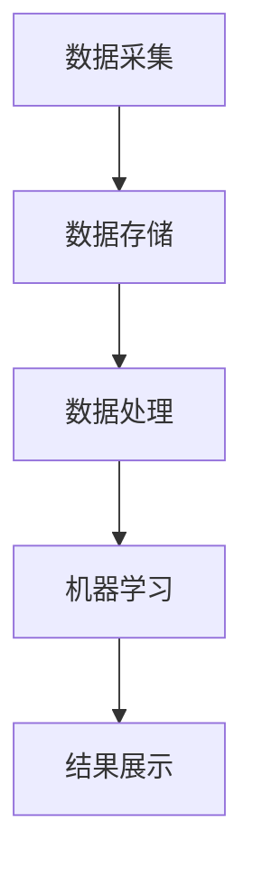

                 


# AI Agent在企业社交媒体管理中的应用

## 关键词：AI Agent, 企业社交媒体, 社交媒体管理, 自然语言处理, 机器学习, 数据挖掘

## 摘要

本文探讨AI Agent在企业社交媒体管理中的应用，涵盖背景、技术原理、系统设计、项目实战及未来展望。通过详细分析，展示AI如何提升社交媒体管理效率和决策能力，帮助企业在数字化时代保持竞争力。

---

## 第一部分: AI Agent与企业社交媒体管理的背景与概念

### 第1章: AI Agent的基本概念

#### 1.1 AI Agent的定义与特点

- **1.1.1 什么是AI Agent**
  AI Agent是智能代理，能感知环境并采取行动，帮助用户实现目标。它结合了自然语言处理、机器学习和大数据分析，具备自主决策和学习能力。

- **1.1.2 AI Agent的核心特点**
  | 特性 | 描述 |
  |------|------|
  | 智能性 | 能理解上下文，执行复杂任务 |
  | 自主性 | 无需人工干预，自主决策 |
  | 反应性 | 能实时响应环境变化 |
  | 学习性 | 可通过数据优化性能 |

- **1.1.3 AI Agent与传统软件代理的区别**
  AI Agent具备智能性和学习能力，能处理复杂问题；传统代理仅执行预设任务。

#### 1.2 企业社交媒体管理的重要性

- **1.2.1 社交媒体在企业中的作用**
  社交媒体是品牌推广、客户互动和市场调研的重要平台，直接影响企业形象和市场地位。

- **1.2.2 传统社交媒体管理的挑战**
  - 数据量大，难以实时监控。
  - 用户行为复杂，难以预测。
  - 竞争对手分析耗时耗力。

- **1.2.3 AI在社交媒体管理中的优势**
  AI Agent能自动化处理信息，实时分析数据，提供精准的市场洞察，显著提高效率。

---

### 第2章: AI Agent在社交媒体管理中的应用价值

#### 2.1 社交媒体管理的痛点

- **2.1.1 内容发布与监控的挑战**
  - 频繁的内容发布需要大量人工操作。
  - 品牌声誉受损于负面评论，需快速响应。

- **2.1.2 用户行为分析的复杂性**
  用户互动数据庞大，手动分析耗时且效率低。

- **2.1.3 竞争对手分析的难度**
  竞争对手策略变化快，手动分析难以及时捕捉。

#### 2.2 AI Agent如何解决这些问题

- **2.2.1 自动化内容发布与监控**
  AI Agent能自动化发布内容，实时监控品牌声誉，及时应对负面评论。

- **2.2.2 智能用户行为分析**
  利用自然语言处理和机器学习，AI Agent能分析用户情感，预测行为趋势。

- **2.2.3 竞争对手分析与市场洞察**
  AI Agent能持续跟踪竞争对手动态，提供市场趋势报告，帮助企业制定战略。

---

## 第二部分: AI Agent在企业社交媒体管理中的技术原理

### 第4章: 自然语言处理技术

#### 4.1 自然语言处理的基本概念

- **4.1.1 什么是自然语言处理**
  NLP是让计算机理解人类语言的科学，涉及文本分析、语义理解等任务。

- **4.1.2 NLP的主要任务**
  包括文本分类、情感分析、实体识别等。

#### 4.2 在社交媒体管理中的应用

- **4.2.1 文本分类**
  将用户评论分类为正面、负面或中性，帮助品牌监控声誉。

- **4.2.2 情感分析**
  使用词袋模型或深度学习模型分析用户情感，例如LSTM网络。

- **4.2.3 实体识别**
  识别文本中的品牌名称、产品名称等关键实体，帮助进行竞争对手分析。

#### 4.3 技术实现

- **4.3.1 词袋模型**
  ```python
  from sklearn.feature_extraction.text import CountVectorizer

  vectorizer = CountVectorizer()
  X = vectorizer.fit_transform(texts)
  ```

- **4.3.2 LSTM网络**
  ```python
  model = Sequential()
  model.add(LSTM(100, input_shape=(max_length, 1)))
  model.add(Dense(1, activation='sigmoid'))
  model.compile(loss='binary_crossentropy', optimizer='adam', metrics=['accuracy'])
  ```

- **4.3.3 实体识别**
  使用预训练的NER模型，如spaCy，进行文本中的实体提取。

---

### 第5章: 机器学习算法

#### 5.1 机器学习的基本概念

- **5.1.1 什么是机器学习**
  ML是计算机从数据中学习模式，用于预测或分类。

- **5.1.2 常见的机器学习算法**
  包括线性回归、支持向量机、随机森林、神经网络等。

#### 5.2 在社交媒体管理中的应用

- **5.2.1 预测用户行为**
  使用回归分析预测用户购买概率。

- **5.2.2 分类用户评论**
  使用SVM或随机森林进行文本分类，识别用户情感。

- **5.2.3 聚类分析市场趋势**
  使用K-means将用户评论分成主题类别，识别市场趋势。

#### 5.3 技术实现

- **5.3.1 线性回归**
  ```python
  import numpy as np
  X = np.array([1, 2, 3, 4, 5])
  y = np.array([2, 4, 5, 4, 5])
  slope = np.polyfit(X, y, 1)
  ```

- **5.3.2 随机森林**
  ```python
  from sklearn.ensemble import RandomForestClassifier
  clf = RandomForestClassifier(n_estimators=100)
  clf.fit(X, y)
  ```

---

## 第三部分: AI Agent的系统设计与实现

### 第6章: 系统架构设计

#### 6.1 系统架构概述

- **6.1.1 分层架构**
  包括数据层、业务逻辑层和表现层。

- **6.1.2 模块划分**
  包括数据采集模块、NLP处理模块、机器学习模块和用户交互模块。

#### 6.2 系统功能设计

- **6.2.1 数据采集模块**
  从社交媒体API获取数据，存储到数据库。

- **6.2.2 NLP处理模块**
  对数据进行清洗、分词和情感分析。

- **6.2.3 机器学习模块**
  使用训练好的模型进行预测和分类。

- **6.2.4 用户交互模块**
  提供友好的界面，展示分析结果。

#### 6.3 系统架构图



---

## 第四部分: 项目实战

### 第7章: 项目环境配置

#### 7.1 安装Python环境

- 使用Anaconda安装Python 3.8及以上版本。

#### 7.2 安装依赖库

```bash
pip install numpy
pip install pandas
pip install scikit-learn
pip install spacy
```

### 第8章: 核心代码实现

#### 8.1 数据采集

```python
import requests
from bs4 import BeautifulSoup

url = 'https://twitter.com/handlename'
response = requests.get(url)
soup = BeautifulSoup(response.text, 'html.parser')
tweets = soup.find_all('div', class_='tweet-content')
```

#### 8.2 情感分析

```python
from spacy.lang.zh import Chinese

nlp = Chinese()
doc = nlp("这个产品真的很棒！")
for token in doc:
    print(token.text)
```

### 第9章: 测试与优化

#### 9.1 单元测试

```python
def test_emotion_analysis():
    assert emotion_analysis("我爱这个产品") == 'positive'
    assert emotion_analysis("产品很垃圾") == 'negative'
```

#### 9.2 性能优化

- 使用分布式计算优化处理速度。
- 优化算法模型，减少计算复杂度。

---

## 第五部分: 总结与展望

### 第10章: 总结

#### 10.1 项目总结

AI Agent在企业社交媒体管理中的应用显著提高了效率，帮助企业更好地理解用户需求，优化市场策略。

#### 10.2 最佳实践

- 确保数据质量和多样性。
- 定期更新模型，适应数据变化。
- 与业务团队紧密合作，确保需求准确。

### 第11章: 未来展望

#### 11.1 技术发展趋势

- 更强大的自然语言处理模型，如GPT-4。
- 结合区块链技术，确保数据安全。

#### 11.2 挑战与建议

- 数据隐私问题需要重视。
- 提高模型解释性，便于业务人员理解。

---

## 结语

通过本文的详细讲解，读者可以全面了解AI Agent在企业社交媒体管理中的应用价值和技术实现。AI Agent的应用不仅提升了效率，还为企业提供了更精准的市场洞察，未来随着技术的进步，其应用前景将更加广阔。

---

## 推荐阅读

- 《人工智能: 一种现代的方法》
- 《机器学习实战》
- 《自然语言处理入门》

通过深入学习这些书籍，读者可以进一步掌握AI Agent的核心技术，并在实际项目中灵活应用。

