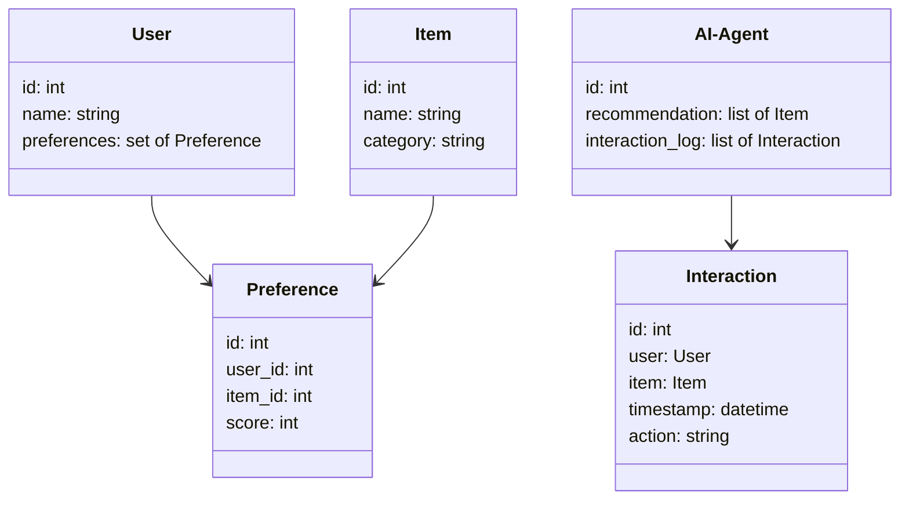
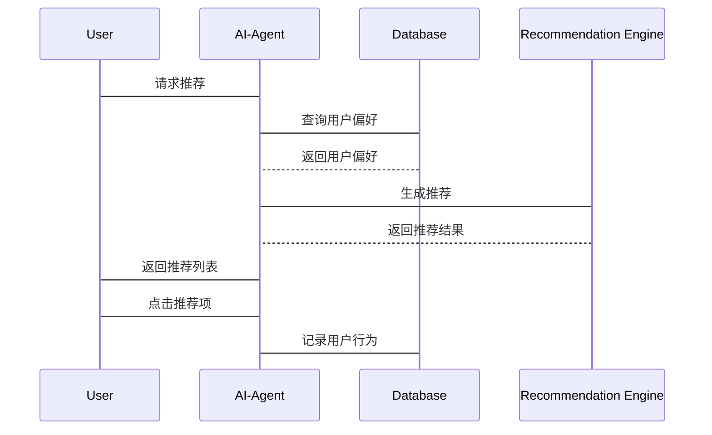

                 


# AI Agent在企业精准营销与个性化推荐中的应用

## 关键词：AI Agent, 精准营销, 个性化推荐, 机器学习, 数据驱动, 用户画像

## 摘要：
随着人工智能技术的快速发展，AI Agent（人工智能代理）在企业精准营销和个性化推荐中的应用越来越广泛。本文将深入探讨AI Agent的核心概念、技术原理及其在精准营销中的应用价值。通过分析不同推荐算法的优缺点，结合实际案例，展示如何利用AI Agent提升企业的营销效率和客户满意度。文章还将详细讲解系统架构设计、项目实战以及最佳实践，帮助读者全面掌握AI Agent在企业营销中的应用。

---

# 第1章: AI Agent与精准营销概述

## 1.1 AI Agent的基本概念
### 1.1.1 AI Agent的定义与特点
AI Agent（人工智能代理）是一种能够感知环境并采取行动以实现目标的智能系统。它具备以下几个核心特点：
- **自主性**：能够自主决策，无需人工干预。
- **反应性**：能够实时感知环境变化并做出响应。
- **目标导向**：以特定目标为导向，优化行动策略。
- **学习能力**：通过数据学习和优化，提升性能。

### 1.1.2 AI Agent在精准营销中的应用
精准营销的目标是通过分析用户行为和偏好，提供个性化的服务和产品。AI Agent在其中扮演着关键角色：
- **用户画像构建**：通过收集和分析用户数据，构建详细的用户画像。
- **实时互动**：通过实时分析用户行为，提供即时的个性化推荐。
- **动态优化**：根据用户反馈和市场变化，动态调整推荐策略。

### 1.1.3 AI Agent与传统营销的对比
与传统营销相比，AI Agent的优势在于其数据驱动和智能化。传统营销依赖人工经验，而AI Agent能够通过大数据分析和机器学习，实现更精准的用户定位和推荐。

## 1.2 精准营销的背景与挑战
### 1.2.1 精准营销的定义与目标
精准营销是指通过分析用户数据，识别用户需求，提供个性化的产品和服务，从而提高营销效率和客户满意度。

### 1.2.2 传统营销模式的局限性
传统营销模式存在以下问题：
- **用户定位不精准**：无法有效区分不同用户的需求。
- **营销成本高**：资源浪费在无关用户上。
- **效率低下**：缺乏数据支持，难以优化营销策略。

### 1.2.3 数据驱动营销的必要性
数据驱动营销通过收集和分析用户数据，帮助企业在营销过程中做出更科学的决策。AI Agent的应用使得数据驱动营销更加高效和精准。

## 1.3 AI Agent在精准营销中的应用前景
### 1.3.1 提升营销效率
AI Agent能够通过自动化分析和推荐，显著提高营销效率。例如，通过用户画像和行为分析，AI Agent可以快速识别高价值用户，制定针对性的营销策略。

### 1.3.2 个性化推荐的核心作用
个性化推荐是精准营销的核心，AI Agent通过分析用户的偏好和行为，提供个性化的产品和服务推荐，从而提高用户满意度和忠诚度。

### 1.3.3 未来趋势与发展方向
随着AI技术的不断进步，AI Agent在精准营销中的应用将更加广泛和深入。未来的趋势包括：
- 更加智能化的推荐算法。
- 更加个性化的用户体验。
- 更加实时的互动和反馈。

## 1.4 本章小结
本章介绍了AI Agent的基本概念及其在精准营销中的应用价值。通过对比传统营销和数据驱动营销，强调了AI Agent在提高营销效率和客户满意度方面的优势。

---

# 第2章: AI Agent的核心概念与技术原理

## 2.1 AI Agent的核心概念
### 2.1.1 用户与AI Agent的关系
用户是AI Agent的核心服务对象。AI Agent通过分析用户的行为和偏好，提供个性化的服务和推荐。

### 2.1.2 数据源与AI Agent的关系
数据源是AI Agent工作的基础。通过收集和分析用户数据，AI Agent能够构建用户画像，并生成推荐结果。

### 2.1.3 推荐系统与AI Agent的关系
推荐系统是AI Agent的重要组成部分。AI Agent通过推荐系统，将个性化推荐结果呈现给用户。

## 2.2 AI Agent的属性特征对比
### 2.2.1 不同推荐算法的特征对比
以下是几种常见推荐算法的特征对比：

| 算法类型       | 特征                                   |
|----------------|----------------------------------------|
| 协同过滤       | 基于用户相似性或物品相似性进行推荐     |
| 基于内容的推荐 | 基于物品的属性特征进行推荐             |
| 深度学习推荐     | 基于神经网络模型，能够捕捉复杂特征     |
| 时间序列推荐   | 基于时间因素，预测未来趋势             |

### 2.2.2 AI Agent的性能指标分析
AI Agent的性能指标包括：
- **准确率**：推荐结果与用户实际需求的匹配程度。
- **召回率**：推荐结果中包含用户感兴趣内容的比例。
- **响应时间**：推荐系统处理请求的时延。

### 2.2.3 算法的可扩展性与实时性对比
以下是几种推荐算法的可扩展性和实时性对比：

| 算法类型       | 可扩展性 | 实时性   |
|----------------|----------|----------|
| 协同过滤       | 中等      | 较低     |
| 基于内容的推荐 | 高       | 中等     |
| 深度学习推荐     | 高       | 较低     |
| 时间序列推荐   | 中等      | 高       |

## 2.3 AI Agent的ER实体关系图
以下是AI Agent的ER实体关系图：

```mermaid
er
    User {
        id: int
        name: string
        preferences: set of Preference
    }
    Item {
        id: int
        name: string
        category: string
    }
    Preference {
        id: int
        user_id: int
        item_id: int
        score: int
    }
    AI-Agent {
        id: int
        recommendation: list of Item
        interaction_log: list of Interaction
    }
    Interaction {
        id: int
        user: User
        item: Item
        timestamp: datetime
        action: string
    }
```

---

# 第3章: AI Agent的算法原理与实现

## 3.1 协同过滤算法
### 3.1.1 协同过滤的原理
协同过滤是一种基于用户相似性或物品相似性进行推荐的算法。其核心思想是：如果用户A和用户B的行为相似，则用户A喜欢的物品，用户B也可能喜欢。

### 3.1.2 协同过滤的实现步骤
1. **数据预处理**：收集用户行为数据，构建用户-物品评分矩阵。
2. **相似度计算**：计算用户之间的相似度或物品之间的相似度。
3. **推荐生成**：基于相似度计算，生成推荐结果。

### 3.1.3 协同过滤的数学模型
协同过滤的数学模型可以表示为：

$$
similarity(u, v) = \frac{\sum_{i \in I}{(r_{u,i} - \bar{r}_u)(r_{v,i} - \bar{r}_v)}}{\sqrt{\sum_{i \in I}{(r_{u,i} - \bar{r}_u)^2}} \cdot \sqrt{\sum_{i \in I}{(r_{v,i} - \bar{r}_v)^2}}}
$$

其中：
- \( u \) 和 \( v \) 表示两个用户。
- \( r_{u,i} \) 表示用户 \( u \) 对物品 \( i \) 的评分。
- \( \bar{r}_u \) 表示用户 \( u \) 的平均评分。

## 3.2 基于内容的推荐算法
### 3.2.1 基于内容的推荐原理
基于内容的推荐算法通过分析物品的属性特征，生成推荐结果。其核心思想是：如果用户喜欢某个物品，那么他可能也喜欢具有相似属性的其他物品。

### 3.2.2 基于内容的推荐实现步骤
1. **物品特征提取**：提取物品的特征向量。
2. **相似度计算**：计算目标物品与其他物品的相似度。
3. **推荐生成**：基于相似度计算，生成推荐结果。

### 3.2.3 基于内容的推荐数学模型
基于内容的推荐数学模型可以表示为：

$$
similarity(i, j) = \frac{\sum_{k=1}^{n}{w_k \cdot (f_{i,k} - f_{j,k})^2}}{\sqrt{\sum_{k=1}^{n}{w_k \cdot (f_{i,k} - \bar{f}_k)^2}} \cdot \sqrt{\sum_{k=1}^{n}{w_k \cdot (f_{j,k} - \bar{f}_k)^2}}}
$$

其中：
- \( i \) 和 \( j \) 表示两个物品。
- \( f_{i,k} \) 表示物品 \( i \) 的第 \( k \) 个特征值。
- \( \bar{f}_k \) 表示第 \( k \) 个特征的平均值。
- \( w_k \) 表示第 \( k \) 个特征的权重。

## 3.3 深度学习推荐算法
### 3.3.1 深度学习推荐原理
深度学习推荐算法通过构建神经网络模型，从海量数据中学习用户的偏好和物品的特征，生成推荐结果。

### 3.3.2 深度学习推荐实现步骤
1. **数据预处理**：对原始数据进行清洗和特征提取。
2. **模型训练**：构建神经网络模型，训练数据，优化模型参数。
3. **推荐生成**：基于训练好的模型，生成推荐结果。

### 3.3.3 深度学习推荐数学模型
深度学习推荐的数学模型可以表示为：

$$
p(y = 1 | x) = \sigma(w x + b)
$$

其中：
- \( x \) 表示输入特征向量。
- \( w \) 表示权重参数。
- \( b \) 表示偏置项。
- \( \sigma \) 表示sigmoid函数。

---

# 第4章: AI Agent的系统架构设计

## 4.1 系统功能设计
### 4.1.1 领域模型设计
以下是领域模型设计图：



### 4.1.2 系统架构设计
以下是系统架构设计图：


## 4.2 接口设计
### 4.2.1 API接口定义
以下是API接口定义：

```http
GET /recommendations?user_id=123
POST /interactions
PUT /preferences
```

## 4.3 交互流程
以下是交互流程图：



---

# 第5章: 项目实战与案例分析

## 5.1 电商推荐系统实战
### 5.1.1 环境安装
以下是环境安装步骤：

```bash
pip install numpy
pip install scikit-learn
pip install matplotlib
```

### 5.1.2 核心代码实现
以下是协同过滤算法的Python实现：

```python
from sklearn.metrics.pairwise import cosine_similarity

# 数据准备
user_item_matrix = ...  # 用户-物品评分矩阵

# 计算相似度
similarity_matrix = cosine_similarity(user_item_matrix)

# 生成推荐
def get_recommendations(user_id, similarity_matrix):
    # 获取用户对应的相似度向量
    user_similarities = similarity_matrix[user_id]
    # 找到相似度最高的用户
    top_k_indices = user_similarities.argsort()[::-1][:5]
    return top_k_indices
```

### 5.1.3 代码解读与分析
上述代码实现了一个简单的协同过滤算法。通过计算用户之间的相似度，找到与目标用户相似度最高的前几个用户，生成推荐结果。

### 5.1.4 实际案例分析
以电商推荐系统为例，假设用户A喜欢购买电子产品，AI Agent会基于协同过滤算法，找到与用户A相似的其他用户，推荐他们喜欢的其他电子产品。

---

# 第6章: 最佳实践与注意事项

## 6.1 小结
本章通过实际案例展示了AI Agent在精准营销中的应用价值。通过项目实战，读者可以更好地理解AI Agent的核心技术及其在实际应用中的优势。

## 6.2 注意事项
在实际应用中，需要注意以下几点：
- **数据隐私**：确保用户数据的安全和隐私。
- **算法优化**：不断优化推荐算法，提高推荐准确率和响应速度。
- **用户体验**：注重用户体验，避免推荐结果过于泛泛。

## 6.3 拓展阅读
建议读者进一步阅读以下内容：
- 《推荐系统导论》
- 《机器学习实战》
- 《深度学习推荐系统》

---

# 第7章: 总结与展望

## 7.1 总结
本文深入探讨了AI Agent在企业精准营销与个性化推荐中的应用。通过分析不同推荐算法的优缺点，结合实际案例，展示了AI Agent在提高营销效率和客户满意度方面的巨大潜力。

## 7.2 展望
随着AI技术的不断发展，AI Agent在精准营销中的应用将更加广泛和深入。未来的趋势包括：
- 更加智能化的推荐算法。
- 更加个性化的用户体验。
- 更加实时的互动和反馈。

---

# 附录

## 附录A: 推荐算法对比表
以下是几种推荐算法的对比表：

| 算法类型       | 优缺点 | 适用场景 |
|----------------|--------|----------|
| 协同过滤       | 优：简单易懂；劣：计算量大 | 用户数量较少的场景 |
| 基于内容的推荐 | 优：推荐结果个性化；劣：需要大量特征数据 | 物品属性丰富的场景 |
| 深度学习推荐     | 优：推荐结果精准；劣：计算资源消耗大 | 用户和物品数量庞大的场景 |

---

通过以上内容，读者可以全面了解AI Agent在企业精准营销与个性化推荐中的应用，并能够将其应用于实际项目中，提升企业的营销效率和客户满意度。

