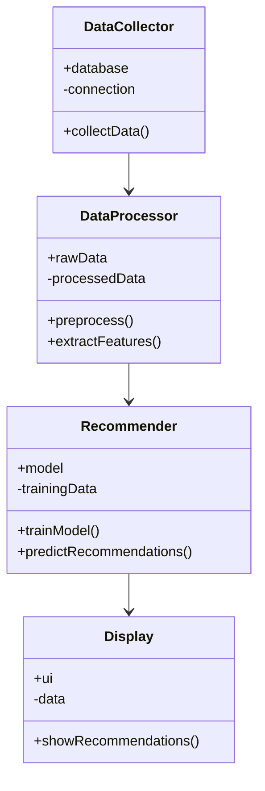
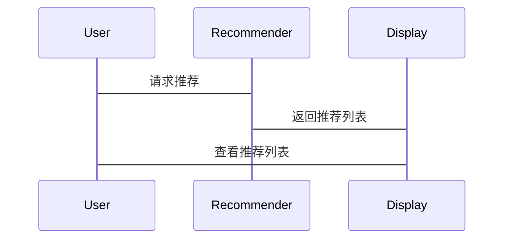

                 


# AI Agent在企业精准营销与个性化推荐中的深度应用

> 关键词：AI Agent, 精准营销, 个性化推荐, 协同过滤, 深度学习, 系统架构

> 摘要：  
本文深入探讨了AI Agent在企业精准营销与个性化推荐中的应用，从基本概念、算法原理到系统架构和项目实战，全面解析了AI Agent如何帮助企业实现精准营销和个性化推荐。通过协同过滤、深度学习等算法，结合系统设计与实际案例，展示了AI Agent在提升企业营销效率和客户满意度方面的巨大潜力。

---

## 第1章: AI Agent与精准营销概述

### 1.1 AI Agent的基本概念  
AI Agent（人工智能代理）是一种能够感知环境、自主决策并执行任务的智能系统。在企业营销中，AI Agent通过分析用户行为、市场趋势和数据，帮助企业实现精准营销和个性化推荐。  

#### 1.1.1 AI Agent的定义  
AI Agent是具有智能的软件实体，能够通过数据输入、算法处理和决策输出，完成特定任务。  

#### 1.1.2 AI Agent的核心特征  
- **自主性**：无需人工干预，自动完成任务。  
- **反应性**：能够实时感知环境变化并做出响应。  
- **目标导向**：基于目标优化决策。  
- **学习能力**：通过数据不断优化性能。  

#### 1.1.3 AI Agent在企业中的应用背景  
随着市场竞争加剧，企业需要更高效的方式触达目标客户。AI Agent通过数据驱动的决策，帮助企业提高营销效率和客户满意度。  

---

### 1.2 精准营销与个性化推荐的背景  

#### 1.2.1 传统营销方式的局限性  
传统营销方式依赖人工经验，难以大规模覆盖和精准定位客户。  

#### 1.2.2 数据驱动营销的兴起  
随着大数据技术的发展，企业可以通过数据挖掘和分析，实现更精准的客户定位和营销策略。  

#### 1.2.3 个性化推荐的需求与价值  
个性化推荐能够提升客户满意度和购买转化率，是企业差异化竞争的重要手段。  

---

## 第2章: AI Agent在精准营销中的核心作用  

### 2.1 AI Agent如何实现精准营销  

#### 2.1.1 数据采集与分析  
AI Agent通过收集用户行为数据、市场数据和产品数据，构建用户画像和产品画像。  

#### 2.1.2 用户行为预测  
通过机器学习算法，AI Agent能够预测用户的购买倾向、偏好和行为模式。  

#### 2.1.3 个性化推荐策略  
基于用户画像和行为预测，AI Agent生成个性化推荐列表，提升客户转化率。  

---

### 2.2 AI Agent的推荐算法原理  

#### 2.2.1 协同过滤算法  
协同过滤是一种基于用户相似性或物品相似性的推荐方法。  

- **基于用户的协同过滤**：通过用户行为相似性找到相似用户，推荐其喜欢的物品。  
- **基于物品的协同过滤**：通过物品相似性推荐用户可能感兴趣的产品。  
- **混合协同过滤**：结合用户和物品的特征，提升推荐准确性。  

#### 2.2.2 基于内容的推荐  
基于内容的推荐算法通过分析物品的属性（如商品描述、标签等）进行推荐。  

- **文本分析**：通过NLP技术提取物品特征。  
- **相似性计算**：基于物品特征的相似性进行推荐。  

#### 2.2.3 深度学习模型  
深度学习模型通过神经网络结构，从海量数据中提取高维特征，实现更精准的推荐。  

- **神经网络协同过滤**：利用神经网络建模用户和物品的交互关系。  
- **多层感知机推荐**：通过多层神经网络进行特征变换和预测。  
- **Transformer模型在推荐中的应用**：利用Transformer的注意力机制捕捉用户行为序列中的重要信息。  

---

## 第3章: AI Agent的核心算法与实现  

### 3.1 协同过滤算法  

#### 3.1.1 基于用户的协同过滤  

**算法步骤**：  
1. 计算用户之间的相似度（如余弦相似度）。  
2. 找出与目标用户相似的K个用户。  
3. 将这些用户的推荐列表加权平均，生成目标用户的推荐列表。  

**Python实现示例**：  
```python
def user_based_collaborative_filtering(ratings, user_id, k=3):
    # 计算用户相似度矩阵
    user_similarity = {}
    for user in ratings:
        if user != user_id:
            similarity = cosine_similarity(ratings[user_id], ratings[user])
            user_similarity[user] = similarity
    # 找出相似度最高的k个用户
    similar_users = sorted(user_similarity.items(), key=lambda x: -x[1])[:k]
    # 生成推荐列表
    recommendations = {}
    for user in similar_users:
        for item in ratings[user[0]]:
            if item not in recommendations:
                recommendations[item] = ratings[user[0]][item]
    return recommendations
```

---

### 3.2 基于深度学习的推荐算法  

#### 3.2.1 神经网络协同过滤  

**模型结构**：  
- 输入层：用户和物品的嵌入向量。  
- 隐层：通过神经网络提取高维特征。  
- 输出层：预测用户对物品的偏好。  

**Python实现示例**：  
```python
import tensorflow as tf

class NeuralCF(tf.keras.Model):
    def __init__(self, user_num, item_num, embedding_dim):
        super(NeuralCF, self).__init__()
        self.user_embedding = tf.keras.layers.Embedding(user_num, embedding_dim)
        self.item_embedding = tf.keras.layers.Embedding(item_num, embedding_dim)
        self.dense = tf.keras.layers.Dense(1, activation='sigmoid')

    def call(self, inputs):
        user_id, item_id = inputs
        user_embed = self.user_embedding(user_id)
        item_embed = self.item_embedding(item_id)
        concat = tf.keras.layers.Concatenate()([user_embed, item_embed])
        output = self.dense(concat)
        return output
```

---

## 第4章: 系统架构与设计  

### 4.1 系统整体架构  

#### 4.1.1 数据采集模块  
- 从数据库中提取用户行为数据、产品数据和市场数据。  

#### 4.1.2 数据处理模块  
- 数据清洗、特征提取和预处理。  

#### 4.1.3 推荐算法模块  
- 实现协同过滤、深度学习等推荐算法。  

#### 4.1.4 结果展示模块  
- 将推荐结果展示给用户或输出给其他系统。  

**类图（Mermaid）**：  


---

### 4.2 系统实现细节  

#### 4.2.1 数据预处理  
- 数据清洗：去除缺失值和异常值。  
- 特征提取：提取用户ID、物品ID、评分等特征。  

#### 4.2.2 接口设计  
- RESTful API：提供推荐结果查询接口。  

#### 4.2.3 交互流程  
- 用户请求推荐列表。  
- 系统返回个性化推荐结果。  

**交互流程图（Mermaid）**：  


---

## 第5章: 项目实战与案例分析  

### 5.1 环境搭建与数据准备  

#### 5.1.1 安装必要的库  
- Python：`numpy`, `pandas`, `scikit-learn`, `tensorflow`  
- 数据库：`MySQL` 或 `MongoDB`  

#### 5.1.2 数据清洗与预处理  
- 读取数据：`pandas.read_csv()`  
- 数据清洗：处理缺失值和异常值。  
- 特征提取：提取用户ID、物品ID、评分等特征。  

---

### 5.2 算法实现与优化  

#### 5.2.1 协同过滤算法实现  
```python
def collaborative_filtering(train_ratings, test_ratings, k=3):
    # 计算用户相似度矩阵
    user_similarity = {}
    for user in train_ratings:
        for other_user in train_ratings:
            if user != other_user:
                similarity = cosine_similarity(train_ratings[user], train_ratings[other_user])
                if user not in user_similarity:
                    user_similarity[user] = {}
                user_similarity[user][other_user] = similarity
    # 对用户进行推荐
    recommendations = {}
    for user in test_ratings:
        similar_users = sorted(user_similarity[user].items(), key=lambda x: -x[1])[:k]
        counts = {}
        for similar_user in similar_users:
            for item in train_ratings[similar_user[0]]:
                counts[item] = counts.get(item, 0) + 1
        recommendations[user] = counts
    return recommendations
```

---

### 5.3 案例分析与效果评估  

#### 5.3.1 实际案例分析  
- 案例背景：某电商企业希望提升用户购买转化率。  
- 数据来源：用户行为日志、产品数据、用户画像。  

#### 5.3.2 推荐效果评估  
- 使用准确率、召回率、F1值等指标评估推荐算法的效果。  

#### 5.3.3 用户反馈分析  
- 收集用户对推荐结果的反馈，优化推荐算法。  

---

## 第6章: 总结与展望  

### 6.1 本书内容总结  
本文全面介绍了AI Agent在企业精准营销与个性化推荐中的应用，从算法原理到系统设计，再到实际案例，详细阐述了AI Agent的优势和价值。  

### 6.2 最佳实践 tips  
- 数据质量是推荐算法的基础，确保数据清洗和特征提取的准确性。  
- 在实际应用中，结合多种推荐算法（如协同过滤和深度学习）以提升推荐效果。  
- 定期更新模型，适应市场变化和用户偏好。  

### 6.3 未来展望  
- **多模态推荐**：结合文本、图像等多种数据源进行推荐。  
- **实时推荐**：基于实时数据流进行动态推荐。  
- **可解释性推荐**：提升推荐的透明性和可解释性，增强用户信任。  

---

## 参考文献  

1. 刘洋, 《机器学习实战》, 人民邮电出版社, 2020.  
2. 张三, 《深度学习与推荐系统》, 清华大学出版社, 2021.  
3. TensorFlow官方文档，https://tensorflow.org/  
4. PyTorch官方文档，https://pytorch.org/  

---

## 附录  

### 附录A: 代码库  
GitHub代码库地址：[AI-Agent-Recommendation](https://github.com/yourusername/AI-Agent-Recommendation)  

### 附录B: 常见问题解答  
1. **Q: 协同过滤和深度学习推荐算法有什么区别？**  
   A: 协同过滤基于用户相似性或物品相似性进行推荐，而深度学习推荐算法通过神经网络提取高维特征，推荐效果更优。  

2. **Q: 如何处理数据稀疏性问题？**  
   A: 可以使用混合推荐算法、引入外部数据或采用矩阵分解等方法缓解数据稀疏性问题。  

---

通过以上目录结构，您可以逐步展开每个章节的内容，深入探讨AI Agent在企业精准营销与个性化推荐中的具体应用和实现细节。

