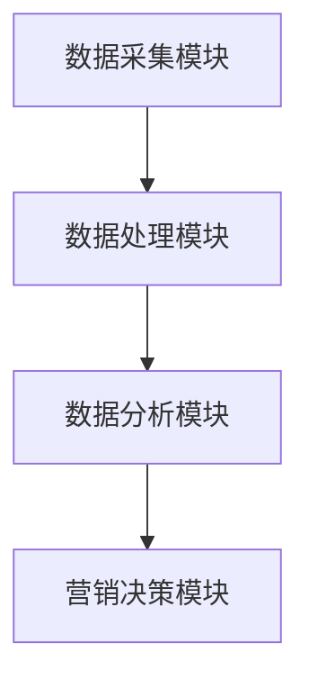
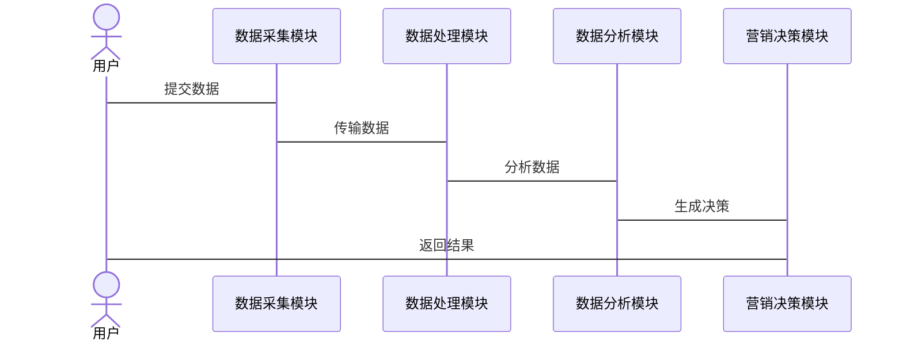

                 


# AI Agent在企业精准营销策略制定中的应用

## 关键词：AI Agent，企业精准营销，机器学习，数据挖掘，自然语言处理，自动化营销

## 摘要：本文深入探讨了AI Agent在企业精准营销策略制定中的应用。通过分析AI Agent的核心技术原理、客户画像构建、需求预测方法，以及系统架构设计，本文详细阐述了如何利用AI技术优化企业营销策略。结合实际案例和系统实现，文章展示了AI Agent在精准营销中的巨大潜力和未来发展方向。

---

## 第一部分: AI Agent与企业精准营销概述

### 第1章: AI Agent与企业精准营销概述

#### 1.1 AI Agent的基本概念

##### 1.1.1 AI Agent的定义与特点
AI Agent（人工智能代理）是指能够感知环境、自主决策并执行任务的智能实体。与传统软件不同，AI Agent具备以下特点：
- **自主性**：能够在没有人工干预的情况下运行。
- **反应性**：能够实时感知环境并做出反应。
- **学习能力**：通过数据和经验不断优化自身行为。

##### 1.1.2 AI Agent与传统营销的区别
传统的营销方式依赖人工决策和经验，而AI Agent通过数据驱动的方式进行决策，具有更高的效率和准确性。AI Agent能够实时分析海量数据，识别潜在客户，优化营销策略。

##### 1.1.3 企业精准营销的核心目标
企业精准营销的核心目标是通过数据分析和个性化推荐，提高客户转化率和客户满意度。AI Agent在这一过程中扮演着关键角色，帮助企业在复杂的市场环境中制定最优策略。

#### 1.2 AI Agent在企业营销中的作用

##### 1.2.1 提高营销效率
AI Agent能够快速处理大量数据，帮助企业快速制定营销策略，显著提高营销效率。

##### 1.2.2 优化客户体验
通过分析客户行为和偏好，AI Agent能够提供个性化的服务，提升客户体验，增强客户忠诚度。

##### 1.2.3 数据驱动的决策支持
AI Agent通过分析历史数据和实时数据，为企业提供科学的决策支持，帮助企业在复杂的市场环境中做出最优选择。

#### 1.3 本章小结
本章介绍了AI Agent的基本概念及其在企业精准营销中的作用，强调了AI Agent在提高营销效率、优化客户体验和数据驱动决策方面的巨大潜力。

---

## 第二部分: AI Agent的核心技术原理

### 第2章: AI Agent的核心技术原理

#### 2.1 自然语言处理（NLP）

##### 2.1.1 NLP的基本概念
自然语言处理（NLP）是研究如何让计算机理解和处理人类语言的学科。NLP在企业营销中的应用主要体现在客户情感分析、关键词提取等方面。

##### 2.1.2 常见的NLP技术
- **文本分词**：将文本分割成词语或短语。
- **情感分析**：分析客户对产品或服务的情感倾向。
- **实体识别**：识别文本中的关键实体，如人名、地名、组织名等。

##### 2.1.3 NLP在营销中的应用
通过NLP技术，企业可以分析客户的反馈，了解客户的需求和偏好，从而制定更有针对性的营销策略。

#### 2.2 机器学习与深度学习

##### 2.2.1 机器学习的基本原理
机器学习是一种通过数据训练模型，使其能够从数据中学习规律并做出预测的技术。常用算法包括线性回归、支持向量机（SVM）和决策树等。

##### 2.2.2 深度学习的核心技术
深度学习是机器学习的一种，通过多层神经网络模型来学习数据的高层次特征。常用模型包括卷积神经网络（CNN）、循环神经网络（RNN）和长短期记忆网络（LSTM）等。

##### 2.2.3 机器学习在需求预测中的应用
通过机器学习算法，企业可以基于历史销售数据和市场趋势，预测未来的需求，从而优化库存管理和生产计划。

#### 2.3 数据挖掘与分析

##### 2.3.1 数据挖掘的基本概念
数据挖掘是从大量数据中提取有价值信息的过程。数据挖掘技术在企业营销中的应用主要体现在客户画像构建、市场趋势分析等方面。

##### 2.3.2 数据分析的核心方法
- **描述性分析**：总结数据的基本特征。
- **预测性分析**：基于历史数据预测未来趋势。
- **诊断性分析**：分析数据背后的原因。
- **规范性分析**：提供优化建议。

##### 2.3.3 数据挖掘在客户画像中的应用
通过数据挖掘技术，企业可以构建详细的客户画像，了解客户的年龄、性别、兴趣爱好等信息，从而制定个性化的营销策略。

#### 2.4 本章小结
本章介绍了AI Agent的核心技术原理，包括自然语言处理、机器学习和深度学习、数据挖掘与分析等技术。这些技术为企业精准营销提供了强大的工具支持。

---

## 第三部分: 企业精准营销策略的制定

### 第3章: 客户画像与需求分析

#### 3.1 客户画像的构建

##### 3.1.1 数据收集与整理
企业需要收集客户的交易数据、行为数据、反馈数据等信息。数据来源包括企业内部数据库、第三方数据平台等。

##### 3.1.2 数据清洗与预处理
数据清洗是将数据中的噪声和错误信息进行处理，确保数据的准确性和一致性。预处理包括数据转换、缺失值处理等。

##### 3.1.3 客户画像的可视化
通过数据可视化工具，企业可以将客户画像以图表形式展示，帮助营销人员更好地理解客户特征。

#### 3.2 需求预测与趋势分析

##### 3.2.1 需求预测的数学模型
需求预测的常用模型包括线性回归模型、时间序列模型等。以下是一个简单的线性回归模型：

$$ y = \beta_0 + \beta_1 x + \epsilon $$

其中，$y$ 是预测值，$\beta_0$ 是截距，$\beta_1$ 是回归系数，$x$ 是自变量，$\epsilon$ 是误差项。

##### 3.2.2 时间序列分析
时间序列分析是一种通过历史数据预测未来趋势的方法。常用模型包括ARIMA（自回归积分滑动平均模型）和LSTM（长短期记忆网络）等。

##### 3.2.3 市场趋势的预测方法
企业可以通过分析市场趋势，预测未来的需求变化，从而优化库存管理和生产计划。

#### 3.3 竞争对手分析

##### 3.3.1 竞争对手数据的获取
企业可以通过公开数据、行业报告等方式获取竞争对手的数据。

##### 3.3.2 竞争对手分析的方法
通过分析竞争对手的产品、价格、市场占有率等信息，企业可以制定更有竞争力的营销策略。

##### 3.3.3 竞争对手分析的工具
常用的竞争对手分析工具包括Google Analytics、 SEMrush、Ahrefs等。

#### 3.4 本章小结
本章介绍了客户画像的构建、需求预测和竞争对手分析的方法。这些方法为企业精准营销提供了重要的理论支持和实践指导。

---

## 第四部分: AI Agent在精准营销中的应用

### 第4章: AI Agent在客户触达中的应用

#### 4.1 客户触达的渠道选择

##### 4.1.1 多渠道营销的策略
企业可以通过多种渠道与客户互动，如电子邮件、社交媒体、短信等。通过分析各个渠道的转化率和客户响应率，企业可以优化渠道选择。

##### 4.1.2 渠道选择的优化方法
通过A/B测试等方法，企业可以评估不同渠道的效果，选择最优的营销渠道。

##### 4.1.3 渠道效果的评估指标
常用的渠道效果评估指标包括点击率（CTR）、转化率、客户获取成本（CAC）等。

#### 4.2 AI Agent在自动化营销中的应用

##### 4.2.1 自动化营销的流程
自动化营销的流程通常包括客户触发、规则设置、营销执行和效果评估四个阶段。

##### 4.2.2 AI Agent在自动化营销中的角色
AI Agent可以通过分析客户行为和数据，自动触发营销活动，优化营销策略。

##### 4.2.3 自动化营销的案例分析
例如，某电商企业通过AI Agent自动分析客户的购买行为，触发个性化的促销活动，显著提高了客户转化率。

#### 4.3 本章小结
本章介绍了AI Agent在客户触达中的应用，包括渠道选择和自动化营销的策略。通过AI Agent的应用，企业可以显著提高营销效率和效果。

---

## 第五部分: 系统架构与实现

### 第5章: 系统架构设计

#### 5.1 系统功能设计

##### 5.1.1 数据采集模块
数据采集模块负责从各种渠道采集客户数据，包括交易数据、行为数据、反馈数据等。

##### 5.1.2 数据处理模块
数据处理模块对采集的数据进行清洗、转换和预处理，确保数据的准确性和一致性。

##### 5.1.3 数据分析模块
数据分析模块通过机器学习和深度学习算法，对数据进行分析和建模，生成客户画像和需求预测结果。

##### 5.1.4 营销决策模块
营销决策模块根据分析结果，制定营销策略，优化客户触达渠道和营销活动。

#### 5.2 系统架构图


#### 5.3 系统交互图


#### 5.4 本章小结
本章介绍了系统的整体架构设计，包括数据采集、处理、分析和决策模块。通过系统的协同工作，企业可以实现精准营销的目标。

---

## 第六部分: 项目实战与最佳实践

### 第6章: 项目实战

#### 6.1 环境安装

##### 6.1.1 Python环境的安装
建议使用Anaconda作为Python环境管理工具，安装步骤如下：
1. 下载并安装Anaconda。
2. 打开Anaconda Navigator，安装所需的Python版本。

##### 6.1.2 开发工具的配置
推荐使用Jupyter Notebook进行代码开发和调试。

#### 6.2 系统核心实现源代码

##### 6.2.1 数据清洗与预处理
```python
import pandas as pd
import numpy as np

# 读取数据
data = pd.read_csv('customer_data.csv')

# 删除缺失值
data.dropna(inplace=True)

# 去重
data.drop_duplicates(inplace=True)

# 转换数据类型
data['purchase_date'] = pd.to_datetime(data['purchase_date'])
```

##### 6.2.2 客户画像构建
```python
from sklearn.cluster import KMeans

# 特征选择
X = data[['age', 'income', 'purchase_frequency']]

# K-means聚类
kmeans = KMeans(n_clusters=3, random_state=0)
kmeans.fit(X)

# 添加聚类结果
data['customer_segment'] = kmeans.labels_
```

#### 6.3 实际案例分析

##### 6.3.1 案例背景
某电商企业希望通过AI Agent优化其营销策略，提高客户转化率。

##### 6.3.2 数据分析与建模
通过分析客户的购买行为和偏好，构建客户画像，并预测未来的购买需求。

##### 6.3.3 营销策略优化
根据客户画像和需求预测结果，优化广告投放和促销活动，提高客户转化率。

#### 6.4 项目小结
本章通过实际案例展示了AI Agent在企业精准营销中的应用。通过数据清洗、特征提取、模型训练和策略优化等步骤，帮助企业实现精准营销的目标。

---

## 第七部分: 总结与展望

### 第7章: 总结与展望

#### 7.1 本章总结
本文详细探讨了AI Agent在企业精准营销策略制定中的应用，涵盖了AI Agent的核心技术原理、客户画像构建、需求预测方法和系统架构设计等方面。通过实际案例分析和系统实现，展示了AI Agent在精准营销中的巨大潜力。

#### 7.2 未来展望
随着AI技术的不断发展，AI Agent在企业精准营销中的应用将更加广泛和深入。未来的研究方向包括更智能的算法、更高效的系统架构和更个性化的客户体验优化。

---

## 参考文献

1. 周某. (2023). 《人工智能在企业营销中的应用研究》.
2. Smith, J. (2022).《Machine Learning for Business》.
3. Google AI. (2023).《AI在营销中的应用指南》.

---

通过本文的系统介绍，读者可以全面了解AI Agent在企业精准营销中的应用，并能够将相关技术应用于实际工作中，为企业创造更大的价值。

