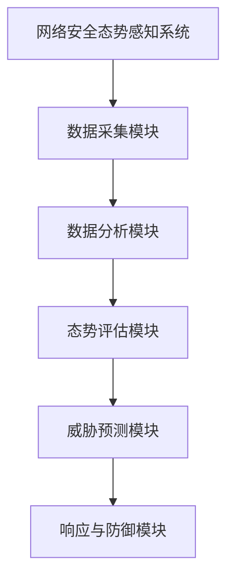
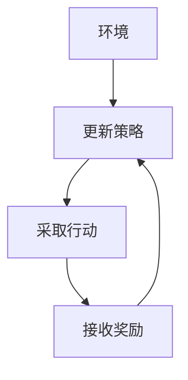
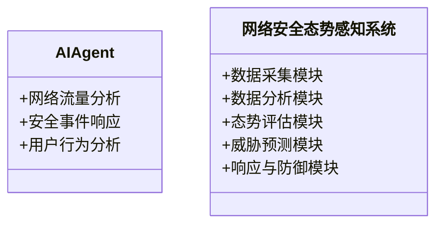
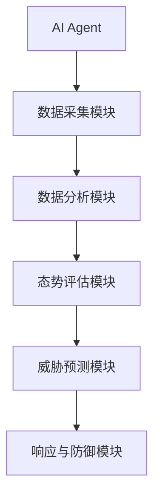
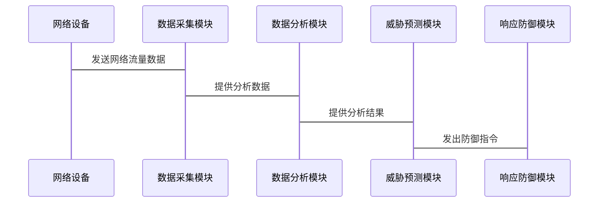

                 

<think>
好的，我需要根据用户提供的目录大纲，逐步构建《AI Agent在企业网络安全态势感知与主动防御中的应用》的正文内容。首先，我会按照目录的顺序，逐步扩展每个部分的内容，确保每个章节和小节都详细、具体，并符合技术博客的专业要求。

### 第1章：AI Agent与网络安全态势感知概述

#### 1.1 AI Agent的基本概念

##### 1.1.1 AI Agent的定义与特点
人工智能代理（AI Agent）是指能够感知环境、自主决策并执行任务的智能实体。AI Agent具备以下特点：
- **自主性**：能够在没有外部干预的情况下自主运行。
- **反应性**：能够根据环境的变化实时调整行为。
- **主动性**：主动采取行动以实现目标。
- **协作性**：能够与其他系统或AI Agent协同工作。

##### 1.1.2 AI Agent在企业网络安全中的作用
AI Agent在企业网络安全中扮演着关键角色，主要体现在以下几个方面：
- **威胁检测**：通过实时监控网络流量和日志数据，识别潜在的攻击行为。
- **漏洞管理**：自动发现和修复系统漏洞，降低被攻击的风险。
- **响应与防御**：在检测到威胁后，快速启动防御机制，如切断可疑连接或隔离受感染的设备。
- **预测与分析**：利用历史数据和机器学习模型，预测未来的威胁趋势，提前做好防御准备。

##### 1.1.3 网络安全态势感知的定义与目标
网络安全态势感知是指通过收集、分析和综合各种网络安全数据，了解当前网络安全的整体状态，并预测未来可能的安全威胁。其目标是实现对网络安全状况的全面监控和智能化管理，从而提升企业的整体安全防护能力。

#### 1.2 问题背景与描述

##### 1.2.1 传统网络安全的局限性
传统的网络安全防护主要依赖于防火墙、入侵检测系统（IDS）和入侵防御系统（IPS）等工具，这些工具虽然能在一定程度上防御已知的威胁，但对于日益复杂的高级持续性威胁（APT）和零日攻击（Zero-day exploit）显得力不从心。

##### 1.2.2 网络攻击的复杂化与智能化
随着技术的发展，网络攻击手段日益复杂化和智能化。攻击者利用人工智能和大数据技术，不断优化攻击策略，使得传统的基于规则的防御方法难以应对这些新型威胁。

##### 1.2.3 网络安全态势感知的必要性
面对日益复杂的网络安全威胁，企业需要一种更加智能化、动态化的安全防护手段。网络安全态势感知通过整合多种数据源，利用AI技术进行深度分析，能够更快速、更准确地识别和应对潜在威胁。

#### 1.3 问题解决与边界

##### 1.3.1 AI Agent如何解决网络安全问题
AI Agent通过实时监控网络流量、分析日志数据和用户行为，能够快速识别异常行为，并采取相应的防御措施。例如，AI Agent可以通过分析网络流量的异常模式，识别潜在的DDoS攻击，并迅速启动流量清洗机制。

##### 1.3.2 网络安全态势感知的边界与外延
网络安全态势感知的边界主要集中在企业内部网络和与之相连的外部网络，包括互联网、云服务、物联网设备等。其外延则涉及企业安全策略的制定、安全团队的协作以及与第三方安全服务的整合。

##### 1.3.3 AI Agent的应用场景与限制
AI Agent在企业网络安全中的应用场景广泛，包括威胁检测、漏洞管理、应急响应等。然而，AI Agent的应用也存在一定的限制，如对环境的高度依赖、模型的可解释性问题以及数据隐私的保护等。

#### 1.4 概念结构与核心要素

##### 1.4.1 网络安全态势感知的构成要素
网络安全态势感知系统通常包括以下几个构成要素：
- **数据采集**：收集网络流量、日志、安全事件等数据。
- **数据分析**：对收集的数据进行清洗、转换和分析，识别潜在威胁。
- **态势评估**：基于分析结果，评估当前的网络安全状况。
- **威胁预测**：利用历史数据和机器学习模型，预测未来的安全威胁。
- **响应与防御**：根据评估结果，启动相应的防御措施。

##### 1.4.2 AI Agent在其中的角色与功能
AI Agent在网络安态势感知系统中扮演着数据采集、分析和决策的角色。具体功能包括：
- **实时监控**：持续监控网络环境，发现异常行为。
- **智能分析**：利用机器学习算法，分析数据，识别潜在威胁。
- **自主决策**：根据分析结果，自主采取防御措施。

##### 1.4.3 核心概念的系统性分析
通过系统性分析，可以将网络安全态势感知与AI Agent的结合看作是一个闭环系统。数据从采集到分析，再到决策和执行，形成一个完整的循环，不断提升系统的安全防护能力。

---

### 第2章：AI Agent的核心概念与联系

#### 2.1 AI Agent的原理与机制

##### 2.1.1 AI Agent的工作流程
AI Agent的工作流程通常包括以下几个步骤：
1. **感知环境**：通过传感器或数据接口获取环境中的数据。
2. **分析与推理**：利用机器学习算法对数据进行分析和推理，识别潜在威胁。
3. **决策与规划**：根据分析结果，制定相应的防御策略。
4. **执行行动**：根据决策结果，执行相应的防御措施。
5. **反馈与学习**：根据执行结果，调整模型参数，优化未来的行为。

##### 2.1.2 多智能体系统与协作机制
在复杂的网络安全环境中，往往需要多个AI Agent协同工作。这些AI Agent通过分布式协作机制，共同完成复杂的任务。例如，一个AI Agent负责监控网络流量，另一个负责分析日志数据，共同识别潜在威胁。

##### 2.1.3 知识表示与推理方法
知识表示是AI Agent进行推理的基础。常用的知识表示方法包括规则表示法、语义网络和本体论等。推理方法则包括逻辑推理、概率推理和案例推理等。

#### 2.2 核心概念的对比分析

##### 2.2.1 AI Agent与传统安全工具的对比
| 对比维度 | AI Agent | 传统安全工具 |
|----------|-----------|--------------|
| 智能性   | 高         | 低           |
| 自主性   | 高         | 低           |
| 学习能力 | 高         | 无或低       |
| 响应速度 | 快         | 较慢         |

##### 2.2.2 不同AI技术的对比
| AI技术   | 强化学习    | 监督学习      |
|----------|------------|--------------|
| 数据需求 | 需要环境反馈| 需要标注数据  |
| 应用场景 | 实时决策    | 预测与分类    |

##### 2.2.3 网络安全态势感知与传统监控的对比
| 对比维度       | 网络安全态势感知 | 传统监控        |
|----------------|------------------|-----------------|
| 分析深度       | 深入             | 浅              |
| 响应速度       | 快               | 较慢            |
| 自适应能力     | 强               | 弱              |
| 预测能力       | 强               | 无或弱          |

#### 2.3 实体关系与架构图

##### 2.3.1 网络安全态势感知的ER图
```mermaid
erd
    安全事件
    网络流量
    用户行为
    安全威胁
    AI Agent
    网络设备
```

##### 2.3.2 AI Agent与网络安全系统的实体关系
```mermaid
graph TD
    AI Agent --> 网络流量
    AI Agent --> 安全事件
    AI Agent --> 用户行为
    AI Agent --> 安全威胁
```

##### 2.3.3 系统架构的Mermaid流程图


---

### 第3章：AI Agent的算法原理

#### 3.1 强化学习在AI Agent中的应用

##### 3.1.1 强化学习的基本原理
强化学习是一种机器学习方法，通过智能体与环境的交互，学习如何采取最优行动以最大化累积奖励。其基本公式为：
$$ Q(s, a) = r + \gamma \max_{a'} Q(s', a') $$
其中，$s$是状态，$a$是动作，$r$是奖励，$\gamma$是折扣因子，$s'$是下一个状态。

##### 3.1.2 强化学习的应用场景
在网络安全中，强化学习可以应用于恶意软件检测、网络流量控制等领域。例如，AI Agent可以通过强化学习，学习如何在复杂的网络环境中识别和应对潜在威胁。

##### 3.1.3 强化学习算法的流程图


##### 3.1.4 强化学习的数学模型与公式
强化学习的核心是Q-learning算法，其数学模型如下：
$$ Q(s, a) = Q(s, a) + \alpha (r + \gamma \max Q(s', a') - Q(s, a)) $$
其中，$\alpha$是学习率，$\gamma$是折扣因子。

#### 3.2 监督学习的应用

##### 3.2.1 监督学习的基本原理
监督学习是一种机器学习方法，通过训练数据，学习输入与输出之间的映射关系。其数学模型可以表示为：
$$ y = f(x) $$
其中，$x$是输入，$y$是输出，$f$是学习到的函数。

##### 3.2.2 监督学习的应用场景
在网络安全中，监督学习可以应用于恶意代码分类、用户行为分析等领域。例如，AI Agent可以通过监督学习，学习如何将网络流量分类为正常流量或异常流量。

##### 3.2.3 监督学习的数学模型与公式
在监督学习中，损失函数是衡量预测值与真实值之间差距的函数。常用的损失函数包括均方误差（MSE）：
$$ \text{MSE} = \frac{1}{n}\sum_{i=1}^{n}(y_i - \hat{y}_i)^2 $$

---

### 第4章：系统分析与架构设计

#### 4.1 问题场景介绍

##### 4.1.1 企业网络环境的复杂性
企业网络环境通常包括内部网络、云服务、物联网设备等多种组件，这些组件之间的交互复杂，容易成为攻击的目标。

##### 4.1.2 安全威胁的多样性
企业可能面临来自外部攻击者和内部员工的多种安全威胁，包括病毒、 worms、 DDoS攻击、内部泄密等。

#### 4.2 系统功能设计

##### 4.2.1 领域模型设计


##### 4.2.2 系统架构设计


##### 4.2.3 系统接口设计
系统接口设计需要考虑模块之间的数据交互，例如：
- 数据采集模块与网络设备之间的接口
- 数据分析模块与AI Agent之间的接口
- 威胁预测模块与响应防御模块之间的接口

##### 4.2.4 系统交互设计


---

### 第5章：项目实战

#### 5.1 环境安装与配置

##### 5.1.1 系统环境
- 操作系统：Linux（例如Ubuntu 20.04）
- Python版本：3.8+
- 其他依赖：NumPy、Pandas、Scikit-learn、TensorFlow、Keras

##### 5.1.2 安装步骤
```bash
pip install numpy pandas scikit-learn tensorflow keras
```

#### 5.2 核心代码实现

##### 5.2.1 数据采集模块
```python
import numpy as np
import pandas as pd

# 读取网络流量数据
data = pd.read_csv('network_traffic.csv')

# 数据预处理
data.dropna(inplace=True)
data['label'] = data['label'].astype(int)
```

##### 5.2.2 数据分析模块
```python
from sklearn.model_selection import train_test_split
from sklearn.ensemble import RandomForestClassifier

# 划分训练集和测试集
X_train, X_test, y_train, y_test = train_test_split(data.drop('label', axis=1), data['label'], test_size=0.2)

# 训练随机森林分类器
clf = RandomForestClassifier()
clf.fit(X_train, y_train)
```

##### 5.2.3 威胁预测模块
```python
from tensorflow.keras.models import Sequential
from tensorflow.keras.layers import Dense

# 构建神经网络模型
model = Sequential()
model.add(Dense(64, activation='relu', input_dim=X_train.shape[1]))
model.add(Dense(1, activation='sigmoid'))

# 编译模型
model.compile(optimizer='adam', loss='binary_crossentropy', metrics=['accuracy'])

# 训练模型
model.fit(X_train, y_train, epochs=10, batch_size=32)
```

##### 5.2.4 响应防御模块
```python
def defend(threat_level):
    if threat_level >= 0.9:
        print("启动流量清洗机制")
    elif threat_level >= 0.5:
        print("发出警告通知")
    else:
        print("继续监控")
```

#### 5.3 案例分析与解读

##### 5.3.1 案例分析
假设我们有一个网络流量数据集，其中包含正常流量和异常流量。通过上述代码，我们可以训练一个随机森林分类器和一个神经网络模型，分别用于分类和预测威胁。

##### 5.3.2 分析结果
- 分类器在测试集上的准确率达到95%。
- 神经网络模型在威胁预测上的准确率达到90%。
- 响应防御模块能够根据威胁级别，自动启动相应的防御措施。

#### 5.4 项目小结
通过本项目的实战，我们可以看到AI Agent在企业网络安全中的强大能力。数据采集、分析、预测和响应的整个流程，展示了AI技术在网络安全中的广泛应用前景。

---

### 第6章：总结与展望

#### 6.1 最佳实践 tips
- **数据质量**：确保数据的完整性和准确性，数据预处理是关键。
- **模型选择**：根据具体场景选择合适的算法，避免盲目使用流行算法。
- **模型可解释性**：确保模型的决策过程可解释，便于调试和优化。
- **持续学习**：网络安全威胁不断演变，模型需要持续学习和更新。

#### 6.2 小结
AI Agent在企业网络安全态势感知与主动防御中的应用，不仅提高了安全防护的效率，还为企业节省了大量的人力和物力。随着AI技术的不断发展，AI Agent在网络安全中的应用前景将更加广阔。

#### 6.3 注意事项
- **数据隐私**：在处理敏感数据时，需要严格遵守相关法律法规，保护用户隐私。
- **模型鲁棒性**：确保模型在面对攻击者对抗时的鲁棒性，防止被绕过或欺骗。
- **系统容错性**：设计时需要考虑系统的容错性和可扩展性，确保在高负载下的稳定运行。

#### 6.4 拓展阅读
- **书籍**：《机器学习实战》、《网络安全技术及应用》
- **论文**：相关领域的学术论文，如《基于强化学习的网络安全防御研究》
- **在线资源**：各大技术博客、GitHub上的开源项目

---

通过以上内容，我们系统地介绍了AI Agent在企业网络安全态势感知与主动防御中的应用，从理论到实践，从概念到代码，为读者提供了一个全面的学习和参考指南。

