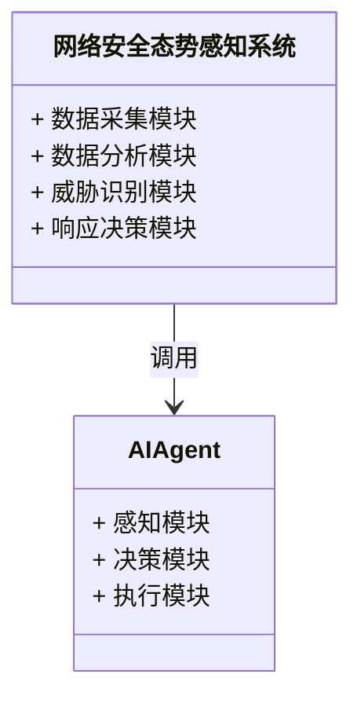
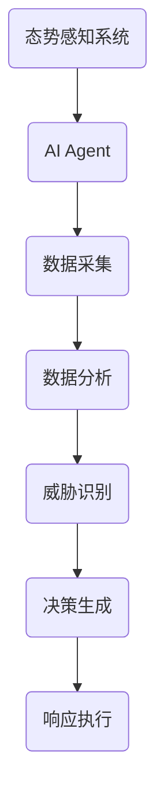
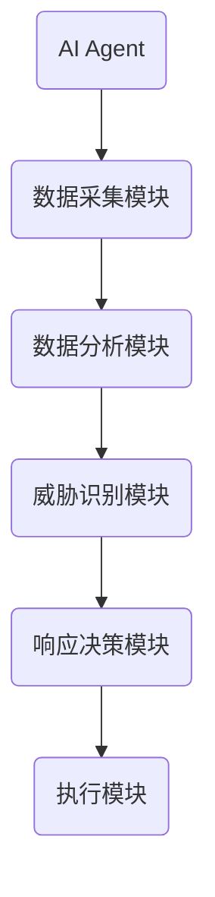
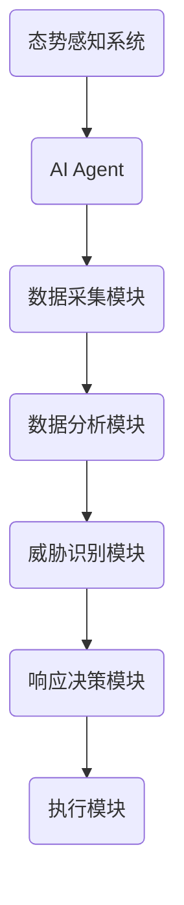

                 


# 第四部分: AI Agent的系统分析与架构设计

# 第4章: 系统分析与架构设计

## 4.1 系统分析

### 4.1.1 问题场景介绍

### 4.1.2 项目介绍

### 4.1.3 系统功能设计

#### 4.1.3.1 领域模型



### 4.1.3.2 功能模块交互



## 4.2 系统架构设计

### 4.2.1 系统架构图



### 4.2.2 接口设计

#### 4.2.2.1 数据采集接口

#### 4.2.2.2 数据分析接口

#### 4.2.2.3 威胁识别接口

#### 4.2.2.4 响应决策接口

## 4.3 系统交互流程

### 4.3.1 交互流程图



### 4.3.2 交互流程说明

---

# 第五部分: AI Agent的项目实战

# 第5章: 项目实战

## 5.1 环境安装

### 5.1.1 安装Python

### 5.1.2 安装依赖库

### 5.1.3 安装开发环境

## 5.2 系统核心实现

### 5.2.1 数据采集模块

#### 5.2.1.1 代码实现

```python
# 数据采集模块
import requests

def collect_data():
    # 采集网络流量数据
    response = requests.get('http://localhost:8080/flow')
    return response.json()
```

#### 5.2.1.2 代码解读

### 5.2.2 数据分析模块

#### 5.2.2.1 代码实现

```python
# 数据分析模块
import pandas as pd

def analyze_data(data):
    df = pd.DataFrame(data)
    # 数据清洗和特征提取
    return df
```

#### 5.2.2.2 代码解读

### 5.2.3 威胁识别模块

#### 5.2.3.1 代码实现

```python
# 威胁识别模块
from sklearn import svm

def identify_threats(data):
    model = svm.SVC()
    model.fit(data[['feature1', 'feature2']], data['label'])
    return model.predict(new_data)
```

#### 5.2.3.2 代码解读

### 5.2.4 响应决策模块

#### 5.2.4.1 代码实现

```python
# 响应决策模块
def decide_response(threat_level):
    if threat_level >= 0.8:
        return 'block'
    elif threat_level >= 0.5:
        return 'alert'
    else:
        return 'monitor'
```

#### 5.2.4.2 代码解读

## 5.3 案例分析

### 5.3.1 案例背景

### 5.3.2 实施步骤

### 5.3.3 分析结果

## 5.4 实战小结

---

# 第六部分: 最佳实践与总结

# 第6章: 最佳实践与总结

## 6.1 最佳实践

### 6.1.1 系统设计与实现中的注意事项

### 6.1.2 系统优化建议

### 6.1.3 安全防护措施

## 6.2 小结

### 6.2.1 本章内容回顾

### 6.2.2 未来研究方向

## 6.3 注意事项

### 6.3.1 系统维护

### 6.3.2 数据隐私

### 6.3.3 系统升级

## 6.4 扩展阅读

### 6.4.1 相关技术领域

### 6.4.2 学术论文推荐

### 6.4.3 技术书籍推荐

---

# 总结

通过以上章节的详细分析和实战案例，我们可以看到AI Agent在企业网络安全态势感知与威胁响应中的巨大潜力。尽管在实施过程中面临诸多挑战，但随着技术的不断进步，AI Agent必将在未来的网络安全领域发挥越来越重要的作用。

