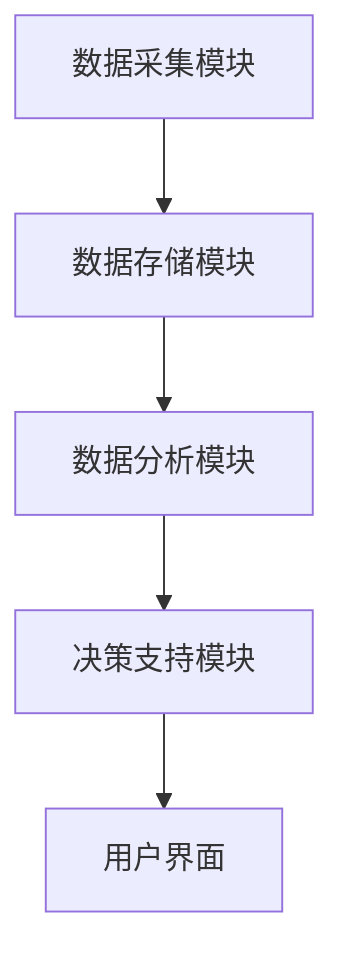

                 


# AI Agent在企业网络安全态势感知中的应用

> 关键词：AI Agent，网络安全，态势感知，机器学习，威胁检测

> 摘要：本文探讨AI Agent在企业网络安全态势感知中的应用，分析其核心概念、算法原理及系统设计，结合实际案例，详细阐述如何利用AI技术提升网络安全防护能力。

---

# 第1章: 引言

## 1.1 网络安全态势感知的背景与意义
随着企业数字化转型的加速，网络安全威胁日益复杂。传统的被动防御手段已难以应对新型攻击方式。网络安全态势感知通过实时监控和分析网络状态，帮助企业识别潜在威胁，做出快速响应。AI Agent的引入，进一步提升了态势感知的智能化水平，为企业构建主动防御体系提供了新思路。

## 1.2 AI Agent与网络安全态势感知的关系
AI Agent具备自主学习、推理和决策的能力，能够有效处理网络安全中的复杂问题。结合态势感知，AI Agent可实现对网络环境的动态分析，预测潜在威胁，并制定最优应对策略。

## 1.3 本文结构安排
本文将从AI Agent的基本概念、算法原理、系统设计、项目实战等方面展开，全面解析其在网络安全态势感知中的应用价值。

---

# 第2章: AI Agent与网络安全态势感知的基础

## 2.1 AI Agent的核心概念
AI Agent是一种智能体，能够通过感知环境、分析信息并采取行动来实现特定目标。在网络安全中，AI Agent可执行威胁检测、漏洞发现和响应处置等任务。

## 2.2 网络安全态势感知的关键要素
态势感知依赖于数据采集、分析与决策。AI Agent通过整合多源数据，利用机器学习模型进行威胁识别和风险评估，为防御决策提供支持。

## 2.3 AI Agent在态势感知中的优势
- **实时性**：快速处理网络流量数据，及时发现异常行为。
- **准确性**：基于历史数据和模型训练，提高威胁检测的精度。
- **适应性**：能够自适应网络环境的变化，持续优化防护策略。

---

# 第3章: AI Agent的核心原理与网络安全态势感知的结合

## 3.1 AI Agent的感知机制
AI Agent通过传感器和API接口收集网络数据，包括流量日志、系统状态和安全事件等。这些数据经过预处理后，输入到机器学习模型中进行分析。

## 3.2 数据分析与威胁识别
- **特征提取**：从原始数据中提取有意义的特征，如IP地址、用户行为模式等。
- **威胁分类**：利用分类算法（如随机森林、神经网络）识别已知和未知威胁。

## 3.3 威胁评估与响应策略
AI Agent根据分析结果评估威胁的严重性，并生成相应的响应策略，如封锁可疑IP、隔离受感染设备等。

---

# 第4章: AI Agent的算法原理

## 4.1 基于机器学习的威胁检测算法
### 4.1.1 算法流程
1. 数据预处理：清洗、归一化。
2. 特征选择：提取关键特征。
3. 模型训练：使用训练数据进行参数优化。
4. 威胁预测：对新数据进行分类预测。

### 4.1.2 代码实现
```python
import pandas as pd
from sklearn.ensemble import RandomForestClassifier

# 数据加载与预处理
data = pd.read_csv('network_logs.csv')
X = data.drop('label', axis=1)
y = data['label']

# 模型训练
model = RandomForestClassifier(n_estimators=100)
model.fit(X, y)

# 预测与评估
from sklearn.metrics import accuracy_score
y_pred = model.predict(X)
print("Accuracy:", accuracy_score(y, y_pred))
```

## 4.2 基于深度学习的异常检测
### 4.2.1 深度学习模型的选择
使用LSTM网络分析时间序列数据，识别异常行为。

### 4.2.2 模型结构
$$ LSTM层：输入特征数为n，隐藏层维度为m $$

### 4.2.3 训练流程
1. 数据预处理：标准化、序列分割。
2. 模型训练：反向传播优化参数。
3. 异常检测：计算重建误差，判断是否异常。

---

# 第5章: 网络安全态势感知系统的架构设计

## 5.1 系统功能模块
### 5.1.1 数据采集模块
负责收集网络流量、日志等数据。

### 5.1.2 数据分析模块
利用AI Agent进行威胁检测和风险评估。

### 5.1.3 决策支持模块
提供可视化界面，辅助安全专家制定应对策略。

## 5.2 系统架构设计
- **数据层**：存储原始数据和分析结果。
- **应用层**：处理用户请求，展示分析结果。
- **服务层**：提供API接口，支持多平台调用。

### 系统架构图


---

# 第6章: 项目实战与案例分析

## 6.1 项目背景
某企业遭受多次勒索软件攻击，希望通过AI Agent提升威胁检测能力。

## 6.2 系统实现
### 6.2.1 环境配置
- 操作系统：Linux
- 开发工具：Python、TensorFlow

### 6.2.2 核心代码
```python
import tensorflow as tf
from tensorflow.keras import layers

# 模型定义
model = tf.keras.Sequential([
    layers.LSTM(64, input_shape=(None, input_dim)),
    layers.Dense(1, activation='sigmoid')
])
model.compile(loss='binary_crossentropy', optimizer='adam', metrics=['accuracy'])

# 模型训练
model.fit(X_train, y_train, epochs=10, batch_size=32)
```

## 6.3 案例分析
通过部署AI Agent，企业成功识别并阻止了一次潜在的DDoS攻击，证明了该方案的有效性。

---

# 第7章: 总结与展望

## 7.1 本章总结
AI Agent在网络安全态势感知中的应用显著提升了威胁检测和响应效率。其智能化和自适应能力为企业构建主动防御体系提供了有力支持。

## 7.2 未来展望
随着技术的进步，AI Agent将在更广泛的场景中发挥作用，如零日漏洞发现、APT攻击识别等。同时，如何提升模型的可解释性和鲁棒性，仍需进一步研究。

---

# 第8章: 最佳实践与注意事项

## 8.1 最佳实践
- 定期更新模型，保持其有效性。
- 结合人工分析，确保误报率可控。

## 8.2 注意事项
- 数据隐私保护至关重要。
- 建立完善的监控机制，及时发现并修复系统漏洞。

---

通过以上结构，文章详细阐述了AI Agent在企业网络安全态势感知中的应用，从理论到实践，为企业提供了一套完整的解决方案。

