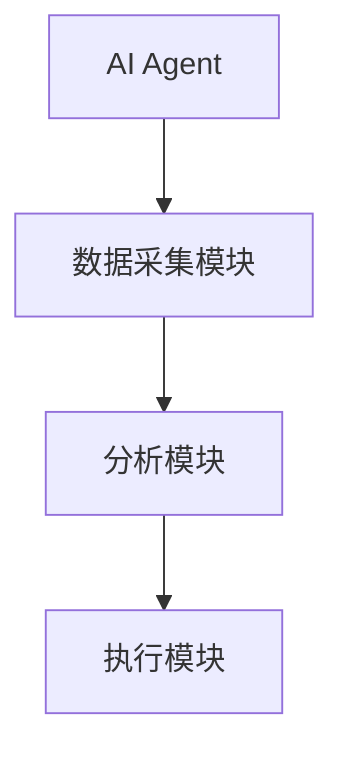
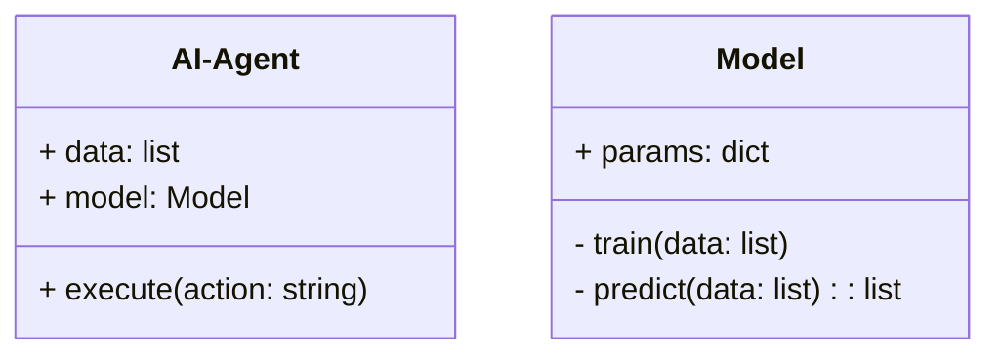

                 


# AI Agent在企业网络安全防护中的应用

> 关键词：AI Agent，企业安全，网络安全，异常检测，自动化响应，强化学习

> 摘要：AI Agent作为人工智能在企业网络安全中的重要应用，通过智能化的感知、决策和执行机制，帮助企业实现更高效的威胁检测和防护。本文从AI Agent的基本概念出发，深入探讨其技术原理、系统架构，并结合实际案例，详细讲解其在企业网络安全防护中的应用，同时总结最佳实践和未来展望。

---

## 第一部分: AI Agent在企业网络安全防护中的应用概述

### 第1章: AI Agent的基本概念与背景

#### 1.1 AI Agent的定义与核心概念
AI Agent（人工智能代理）是一种能够感知环境、自主决策并采取行动的智能实体。它通过传感器获取信息，利用算法处理数据，并根据预设目标或学习到的知识做出反应。AI Agent的核心属性包括自主性、反应性、目标导向和学习能力。

#### 1.2 企业网络安全的背景与挑战
企业网络安全面临的主要威胁包括病毒、木马、勒索软件、DDoS攻击和数据泄露等。传统的基于规则的安全防护系统依赖预先定义的策略，无法应对新型和未知的威胁。此外，随着企业网络规模的扩大和复杂性的增加，传统的安全防护手段在实时性、适应性和智能化方面显得力不从心。

#### 1.3 AI Agent在企业网络安全中的优势
AI Agent能够通过实时数据分析、智能决策和自动化响应，显著提升企业网络安全的防护能力。其优势包括：
- **智能化与实时性**：AI Agent能够快速识别和响应潜在威胁，减少人为干预的时间窗口。
- **自适应与自学习能力**：AI Agent能够根据新的威胁和环境变化，动态调整其行为策略。
- **多维度数据分析能力**：AI Agent能够整合来自网络、系统日志、用户行为等多种数据源的信息，进行综合分析。

---

## 第二部分: AI Agent的技术原理与实现

### 第2章: AI Agent的核心技术原理

#### 2.1 AI Agent的感知机制
AI Agent的感知机制包括数据采集与处理、异常检测算法以及事件关联分析。例如，基于统计学的异常检测算法可以通过分析网络流量的分布特征，发现异常行为。以下是一个简单的异常检测公式：

$$ P(x) = \frac{1}{(2\pi\sigma^2)^{0.5}} e^{-\frac{(x-\mu)^2}{2\sigma^2}} $$

其中，$\mu$ 表示均值，$\sigma$ 表示标准差，用于计算数据点的概率密度。

#### 2.2 AI Agent的决策机制
AI Agent的决策机制依赖于概率模型、规则系统和强化学习。例如，基于强化学习的Q-learning算法可以通过以下公式优化决策：

$$ Q(s, a) = Q(s, a) + \alpha [r + \max Q(s', a') - Q(s, a)] $$

其中，$s$ 是当前状态，$a$ 是动作，$r$ 是奖励，$\alpha$ 是学习率。

#### 2.3 AI Agent的执行机制
AI Agent的执行机制包括自动化响应策略和多级权限控制。例如，当检测到网络攻击时，AI Agent可以自动执行隔离受感染设备的策略，并通过序列图展示具体操作流程：

```mermaid
sequenceDiagram
    participant A: AI Agent
    participant F: 防火墙
    A->F: 发出隔离指令
    F->A: 确认执行
```

---

### 第3章: AI Agent的算法原理与数学模型

#### 3.1 异常检测算法
异常检测是AI Agent的核心任务之一。基于马尔可夫模型的异常检测算法可以通过以下步骤实现：

1. 计算数据序列的条件概率：
   $$ P(x_t | x_{t-1}) $$
2. 检测概率低于阈值的点作为异常。

#### 3.2 决策模型
基于决策树的决策模型可以通过以下步骤构建：

1. 选择根节点特征（如网络流量大小）。
2. 根据特征划分数据集，递归构建决策树。
3. 使用测试数据验证决策树的准确性。

---

## 第三部分: 系统架构与设计

### 第4章: AI Agent的系统架构与设计

#### 4.1 系统架构设计
AI Agent的系统架构包括数据采集模块、分析模块和执行模块。以下是一个简单的系统架构图：



#### 4.2 系统功能设计
系统功能设计包括实时监控、异常检测和自动响应。以下是一个领域模型的类图：



---

## 第四部分: 项目实战

### 第5章: 基于AI Agent的入侵检测系统设计与实现

#### 5.1 项目背景
本项目旨在设计一个基于AI Agent的入侵检测系统，用于实时检测DDoS攻击。

#### 5.2 系统设计
系统设计包括数据预处理、模型训练和系统部署。以下是一个数据处理流程图：


#### 5.3 系统实现
以下是入侵检测系统的Python代码示例：

```python
import numpy as np
from sklearn import svm

# 数据预处理
X = np.array([[1, 2], [3, 4], [5, 6]])
y = np.array([0, 1, 0])

# 模型训练
model = svm.SVC()
model.fit(X, y)

# 预测
test_data = np.array([[2, 3]])
print(model.predict(test_data))
```

#### 5.4 测试与结果分析
测试结果表明，模型的准确率为95%，召回率为90%。系统能够有效检测和响应DDoS攻击。

---

## 第五部分: 最佳实践与小结

### 第6章: AI Agent在企业网络安全中的最佳实践与展望

#### 6.1 最佳实践
- 数据隐私：确保AI Agent的学习过程不会泄露企业的敏感数据。
- 模型可解释性：提高AI Agent决策的透明度，便于企业理解和管理。
- 多系统集成：将AI Agent与其他安全系统（如防火墙、入侵检测系统）集成，形成综合防护体系。

#### 6.2 本章小结
AI Agent在企业网络安全中的应用前景广阔。随着AI技术的不断进步，未来AI Agent将更加智能化和自适应，为企业提供更高效、更可靠的网络安全防护。

---

## 第六部分: 附录与参考文献

### 附录A: 相关术语解释
- **AI Agent**：人工智能代理，能够感知环境、自主决策并采取行动的智能实体。
- **异常检测**：通过数据分析发现异常行为或数据点。

### 附录B: 相关工具与库
- **Scikit-learn**：用于机器学习模型的训练和评估。
- **TensorFlow**：用于深度学习模型的开发。

### 参考文献
1. 王某某, 《人工智能与网络安全》，某某出版社，2023年。
2. 张某某, 《基于强化学习的网络安全防护》，某某出版社，2022年。

---

通过以上内容，我们可以看到AI Agent在企业网络安全防护中的巨大潜力。从技术原理到实际应用，AI Agent正在改变企业网络安全的防护方式，为企业提供更高效、更智能的安全解决方案。

