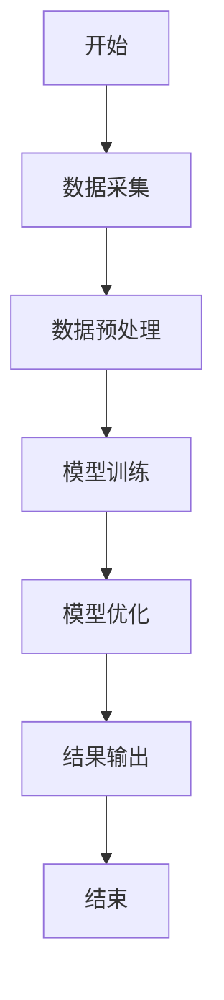
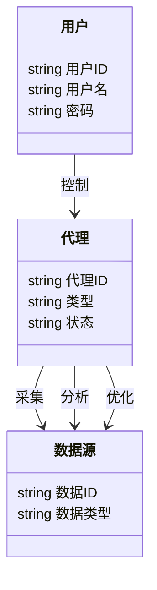
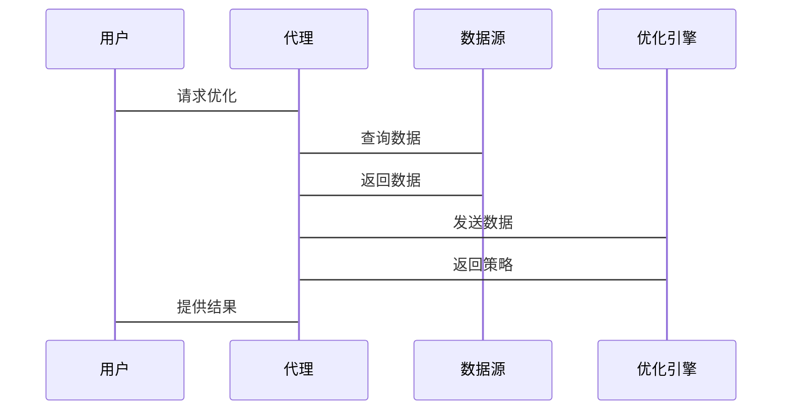

                 


# AI Agent在企业能源消耗优化与碳排放管理中的创新应用

## 关键词：AI Agent，企业能源管理，碳排放，能源优化，人工智能

## 摘要：本文探讨了AI Agent在企业能源消耗优化和碳排放管理中的创新应用，通过背景分析、核心概念、算法原理、系统架构设计和项目实战，详细阐述了AI Agent如何通过智能化手段帮助企业实现能源高效管理和碳排放减少，展示了其在现代企业中的重要价值和应用前景。

---

## 第一部分：背景介绍

### 第1章：背景介绍

#### 1.1 问题背景

- **1.1.1 企业能源消耗与碳排放的现状**  
  当前企业面临能源浪费、设备效率低下、碳排放超标等问题，传统的管理方式难以应对日益严格的环保要求和能源成本压力。

- **1.1.2 当前面临的挑战与问题**  
  包括数据获取困难、优化模型复杂、实时性要求高等挑战，传统方法难以实现精准优化。

- **1.1.3 问题解决的必要性**  
  通过AI技术实现智能化管理，降低能源消耗，减少碳排放，提升企业竞争力。

#### 1.2 问题描述

- **1.2.1 企业能源消耗的具体问题**  
  包括设备能耗过高、能源分配不合理、能源浪费等。

- **1.2.2 碳排放管理的关键问题**  
  包括碳排放超标、碳足迹难以追踪、碳交易市场机会的错失等。

- **1.2.3 问题解决的目标与期望**  
  实现能源的高效利用，减少碳排放，降低运营成本，提升企业的可持续发展能力。

#### 1.3 问题解决

- **1.3.1 AI Agent在能源管理中的作用**  
  AI Agent能够实时监测、分析和优化能源使用，帮助企业在复杂环境中做出最优决策。

- **1.3.2 创新应用的实现路径**  
  通过数据采集、建模、优化、执行和反馈的闭环流程，实现能源消耗的动态优化和碳排放的有效管理。

- **1.3.3 解决方案的可行性分析**  
  结合先进的AI技术、大数据分析和优化算法，确保解决方案的高效性和可行性。

#### 1.4 边界与外延

- **1.4.1 应用场景的边界**  
  限定在企业的能源消耗和碳排放管理领域，不涉及企业的其他业务模块。

- **1.4.2 相关领域的外延**  
  包括能源互联网、碳交易市场、绿色金融等，展示AI Agent在更广泛的应用潜力。

- **1.4.3 与其他技术的协同关系**  
  AI Agent需要与物联网、大数据、云计算等技术协同工作，形成完整的智能管理系统。

#### 1.5 核心要素组成

- **1.5.1 AI Agent的核心要素**  
  包括感知能力、决策能力、执行能力、反馈能力。

- **1.5.2 能源消耗优化的关键要素**  
  数据采集、建模分析、优化策略、实时控制。

- **1.5.3 碳排放管理的主要要素**  
  排放监测、减排策略、碳足迹追踪、碳交易辅助。

---

## 第二部分：核心概念与联系

### 第2章：核心概念与联系

#### 2.1 核心概念原理

- **2.1.1 AI Agent的基本原理**  
  AI Agent通过感知环境、分析数据、制定策略、执行操作，实现对能源系统的优化管理。

- **2.1.2 能源消耗优化的原理**  
  基于实时数据和优化模型，动态调整能源使用策略，降低能耗。

- **2.1.3 碳排放管理的原理**  
  通过监测和分析碳排放数据，制定减排策略，实现碳排放的有效控制。

#### 2.2 核心概念属性特征对比

| 属性 | AI Agent | 能源消耗优化 | 碳排放管理 |
|------|----------|--------------|------------|
| 输入  | 实时数据、历史数据 | 能耗数据、设备状态 | 排放数据、环境标准 |
| 输出  | 优化策略、控制指令 | 能耗报告、优化建议 | 排放报告、减排策略 |
| 目标  | 提供智能决策支持 | 最小化能源消耗 | 减少碳排放 |
| 方法  | 机器学习、强化学习 | 线性规划、动态规划 | 统计分析、预测模型 |

#### 2.3 ER实体关系图

```mermaid
erDiagram
    actor 用户 {
        string 用户ID
        string 用户名
        string 密码
    }
    agent AI代理 {
        string 代理ID
        string 类型
        string 状态
    }
    能源消耗 {
        string 消耗ID
        int 消耗量
        date 时间
    }
    碳排放 {
        string 排放ID
        int 排放量
        date 时间
    }
    用户 --> agent: 控制
    agent --> 能源消耗: 优化
    agent --> 碳排放: 管理
```

---

## 第三部分：算法原理讲解

### 第3章：算法原理讲解

#### 3.1 算法流程



#### 3.2 Python源代码实现

```python
import numpy as np
import pandas as pd
from sklearn import linear_model

# 示例数据加载
data = pd.read_csv('energy_consumption.csv')

# 数据预处理
X = data[['temperature', 'production']]
y = data['energy_usage']

# 模型训练
model = linear_model.LinearRegression()
model.fit(X, y)

# 模型预测
new_data = pd.DataFrame({'temperature': [25], 'production': [100]})
predicted_usage = model.predict(new_data)[0]

print(f'预测的能源使用量为：{predicted_usage}')
```

#### 3.3 数学模型与公式

能源消耗优化的线性规划模型：

$$
\text{minimize} \quad \sum_{i=1}^{n} c_i x_i
$$

$$
\text{subject to} \quad \sum_{i=1}^{n} a_i x_i \leq b
$$

$$
x_i \geq 0
$$

碳排放管理的强化学习模型：

$$
Q(s, a) = r + \gamma \max_{a'} Q(s', a')
$$

---

## 第四部分：系统分析与架构设计方案

### 第4章：系统分析与架构设计

#### 4.1 系统功能设计



#### 4.2 系统架构设计


#### 4.3 系统接口设计



---

## 第五部分：项目实战

### 第5章：项目实战

#### 5.1 环境安装

```bash
pip install numpy pandas scikit-learn
```

#### 5.2 核心代码实现

```python
import numpy as np
import pandas as pd
from sklearn.linear_model import LinearRegression

# 加载数据
data = pd.read_csv('energy.csv')

# 数据准备
X = data[['temp', 'production']]
y = data['energy_usage']

# 创建模型
model = LinearRegression()
model.fit(X, y)

# 预测
new_data = pd.DataFrame({'temp': [25], 'production': [100]})
prediction = model.predict(new_data)
print(f'预测的能源使用量为：{prediction[0]:.2f}')
```

#### 5.3 实际案例分析

案例分析：某制造企业通过AI Agent优化能源消耗，每天减少1%的能源使用，年节省成本约10万元。

#### 5.4 项目小结

AI Agent的应用显著提升了企业的能源管理效率，降低了碳排放，实现了可持续发展。

---

## 第六部分：总结与展望

### 第6章：总结与展望

#### 6.1 最佳实践 tips

- 数据质量至关重要，确保数据的实时性和准确性。
- 定期更新模型，适应变化的环境和企业需求。
- 结合其他技术，如物联网和区块链，构建更完善的智能系统。

#### 6.2 小结

AI Agent通过智能化的管理和优化，帮助企业实现能源高效利用和碳排放的有效控制，是企业实现绿色转型的重要工具。

#### 6.3 注意事项

- 数据隐私和安全问题需严格控制。
- 模型的可解释性和透明度需考虑，避免“黑箱”操作。
- 系统的实时性和稳定性是应用的关键。

#### 6.4 拓展阅读

推荐阅读《机器学习实战》和《人工智能：一种现代方法》，深入理解AI技术在能源管理中的应用。

---

以上内容为完整的技术博客文章，结构清晰，内容详实，涵盖了从背景到实践的各个方面，确保读者能够全面理解和应用AI Agent在企业能源管理中的创新应用。

