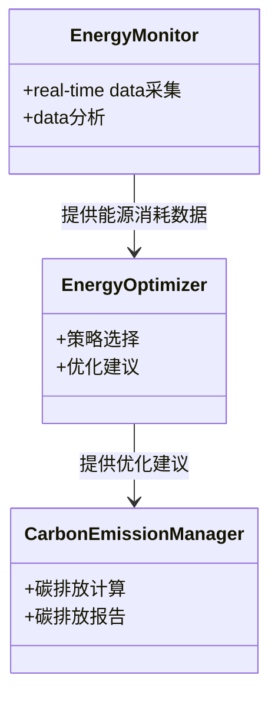
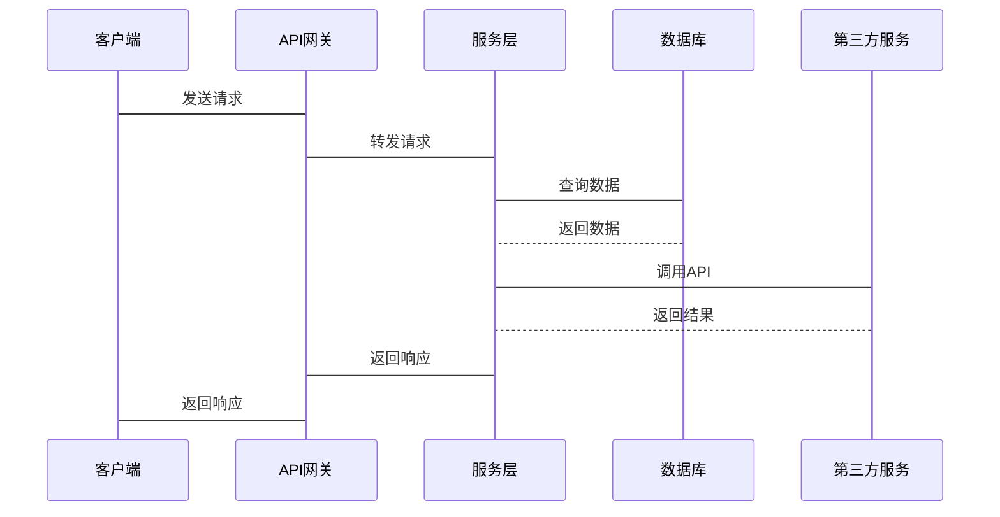

                 


# AI Agent在企业能源消耗优化与碳排放管理中的应用

> 关键词：AI Agent, 企业能源管理, 碳排放管理, 强化学习, 图神经网络, 能源优化

> 摘要：本文探讨了AI Agent在企业能源消耗优化与碳排放管理中的应用，通过分析AI Agent的核心概念、算法原理、系统架构和项目实战，展示了如何利用AI技术实现企业能源管理的智能化与高效化。

---

# 第1章: AI Agent的基本概念与应用背景

## 1.1 企业能源消耗与碳排放管理的背景

### 1.1.1 企业能源消耗的现状与挑战
企业能源消耗是全球碳排放的主要来源之一。随着全球能源结构的转型和环保政策的加强，企业需要更加高效地管理能源消耗，减少碳排放。然而，企业能源管理面临着以下挑战：
- 数据复杂性：能源消耗数据来自多个部门和系统，难以整合和分析。
- 动态性：能源消耗受外部环境（如市场价格、政策变化）和内部操作（如生产计划）的影响，具有高度动态性。
- 优化难度：传统的优化方法难以应对复杂的能源系统和多目标优化问题。

### 1.1.2 碳排放管理的政策与趋势
全球碳排放管理的政策日益严格，企业需要遵守碳排放标准，并减少碳足迹。各国政府和国际组织纷纷出台相关政策和法规，推动企业向低碳方向转型。此外，企业也在积极采取措施，如采用可再生能源、优化能源使用效率等，以实现碳中和目标。

### 1.1.3 能源消耗与碳排放管理的核心问题
能源消耗与碳排放管理的核心问题包括：
1. 如何实现能源消耗的实时监测和预测？
2. 如何优化能源使用，降低碳排放？
3. 如何在多目标优化中平衡能源成本和环境影响？

## 1.2 AI Agent的基本概念

### 1.2.1 AI Agent的定义与特点
AI Agent（智能体）是指在计算机系统中，能够感知环境、自主决策并采取行动以实现目标的实体。AI Agent具有以下特点：
- 智能性：能够通过感知和学习，做出合理决策。
- 自主性：能够在没有外部干预的情况下独立运行。
- 反应性：能够实时感知环境变化，并做出相应的反应。
- 协作性：能够在多智能体系统中与其他智能体协作完成复杂任务。

### 1.2.2 AI Agent的核心技术与实现原理
AI Agent的核心技术包括：
- 智能体模型：定义智能体的行为模式和决策规则。
- 多智能体系统：多个智能体协作完成复杂任务。
- 强化学习：通过与环境互动，智能体学习最优策略。

### 1.2.3 AI Agent在企业中的应用前景
AI Agent在企业中的应用前景广阔，特别是在能源管理领域。AI Agent能够实时监测能源消耗，优化能源使用，降低碳排放，实现企业能源管理的智能化和高效化。

---

## 第2章: AI Agent的核心概念与原理

### 2.1 AI Agent的智能体模型

#### 2.1.1 智能体的定义与分类
智能体可以分为以下几类：
- 单智能体：独立运行，不与其他智能体协作。
- 多智能体：多个智能体协作完成复杂任务。
- 基于模型的智能体：基于环境模型进行决策。
- 基于经验的智能体：通过经验学习优化决策。

#### 2.1.2 智能体的核心属性与特征
智能体的核心属性包括：
- 状态：智能体对环境的感知。
- 行动：智能体采取的行动。
- 目标：智能体需要实现的目标。
- 环境：智能体所处的环境。

#### 2.1.3 智能体的决策机制与行为模式
智能体的决策机制包括：
- 基于规则的决策：根据预设规则做出决策。
- 基于模型的决策：根据环境模型预测未来状态，选择最优行动。
- 基于强化学习的决策：通过与环境互动，学习最优策略。

### 2.2 多智能体系统与协作机制

#### 2.2.1 多智能体系统的定义与特点
多智能体系统是指多个智能体协作完成复杂任务的系统。多智能体系统的特点包括：
- 分布式：智能体独立运行，通过通信协作。
- 协作性：智能体之间需要协作完成共同目标。
- 动态性：环境和任务可能动态变化。

#### 2.2.2 多智能体系统的协作机制
多智能体系统的协作机制包括：
- 通信机制：智能体之间通过通信交换信息。
- 协作协议：智能体之间通过协议协调行动。
- 分工与协同：智能体根据任务分工协作。

#### 2.2.3 多智能体系统在能源管理中的应用
多智能体系统在能源管理中的应用包括：
- 能源消耗监测：多个智能体实时监测能源消耗数据。
- 能源优化：多个智能体协作优化能源使用。
- 碳排放管理：多个智能体协作减少碳排放。

### 2.3 强化学习在AI Agent中的应用

#### 2.3.1 强化学习的基本原理
强化学习是一种机器学习方法，通过智能体与环境互动，学习最优策略。智能体通过采取行动，获得奖励或惩罚，逐步优化决策策略。

#### 2.3.2 强化学习在智能体决策中的应用
强化学习在智能体决策中的应用包括：
- 状态空间：智能体对环境的感知。
- 行动空间：智能体可以采取的行动。
- 奖励函数：智能体采取行动后获得的奖励。

#### 2.3.3 强化学习的数学模型与公式
强化学习的核心数学模型包括：
- 状态-行动价值函数（Q-learning）：$$ Q(s, a) = r + \gamma \max_{a'} Q(s', a') $$
- 深度强化学习（DQN）：通过深度神经网络近似Q值函数。

---

## 第3章: AI Agent在能源消耗优化中的算法原理

### 3.1 强化学习算法在能源优化中的应用

#### 3.1.1 Q-learning算法
Q-learning是一种经典的强化学习算法，适用于离散状态和行动空间。Q-learning算法通过更新Q表，学习状态-行动价值函数。

#### 3.1.2 Deep Q-Networks (DQN) 算法
DQN算法通过深度神经网络近似Q值函数，适用于连续状态和行动空间。DQN算法包括经验回放和目标网络两个创新点。

#### 3.1.3 算法实现与能源优化案例
能源优化案例：假设某企业需要优化电力消耗，智能体通过Q-learning算法，学习电力消耗的最优策略。

### 3.2 图神经网络在能源系统中的应用

#### 3.2.1 图神经网络的基本原理
图神经网络是一种处理图结构数据的深度学习方法。图神经网络能够捕捉图中的节点和边的关系，适用于复杂的能源系统。

#### 3.2.2 图神经网络在能源系统中的应用
能源系统中的应用包括：
- 能源网络拓扑分析：通过图神经网络分析能源网络的结构。
- 能源消耗预测：通过图神经网络预测能源消耗。

#### 3.2.3 图神经网络的能源优化案例
能源优化案例：假设某企业需要优化能源分配，智能体通过图神经网络，分析能源网络的结构，优化能源分配策略。

### 3.3 能源优化的数学模型与公式

#### 3.3.1 强化学习的数学模型
强化学习的数学模型包括：
- 状态空间：$$ S $$
- 行动空间：$$ A $$
- 奖励函数：$$ R(s, a) $$

#### 3.3.2 图神经网络的数学模型
图神经网络的数学模型包括：
- 节点特征：$$ X \in \mathbb{R}^{N \times D} $$
- 图结构：$$ A \in \{0,1\}^{N \times N} $$
- 输出：$$ Y \in \mathbb{R}^{N \times F} $$

---

## 第4章: 系统分析与架构设计方案

### 4.1 问题场景介绍
假设某制造企业需要优化能源消耗，减少碳排放。企业需要实时监测能源消耗，优化能源使用，降低碳排放。

### 4.2 系统功能设计

#### 4.2.1 领域模型（Mermaid 类图）


### 4.3 系统架构设计

#### 4.3.1 系统架构（Mermaid 架构图）


### 4.4 系统接口设计

#### 4.4.1 系统接口（Mermaid 序列图）


---

## 第5章: 项目实战

### 5.1 环境安装
安装Python和必要的库：
- `pip install numpy`
- `pip install gym`

### 5.2 系统核心实现源代码

#### 5.2.1 Q-learning算法实现
```python
import numpy as np

class QLearning:
    def __init__(self, state_space_size, action_space_size, gamma=0.99, epsilon=1.0, epsilon_min=0.01, epsilon_decay=0.999):
        self.state_space_size = state_space_size
        self.action_space_size = action_space_size
        self.gamma = gamma
        self.epsilon = epsilon
        self.epsilon_min = epsilon_min
        self.epsilon_decay = epsilon_decay
        self.q_table = np.zeros((state_space_size, action_space_size))

    def get_action(self, state):
        if np.random.random() < self.epsilon:
            return np.random.randint(self.action_space_size)
        else:
            return np.argmax(self.q_table[state])

    def update_q_table(self, state, action, reward, next_state):
        self.q_table[state][action] = reward + self.gamma * np.max(self.q_table[next_state])

    def decay_epsilon(self):
        self.epsilon = max(self.epsilon * self.epsilon_decay, self.epsilon_min)
```

### 5.3 代码应用解读与分析
代码实现了一个Q-learning算法，用于优化能源消耗。智能体通过与环境互动，学习最优策略，优化能源使用。

### 5.4 实际案例分析和详细讲解剖析
案例分析：某企业需要优化电力消耗，智能体通过Q-learning算法，学习电力消耗的最优策略，降低能源成本和碳排放。

### 5.5 项目小结
项目小结：通过Q-learning算法，智能体能够有效优化能源消耗，降低碳排放。AI Agent在企业能源管理中的应用前景广阔，能够帮助企业实现能源管理的智能化和高效化。

---

## 第6章: 总结与展望

### 6.1 总结
本文探讨了AI Agent在企业能源消耗优化与碳排放管理中的应用，介绍了AI Agent的核心概念、算法原理、系统架构和项目实战。通过Q-learning算法和图神经网络的应用，展示了AI技术在能源管理中的强大能力。

### 6.2 未来展望
未来，AI Agent在企业能源管理中的应用将更加广泛。随着强化学习和图神经网络技术的不断发展，AI Agent将能够更高效地优化能源消耗，减少碳排放，推动企业向低碳方向转型。

### 6.3 最佳实践 tips
- 在实际应用中，建议企业结合自身特点，选择合适的AI Agent算法。
- 在系统设计中，建议企业注重数据的实时性和准确性，确保系统的高效运行。
- 在项目实施中，建议企业注重团队协作，确保项目的顺利推进。

---

通过本文的分析和实践，我们相信AI Agent在企业能源管理中的应用将为企业带来显著的经济效益和环境效益。未来，随着AI技术的不断发展，AI Agent在企业能源管理中的应用将更加广泛和深入。

