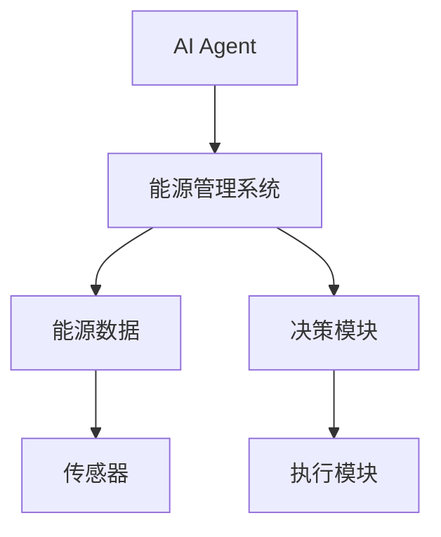
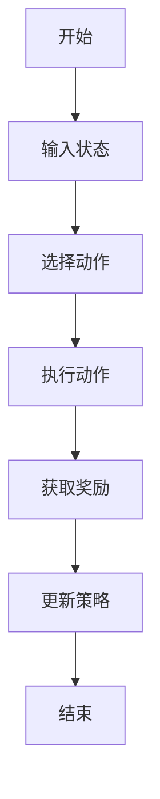
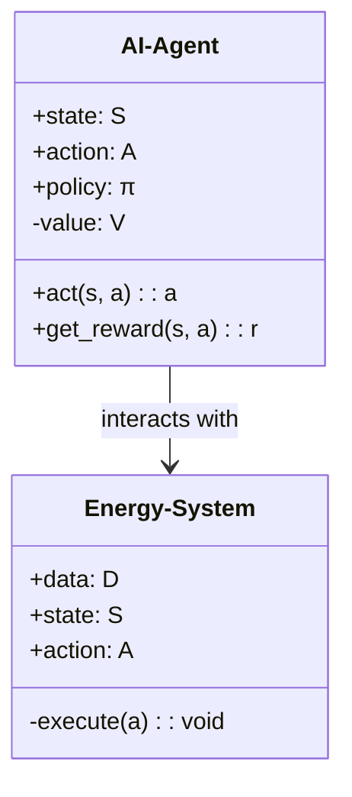
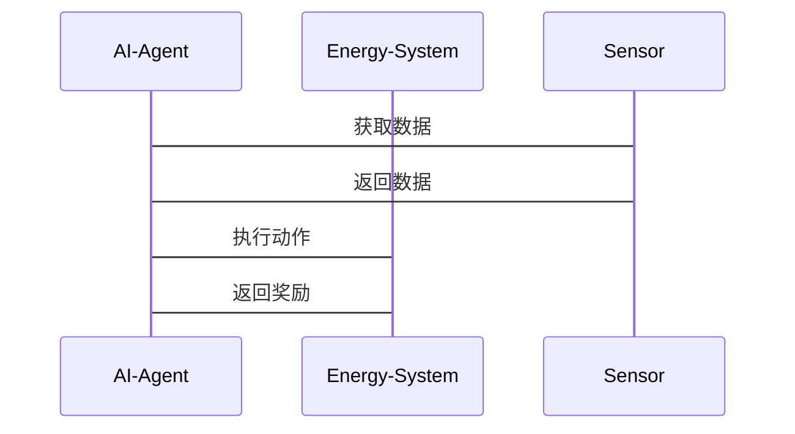

                 


# AI Agent在企业能源管理与可持续发展中的应用

## 关键词：AI Agent, 企业能源管理, 可持续发展, 算法原理, 系统架构, 项目实战

## 摘要：随着全球对可持续发展的关注增加，企业能源管理的智能化需求日益迫切。AI Agent作为人工智能领域的核心技术，能够通过自主决策和优化算法，显著提升能源管理效率。本文详细探讨了AI Agent在企业能源管理中的应用背景、核心概念、算法原理、系统架构设计以及项目实战，为企业在可持续发展中的技术实践提供了深度分析和具体指导。

---

# 第1章: AI Agent与可持续发展的背景介绍

## 1.1 AI Agent的核心概念
### 1.1.1 AI Agent的定义与特点
AI Agent（人工智能代理）是指能够感知环境、自主决策并执行任务的智能实体。它具备以下特点：
- **自主性**：能够独立决策和行动。
- **反应性**：能够实时感知环境并做出响应。
- **学习性**：通过数据和经验不断优化决策能力。
- **协作性**：能够与其他系统或人类协同工作。

### 1.1.2 可持续发展的概念与目标
可持续发展是指在满足当前需求的同时，不损害后代满足其需求的能力。其核心目标包括：
- 节能减排。
- 可再生能源的利用。
- 资源的高效配置。

### 1.1.3 企业能源管理的背景与挑战
企业能源管理涉及电力、热能、燃气等多种能源的规划、监控和优化。传统能源管理面临以下挑战：
- **数据孤岛**：能源数据分散，难以统一管理。
- **效率低下**：人工管理能耗较高，响应速度慢。
- **不确定性**：能源价格波动和需求变化难以预测。

## 1.2 AI Agent在企业能源管理中的应用背景
### 1.2.1 企业能源管理的传统模式与痛点
传统企业能源管理依赖人工操作，存在以下痛点：
- **效率低**：人工监控和调整能耗，效率低下。
- **精准度差**：缺乏实时数据和智能决策支持。
- **灵活性不足**：难以适应需求变化和能源价格波动。

### 1.2.2 可再生能源与能源效率的提升需求
随着可再生能源的普及，企业需要更灵活的能源管理策略，以应对能源价格波动和需求变化。

### 1.2.3 AI技术在能源管理中的潜力与优势
AI技术能够通过数据分析和自主决策，显著提升能源管理的效率和精准度。AI Agent能够实时监控能源消耗、预测需求变化，并优化能源分配策略。

## 1.3 本章小结
本章介绍了AI Agent的核心概念、可持续发展的目标，以及企业能源管理的背景与挑战。通过对比传统能源管理模式与AI Agent的优势，为后续章节的分析奠定了基础。

---

# 第2章: AI Agent的核心概念与联系

## 2.1 AI Agent的核心原理
### 2.1.1 AI Agent的基本工作原理
AI Agent通过感知环境、分析数据、制定策略并执行操作，实现能源管理的优化目标。

### 2.1.2 AI Agent与传统自动化系统的区别
- **自主性**：AI Agent能够自主决策，而传统自动化系统依赖预设规则。
- **学习能力**：AI Agent能够通过数据学习优化决策，传统系统不具备此能力。
- **适应性**：AI Agent能够适应环境变化，传统系统难以应对不确定性。

### 2.1.3 AI Agent的自主决策能力
AI Agent通过强化学习和监督学习等算法，能够根据实时数据动态调整能源管理策略。

## 2.2 AI Agent与相关技术的对比
### 2.2.1 AI Agent与机器学习的对比
- **目标**：AI Agent注重自主决策和执行，机器学习注重数据模式识别。
- **应用**：AI Agent应用于能源管理，机器学习应用于数据分析。

### 2.2.2 AI Agent与物联网（IoT）的结合
IoT提供了实时数据采集能力，AI Agent利用这些数据进行决策和优化，二者结合能够实现智能化的能源管理。

### 2.2.3 AI Agent与区块链技术的协同
区块链技术可以用于能源交易的透明化和去中心化，AI Agent则负责优化能源分配策略。

## 2.3 AI Agent在企业能源管理中的实体关系图


## 2.4 本章小结
本章详细阐述了AI Agent的核心原理、与相关技术的对比，以及在企业能源管理中的实体关系图，为后续章节的系统设计奠定了基础。

---

# 第3章: AI Agent的算法原理与数学模型

## 3.1 AI Agent的算法原理
### 3.1.1 强化学习在AI Agent中的应用
强化学习通过奖励机制，训练AI Agent在能源管理中的决策能力。例如，当AI Agent成功优化能源消耗时，给予正向奖励。

### 3.1.2 监督学习与无监督学习的结合
监督学习用于分类和预测，无监督学习用于聚类和异常检测。二者结合能够提升AI Agent的决策能力。

### 3.1.3 贝叶斯网络在决策中的应用
贝叶斯网络能够通过概率推理，帮助AI Agent在不确定性环境中做出最优决策。

## 3.2 AI Agent的数学模型
### 3.2.1 状态空间模型
状态空间模型描述了AI Agent可能面临的环境状态。例如，能源消耗状态可以用以下公式表示：
$$S_t = \{s_1, s_2, ..., s_n\}$$
其中，$S_t$表示时间$t$的环境状态，$s_i$表示具体的状态。

### 3.2.2 动作空间模型
动作空间模型描述了AI Agent可以执行的操作。例如，能源分配策略可以用以下公式表示：
$$A = \{a_1, a_2, ..., a_m\}$$
其中，$A$表示可执行的动作，$a_i$表示具体动作。

### 3.2.3 奖励函数设计
奖励函数用于评估AI Agent的决策效果。例如，能源消耗减少时，给予正向奖励：
$$R(s_t, a_i) = r_{t,i}$$

## 3.3 算法流程图


## 3.4 本章小结
本章详细探讨了AI Agent的算法原理和数学模型，为后续章节的系统设计提供了理论基础。

---

# 第4章: 企业能源管理系统的架构设计

## 4.1 系统功能设计
### 4.1.1 数据采集与处理模块
数据采集模块通过传感器获取能源消耗数据，并通过数据预处理模块进行清洗和转换。

### 4.1.2 能源消耗预测模块
预测模块利用时间序列模型，预测未来能源消耗趋势。

### 4.1.3 AI Agent决策模块
决策模块基于强化学习算法，制定能源分配策略。

## 4.2 系统架构设计
### 4.2.1 系统功能模块的类图


### 4.2.2 系统接口设计
系统接口设计包括数据接口和控制接口。数据接口负责与传感器和数据库交互，控制接口负责与执行模块交互。

### 4.2.3 系统交互流程的序列图


## 4.3 本章小结
本章详细描述了企业能源管理系统的功能设计和架构设计，为后续章节的项目实战奠定了基础。

---

# 第5章: 项目实战

## 5.1 项目环境与工具安装
### 5.1.1 环境配置
需要安装Python、TensorFlow、Keras等工具。

## 5.1.2 数据集准备
获取能源消耗数据，包括历史数据和实时数据。

## 5.2 系统核心实现源代码
### 5.2.1 数据预处理
```python
import pandas as pd
data = pd.read_csv('energy_data.csv')
data = data.dropna()
```

### 5.2.2 AI Agent的实现
```python
class AI-Agent:
    def __init__(self, state_space, action_space):
        self.state_space = state_space
        self.action_space = action_space
        self.policy = self.initialize_policy()

    def act(self, state):
        # 根据策略选择动作
        return self.policy[state]

    def update_policy(self, reward):
        # 更新策略
        pass
```

### 5.2.3 能源管理系统实现
```python
class Energy-System:
    def __init__(self):
        self.data = []

    def execute_action(self, action):
        # 执行动作并返回奖励
        pass
```

## 5.3 代码应用解读与分析
### 5.3.1 数据预处理解读
数据预处理是确保数据质量和一致性的关键步骤。

### 5.3.2 AI Agent实现解读
AI Agent通过策略选择动作，并根据奖励更新策略，实现自主决策。

### 5.3.3 系统交互流程解读
系统通过传感器获取数据，AI Agent制定决策，并通过执行模块实现能源管理。

## 5.4 实际案例分析
### 5.4.1 案例背景
某企业希望通过AI Agent优化能源消耗。

### 5.4.2 数据分析
通过分析历史数据，发现高峰时段能源消耗过高。

### 5.4.3 方案设计与实施
AI Agent通过强化学习优化能源分配策略，显著降低高峰时段的能源消耗。

## 5.5 项目小结
本章通过实际案例分析，展示了AI Agent在企业能源管理中的应用价值。

---

# 第6章: 最佳实践、小结与展望

## 6.1 最佳实践 tips
- 数据质量是AI Agent性能的关键。
- 系统设计需要考虑可扩展性和可维护性。
- 持续优化和迭代是提升系统性能的重要手段。

## 6.2 本章小结
本文详细探讨了AI Agent在企业能源管理中的应用，从理论到实践，为企业实现可持续发展提供了技术支持。

## 6.3 未来展望
随着AI技术的不断发展，AI Agent在企业能源管理中的应用将更加广泛，可持续发展的目标也将逐步实现。

---

# 结论

AI Agent作为人工智能领域的核心技术，能够在企业能源管理中发挥重要作用。通过自主决策和优化算法，AI Agent能够显著提升能源管理的效率和精准度，为企业的可持续发展提供有力支持。未来，随着技术的不断进步，AI Agent在企业能源管理中的应用将更加广泛和深入。

