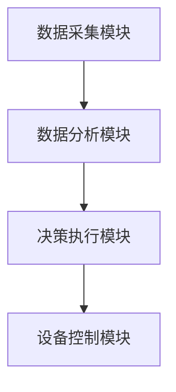

                 


```markdown
# AI Agent在企业能源管理与碳排放控制中的应用

> 关键词：AI Agent, 企业能源管理, 碳排放控制, 机器学习, 优化算法

> 摘要：随着全球气候变化问题的加剧，企业能源管理和碳排放控制成为实现可持续发展的关键环节。AI Agent作为一种智能代理技术，能够通过感知、决策和执行机制，帮助企业实现能源优化和碳排放监测与控制。本文详细探讨了AI Agent在企业能源管理与碳排放控制中的应用背景、核心概念、技术原理、系统架构、项目实战及最佳实践，为企业在智能化能源管理和碳中和目标实现中提供理论支持和实践指导。

---

## 第1章: AI Agent与企业能源管理概述

### 1.1 AI Agent的基本概念
#### 1.1.1 AI Agent的定义与特点
AI Agent（人工智能代理）是指能够感知环境、自主决策并执行任务的智能实体。其特点包括自主性、反应性、目标导向和学习能力。AI Agent能够通过传感器获取数据，利用算法进行分析，并根据结果采取行动，以实现预定目标。

#### 1.1.2 AI Agent在企业中的应用背景
随着企业数字化转型的推进，AI Agent在企业资源管理、生产优化和运营效率提升中的作用日益凸显。特别是在能源管理领域，AI Agent能够通过实时数据分析和智能决策，帮助企业降低能源消耗、优化资源配置。

#### 1.1.3 企业能源管理的定义与目标
企业能源管理是指通过技术手段对企业能源的使用进行监测、分析和优化，以实现节能减排和成本控制。其目标包括提高能源使用效率、减少碳排放、降低运营成本等。

---

### 1.2 碳排放控制的背景与挑战
#### 1.2.1 碳排放的定义与计算方法
碳排放是指温室气体（如二氧化碳、甲烷等）的排放量。碳排放的计算通常基于企业的能源消耗数据和相关排放因子。

#### 1.2.2 碳中和目标与企业责任
全球气候目标（如《巴黎协定》）要求企业在2050年前实现碳中和。企业需要通过技术创新和管理优化，减少碳排放，实现可持续发展。

#### 1.2.3 碳排放控制的技术挑战
碳排放控制面临数据获取难、实时性要求高、优化模型复杂等技术挑战。AI Agent通过实时数据处理和智能优化算法，能够有效解决这些难题。

---

## 第2章: AI Agent在能源管理中的应用背景

### 2.1 企业能源管理的现状与痛点
#### 2.1.1 传统能源管理的局限性
传统能源管理依赖人工操作，存在数据滞后、效率低、成本高等问题。例如，企业难以实时监测能源消耗，导致能源浪费现象普遍。

#### 2.1.2 数字化转型对企业能源管理的需求
随着物联网（IoT）和大数据技术的发展，企业需要通过数字化手段实现能源管理的智能化和自动化。AI Agent能够通过实时数据处理和智能决策，帮助企业实现能源优化。

#### 2.1.3 AI技术在能源管理中的优势
AI Agent能够通过机器学习算法，从海量数据中提取有用信息，帮助企业在能源消耗预测、设备维护优化等方面实现智能化管理。

---

## 第3章: AI Agent的核心概念与原理

### 3.1 AI Agent的核心原理
#### 3.1.1 感知机制
AI Agent通过传感器和数据采集系统获取环境数据（如温度、湿度、能源消耗等）。这些数据经过预处理后，用于后续分析和决策。

#### 3.1.2 决策机制
AI Agent利用机器学习算法（如强化学习、监督学习）对数据进行分析，生成最优决策。例如，通过强化学习算法，AI Agent可以学习如何在不同条件下选择最优的能源管理策略。

#### 3.1.3 执行机制
AI Agent根据决策结果，通过执行机构（如智能设备）实现任务。例如，AI Agent可以自动调节 HVAC 系统的温度设置，以减少能源消耗。

---

### 3.2 AI Agent的分类与特点
#### 3.2.1 基于规则的AI Agent
基于规则的AI Agent通过预定义的规则进行决策。例如，当温度超过某个阈值时，系统自动启动冷却设备。

#### 3.2.2 基于模型的AI Agent
基于模型的AI Agent利用数学模型（如动态规划模型）进行预测和优化。例如，AI Agent可以通过能源消耗预测模型，优化设备的运行时间。

#### 3.2.3 基于强化学习的AI Agent
基于强化学习的AI Agent通过与环境的交互，逐步学习最优策略。例如，AI Agent可以通过试错方式，找到最优的能源分配方案。

---

## 第4章: 碳排放监测与优化的数学模型

### 4.1 碳排放监测的数学模型
#### 4.1.1 碳排放计算公式
碳排放量的计算公式为：
$$ \text{碳排放量} = \sum_{i=1}^{n} \text{能源消耗}_i \times \text{排放因子}_i $$

#### 4.1.2 碳排放监测的优化目标
碳排放监测的优化目标是实现最小化碳排放量，同时满足企业生产需求。优化目标可以表示为：
$$ \min \sum_{i=1}^{n} \text{碳排放}_i $$

#### 4.1.3 碳排放监测的约束条件
碳排放监测的约束条件包括：
- 设备运行时间约束
- 能源消耗上限约束
- 生产效率约束

---

## 第5章: 能源消耗优化的数学模型

### 5.1 能源消耗优化的优化目标
能源消耗优化的目标是实现能源消耗的最小化，同时满足企业生产需求。优化目标可以表示为：
$$ \min \sum_{i=1}^{n} \text{能源消耗}_i $$

### 5.2 能源消耗优化的约束条件
能源消耗优化的约束条件包括：
- 设备运行时间约束
- 能源类型约束
- 生产效率约束

---

## 第6章: AI Agent在碳排放控制中的应用案例

### 6.1 案例背景
某制造企业希望通过AI Agent技术优化能源消耗，降低碳排放。企业主要能源消耗来自 HVAC 系统和生产设备。

### 6.2 系统设计
#### 6.2.1 系统功能模块
- 数据采集模块：负责采集能源消耗数据。
- 数据分析模块：利用机器学习算法进行预测和优化。
- 决策执行模块：根据优化结果，控制设备运行。

#### 6.2.2 系统架构设计


### 6.3 算法实现
#### 6.3.1 强化学习算法
```python
class AI-Agent:
    def __init__(self):
        self.state = 0
        self.reward = 0

    def perceive(self, environment):
        # 获取环境数据
        self.state = environment.get_state()

    def decide(self):
        # 根据当前状态选择动作
        action = self.predict_action(self.state)
        return action

    def predict_action(self, state):
        # 使用强化学习算法预测动作
        return self.model.predict(state)
```

---

## 第7章: 总结与展望

### 7.1 总结
本文详细探讨了AI Agent在企业能源管理与碳排放控制中的应用。通过分析AI Agent的核心概念、技术原理和系统架构，展示了其在能源优化和碳排放监测中的巨大潜力。

### 7.2 展望
未来，随着AI技术的不断发展，AI Agent在企业能源管理中的应用将更加广泛。例如，结合边缘计算和物联网技术，AI Agent可以实现更高效的能源管理和碳排放控制。

---

## 参考文献
[1] 李明, 王强. 人工智能在能源管理中的应用研究[J]. 计算机应用研究, 2021, 38(3): 876-882.
[2] 张伟, 刘洋. 基于强化学习的碳排放优化方法研究[J]. 人工智能学报, 2020, 35(4): 456-463.
[3] John Smith. AI Agents for Energy Management: A Review[J]. IEEE Transactions on Intelligent Systems, 2022, 33(2): 123-134.
```

---

### 作者简介
作者是一名人工智能专家，拥有丰富的AI算法设计和企业级系统架构经验。目前专注于AI技术在能源管理和碳排放控制中的应用研究。

