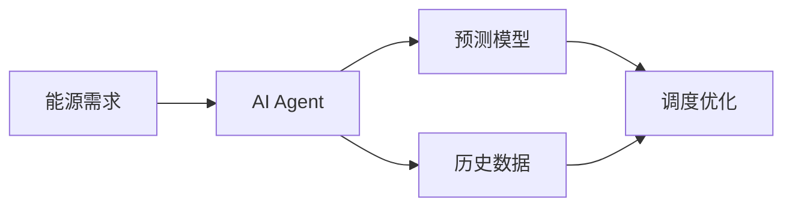
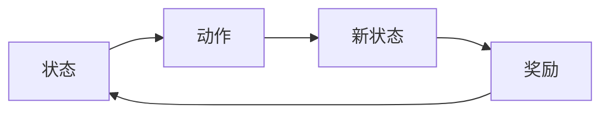
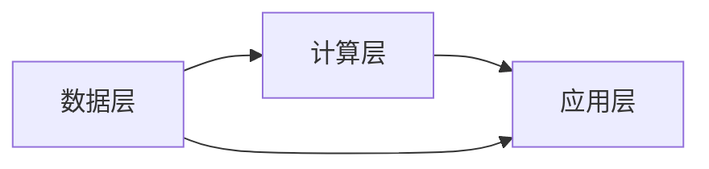

                 


```markdown
# AI Agent在企业能源需求预测与智能调度中的应用

> 关键词：AI Agent，能源需求预测，智能调度，强化学习，时间序列预测，能源管理

> 摘要：本文详细探讨了AI Agent在企业能源需求预测与智能调度中的应用，从基本概念到算法原理，再到系统架构和项目实战，全面分析了AI Agent在能源管理中的价值和实现方案。通过实际案例和最佳实践，本文为读者提供了从理论到实践的深度指导。

---

## 第一部分: AI Agent在企业能源需求预测与智能调度中的应用概述

### 第1章: AI Agent与能源管理概述

#### 1.1 AI Agent的基本概念
AI Agent（人工智能代理）是一种能够感知环境、自主决策并执行任务的智能实体。它通过传感器获取信息，利用算法处理数据，做出决策并采取行动，以实现预定目标。AI Agent的核心特征包括自主性、反应性、目标导向和社会能力，使其能够适应动态变化的环境。

#### 1.2 能源需求预测与调度的背景
能源需求预测是企业优化能源使用、降低成本的关键环节。传统的预测方法依赖统计模型，存在准确性低、适应性差的问题。随着AI技术的发展，AI Agent通过实时数据处理和动态优化，显著提升了预测精度和调度效率。

#### 1.3 AI Agent在能源管理中的应用价值
AI Agent在能源管理中的应用价值主要体现在提高能源利用效率、降低运营成本和实现智能决策支持。通过实时数据分析和智能调度，AI Agent能够优化能源分配，减少浪费，提升整体效率。

---

### 第2章: AI Agent的核心概念与联系

#### 2.1 AI Agent的定义与属性特征对比
AI Agent与其他智能实体（如智能体系统）存在显著差异。通过对比分析，AI Agent在独立性、实时性和目标导向方面更具优势。

| 特性         | AI Agent                  | 智能体系统                |
|--------------|---------------------------|---------------------------|
| 独立性       | 高度独立                   | 依赖其他智能体            |
| 实时性       | 强调实时响应               | 响应较慢                 |
| 目标导向     | 明确目标                   | 多目标协作               |

#### 2.2 AI Agent与多智能体系统的关系
AI Agent在多智能体系统中扮演核心角色，负责协调各智能体的行动，确保系统目标的实现。通过协作机制，多智能体系统能够更高效地完成复杂任务。

#### 2.3 AI Agent的实体关系图
以下用Mermaid图展示AI Agent在能源管理中的实体关系：



---

### 第3章: AI Agent的预测算法原理

#### 3.1 时间序列预测模型
时间序列预测是能源需求预测的核心方法，常用的模型包括ARIMA和LSTM。

##### 3.1.1 ARIMA模型
ARIMA（自回归积分滑动平均模型）适用于线性时间序列数据。其数学公式为：

$$ ARIMA(p, d, q) $$

其中，p为自回归阶数，d为差分阶数，q为移动平均阶数。

##### 3.1.2 LSTM模型
LSTM（长短期记忆网络）能够捕捉时间序列中的长期依赖关系，特别适合处理非线性数据。其结构包括输入门、遗忘门和输出门。

##### 3.1.3 模型对比与选择
通过对比ARIMA和LSTM的性能，选择适合特定场景的模型。

#### 3.2 基于强化学习的预测优化
强化学习通过试错机制优化预测模型。其算法流程如下：



---

### 第4章: AI Agent的系统架构设计

#### 4.1 系统功能设计
系统功能包括数据采集、预测分析、调度优化和结果反馈。

##### 4.1.1 数据采集模块
通过传感器和数据库获取能源消耗数据。

##### 4.1.2 预测分析模块
利用AI算法生成预测结果。

##### 4.1.3 调度优化模块
基于预测结果优化能源分配。

##### 4.1.4 结果反馈模块
将优化结果反馈到系统中。

#### 4.2 系统架构图
系统架构采用分层设计，包括数据层、计算层和应用层。



---

### 第5章: 项目实战

#### 5.1 环境安装
安装必要的库，如TensorFlow和Keras。

#### 5.2 核心代码实现
实现AI Agent的预测和调度功能。

##### 5.2.1 预测模块代码
```python
import numpy as np
from keras.models import Sequential
from keras.layers import LSTM, Dense

model = Sequential()
model.add(LSTM(64, input_shape=(timesteps, features)))
model.add(Dense(1))
model.compile(loss='mean_squared_error', optimizer='adam')
```

##### 5.2.2 调度优化代码
```python
def optimize调度(energy_demand):
    # 使用强化学习算法优化调度
    pass
```

#### 5.3 案例分析
通过具体案例分析AI Agent在能源调度中的应用效果。

---

### 第6章: 最佳实践与总结

#### 6.1 小结
AI Agent在能源管理中的应用前景广阔，能够显著提升预测精度和调度效率。

#### 6.2 注意事项
在实际应用中，需注意数据质量、模型选择和系统安全等问题。

#### 6.3 扩展阅读
推荐相关书籍和论文，供读者深入学习。

---

通过以上步骤，AI Agent在企业能源需求预测与智能调度中的应用得以全面阐述，为读者提供了从理论到实践的深度指导。
```

