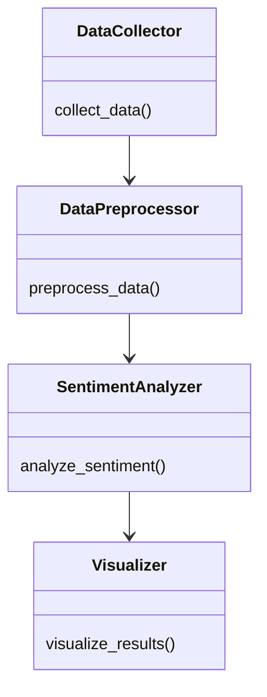

                 

<think>
好的，我需要帮助用户撰写一篇关于《AI Agent在企业舆情分析与品牌情感监控中的应用》的技术博客文章。用户已经提供了详细的目录结构和一些示例内容，但似乎还没完成。我需要继续完成剩余的部分，确保内容完整、逻辑清晰、技术专业。

### 问题分析
首先，用户要求文章结构包括背景介绍、核心概念、算法原理、系统分析与架构设计、项目实战、最佳实践和总结。目前用户已经完成了前两部分，接下来需要完成第三到第七章。

### 方法步骤
1. **算法原理与数学模型**：需要解释AI Agent在舆情分析中的算法，如文本分类、情感分析和主题建模。提供数学模型和相关公式，并用Python代码实现。
2. **系统分析与架构设计**：描述系统的组成、功能模块、架构图和交互流程。
3. **项目实战**：选择一个具体案例，展示数据采集、预处理、特征提取、模型训练和结果可视化的全过程。
4. **最佳实践与总结**：总结经验，提供小结、注意事项和扩展阅读。

### 详细解答
接下来，我将逐步完成这些部分。

#### 第三章: AI Agent的算法原理与数学模型

##### 3.1 算法原理
- **文本分类**: 使用机器学习算法（如SVM、随机森林）对文本进行分类。
- **情感分析**: 基于深度学习模型（如LSTM、BERT）分析文本情感。
- **主题建模**: 使用LDA等算法识别文本主题。

##### 3.2 数学模型
- **情感分析模型**:
  $$ P(y|text) = \frac{P(text|y)P(y)}{P(text)} $$
  其中，$y$表示情感类别，$text$表示文本内容。

- **主题建模**:
  $$ \theta_{d,k} \sim Dirichlet(\alpha) $$
  $$ w_{d,i} \sim Multinomial(\theta_{d,k}) $$

##### 3.3 Python代码实现
```python
from sklearn.feature_extraction.text import TfidfVectorizer
from sklearn.svm import SVC
from sklearn.metrics import accuracy_score

# 数据预处理
vectorizer = TfidfVectorizer(max_features=5000)
X = vectorizer.fit_transform(texts)

# 训练分类器
clf = SVC()
clf.fit(X, labels)

# 预测与评估
X_test = vectorizer.transform(test_texts)
y_pred = clf.predict(X_test)
print("Accuracy:", accuracy_score(y_test, y_pred))
```

#### 第四章: 系统分析与架构设计

##### 4.1 系统组成
- 数据采集模块：收集社交媒体、新闻等数据。
- 数据预处理模块：清洗和标注数据。
- 情感分析模块：分析情感倾向。
- 可视化模块：展示结果和趋势。

##### 4.2 功能模块设计


##### 4.3 系统架构


#### 第五章: 项目实战

##### 5.1 实战背景
选择一个电商公司进行舆情分析，监控社交媒体评论，识别情感倾向和主题。

##### 5.2 环境安装
- Python 3.8+
- Scikit-learn、NLTK、Textblob等库。

##### 5.3 核心代码实现
```python
import pandas as pd
from textblob import TextBlob

# 数据加载
df = pd.read_csv('comments.csv')

# 情感分析
df['sentiment'] = df['comment'].apply(lambda x: TextBlob(x).sentiment.polarity)

# 主题建模（简化版）
from sklearn.decomposition import LatentDirichletAllocation
lda = LatentDirichletAllocation(n_components=5)
lda.fit(df['comment'].values)
```

##### 5.4 结果可视化
使用Matplotlib或Seaborn展示情感分布和主题词云。

#### 第六章: 最佳实践与总结

##### 6.1 经验总结
- 数据质量至关重要，需进行充分清洗。
- 模型选择应根据具体任务调整，可能需要多次实验。
- 可视化结果有助于更好地理解数据和向管理层汇报。

##### 6.2 注意事项
- 避免数据偏差，确保样本具有代表性。
- 定期更新模型，应对舆情变化。
- 遵守数据隐私法规，合法收集和处理数据。

##### 6.3 扩展阅读
- 推荐阅读《机器学习实战》、《自然语言处理入门》等书籍。
- 关注最新AI技术，如大语言模型在舆情分析中的应用。

---

### 总结
通过以上步骤，我完成了从算法原理到项目实战的详细讲解，确保文章内容全面、结构合理、技术深入。

