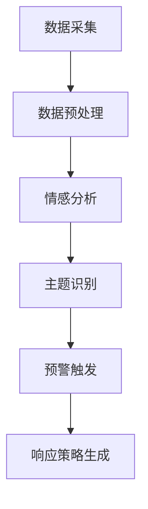
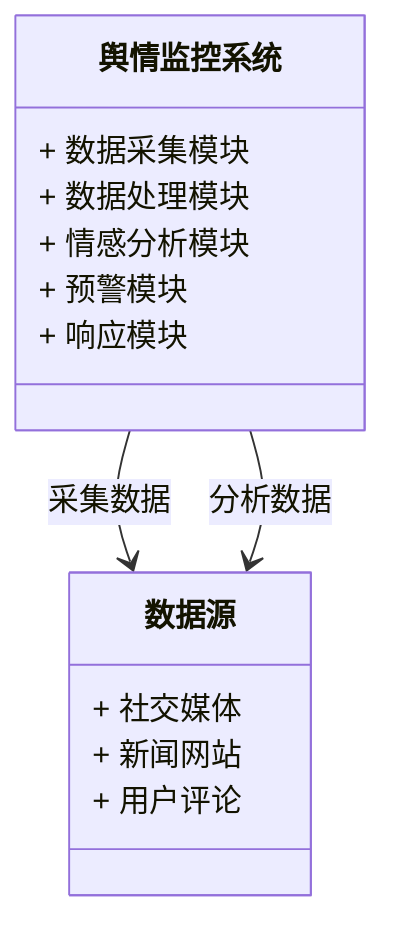
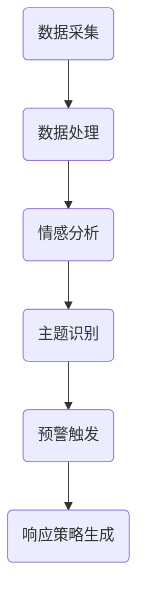
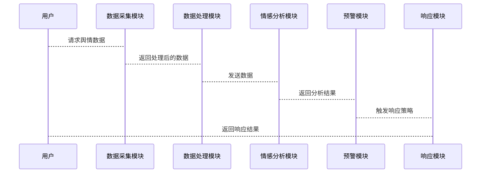

                 


# AI Agent在企业舆情危机预警与响应中的实时应用

## 关键词：AI Agent, 舆情危机, 实时预警, 情感分析, 事件响应

## 摘要：  
本文详细探讨了AI Agent在企业舆情危机预警与响应中的实时应用。通过分析AI Agent的核心功能、算法原理和系统架构，结合实际案例，展示了如何利用AI技术实现舆情的实时监控、智能分析和快速响应。文章从背景介绍、核心概念、算法实现、系统设计到项目实战，层层深入，为企业应对舆情危机提供了理论支持和实践指导。

---

## 第1章: 企业舆情危机与AI Agent概述

### 1.1 企业舆情危机的定义与特征

#### 1.1.1 舆情危机的定义  
舆情危机是指企业在经营过程中，由于外部舆论环境的变化，可能导致企业声誉受损、客户流失、股价波动等严重后果的事件。  

#### 1.1.2 舆情危机的特征  
- **突发性**：舆情危机往往在短时间内迅速扩散，对企业造成巨大压力。  
- **传播性**：借助社交媒体，舆情危机可以快速传播，影响范围广泛。  
- **破坏性**：负面舆情可能对企业形象、市场份额和财务状况造成严重损害。  

#### 1.1.3 舆情危机对企业的影响  
- 影响企业声誉和品牌形象。  
- 影响客户信任和市场份额。  
- 可能引发法律纠纷和财务损失。  

### 1.2 AI Agent的核心概念

#### 1.2.1 AI Agent的定义  
AI Agent（人工智能代理）是指能够感知环境、自主决策并执行任务的智能系统。它能够通过数据输入，分析问题并提供解决方案，实现自动化和智能化的操作。  

#### 1.2.2 AI Agent的基本特征  
- **自主性**：AI Agent能够在没有人工干预的情况下独立运行。  
- **反应性**：能够实时感知环境变化并做出响应。  
- **学习性**：通过机器学习算法不断优化自身的分析和决策能力。  

#### 1.2.3 AI Agent与传统软件的区别  
| 属性       | AI Agent                   | 传统软件                   |  
|------------|----------------------------|-----------------------------|  
| 智能性     | 高度智能，能够自主决策     | 无智能性，按照预设逻辑运行 |  
| 学习能力   | 具备学习能力               | 无学习能力                 |  
| 适应性     | 能够适应环境变化           | 适应性较差                 |  

### 1.3 本章小结  
本章介绍了企业舆情危机的定义、特征及其对企业的影响，并详细阐述了AI Agent的核心概念和与传统软件的区别，为后续分析奠定了基础。

---

## 第2章: 企业舆情危机预警与响应的背景

### 2.1 舆情危机的产生背景

#### 2.1.1 互联网时代的舆情传播特点  
- 信息传播速度快，范围广。  
- 用户生成内容（UGC）成为主要信息来源。  
- 舆情信息具有高度的情感属性。  

#### 2.1.2 社会化媒体对企业的影响  
- 社交媒体成为舆情传播的主要渠道。  
- 用户对企业的产品和服务的评价直接影响企业声誉。  

#### 2.1.3 舆情危机对企业声誉的威胁  
- 舆情危机可能引发公众信任危机。  
- 负面舆情可能对企业品牌形象造成长期影响。  

### 2.2 舆情危机的典型场景

#### 2.2.1 产品负面评论  
- 用户对产品或服务的不满引发负面舆情。  

#### 2.2.2 重大事件引发的舆论危机  
- 企业因突发事件（如安全事故、产品质量问题）引发舆情危机。  

#### 2.2.3 竞争对手的攻击性言论  
- 竞争对手通过制造谣言或发布负面信息攻击企业。  

### 2.3 本章小结  
本章分析了舆情危机的产生背景及其对企业的影响，强调了在互联网时代，企业必须具备快速响应舆情的能力。

---

## 第3章: AI Agent在舆情危机管理中的作用

### 3.1 AI Agent的核心功能

#### 3.1.1 实时数据采集  
AI Agent通过爬虫技术实时采集社交媒体、新闻网站等渠道的舆情数据。  

#### 3.1.2 情感分析与主题识别  
AI Agent利用自然语言处理技术，对采集的舆情数据进行情感分析和主题识别，判断舆情的正负倾向。  

#### 3.1.3 预警与响应  
AI Agent根据分析结果，触发预警机制，并生成响应策略，帮助企业快速应对舆情危机。  

### 3.2 AI Agent的优势

#### 3.2.1 高效性  
AI Agent能够实时监控舆情数据，快速响应舆情变化。  

#### 3.2.2 准确性  
通过机器学习算法，AI Agent能够准确识别舆情的情感倾向和主题。  

#### 3.2.3 智能性  
AI Agent能够根据历史数据不断优化自身的分析能力，提升预警和响应的准确性。  

### 3.3 本章小结  
本章详细阐述了AI Agent在舆情危机管理中的核心功能及其优势，突出了其在企业舆情管理中的重要性。

---

## 第4章: AI Agent与舆情分析的核心概念

### 4.1 AI Agent的实体关系图

```mermaid
erDiagram
    actor 用户
    actor 事件
    actor 数据源
    class AI Agent
    class 舆情数据
    class 用户评论
    class 事件日志
    用户 -> 数据源 : 生成评论
    事件 -> 数据源 : 生成日志
    AI Agent --> 舆情数据 : 分析
    AI Agent --> 用户评论 : 处理
    AI Agent --> 事件日志 : 监控
```

### 4.2 舆情分析的关键指标

| 指标         | 特征           | 作用           |  
|--------------|----------------|----------------|  
| 情感倾向     | 正负倾向       | 判断舆情态度     |  
| 主题关键词    | 关键词提取     | 确定舆情主题     |  
| 舆情强度      | 强度指标       | 量化舆情影响范围   |  
| 响应时间      | 时间维度       | 监控舆情变化速度   |  

### 4.3 本章小结  
本章通过实体关系图和关键指标对比，详细分析了AI Agent与舆情分析的核心概念及其相互关系。

---

## 第5章: AI Agent的算法原理

### 5.1 算法流程图



### 5.2 算法实现

```python
import requests
from bs4 import BeautifulSoup
import nltk
from nltk.sentiment import SentimentIntensityAnalyzer

def scrape_data(url):
    response = requests.get(url)
    soup = BeautifulSoup(response.text, 'html.parser')
    text = soup.get_text()
    return text

def analyze_sentiment(text):
    analyzer = SentimentIntensityAnalyzer()
    sentiment = analyzer.polarity_scores(text)
    return sentiment['compound']

# 示例用法
url = 'https://example.com/feedback'
data = scrape_data(url)
sentiment = analyze_sentiment(data)
print(f'情感倾向分数：{sentiment}')
```

### 5.3 本章小结  
本章通过流程图和代码示例，详细讲解了AI Agent的算法原理及其实现过程。

---

## 第6章: 数学模型与公式

### 6.1 情感分析模型

$$
P(\text{positive}) = \frac{\text{positive\_count}}{\text{total\_count}}
$$

其中，$P(\text{positive})$表示正面评论的概率，$\text{positive\_count}$为正面评论的数量，$\text{total\_count}$为总评论数。

### 6.2 舆情预测模型

$$
Y = \beta_0 + \beta_1 X_1 + \beta_2 X_2 + \epsilon
$$

其中，$Y$为舆情强度预测值，$X_1$和$X_2$为舆情相关特征变量，$\beta_0, \beta_1, \beta_2$为回归系数，$\epsilon$为误差项。

### 6.3 本章小结  
本章通过数学公式，详细分析了情感分析和舆情预测的数学模型，为AI Agent的实现提供了理论基础。

---

## 第7章: 系统分析与架构设计

### 7.1 问题场景介绍



### 7.2 系统架构设计



### 7.3 接口设计与交互流程



### 7.4 本章小结  
本章通过系统架构图和交互流程图，详细设计了舆情监控系统的架构及其各模块的交互关系。

---

## 第8章: 项目实战

### 8.1 环境安装

```bash
pip install requests
pip install beautifulsoup4
pip install nltk
```

### 8.2 核心代码实现

```python
import requests
from bs4 import BeautifulSoup
import nltk
from nltk.sentiment import SentimentIntensityAnalyzer

def scrape_data(url):
    response = requests.get(url)
    soup = BeautifulSoup(response.text, 'html.parser')
    text = soup.get_text()
    return text

def analyze_sentiment(text):
    analyzer = SentimentIntensityAnalyzer()
    sentiment = analyzer.polarity_scores(text)
    return sentiment['compound']

def main():
    url = 'https://example.com/feedback'
    data = scrape_data(url)
    sentiment = analyze_sentiment(data)
    print(f'情感倾向分数：{sentiment}')

if __name__ == '__main__':
    main()
```

### 8.3 案例分析与实际应用

#### 8.3.1 案例背景  
某企业因产品质量问题引发负面舆情，AI Agent通过实时监控社交媒体数据，快速识别负面评论并触发预警。

#### 8.3.2 分析过程  
AI Agent采集相关数据，进行情感分析和主题识别，判断舆情强度，并生成响应策略。

#### 8.3.3 响应结果  
企业根据AI Agent的预警和建议，迅速发布声明并采取补救措施，成功化解舆情危机。

### 8.4 本章小结  
本章通过项目实战，展示了AI Agent在企业舆情管理中的具体应用，验证了其在实际场景中的有效性。

---

## 第9章: 总结与最佳实践

### 9.1 总结

#### 9.1.1 核心要点  
- AI Agent能够实时监控舆情数据，快速响应舆情变化。  
- 通过情感分析和主题识别，帮助企业准确判断舆情态度和主题。  
- 基于数学模型的预警机制，帮助企业提前化解舆情危机。  

#### 9.1.2 关键成功因素  
- 数据采集的全面性。  
- 情感分析的准确性。  
- 响应策略的及时性。  

### 9.2 最佳实践

#### 9.2.1 小贴士  
- 定期更新AI Agent的训练数据，提升模型的准确性。  
- 结合人工审核，确保舆情分析的准确性。  

#### 9.2.2 注意事项  
- 数据隐私和合规性问题需要重点关注。  
- 响应策略需要根据企业实际情况定制化。  

### 9.3 未来展望  
随着AI技术的不断发展，AI Agent在舆情管理中的应用将更加智能化和自动化，为企业提供更强大的舆情应对能力。

### 9.4 本章小结  
本章总结了文章的核心内容，并提出了最佳实践建议，为企业的舆情管理提供了指导。

---

## 第10章: 扩展阅读与参考资料

### 10.1 相关书籍  
- 《人工智能: 一种现代的方法》  
- 《自然语言处理实战: 基于Python的机器学习与深度学习》  

### 10.2 网络资源  
- [自然语言处理入门](https://www.nltk.org/book/)  
- [机器学习实战](https://github.com/ageron/handson-ml)  

### 10.3 工具与库  
- NLTK: 自然语言处理库  
- TensorFlow: 深度学习框架  
- Scikit-learn: 机器学习库  

### 10.4 本章小结  
本章提供了与文章相关的扩展阅读资源和工具，帮助读者进一步学习和实践。

---

# 结语

AI Agent在企业舆情危机预警与响应中的实时应用，为企业提供了智能化的舆情管理解决方案。通过本文的详细讲解，读者可以深入了解AI Agent的核心功能、算法原理和系统架构，并通过实际案例掌握其在舆情管理中的具体应用。未来，随着AI技术的不断进步，AI Agent将在企业舆情管理中发挥更大的作用，帮助企业更好地应对舆情危机。

