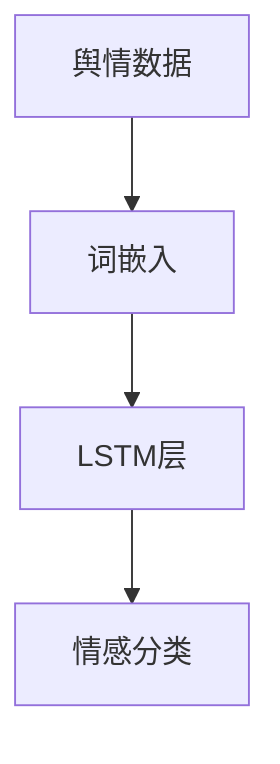
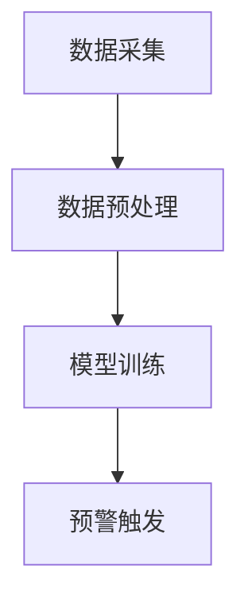
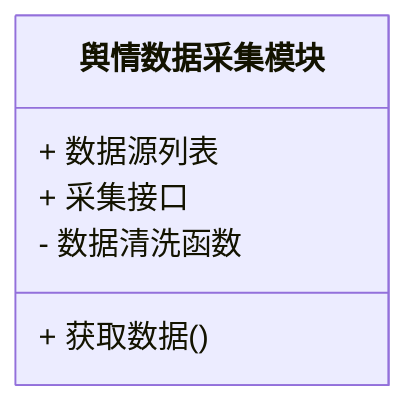
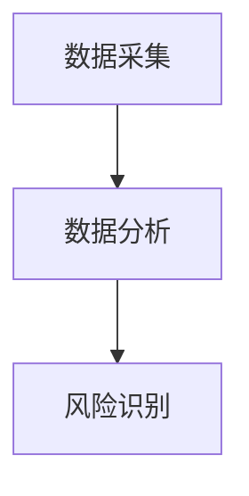

                 


# AI Agent在企业舆情危机预警与响应中的应用

> 关键词：AI Agent，舆情危机，预警，响应，自然语言处理，机器学习，舆情监控

> 摘要：本文深入探讨了AI Agent在企业舆情危机管理中的应用，分析了其在舆情预警和响应中的优势，结合具体算法和系统架构，详细讲解了如何利用AI Agent构建高效的舆情监控系统。

---

## 第一章 引言

### 1.1 舆情危机的重要性

在当今信息爆炸的时代，企业面临来自社交媒体、新闻媒体和客户反馈的海量信息。舆情危机可能迅速对企业声誉和市场地位造成重大影响。及时发现和处理负面舆情是企业危机管理的关键。

### 1.2 AI Agent的优势

AI Agent（人工智能代理）具备实时监控、自动分析和智能响应的能力，能够显著提高舆情管理的效率和准确性。与传统舆情监控工具相比，AI Agent能够主动学习和优化，适应复杂的舆情环境。

### 1.3 本文结构

本文将从AI Agent的基本概念、舆情预警模型、响应机制等方面展开，结合实际案例，详细讲解AI Agent在企业舆情管理中的应用。

---

## 第二章 AI Agent的核心概念与技术特点

### 2.1 AI Agent的基本原理

AI Agent通过自然语言处理（NLP）和机器学习技术，分析文本数据，识别情感倾向和关键词，从而判断舆情的积极或消极性质。

### 2.2 技术特点对比

| 技术特点         | 传统舆情监控工具 | AI Agent |
|------------------|------------------|-----------|
| 数据处理能力     | 基于关键词匹配   | 深度学习   |
| 自适应能力       | 有限             | 强大       |
| 响应速度         | 较慢             | 实时       |

### 2.3 AI Agent在舆情管理中的优势

AI Agent能够实现舆情的实时监控、自动化分析和智能响应，显著提升舆情管理的效率和精准度。

---

## 第三章 AI Agent的舆情预警模型

### 3.1 情感分析模型

#### 3.1.1 LSTM模型

LSTM（长短时记忆网络）用于处理序列数据，适合分析时间序列的舆情变化。

**流程图：**


#### 3.1.2 BERT模型

BERT通过预训练语言模型，能够理解上下文关系，提升情感分析的准确性。

**代码示例：**
```python
from transformers import BertTokenizer, BertModel
tokenizer = BertTokenizer.from_pretrained('bert-base-uncased')
model = BertModel.from_pretrained('bert-base-uncased')
```

### 3.2 舆情预警算法

#### 3.2.1 算法流程

1. 数据采集：从社交媒体、新闻网站等渠道获取舆情数据。
2. 数据预处理：清洗、分词和去停用词。
3. 模型训练：使用LSTM或BERT模型训练情感分析模型。
4. 预警触发：当负面情感强度超过阈值时，触发预警。

**流程图：**


---

## 第四章 AI Agent的舆情响应机制

### 4.1 自动化响应策略

AI Agent能够根据预警结果自动生成响应策略，例如发布澄清声明或联系客户解决问题。

### 4.2 人工干预与协作

在复杂舆情事件中，AI Agent提供决策支持，辅助人类专家制定最优响应方案。

### 4.3 响应效果评估

通过分析舆情变化，评估响应措施的有效性，并优化后续的响应策略。

---

## 第五章 基于AI Agent的舆情决策支持系统

### 5.1 系统架构设计

#### 5.1.1 数据采集模块

负责从多渠道采集舆情数据，并进行初步清洗。

**类图：**


#### 5.1.2 数据分析模块

利用机器学习模型对数据进行深度分析，识别潜在风险。

**流程图：**


### 5.2 系统接口设计

定义清晰的API接口，便于与其他系统（如CRM、邮件系统）集成。

---

## 第六章 项目实战：基于Python的AI Agent舆情监控系统

### 6.1 环境安装

安装必要的库，如自然语言处理库和机器学习库：
```bash
pip install numpy pandas transformers
```

### 6.2 核心代码实现

#### 6.2.1 情感分析模块

```python
from transformers import BertTokenizer, BertModel
import torch

def analyze_sentiment(text):
    inputs = tokenizer(text, return_tensors='pt')
    outputs = model(**inputs)
    prediction = torch.argmax(outputs.logits, dim=-1)
    return prediction.item()
```

#### 6.2.2 预警触发模块

```python
def trigger_alert(sentiment_score):
    if sentiment_score > 0.8:
        print("负面舆情预警！")
```

### 6.3 实际案例分析

通过具体案例，展示系统如何实时监控和处理负面舆情。

---

## 第七章 总结与展望

### 7.1 本文总结

本文详细探讨了AI Agent在企业舆情管理中的应用，从理论到实践，展示了如何利用AI技术提升舆情预警和响应的效率。

### 7.2 未来展望

未来，随着AI技术的不断发展，舆情管理将更加智能化和自动化，AI Agent将在企业危机管理中发挥更大的作用。

---

通过以上内容，我们可以看到AI Agent在企业舆情危机管理中的巨大潜力，结合先进的自然语言处理和机器学习技术，企业能够更有效地应对舆情危机，维护品牌形象和市场地位。

