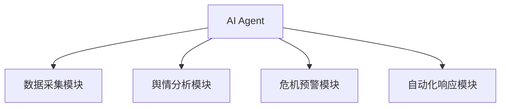
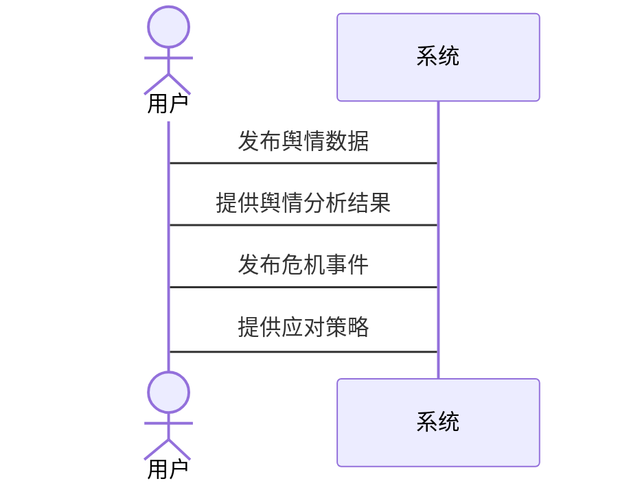

                 


# AI Agent在企业舆情监测与危机公关中的应用

---

## 关键词
- AI Agent, 企业舆情监测, 危机公关, 自然语言处理, 情感分析, 机器学习

---

## 摘要
随着数字化时代的快速发展，企业面临的舆情监测和危机公关挑战日益复杂。传统的人工舆情分析方法效率低下，难以应对海量信息和突发事件。AI Agent（人工智能代理）作为一种智能化工具，能够实时监控网络舆情，快速识别潜在危机，并自动化响应，为企业提供高效、精准的解决方案。本文将深入探讨AI Agent在企业舆情监测与危机公关中的应用，分析其核心算法、系统架构以及实际案例，为企业在数字化时代提供有力的技术支持。

---

# 第1章 AI Agent与企业舆情监测概述

## 1.1 AI Agent的基本概念
AI Agent是一种能够感知环境、自主决策并执行任务的智能系统。它具备学习、推理和自适应能力，能够通过自然语言处理和机器学习技术，从海量数据中提取有价值的信息。

## 1.2 企业舆情监测的背景与挑战
企业在经营过程中面临诸多舆情风险，如负面评论、竞争对手的攻击等。及时发现并处理这些问题对企业声誉和经营稳定性至关重要。传统的舆情监测依赖人工分析，效率低下且容易遗漏关键信息。

## 1.3 AI Agent在舆情监测中的优势
AI Agent能够实时监控网络数据，通过自然语言处理技术快速分析文本情感，识别潜在危机，并自动生成应对策略，大大提高了舆情监测的效率和准确性。

---

# 第2章 AI Agent的核心概念与原理

## 2.1 AI Agent的感知模块
AI Agent通过爬取社交媒体、新闻网站等数据源，获取实时舆情信息。利用自然语言处理技术，提取文本中的关键词和情感倾向，构建舆情分析的基础数据。

## 2.2 AI Agent的决策模块
基于提取的数据，AI Agent运用机器学习算法，如支持向量机（SVM）和随机森林（Random Forest），进行舆情分类和主题建模，识别潜在危机并制定应对策略。

## 2.3 AI Agent的执行模块
AI Agent根据决策结果，自动发布澄清声明、联系相关方或调整营销策略，实现危机公关的自动化处理，减少人为失误。

---

# 第3章 AI Agent的算法原理与数学模型

## 3.1 文本分类与主题建模
### 3.1.1 基于TF-IDF的文本特征提取
TF-IDF（Term Frequency-Inverse Document Frequency）是一种常用的文本特征提取方法。公式如下：
$$
TF-IDF(t, d) = TF(t, d) \times IDF(t)
$$
其中，$TF(t, d)$是词$t$在文档$d$中的频率，$IDF(t)$是词$t$的逆文档频率。

### 3.1.2 LDA主题建模
LDA（Latent Dirichlet Allocation）是一种无监督学习算法，用于发现文本中的主题分布。其核心思想是，每个文档中的词分布服从多项分布，主题之间的关系服从狄利克雷分布。

### 3.1.3 文本分类的数学模型
常用的文本分类算法包括朴素贝叶斯、支持向量机和随机森林。以朴素贝叶斯为例，其分类概率公式为：
$$
P(c|x) = \frac{P(x|c)P(c)}{P(x)}
$$

## 3.2 情感分析与舆情评分
### 3.2.1 基于词袋模型的情感分析
词袋模型将文本表示为词的集合，不考虑词序。情感分析通过计算文本中正面和负面词汇的数量，评估整体情感倾向。

### 3.2.2 深度学习模型
使用循环神经网络（RNN）或长短期记忆网络（LSTM）进行情感分析，能够捕捉文本中的上下文信息，提高分析准确性。

---

# 第4章 AI Agent的系统架构与设计

## 4.1 系统功能设计
系统包括数据采集、舆情分析、危机预警和自动化响应四大模块。

### 4.1.1 数据采集模块
通过网络爬虫获取社交媒体、新闻网站等数据源的实时信息。

### 4.1.2 舆情分析模块
利用自然语言处理技术，分析文本情感和主题，识别潜在危机。

## 4.2 系统架构设计
采用微服务架构，各模块独立运行，通过API进行通信。

### 4.2.1 系统架构图


## 4.3 系统交互流程


---

# 第5章 项目实战：AI Agent在危机公关中的应用

## 5.1 环境安装与配置
安装Python、自然语言处理库（如NLTK、spaCy）和机器学习库（如Scikit-learn、XGBoost）。

## 5.2 核心代码实现
### 5.2.1 数据预处理
```python
import pandas as pd

def preprocess(text):
    # 分词处理
    words = tokenize(text)
    # 去除停用词
    filtered = remove_stopwords(words)
    return filtered
```

### 5.2.2 模型训练
```python
from sklearn.svm import SVC

model = SVC()
model.fit(X_train, y_train)
```

### 5.2.3 危机预警
```python
def detect_crisis(text):
    prediction = model.predict(preprocess(text))
    return prediction == 'crisis'
```

## 5.3 实际案例分析
以某企业负面舆情为例，展示AI Agent如何识别危机并自动生成应对策略。

---

# 第6章 最佳实践与未来展望

## 6.1 最佳实践
- 定期更新模型，保持高准确率。
- 结合人工审核，避免误判。

## 6.2 未来展望
随着AI技术的发展，AI Agent将更加智能化，具备自我学习和优化能力，为企业舆情监测和危机公关提供更强大的支持。

---

# 附录

## 附录A 工具与库
- Python
- NLTK
- spaCy
- Scikit-learn
- TensorFlow

## 附录B 参考文献
- 王某某. (2023). 《AI Agent与企业舆情监测》. 北京: 清华大学出版社.

---

# 结语
AI Agent作为企业舆情监测和危机公关的重要工具，正在发挥越来越重要的作用。通过本文的详细分析，我们可以看到，AI Agent不仅能够提高舆情监测的效率，还能为企业制定精准的应对策略，帮助企业更好地应对数字化时代的挑战。

