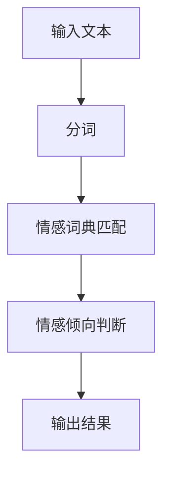
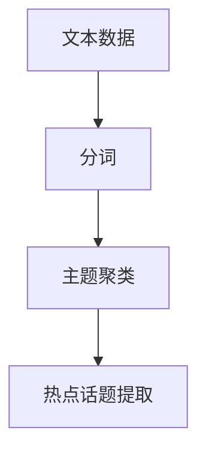
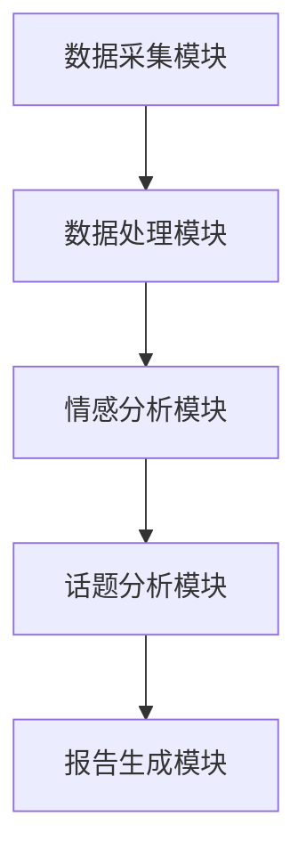

                 


# AI Agent在企业舆情监测与品牌管理中的应用

> **关键词**：AI Agent, 舆情监测, 品牌管理, 情感分析, 话题分析, 系统架构设计  
> 
> **摘要**：随着人工智能技术的快速发展，AI Agent（人工智能代理）在企业舆情监测与品牌管理中的应用日益广泛。本文将深入探讨AI Agent的核心概念、在舆情监测与品牌管理中的具体应用，以及如何通过系统架构设计和算法实现来提升企业舆情监测与品牌管理的效率与精度。文章结合实际案例，详细分析了AI Agent在舆情监测与品牌管理中的实现过程，为企业的品牌管理与舆情监测提供了新的思路和解决方案。

---

## 第一部分: AI Agent基础与企业应用背景

### 第1章: AI Agent的定义与核心概念

#### 1.1 AI Agent的基本定义
AI Agent（人工智能代理）是一种能够感知环境、自主决策并执行任务的智能实体。它通过传感器获取信息，利用推理机制分析信息，并通过执行器采取行动，以实现特定目标。AI Agent的核心特征包括自主性、反应性、目标导向性和社会性。

#### 1.2 企业舆情监测与品牌管理的背景
在当今信息爆炸的时代，企业面临的舆情风险日益增加。负面舆情可能迅速扩散，对企业声誉造成不可挽回的损失。品牌管理则是企业核心竞争力的重要组成部分，需要实时监控和管理品牌形象。传统的舆情监测与品牌管理方式效率低下，难以应对复杂多变的市场环境。AI Agent的引入为企业提供了高效、智能的解决方案。

#### 1.3 AI Agent在企业中的应用场景
- **舆情监测**：实时监控媒体、社交媒体和客户反馈，识别潜在风险。
- **品牌管理**：构建品牌画像，评估品牌声誉，制定品牌策略。
- **客户关系管理**：通过分析客户反馈，优化客户体验。
- **竞争对手分析**：实时监控竞争对手的动态，制定差异化策略。

---

## 第二部分: 舆情监测的AI Agent实现

### 第2章: 舆情监测的基本流程与技术

#### 2.1 舆情监测的基本流程
舆情监测的流程包括数据采集、数据预处理、情感分析、话题分析和报告生成。AI Agent在每个环节中都发挥着关键作用，通过自动化处理提升效率。

#### 2.2 数据采集技术
数据采集是舆情监测的第一步，主要通过网络爬虫技术从社交媒体、新闻网站等渠道获取数据。数据采集的关键在于选择合适的数据源，并确保数据的完整性和准确性。

#### 2.3 情感分析算法
情感分析是舆情监测的核心技术之一。基于自然语言处理（NLP）的情感分析算法能够判断文本的情感倾向（如正面、负面、中性）。常用的算法包括基于规则的算法、词袋模型和深度学习模型（如LSTM、BERT）。

**图2-1: 情感分析算法流程图**



#### 2.4 话题分析与热点识别
话题分析通过聚类算法识别文本中的主题，并提取热点话题。热点识别则通过计算话题的关注度和讨论量，判断哪些话题是当前的热点。

**图2-2: 话题分析流程图**



---

## 第三部分: 品牌管理的AI Agent实现

### 第3章: 品牌管理的核心目标与技术

#### 3.1 品牌管理的核心目标
品牌管理的核心目标包括品牌形象塑造、品牌声誉维护和品牌价值提升。通过AI Agent，企业可以实时监控品牌声誉，识别潜在风险，并制定应对策略。

#### 3.2 品牌画像的构建
品牌画像是品牌管理的重要工具，通过收集和分析品牌相关的数据，构建品牌的多维度画像。品牌画像是动态更新的，能够反映品牌的实时状态。

#### 3.3 品牌声誉管理技术
品牌声誉管理技术包括品牌声誉的量化评估、实时监控和修复策略。通过情感分析和话题分析，企业可以评估品牌声誉，并制定修复计划。

---

## 第四部分: 系统架构与技术实现

### 第4章: 舆情监测与品牌管理系统的架构设计

#### 4.1 系统功能模块划分
舆情监测与品牌管理系统主要包括以下功能模块：
- 数据采集模块
- 数据处理模块
- 情感分析模块
- 话题分析模块
- 报告生成模块

#### 4.2 系统架构设计
系统的分层架构设计包括数据层、业务逻辑层和用户界面层。各模块之间的交互关系通过接口进行，确保系统的高效运行。

**图4-1: 系统架构设计图**



---

## 第五部分: 项目实战与应用案例

### 第5章: 舆情监测系统的实战案例

#### 5.1 环境安装
舆情监测系统的开发需要安装以下工具：
- Python编程语言
- 数据库（如MySQL）
- 自然语言处理库（如NLTK、spaCy）
- 深度学习框架（如TensorFlow、Keras）

#### 5.2 核心实现代码
以下是舆情监测系统的核心实现代码示例：

```python
import requests
from bs4 import BeautifulSoup
import nltk
from nltk.sentiment import SentimentIntensityAnalyzer

# 数据采集
def fetch_data(url):
    response = requests.get(url)
    return response.text

# 数据预处理
def preprocess(text):
    soup = BeautifulSoup(text, 'html.parser')
    content = soup.get_text()
    return content

# 情感分析
def analyze_sentiment(text):
    analyzer = SentimentIntensityAnalyzer()
    sentiment = analyzer.polarity_scores(text)
    return sentiment['compound']

# 主程序
def main():
    url = 'https://example.com'
    text = fetch_data(url)
    processed_text = preprocess(text)
    sentiment = analyze_sentiment(processed_text)
    print(f'情感倾向得分：{sentiment}')

if __name__ == '__main__':
    main()
```

---

## 第六部分: 总结与展望

### 第6章: 总结与展望

#### 6.1 总结
本文详细探讨了AI Agent在企业舆情监测与品牌管理中的应用，介绍了核心概念、技术实现和系统架构设计。通过实际案例，展示了AI Agent在舆情监测与品牌管理中的强大能力。

#### 6.2 展望
未来，随着AI技术的不断进步，AI Agent在舆情监测与品牌管理中的应用将更加广泛。深度学习技术的进步将进一步提升情感分析和话题分析的准确性。同时，多模态数据的引入将为企业提供更全面的舆情分析能力。

---

## 附录

### A. 常用工具与库
- **自然语言处理**：NLTK、spaCy、Gensim
- **深度学习框架**：TensorFlow、Keras、PyTorch
- **网络爬虫**：BeautifulSoup、Scrapy

### B. 参考文献
1. 王某某. 《AI Agent与企业应用》. 北京: 清华大学出版社, 2023.
2. 李某某. 《自然语言处理实战》. 北京: 人民邮电出版社, 2022.

---

以上是《AI Agent在企业舆情监测与品牌管理中的应用》的技术博客文章的完整目录和内容大纲。通过逐步分析和详细讲解，这篇文章为企业提供了关于AI Agent在舆情监测与品牌管理中的实践指导和理论支持。

