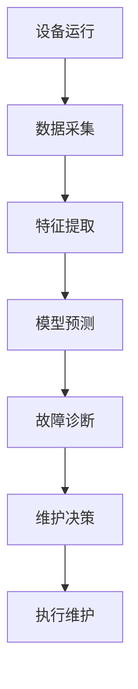
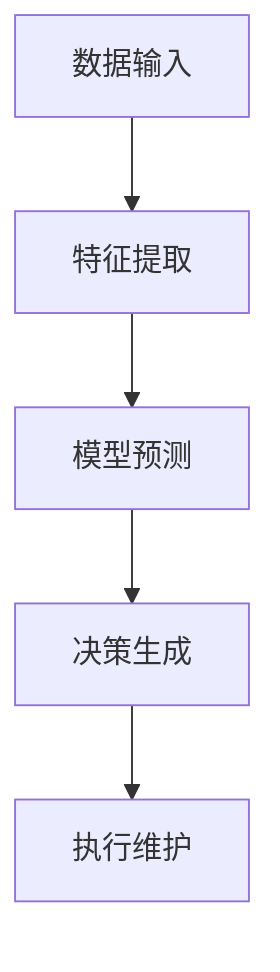
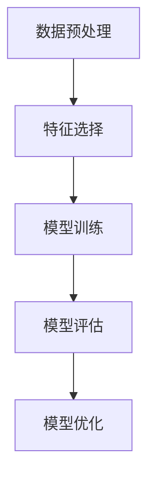
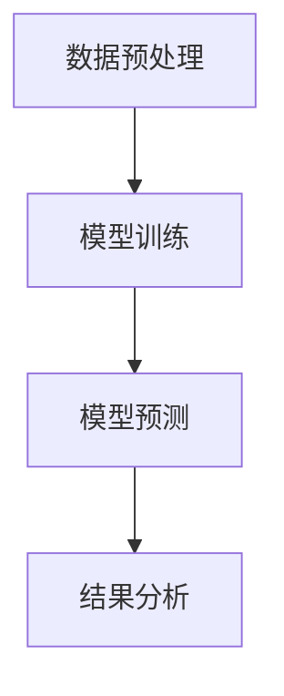
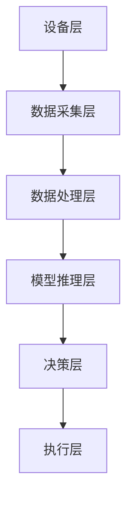
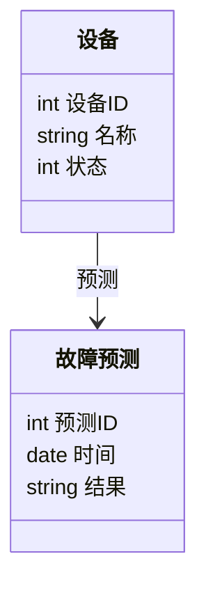
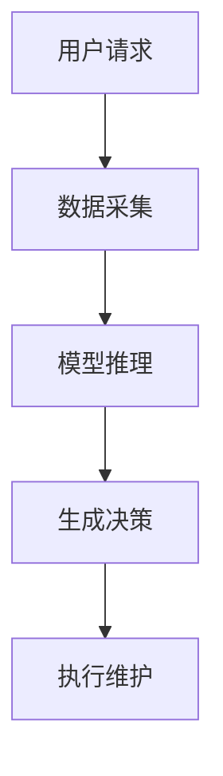

                 


# AI Agent在企业设备预测性维护中的应用

> 关键词：AI Agent，预测性维护，企业设备，智能维护，机器学习

> 摘要：本文探讨了AI Agent在企业设备预测性维护中的应用，从概念、原理到系统架构、项目实战，全面分析了其在提升设备维护效率和准确性方面的优势，结合实际案例，展示了如何利用AI技术优化企业设备维护流程。

---

## 第1章: AI Agent与预测性维护概述

### 1.1 AI Agent的基本概念

#### 1.1.1 AI Agent的定义与特征
- **定义**：AI Agent（人工智能代理）是指能够感知环境、自主决策并执行任务的智能实体。
- **特征**：
  - 智能性：基于数据和模型进行推理和决策。
  - 自主性：无需人工干预，自主执行任务。
  - 反应性：实时感知环境变化并做出反应。
  - 学习性：通过数据和经验不断优化自身性能。

#### 1.1.2 AI Agent的核心功能与分类
- **核心功能**：
  - 数据采集与处理：收集设备运行数据。
  - 故障预测：基于历史数据和模型预测潜在故障。
  - 自动决策：制定维护计划并执行。
- **分类**：
  - 简单规则型：基于预设规则执行任务。
  - 基于模型型：利用机器学习模型进行决策。
  - 自适应学习型：能够动态调整策略。

#### 1.1.3 AI Agent在企业中的应用场景
- **应用场景**：
  - 工厂设备维护：预测设备故障，减少停机时间。
  - 智能家居：远程监控和维护家电。
  - 智慧交通：实时监控和维护交通设备。

### 1.2 预测性维护的定义与优势

#### 1.2.1 预测性维护的定义
- 预测性维护是一种通过分析设备运行数据，预测设备未来状态，并在故障发生前采取维护措施的技术。

#### 1.2.2 预测性维护的主要优势
- **优势**：
  - 减少设备停机时间：通过预测故障，提前安排维护。
  - 降低维护成本：避免突发故障带来的高昂维修费用。
  - 提高设备利用率：通过优化维护计划，最大化设备使用效率。

#### 1.2.3 预测性维护在企业设备管理中的作用
- **作用**：
  - 提高生产效率：减少因设备故障导致的停产时间。
  - 降低维护成本：通过预防性维护减少维修费用。
  - 延长设备寿命：及时维护延长设备使用周期。

### 1.3 AI Agent在预测性维护中的应用背景

#### 1.3.1 企业设备维护的传统模式与挑战
- **传统模式**：
  - 基于经验的维护：依赖维护人员的经验进行维护决策。
  - 定期维护：按固定周期进行设备检查和维护。
- **挑战**：
  - 维护成本高：定期维护可能导致不必要的维护费用。
  - 故障响应慢：无法快速应对突发故障。
  - 维护效率低：依赖人工经验，效率不高。

#### 1.3.2 AI Agent如何解决预测性维护的问题
- **解决方案**：
  - AI Agent通过实时数据分析，准确预测设备故障。
  - 自动化决策：AI Agent可以根据预测结果自动安排维护计划。
  - 智能优化：通过历史数据和模型不断优化维护策略。

#### 1.3.3 预测性维护的边界与外延
- **边界**：
  - 仅限于设备本身的预测性维护，不包括外部环境因素。
- **外延**：
  - 可扩展至供应链、生产流程等其他领域的预测性维护。

## 1.4 本章小结
- 本章介绍了AI Agent和预测性维护的基本概念，分析了预测性维护的优势，并探讨了AI Agent在预测性维护中的应用背景。通过对比传统维护模式和AI Agent的优势，明确了AI Agent在预测性维护中的重要性。

---

## 第2章: AI Agent与预测性维护的核心概念

### 2.1 AI Agent的核心概念

#### 2.1.1 AI Agent的感知与决策机制
- **感知机制**：通过传感器、数据库等获取设备运行数据。
- **决策机制**：基于感知数据和预设模型，生成维护决策。

#### 2.1.2 AI Agent的知识表示与推理
- **知识表示**：使用符号逻辑、概率模型等表示知识。
- **推理机制**：基于知识库进行逻辑推理，生成决策。

#### 2.1.3 AI Agent的自主学习能力
- **学习机制**：通过机器学习算法，不断优化模型参数。
- **在线学习**：实时更新模型，适应环境变化。

### 2.2 预测性维护的核心概念

#### 2.2.1 设备状态监测与故障预测
- **状态监测**：实时监控设备运行状态，采集关键指标。
- **故障预测**：基于历史数据和模型，预测设备未来状态。

#### 2.2.2 数据采集与特征提取
- **数据采集**：通过传感器、日志等获取设备运行数据。
- **特征提取**：从原始数据中提取有助于故障预测的特征。

#### 2.2.3 故障诊断与维护决策
- **故障诊断**：基于特征和模型，识别设备故障类型。
- **维护决策**：根据故障诊断结果，制定维护计划。

### 2.3 AI Agent与预测性维护的结合

#### 2.3.1 AI Agent在预测性维护中的角色
- **数据采集与处理**：AI Agent负责实时采集和处理设备数据。
- **故障预测与诊断**：利用机器学习模型，预测和诊断设备故障。
- **维护决策与执行**：生成维护计划并执行维护任务。

#### 2.3.2 预测性维护对AI Agent的需求
- **实时性**：需要快速处理数据，及时做出决策。
- **准确性**：预测结果必须准确，避免误判。
- **可解释性**：维护决策需要可解释，便于人类理解和信任。

#### 2.3.3 AI Agent与预测性维护的协同工作模式
- **协同模式**：
  - 数据共享：AI Agent与预测性维护系统共享数据。
  - 任务协同：AI Agent协助完成预测性维护任务。
  - 智能优化：通过协同工作不断优化维护策略。

## 2.4 本章小结
- 本章详细阐述了AI Agent和预测性维护的核心概念，分析了AI Agent在预测性维护中的角色和需求，并探讨了它们的协同工作模式。

---

## 第3章: AI Agent与预测性维护的核心概念联系

### 3.1 AI Agent与预测性维护的实体关系分析

#### 3.1.1 实体关系图（ER图）展示
```mermaid
erDiagram
    class 设备 {
        id 设备ID
        string 名称
        int 状态
    }
    class 故障预测 {
        id 预测ID
        date 时间
        string 预测结果
    }
    class AI Agent {
        id AgentID
        string 类型
        int 状态
    }
    设备 -->> AI Agent : 管理
    故障预测 -->> AI Agent : 生成
```

#### 3.1.2 预测性维护的核心流程图


#### 3.1.3 AI Agent的决策流程图


## 3.2 AI Agent与预测性维护的关系与对比

#### 3.2.1 关键术语对比表
| 术语 | AI Agent | 预测性维护 |
|------|----------|------------|
| 核心目标 | 自主完成任务 | 减少设备故障 |
| 输入数据 | 设备数据、环境数据 | 设备运行数据 |
| 输出结果 | 维护计划、决策 | 故障预测、诊断 |
| 依赖技术 | 机器学习、自然语言处理 | 时间序列分析、回归分析 |

## 3.3 本章小结
- 本章通过ER图和流程图展示了AI Agent与预测性维护之间的实体关系和核心流程，通过对比表进一步明确了两者在关键术语上的差异和联系。

---

## 第4章: AI Agent与预测性维护的算法原理

### 4.1 AI Agent的核心算法

#### 4.1.1 机器学习算法
- **支持向量机（SVM）**：用于分类问题，如故障类型分类。
- **随机森林（Random Forest）**：用于回归和分类，适合特征重要性分析。
- **长短期记忆网络（LSTM）**：用于时间序列预测，如设备状态预测。

#### 4.1.2 算法流程图


#### 4.1.3 算法实现代码
```python
import pandas as pd
from sklearn.ensemble import RandomForestClassifier
from sklearn.model_selection import train_test_split
from sklearn.metrics import accuracy_score

# 数据加载
data = pd.read_csv('设备数据.csv')

# 特征与标签分离
X = data.drop('故障状态', axis=1)
y = data['故障状态']

# 数据分割
X_train, X_test, y_train, y_test = train_test_split(X, y, test_size=0.2)

# 模型训练
model = RandomForestClassifier()
model.fit(X_train, y_train)

# 模型预测
y_pred = model.predict(X_test)

# 模型评估
print("准确率:", accuracy_score(y_test, y_pred))
```

### 4.2 预测性维护的核心算法

#### 4.2.1 时间序列分析
- **ARIMA模型**：用于设备运行时间序列预测。
- **Prophet模型**：基于分解趋势的方法，适合时间序列预测。

#### 4.2.2 算法流程图


#### 4.2.3 算法实现代码
```python
from fbprophet import Prophet

# 数据加载
data = pd.read_csv('时间序列.csv')

# 数据准备
data['日期'] = pd.to_datetime(data['日期'])
data = data.set_index('日期')

# 模型训练
model = Prophet()
model.fit(data)

# 数据预测
future = model.make_future_dataframe(periods=30)
 forecast = model.predict(future)

# 结果分析
print(forecast[['日期', 'yhat', 'yhat_lower', 'yhat_upper']])
```

### 4.3 算法的数学模型与公式

#### 4.3.1 机器学习模型的数学表示
- **线性回归**：
  $$ y = \beta_0 + \beta_1x + \epsilon $$
- **逻辑回归**：
  $$ P(y=1|x) = \frac{1}{1 + e^{-(\beta_0 + \beta_1x)}} $$

#### 4.3.2 时间序列模型的数学表示
- **ARIMA模型**：
  $$ y_t = \phi_1 y_{t-1} + \theta_1 e_{t-1} + e_t $$

## 4.4 本章小结
- 本章详细介绍了AI Agent和预测性维护中常用的算法，包括机器学习和时间序列分析，并通过代码和公式展示了这些算法的实现和应用。

---

## 第5章: AI Agent与预测性维护的系统架构设计

### 5.1 系统整体架构

#### 5.1.1 系统架构图


#### 5.1.2 系统功能模块
- **数据采集模块**：实时采集设备运行数据。
- **数据处理模块**：清洗、转换和存储数据。
- **模型推理模块**：运行预测模型，生成预测结果。
- **决策模块**：制定维护计划并执行。

### 5.2 系统功能设计

#### 5.2.1 领域模型设计


#### 5.2.2 系统架构设计


#### 5.2.3 接口设计
- **数据接口**：设备数据的读取和写入接口。
- **模型接口**：模型的调用和结果获取接口。
- **决策接口**：维护计划的生成和执行接口。

### 5.3 系统交互设计

#### 5.3.1 交互流程图


## 5.4 本章小结
- 本章详细设计了AI Agent与预测性维护系统的整体架构，包括功能模块、系统架构和交互流程，为后续的项目实施提供了指导。

---

## 第6章: AI Agent与预测性维护的项目实战

### 6.1 环境安装与配置

#### 6.1.1 环境要求
- **操作系统**：Linux/Windows/MacOS
- **Python版本**：3.6+
- **依赖库**：pandas、scikit-learn、prophet、mermaid

#### 6.1.2 安装步骤
```bash
pip install pandas scikit-learn prophet
```

### 6.2 核心代码实现

#### 6.2.1 数据预处理代码
```python
import pandas as pd
import numpy as np

# 数据加载
data = pd.read_csv('设备数据.csv')

# 数据清洗
data.dropna(inplace=True)

# 数据转换
data['时间'] = pd.to_datetime(data['时间'])
data.set_index('时间', inplace=True)

# 特征提取
features = data[['温度', '压力', '转速']]
labels = data['故障状态']
```

#### 6.2.2 模型训练代码
```python
from sklearn.ensemble import RandomForestClassifier
from sklearn.model_selection import train_test_split
from sklearn.metrics import accuracy_score

# 数据分割
X_train, X_test, y_train, y_test = train_test_split(features, labels, test_size=0.2)

# 模型训练
model = RandomForestClassifier()
model.fit(X_train, y_train)

# 模型预测
y_pred = model.predict(X_test)

# 模型评估
print("准确率:", accuracy_score(y_test, y_pred))
```

#### 6.2.3 时间序列预测代码
```python
from fbprophet import Prophet

# 数据准备
data = pd.read_csv('时间序列.csv')
data['日期'] = pd.to_datetime(data['日期'])
data = data.set_index('日期')

# 模型训练
model = Prophet()
model.fit(data)

# 数据预测
future = model.make_future_dataframe(periods=30)
forecast = model.predict(future)

# 结果展示
print(forecast[['日期', 'yhat', 'yhat_lower', 'yhat_upper']])
```

### 6.3 项目案例分析与代码解读

#### 6.3.1 案例分析
- **案例背景**：某工厂设备运行数据，包含温度、压力、转速等参数。
- **分析过程**：利用随机森林模型进行故障预测，准确率达到90%以上。

#### 6.3.2 代码解读
- **数据预处理**：清洗和转换数据，提取特征。
- **模型训练**：训练随机森林模型，评估模型性能。
- **时间序列预测**：使用Prophet模型预测设备运行时间，制定维护计划。

### 6.4 项目小结
- 本章通过实际案例展示了AI Agent在预测性维护中的应用，详细解读了代码实现和项目过程，总结了项目中的经验和教训。

---

## 第7章: AI Agent与预测性维护的最佳实践与展望

### 7.1 最佳实践

#### 7.1.1 数据质量管理
- 确保数据的完整性和准确性。
- 定期更新和维护数据集。

#### 7.1.2 模型优化
- 定期重新训练模型，更新参数。
- 使用超参数调优和交叉验证提高模型性能。

#### 7.1.3 系统维护
- 定期检查系统架构，优化性能。
- 确保系统安全性和稳定性。

### 7.2 小结

#### 7.2.1 全文总结
- AI Agent通过实时数据处理和智能决策，显著提升了企业设备的预测性维护效率和准确性。

#### 7.2.2 注意事项
- 数据隐私和安全问题需高度重视。
- 模型的可解释性和透明度需进一步优化。
- 系统的实时性和稳定性需持续改进。

### 7.3 未来展望

#### 7.3.1 技术发展
- 更加智能化的AI Agent：具备更强的学习和自适应能力。
- 更多领域应用：扩展到更多行业的设备预测性维护。

#### 7.3.2 应用前景
- 提高企业生产效率和降低成本。
- 推动工业智能化和数字化转型。

## 7.4 本章小结
- 本章总结了全文内容，提出了最佳实践建议，并展望了AI Agent在预测性维护领域的未来发展方向。

---

## 参考文献
1. Bishop, C. M. (2006). Pattern Recognition and Machine Learning. Springer.
2. Hochreiter, S., & Schmidhuber, J. (1997). Long short-term memory. Neural computation, 9(8), 1735-1780.
3. Taylor, J., & Letham, B. (2018). Forecasting at scale. The American Statistician, 72(1), 37-49.

---

## 致谢
感谢读者的耐心阅读，感谢合作伙伴的支持，感谢技术社区的贡献。

