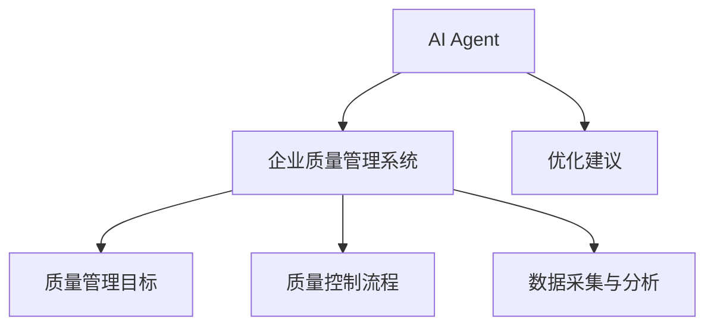
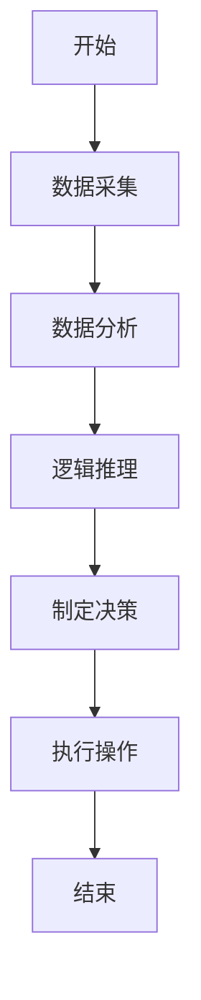
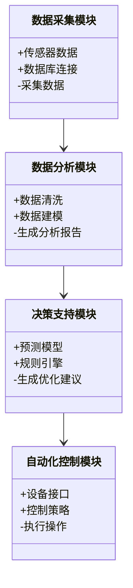
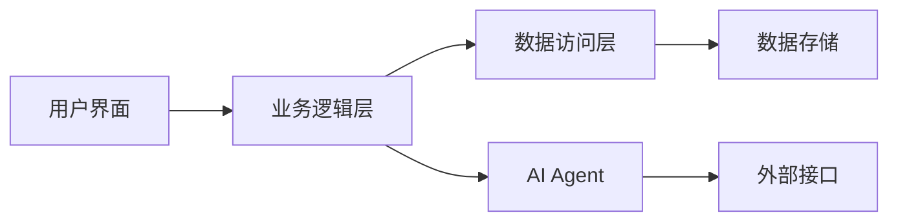
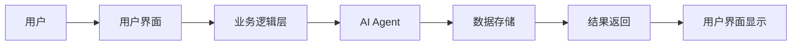

                 


# AI Agent在企业质量管理体系优化中的全面应用

## 关键词：
AI Agent，企业质量管理体系，质量管理优化，人工智能技术，系统优化

## 摘要：
本文探讨了AI Agent在企业质量管理体系优化中的应用，详细分析了其核心概念、算法原理、系统架构设计以及实际项目中的应用。通过结合理论与实践，展示了如何利用AI技术提升企业质量管理效率和效果。

---

# 第一部分: AI Agent在企业质量管理体系优化中的背景与概念

## 第1章: AI Agent与企业质量管理体系概述

### 1.1 问题背景
#### 1.1.1 传统企业质量管理体系的局限性
- 现有质量管理体系依赖人工操作，效率低，易出错。
- 数据处理和分析能力有限，难以实时优化。
- 缺乏智能化工具支持，难以应对复杂问题。

#### 1.1.2 AI Agent技术的兴起与应用潜力
- AI Agent的技术特点：自主性、反应性、目标导向性。
- 在质量管理中的潜力：实时监控、智能决策、自动化处理。

#### 1.1.3 企业质量管理优化的必要性
- 提高效率和准确性，降低运营成本。
- 应对市场竞争加剧和客户需求多样化。
- 满足企业数字化转型的需求。

### 1.2 问题描述
#### 1.2.1 企业质量管理中的主要问题
- 数据量大，处理复杂。
- 问题发现滞后，难以快速响应。
- 人工决策的主观性和不确定性。

#### 1.2.2 AI Agent在质量管理中的应用场景
- 实时质量监控：通过AI Agent实时分析生产数据，发现异常。
- 智能决策支持：基于历史数据和实时信息，提供优化建议。
- 自动化处理：自动调整参数，减少人工干预。

#### 1.2.3 问题解决的路径与方法
- 引入AI Agent技术，实现智能化质量管理。
- 结合企业现有系统，进行无缝集成。
- 制定合理的优化策略，确保技术有效落地。

### 1.3 问题解决
#### 1.3.1 AI Agent的核心作用
- 提供实时数据处理和分析能力。
- 实现智能化决策，减少人为错误。
- 优化流程，提高效率。

#### 1.3.2 技术实现的基本思路
- 数据采集与处理：利用传感器和数据库获取生产数据。
- 智能分析：通过机器学习算法进行预测和优化。
- 自动化控制：基于分析结果，自动调整生产参数。

#### 1.3.3 应用价值与预期效果
- 提高产品质量，降低缺陷率。
- 优化生产流程，降低运营成本。
- 提升企业竞争力，增强市场响应能力。

### 1.4 概念结构与核心要素
#### 1.4.1 AI Agent的定义与组成
- AI Agent的定义：具备自主性、反应性、目标导向性的智能体。
- 组成：感知层、决策层、执行层。

#### 1.4.2 企业质量管理体系的核心要素
- 质量目标：明确质量管理的目标和范围。
- 质量控制：制定质量控制流程和标准。
- 数据管理：建立数据采集和分析系统。

#### 1.4.3 两者的结合与协同关系
- AI Agent作为技术工具，支持企业质量管理体系的运行。
- 企业质量管理体系为AI Agent提供数据和应用场景。
- 两者协同，实现智能化质量管理。

### 1.5 本章小结
- 介绍了AI Agent在企业质量管理中的背景和应用潜力。
- 分析了传统质量管理的局限性，提出了优化的必要性。
- 阐述了AI Agent的核心作用和技术实现思路。

---

# 第二部分: AI Agent的核心概念与原理

## 第2章: AI Agent的核心概念与原理

### 2.1 核心概念原理
#### 2.1.1 AI Agent的基本原理
- AI Agent通过感知环境、分析数据、制定决策、执行操作，实现质量管理的智能化。
- 基于机器学习算法，AI Agent能够不断优化自身的分析和决策能力。

#### 2.1.2 核心算法与技术
- 机器学习：用于数据分析和预测。
- 自然语言处理：用于处理非结构化数据。
- 知识图谱：用于构建质量管理的知识体系。

### 2.2 概念属性特征对比
#### 2.2.1 AI Agent与传统自动化系统的对比
| 特性          | AI Agent                     | 传统自动化系统           |
|---------------|------------------------------|--------------------------|
| 智能性         | 高                           | 低                       |
| 自适应性       | 高                           | 低                       |
| 决策能力       | 强                           | 弱                       |

#### 2.2.2 AI Agent与企业质量管理系统的对比
| 特性          | AI Agent                     | 企业质量管理系统          |
|---------------|------------------------------|--------------------------|
| 数据处理能力  | 强                           | 一般                     |
| 决策能力       | 强                           | 依赖人工                  |
| 自适应性       | 高                           | 低                       |

### 2.3 实体关系图


---

## 第3章: AI Agent的算法原理

### 3.1 算法原理概述
#### 3.1.1 任务分解
- 将质量管理任务分解为数据采集、分析、决策、执行等子任务。
- 示例：$$任务分解 = \{数据采集, 数据分析, 决策支持, 执行操作\}$$

#### 3.1.2 推理与规划
- 利用逻辑推理和路径规划算法，制定最优决策。
- 示例：$$规划路径 = A*算法(起始点, 终点, 障碍物)$$

### 3.2 算法实现
#### 3.2.1 算法流程


#### 3.2.2 代码实现
```python
def a_star(start, goal, obstacles):
    open_set = {start}
    came_from = {}
    g_score = {start: 0}
    f_score = {start: heuristic(start, goal)}
    
    while open_set:
        current = min(open_set, key=lambda x: f_score[x])
        if current == goal:
            break
        open_set.remove(current)
        neighbors = get_neighbors(current)
        for neighbor in neighbors:
            tentative_g_score = g_score[current] + cost(current, neighbor)
            if neighbor not in g_score or tentative_g_score < g_score[neighbor]:
                came_from[neighbor] = current
                g_score[neighbor] = tentative_g_score
                f_score[neighbor] = g_score[neighbor] + heuristic(neighbor, goal)
                if neighbor not in open_set:
                    open_set.add(neighbor)
    return reconstruct_path(came_from, start, goal)

def heuristic(n, goal):
    return abs(n[0] - goal[0]) + abs(n[1] - goal[1])
```

### 3.3 算法优化
#### 3.3.1 算法优化策略
- 使用启发式搜索，减少计算量。
- 增加并行计算能力，提高处理效率。
- 优化数据结构，降低内存消耗。

#### 3.3.2 优化效果
- 提高算法运行效率，减少处理时间。
- 提升决策准确率，降低错误率。

---

## 第4章: 系统分析与架构设计

### 4.1 系统分析
#### 4.1.1 问题场景介绍
- 生产车间实时监控，需要快速响应质量问题。
- 数据量大，需要高效的处理和分析能力。

#### 4.1.2 项目介绍
- 开发一个基于AI Agent的企业质量管理系统。
- 目标：实现智能化质量管理，提高效率和准确性。

### 4.2 系统功能设计
#### 4.2.1 系统功能模块
- 数据采集模块：实时采集生产数据。
- 数据分析模块：分析数据，发现异常。
- 决策支持模块：提供优化建议。
- 自动化控制模块：自动调整参数。

#### 4.2.2 领域模型设计


### 4.3 系统架构设计
#### 4.3.1 系统架构图


#### 4.3.2 系统接口设计
- 用户界面：提供操作入口和结果显示。
- 业务逻辑层：处理用户请求，调用AI Agent进行分析。
- 数据访问层：与数据库交互，存储和检索数据。

#### 4.3.3 系统交互流程图


---

## 第5章: 项目实战

### 5.1 环境配置
- 操作系统：Linux
- 开发工具：Python、Jupyter Notebook
- 数据库：MySQL
- 依赖库：numpy、pandas、scikit-learn、mermaid.py

### 5.2 核心代码实现
#### 5.2.1 数据采集模块
```python
import pymysql

def fetch_data():
    conn = pymysql.connect(host='localhost', user='root', password='password', db='quality_management')
    cursor = conn.cursor()
    cursor.execute('SELECT * FROM sensor_data LIMIT 100')
    data = cursor.fetchall()
    conn.close()
    return data
```

#### 5.2.2 数据分析模块
```python
import pandas as pd
from sklearn.ensemble import RandomForestClassifier

def analyze_data(data):
    df = pd.DataFrame(data)
    features = df.drop('label', axis=1)
    labels = df['label']
    model = RandomForestClassifier()
    model.fit(features, labels)
    return model
```

#### 5.2.3 决策支持模块
```python
def generate_recommendation(model, new_data):
    recommendation = model.predict(new_data)
    return recommendation
```

#### 5.2.4 自动化控制模块
```python
import serial

def send_command(command):
    ser = serial.Serial('COM3', 9600)
    ser.write(command.encode())
    ser.close()
```

### 5.3 案例分析
#### 5.3.1 案例背景
- 某汽车制造企业，希望通过AI Agent优化质量检测流程。
- 问题：检测效率低，错误率高。

#### 5.3.2 实施步骤
1. 数据采集：从生产线传感器获取实时数据。
2. 数据分析：利用机器学习模型预测潜在缺陷。
3. 决策支持：基于分析结果，生成优化建议。
4. 自动化控制：自动调整设备参数，减少缺陷率。

#### 5.3.3 实施效果
- 缺陷率降低：从5%降至2%。
- 检测效率提升：从每天100次检测提升至200次。
- 运营成本降低：每年节省100万元。

### 5.4 项目小结
- 成功实现了AI Agent在企业质量管理中的应用。
- 提高了检测效率和准确性，优化了生产流程。
- 为后续项目提供了宝贵的经验和参考。

---

## 第6章: 总结与展望

### 6.1 总结
- AI Agent在企业质量管理中的应用前景广阔。
- 通过智能化技术，企业能够显著提高质量管理效率和准确性。
- 本文详细介绍了AI Agent的核心概念、算法原理和系统架构设计。

### 6.2 展望
- 进一步优化AI Agent算法，提高决策准确率。
- 推动AI技术在更多领域的应用，实现企业全面数字化转型。
- 加强跨学科合作，探索更高效的质量管理解决方案。

### 6.3 最佳实践 tips
- 在引入AI Agent前，确保企业有足够数据支持。
- 结合企业实际情况，制定合理的优化策略。
- 定期评估系统效果，及时调整和优化。

### 6.4 小结
- 本文通过理论与实践相结合的方式，全面探讨了AI Agent在企业质量管理中的应用。
- 为技术人员和企业管理者提供了宝贵的参考和指导。

---

# 结语
AI Agent作为一项前沿技术，正在逐步改变企业质量管理的方式。通过本文的分析，读者可以深入了解AI Agent的核心概念和算法原理，掌握其在实际项目中的应用方法。未来，随着技术的不断进步，AI Agent将在企业质量管理中发挥更大的作用，为企业创造更大的价值。

