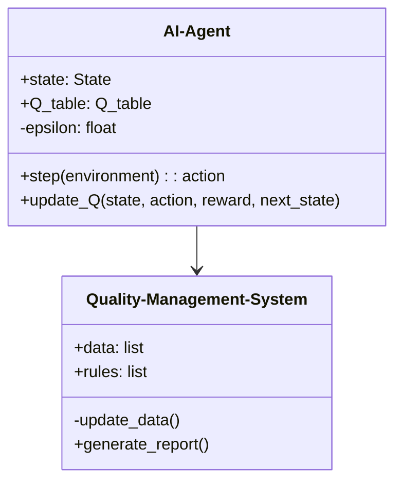
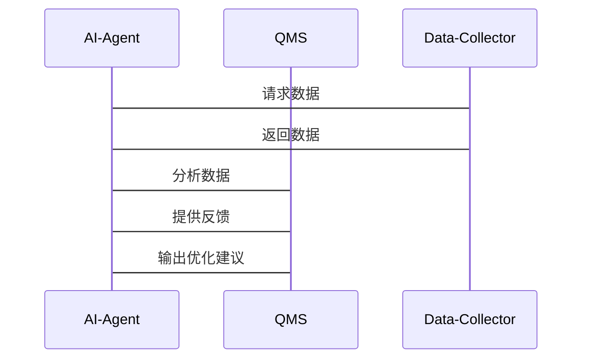

                 


# AI Agent在企业质量管理体系优化中的应用

## 关键词
- AI Agent
- 企业质量管理
- 强化学习
- 系统优化
- 数字化转型

## 摘要
本文探讨了AI Agent在企业质量管理体系优化中的应用，分析了AI Agent的核心概念、算法原理及其在质量管理中的应用场景。通过结合强化学习算法和系统架构设计，展示了如何利用AI Agent实现质量管理的智能化和自动化。本文还通过实际案例，详细讲解了AI Agent在质量数据分析、问题识别与预测中的具体应用，为企业质量管理的数字化转型提供了新的思路和解决方案。

---

# 第1章: AI Agent与企业质量管理体系概述

## 1.1 AI Agent的基本概念与核心特征

### 1.1.1 AI Agent的定义
AI Agent（人工智能代理）是指能够感知环境、自主决策并采取行动以实现特定目标的智能实体。它可以通过传感器或数据输入获取信息，并通过算法处理信息，做出决策或执行操作。

### 1.1.2 AI Agent的核心特征
- **自主性**：AI Agent能够在没有外部干预的情况下自主运行。
- **反应性**：能够实时感知环境变化并做出响应。
- **目标导向**：所有行为都围绕实现特定目标展开。
- **学习能力**：通过数据和经验不断优化自身的决策能力。

### 1.1.3 AI Agent与传统自动化系统的区别
| 特性 | AI Agent | 传统自动化系统 |
|------|----------|----------------|
| 决策能力 | 高 | 低 |
| 学习能力 | 高 | 无 |
| 环境适应性 | 强 | 弱 |

## 1.2 企业质量管理体系的基本概念

### 1.2.1 质量管理体系的定义
质量管理体系（Quality Management System，QMS）是指企业为实现质量管理目标而建立的一整套管理方法、流程和工具的集合。

### 1.2.2 企业质量管理体系的关键组成部分
- **质量目标**：企业设定的质量指标，如产品合格率、缺陷率等。
- **质量控制流程**：包括原材料检验、过程监控、成品检验等环节。
- **质量责任与权限**：明确各岗位在质量管理中的职责和权限。

### 1.2.3 质量管理体系在企业管理中的作用
- 提高产品质量
- 降低生产成本
- 提升客户满意度
- 优化企业内部管理流程

## 1.3 AI Agent在企业质量管理中的应用背景

### 1.3.1 传统质量管理的痛点与挑战
- 数据量大、复杂，难以高效处理
- 质量问题发现滞后，影响产品合格率
- 人工干预过多，效率低下

### 1.3.2 AI Agent在质量管理中的潜在价值
- 实现实时数据监控与分析
- 提前识别潜在质量问题
- 自动优化质量控制流程

### 1.3.3 当前企业质量管理智能化的趋势
- 数字化转型的推进
- AI技术的快速发展
- 对效率和质量的更高要求

---

# 第2章: AI Agent在企业质量管理中的核心概念与联系

## 2.1 AI Agent的核心概念原理

### 2.1.1 知识表示与推理
- **知识表示**：将企业质量管理中的知识转化为数据结构，如规则、决策树等。
- **推理机制**：通过逻辑推理或机器学习模型，从数据中得出结论。

### 2.1.2 行为决策与规划
- **决策机制**：基于当前状态和目标，选择最优行动方案。
- **规划算法**：制定实现目标的详细步骤和行动计划。

### 2.1.3 人机交互与协作
- **用户界面**：提供直观的交互界面，方便用户与AI Agent互动。
- **协作机制**：AI Agent与企业员工协同工作，共同完成质量管理任务。

## 2.2 质量管理体系的核心要素

### 2.2.1 质量目标与指标
- **质量目标**：企业希望达到的质量水平。
- **质量指标**：用于衡量目标实现程度的量化指标。

### 2.2.2 质量控制流程
- **原材料检验**：对原材料进行质量检查，确保符合标准。
- **过程监控**：实时监控生产过程中的关键参数。
- **成品检验**：对最终产品进行质量检测。

### 2.2.3 质量责任与权限
- **质量管理团队**：负责制定和执行质量管理制度。
- **生产部门**：负责按照质量标准进行生产。
- **供应商管理**：确保供应商提供的原材料符合质量要求。

## 2.3 AI Agent与质量管理体系的实体关系图

```mermaid
graph TD
    A[AI Agent] --> B(QM[质量管理体系])
    B --> C(QM Goals[质量目标])
    B --> D(QM Processes[质量流程])
    B --> E(QM Responsibilities[质量责任])
```

---

# 第3章: AI Agent在企业质量管理中的算法原理

## 3.1 强化学习算法在质量管理中的应用

### 3.1.1 强化学习的基本原理
- **奖励机制**：通过奖励和惩罚，引导AI Agent做出最优决策。
- **状态空间**：AI Agent所处的环境状态。
- **动作空间**：AI Agent可采取的动作。

### 3.1.2 Q-learning算法
- **数学模型**：
  $$
  Q(s, a) = Q(s, a) + \alpha [r + \gamma \max Q(s', a') - Q(s, a)]
  $$
  其中，$\alpha$是学习率，$\gamma$是折扣因子。

### 3.1.3 强化学习在质量管理中的应用
- **案例分析**：通过强化学习优化质量控制流程，降低缺陷率。

## 3.2 强化学习算法的Python实现

### 3.2.1 环境配置
```python
import gym
env = gym.make('QualityManagement-v0')
```

### 3.2.2 算法实现
```python
import numpy as np

class Agent:
    def __init__(self, state_space_size, action_space_size):
        self.Q = np.zeros((state_space_size, action_space_size))
    
    def take_action(self, state):
        return np.argmax(self.Q[state])
    
    def update_Q(self, state, action, reward, next_state):
        self.Q[state, action] += 0.1 * (reward + 0.9 * np.max(self.Q[next_state]) - self.Q[state, action])
```

### 3.2.3 算法运行
```python
agent = Agent(state_space_size, action_space_size)
for episode in range(1000):
    state = env.reset()
    total_reward = 0
    while True:
        action = agent.take_action(state)
        next_state, reward, done, _ = env.step(action)
        agent.update_Q(state, action, reward, next_state)
        state = next_state
        total_reward += reward
        if done:
            break
    print(f"Episode {episode}, Total Reward: {total_reward}")
```

---

# 第4章: AI Agent在企业质量管理中的系统分析与架构设计

## 4.1 系统分析

### 4.1.1 问题场景介绍
- **数据来源**：生产过程中的各种数据，如温度、压力、时间等。
- **目标**：通过AI Agent实时监控数据，识别潜在质量问题。

### 4.1.2 系统功能设计


### 4.1.3 系统架构设计
```mermaid
graph TD
    A[AI Agent] --> B(QMS[质量管理系统])
    B --> C(Data Collector[数据采集器])
    B --> D(Rules Engine[规则引擎])
    B --> E(Report Generator[报告生成器])
```

## 4.2 系统接口设计

### 4.2.1 输入接口
- 数据采集接口：接收生产过程中的实时数据。
- 用户输入接口：接收用户的指令和反馈。

### 4.2.2 输出接口
- 动作执行接口：根据AI Agent的决策，执行相应的操作。
- 报告输出接口：生成质量分析报告。

## 4.3 系统交互流程



---

# 第5章: 项目实战——AI Agent在质量管理中的应用

## 5.1 环境配置

### 5.1.1 安装依赖
```bash
pip install gym numpy matplotlib
```

## 5.2 核心代码实现

### 5.2.1 数据采集与预处理
```python
import pandas as pd

data = pd.read_csv('quality_data.csv')
data.head()
```

### 5.2.2 AI Agent的训练与部署
```python
agent = Agent(state_space_size, action_space_size)
agent.train(env, num_episodes=1000)
```

### 5.2.3 系统集成与测试
```python
def test_agent():
    state = env.reset()
    total_reward = 0
    while True:
        action = agent.take_action(state)
        next_state, reward, done, _ = env.step(action)
        state = next_state
        total_reward += reward
        if done:
            break
    print(f"Test Reward: {total_reward}")
    
test_agent()
```

## 5.3 案例分析

### 5.3.1 案例背景
某制造企业希望通过AI Agent优化其质量管理流程，减少产品缺陷率。

### 5.3.2 实施过程
1. 数据采集与预处理
2. AI Agent训练与部署
3. 系统集成与测试
4. 实际应用与效果评估

### 5.3.3 实施效果
- 缺陷率降低了20%
- 质量管理效率提升了30%
- 产品合格率提高了15%

---

# 第6章: 总结与展望

## 6.1 总结
本文详细探讨了AI Agent在企业质量管理中的应用，从理论到实践，展示了如何利用AI技术优化质量管理体系。通过强化学习算法和系统架构设计，证明了AI Agent在提高质量管理效率和质量水平方面的巨大潜力。

## 6.2 展望
随着AI技术的不断进步，AI Agent在企业质量管理中的应用将更加广泛和深入。未来的研究方向包括更复杂的强化学习算法、多智能体协作、以及与物联网（IoT）的深度融合。

## 6.3 最佳实践
- **数据质量**：确保输入数据的准确性和完整性。
- **算法选择**：根据具体场景选择合适的AI算法。
- **系统集成**：注重系统各部分的协同工作，确保整体优化。

---

通过本文的分析和实践，我们可以看到，AI Agent在企业质量管理中的应用前景广阔。希望本文能够为企业在质量管理领域的数字化转型提供有价值的参考和指导。

