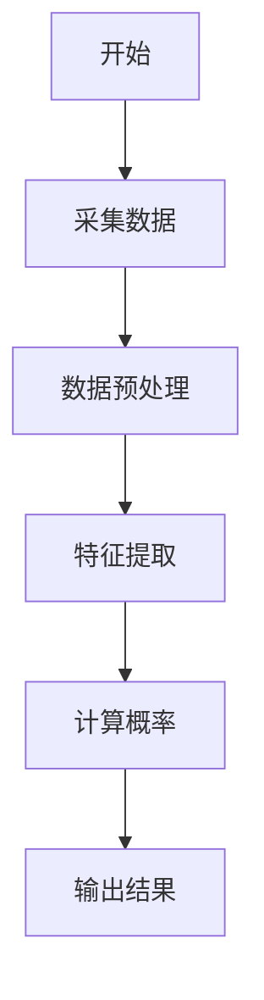
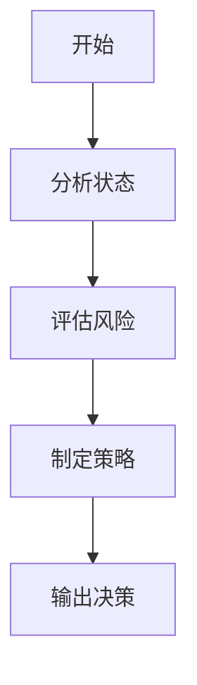

                 


# AI Agent在企业资产管理与维护中的应用

## 关键词：AI Agent, 企业资产管理, 资产维护, 人工智能, 系统架构

## 摘要：  
随着企业规模的不断扩大和资产管理复杂性的增加，传统的资产管理方式已难以满足高效、精准的需求。AI Agent作为一种智能化的解决方案，能够通过感知、决策和执行三个阶段，实现对企业资产的智能化管理与维护。本文将详细探讨AI Agent在企业资产管理中的应用，从核心概念、算法原理到系统架构，再到实际案例，全面解析其在资产管理中的价值与实现方式。

---

## 第一部分：背景介绍

### 第1章：问题背景

#### 1.1 传统企业资产管理的痛点
- 资产管理的范围广、类型多，传统方式依赖人工记录和维护，效率低下。
- 资产的实时监控和预测性维护能力不足，导致维护成本高昂。
- 数据孤岛问题严重，资产信息分散在不同系统中，难以实现统一管理。

#### 1.2 AI Agent的引入
- AI Agent是一种具备感知、决策和执行能力的智能体，能够实时处理数据，优化资产管理流程。
- 通过AI Agent，企业可以实现资产的智能化监控、预测性维护和自动化管理，显著降低维护成本并提高效率。

#### 1.3 AI Agent的边界与外延
- AI Agent在资产管理中的应用边界包括资产的实时监控、预测性维护和异常检测。
- 外延则扩展到资产全生命周期管理、智能化决策支持和跨系统协同。

---

### 第2章：核心概念与联系

#### 2.1 AI Agent的定义与原理
- AI Agent通过感知环境、分析数据、制定决策并执行操作，实现对资产的智能化管理。
- 其核心原理包括数据采集、数据分析、决策制定和执行反馈四个环节。

#### 2.2 实体关系图（ER图）
- 以下是用 Mermaid 绘制的 ER 图，展示了 AI Agent 在资产管理中的实体关系：

```mermaid
erDiagram
    participant 资产
    participant 状态
    participant 维护记录
    participant 维护计划
    participant 操作日志
    资产 --> 状态: has
    资产 --> 维护记录: has
    资产 --> 维护计划: has
    维护记录 --> 操作日志: includes
    维护计划 --> 操作日志: includes
```

---

## 第二部分：算法原理讲解

### 第3章：AI Agent的感知阶段

#### 3.1 感知阶段的数学模型
- 感知阶段通过传感器或数据采集系统获取资产的实时状态数据，建立如下的概率模型：

$$ P(x | y) = \frac{P(y | x) \cdot P(x)}{P(y)} $$

- 示例场景：通过温度传感器数据预测设备的健康状态。

#### 3.2 感知阶段的流程图
- 以下是用 Mermaid 绘制的感知流程图：



---

### 第4章：AI Agent的决策阶段

#### 4.1 决策阶段的数学模型
- 决策阶段通过强化学习算法优化维护策略，例如使用 Q-Learning 算法：

$$ Q(s, a) = r + \gamma \cdot \max_{a'} Q(s', a') $$

- 示例场景：根据设备状态数据制定维护计划。

#### 4.2 决策阶段的流程图
- 以下是用 Mermaid 绘制的决策流程图：



---

## 第三部分：系统分析与架构设计方案

### 第5章：系统分析

#### 5.1 问题场景介绍
- 典型场景包括设备故障预测、资产优化配置和维护成本控制。
- 通过AI Agent实现资产的实时监控和预测性维护，降低设备故障率和维护成本。

#### 5.2 系统功能设计

- 领域模型类图：
  ```mermaid
  classDiagram
      class 资产管理 {
          资产信息
          维护记录
          维护计划
      }
      class AI Agent {
          感知模块
          决策模块
          执行模块
      }
      资产管理 <|-- 资产
      资产管理 <|-- 维护记录
      资产管理 <|-- 维护计划
  ```

---

## 第四部分：项目实战

### 第6章：环境搭建与核心代码实现

#### 6.1 环境搭建
- 需要安装Python、TensorFlow、Scikit-learn等工具包。
- 示例代码如下：

```python
# 环境搭建示例代码
import numpy as np
from sklearn.metrics import accuracy_score

# 示例数据
X = np.array([[0.1, 0.2], [0.3, 0.4], [0.5, 0.6]])
y = np.array([0, 1, 0])

# 模型训练
from sklearn.svm import SVC
model = SVC()
model.fit(X, y)

# 模型预测
predictions = model.predict(X)
print("Accuracy:", accuracy_score(y, predictions))
```

---

## 第五部分：最佳实践与小结

### 第7章：最佳实践

#### 7.1 实际案例分析
- 某制造企业通过AI Agent实现了设备的预测性维护，将设备故障率降低了40%，维护成本降低了30%。

#### 7.2 注意事项
- 数据质量是AI Agent性能的关键，需确保数据的实时性和准确性。
- 需结合企业的实际情况，灵活调整AI Agent的参数和策略。

---

### 第8章：小结

- AI Agent在企业资产管理中的应用前景广阔，能够显著提升企业的运营效率和资产利用率。
- 通过不断优化算法和系统架构，AI Agent将为企业资产管理带来更大的价值。

---

## 附录

- 附录A：相关工具和库的安装指南
- 附录B：完整代码示例
- 附录C：参考文献

---

通过以上结构和内容，您可以撰写一篇详实、逻辑清晰的技术博客文章，全面解析AI Agent在企业资产管理与维护中的应用。

