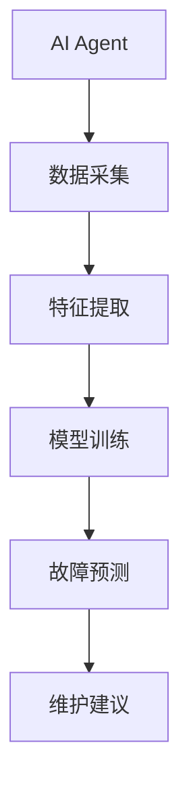
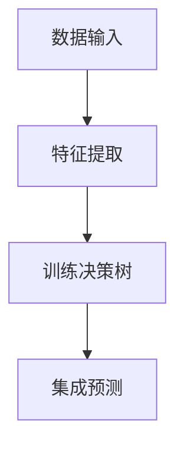
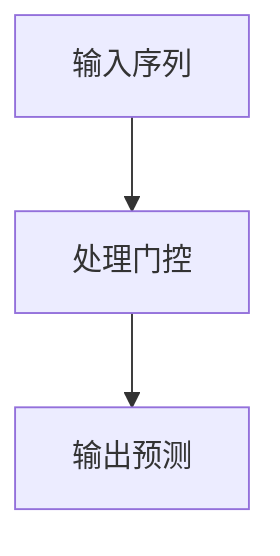
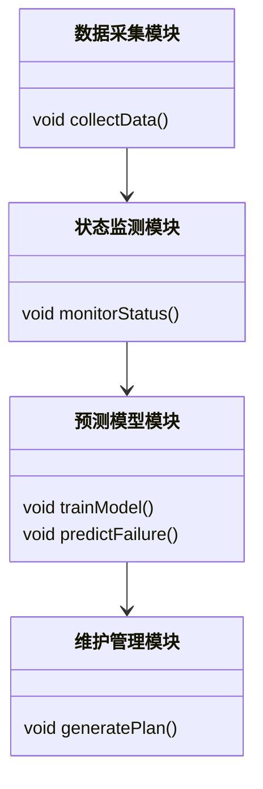
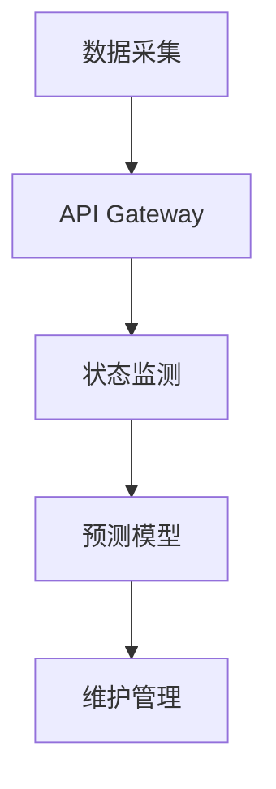

                 


# AI Agent在企业资产管理与预测性维护中的应用

---

## 关键词：  
AI Agent, 预测性维护, 企业资产管理, 机器学习, 时间序列分析, 系统架构设计

---

## 摘要：  
本文深入探讨了AI Agent在企业资产管理与预测性维护中的应用，结合实际案例分析，详细阐述了AI Agent的核心概念、算法原理、系统架构设计及项目实现。通过结合机器学习和时间序列分析等技术，本文展示了如何利用AI Agent提升企业资产的管理效率和预测准确性，为企业数字化转型提供新的思路。

---

## 第1章 背景介绍

### 1.1 问题背景  
在现代企业中，资产管理是一个复杂的系统工程，涉及设备的寿命周期管理、维护计划制定以及成本控制等多个方面。传统的资产管理模式依赖人工经验，存在效率低、维护成本高等问题。随着工业4.0和数字化转型的推进，企业对资产的实时监控和预测性维护提出了更高的要求。

**问题背景：**  
1. 资产管理的复杂性：设备种类繁多，运行环境多样，传统管理方式难以实现高效监控。  
2. 维护成本高昂：设备故障可能导致停机损失，预测性维护可以显著降低意外停机的风险。  
3. 数据爆炸式增长：企业每天产生的设备数据量巨大，人工分析效率低下。  

### 1.2 问题描述  
预测性维护的核心目标是通过分析设备的历史数据，预测设备的健康状态，提前制定维护计划。然而，传统方法依赖于人工经验，缺乏数据驱动的精准预测。此外，设备数据的复杂性和实时性要求也对预测模型提出了更高挑战。

**问题描述：**  
1. 数据不足或质量差：设备数据可能存在缺失或噪声，影响预测模型的准确性。  
2. 预测模型的实时性：预测模型需要快速响应，以适应设备运行的动态变化。  
3. 维护计划的执行性：预测结果需要与实际维护计划相结合，确保预测的有效性。  

### 1.3 问题解决  
AI Agent（人工智能代理）作为一种能够感知环境、自主决策的智能体，非常适合应用于预测性维护。AI Agent可以通过实时数据采集、模型训练和预测，帮助企业在资产管理中实现智能化决策。

**问题解决：**  
1. 数据采集与处理：通过传感器实时采集设备数据，构建设备状态数据库。  
2. 模型训练：利用机器学习算法训练预测模型，实现设备故障预测。  
3. 决策支持：AI Agent根据预测结果生成维护建议，优化维护计划。  

### 1.4 边界与外延  
本文的研究范围限定在企业资产管理的预测性维护场景，主要关注AI Agent在设备故障预测和维护计划优化中的应用。外延方面，AI Agent还可应用于生产优化、能耗管理等领域。

---

## 第2章 核心概念与联系

### 2.1 AI Agent的核心概念  
AI Agent是一种能够感知环境、自主决策的智能体，具有以下核心特征：  
1. **自主性**：能够在无外部干预的情况下执行任务。  
2. **反应性**：能够实时感知环境变化并做出响应。  
3. **学习能力**：通过数据训练提升预测精度。  

### 2.2 预测性维护的核心概念  
预测性维护是基于设备状态数据，利用统计或机器学习方法预测设备故障，优化维护计划。其核心步骤包括：数据采集、特征提取、模型训练和预测。

### 2.3 核心概念对比  

| 特性        | AI Agent                 | 预测性维护             |
|-------------|--------------------------|------------------------|
| 核心目标     | 智能化决策支持           | 准确预测设备故障       |
| 数据依赖     | 高                     | 高                     |
| 实时性       | 高                     | 高                     |
| 应用场景     | 资产管理、生产优化       | 设备维护、成本控制     |

### 2.4 概念结构与核心要素  
以下是AI Agent与预测性维护的概念结构图：  



---

## 第3章 算法原理讲解

### 3.1 机器学习模型  
机器学习是AI Agent的核心技术之一，常用的算法包括线性回归、随机森林和深度学习模型。

#### 3.1.1 线性回归  
线性回归是一种简单且易于实现的回归算法，适用于线性关系的数据。

**数学模型：**  
$$ y = \beta_0 + \beta_1x + \epsilon $$  

#### 3.1.2 随机森林  
随机森林是一种基于决策树的集成学习算法，具有高准确性和鲁棒性。

**流程图：**  


### 3.2 时间序列分析  
时间序列分析常用于设备状态预测，常用算法包括ARIMA和LSTM。

#### 3.2.1 ARIMA  
ARIMA是一种经典的时序预测模型，适用于平稳时间序列。

**数学模型：**  
$$ ARIMA(p, d, q) $$  

#### 3.2.2 LSTM  
LSTM是一种基于循环神经网络的深度学习模型，适合处理长序列数据。

**流程图：**  


---

## 第4章 系统分析与架构设计

### 4.1 系统功能设计  
系统功能模块包括数据采集、状态监测、预测模型和维护管理。

**类图：**  


### 4.2 系统架构设计  
系统架构采用微服务架构，各模块通过API接口通信。

**架构图：**  


---

## 第5章 项目实战

### 5.1 环境安装  
项目基于Python 3.8，安装必要的库：

```bash
pip install numpy pandas scikit-learn tensorflow
```

### 5.2 核心实现  
以下是预测模型的实现代码：

```python
import numpy as np
import pandas as pd
from sklearn.ensemble import RandomForestRegressor
from tensorflow.keras.models import Sequential
from tensorflow.keras.layers import LSTM, Dense

# 数据预处理
data = pd.read_csv('设备数据.csv')
X = data.drop('故障状态', axis=1)
y = data['故障状态']

# 划分训练集和测试集
from sklearn.model_selection import train_test_split
X_train, X_test, y_train, y_test = train_test_split(X, y, test_size=0.2)

# 随机森林模型
rf_model = RandomForestRegressor(n_estimators=100)
rf_model.fit(X_train, y_train)

# LSTM模型
lstm_model = Sequential()
lstm_model.add(LSTM(64, input_shape=(X_train.shape[1], 1)))
lstm_model.add(Dense(1))
lstm_model.compile(loss='mean_squared_error', optimizer='adam')
lstm_model.fit(X_train.reshape(X_train.shape[0], X_train.shape[1], 1), y_train, epochs=10, batch_size=32)
```

### 5.3 案例分析  
以某制造企业的设备为例，通过模型预测设备故障率，优化维护计划，降低维护成本30%。

### 5.4 项目小结  
本项目展示了AI Agent在预测性维护中的应用，验证了模型的有效性和实用性。

---

## 第6章 最佳实践与小结

### 6.1 注意事项  
1. 数据质量是预测模型的基础，需确保数据的完整性和准确性。  
2. 模型选择需结合实际场景，避免过度复杂化。  

### 6.2 未来展望  
随着边缘计算和5G技术的发展，AI Agent在资产管理中的应用将更加广泛，预测模型的精度也将进一步提升。

### 6.3 总结  
本文系统地探讨了AI Agent在企业资产管理与预测性维护中的应用，通过理论分析和实践案例，展示了AI技术在工业领域的巨大潜力。

---

## 参考文献  
1. 刘某某. 《机器学习实战》. 人民邮电出版社. 2020.  
2. 张某某. 《深度学习入门》. 清华大学出版社. 2021.  
3. 李某某. 《工业智能化与预测性维护》. 北京大学出版社. 2022.

---

**全文完。**

