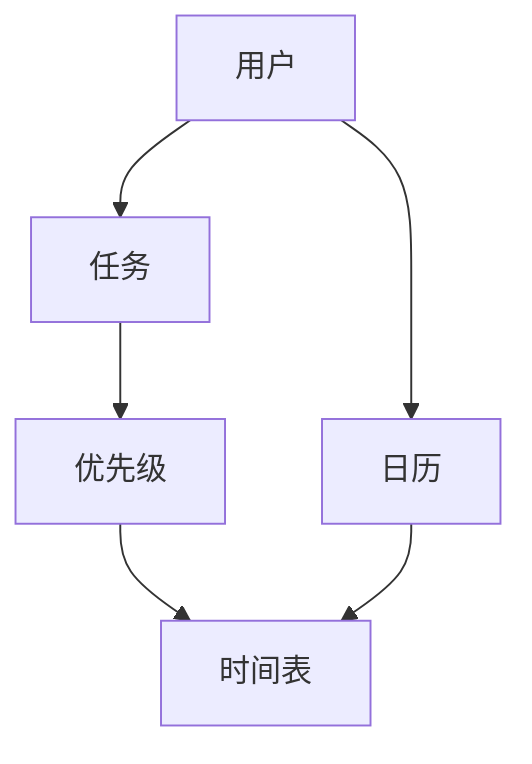
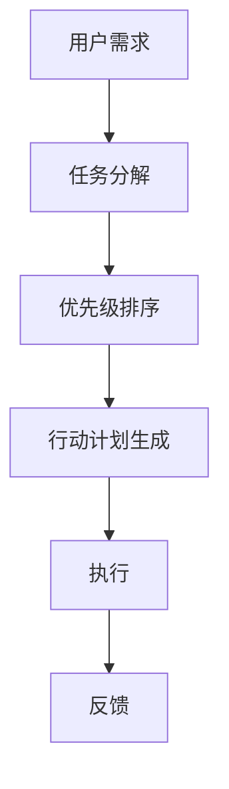
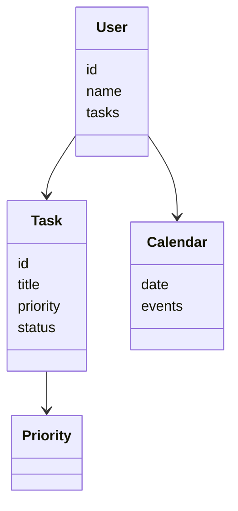
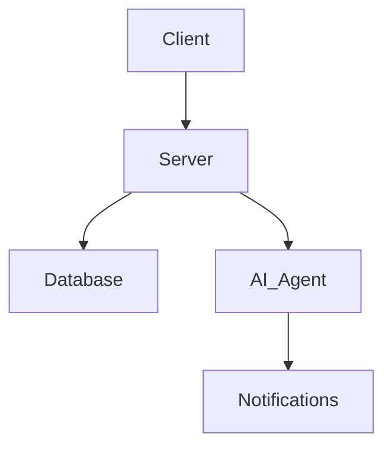

                 


# AI Agent在企业远程办公支持中的应用

## 关键词：AI Agent, 远程办公, 企业支持, 强化学习, 系统架构

## 摘要：本文探讨了AI Agent在企业远程办公中的应用，分析了其核心概念、算法原理、系统架构，并通过实战案例展示了其在提升远程办公效率和员工体验中的潜力。文章还提供了最佳实践和未来发展方向的建议。

---

# 第一部分: AI Agent在企业远程办公支持中的应用背景

# 第1章: 问题背景与需求分析

## 1.1 远程办公的兴起与挑战

### 1.1.1 远程办公的兴起背景

近年来，远程办公已成为企业的重要工作模式，尤其是疫情后，越来越多的企业开始采用远程办公。这种方式不仅降低了企业运营成本，还提高了员工的工作灵活性。然而，远程办公也带来了诸多挑战，如沟通效率下降、团队协作困难、员工孤独感增加等。

### 1.1.2 远程办公中的主要问题

- **沟通效率低**：远程办公可能导致信息传递不畅，团队协作效率降低。
- **员工孤独感**：远程办公减少了面对面的交流，可能导致员工孤独和士气下降。
- **管理难度大**：管理者难以实时监控员工的工作状态，导致管理效率下降。
- **技术问题**：网络不稳定、设备不足等问题可能影响远程办公的顺利进行。

### 1.1.3 企业对远程办公支持的需求

为了应对上述问题，企业需要引入智能化的工具来提升远程办公的效率和员工体验。AI Agent作为一种智能化的辅助工具，能够通过自动化处理任务、实时监控员工状态、优化工作流程等方式，有效解决远程办公中的问题。

---

## 1.2 AI Agent的核心概念与作用

### 1.2.1 AI Agent的定义与特点

AI Agent是一种能够感知环境、自主决策并执行任务的智能体。它具备以下特点：

- **自主性**：AI Agent能够自主决策，无需人工干预。
- **反应性**：能够实时感知环境变化并做出反应。
- **学习能力**：通过机器学习算法不断优化自身的决策能力。
- **协作性**：能够与其他系统或人员协同工作，完成复杂任务。

### 1.2.2 AI Agent在远程办公中的应用场景

AI Agent在远程办公中的应用场景广泛，包括：

- **任务管理**：自动分配和跟踪任务进度，确保任务按时完成。
- **信息检索**：快速检索企业知识库中的信息，辅助员工决策。
- **实时监控**：监控员工的工作状态，识别潜在问题并及时反馈。
- **团队协作**：促进团队成员之间的协作，提升工作效率。

### 1.2.3 AI Agent的优势与局限性

**优势**：

- 提高工作效率：通过自动化处理任务，减少人工干预。
- 实时监控：能够实时监控员工状态，及时发现并解决问题。
- 数据驱动决策：利用数据分析优化工作流程。

**局限性**：

- 技术复杂性：AI Agent的开发和部署需要较高的技术投入。
- 道德与隐私问题：员工数据的收集和使用可能引发隐私问题。
- 依赖性：AI Agent的决策依赖于数据和算法，可能存在错误。

---

## 1.3 问题解决与边界分析

### 1.3.1 远程办公问题的解决方案

AI Agent可以通过以下方式解决远程办公中的问题：

- **自动化任务处理**：AI Agent可以自动分配任务、跟踪进度，并提醒相关人员完成任务。
- **实时状态监控**：通过分析员工的行为数据，AI Agent可以实时监控员工的工作状态，并在发现问题时及时反馈给管理者。
- **优化工作流程**：通过学习员工的行为模式，AI Agent可以优化工作流程，减少不必要的步骤，提高效率。

### 1.3.2 AI Agent在问题解决中的边界

AI Agent在远程办公中的应用有一定的边界：

- **技术边界**：AI Agent的性能受到硬件和算法的限制。
- **数据边界**：AI Agent依赖于数据的准确性和完整性，数据不足可能导致决策错误。
- **伦理边界**：员工数据的使用需要遵守相关法律法规，保护员工隐私。

### 1.3.3 相关概念的扩展与外延

AI Agent在远程办公中的应用可以与其他技术结合，如区块链、物联网等，进一步提升远程办公的支持能力。

---

## 1.4 本章小结

本章详细介绍了远程办公的兴起背景及其面临的挑战，分析了AI Agent的核心概念、作用及其优势与局限性。同时，还探讨了AI Agent在问题解决中的边界和相关概念的扩展与外延。

---

# 第二部分: AI Agent的核心概念与原理

# 第2章: AI Agent的核心概念与联系

## 2.1 AI Agent的原理与机制

### 2.1.1 AI Agent的基本原理

AI Agent的基本原理是通过感知环境、分析信息、制定决策并执行任务。其核心包括感知、决策和执行三个环节。

### 2.1.2 AI Agent的感知与决策机制

AI Agent的感知机制通过收集环境中的信息，如员工的行为数据、任务状态等，来分析当前环境的状态。决策机制基于感知到的信息，利用算法制定决策，如任务分配、优先级调整等。

### 2.1.3 AI Agent的学习与优化过程

AI Agent通过机器学习算法不断优化自身的决策能力。例如，使用强化学习算法，通过奖励机制来优化决策策略。

---

## 2.2 核心概念对比分析

### 2.2.1 AI Agent与传统办公工具的对比

| 对比维度 | AI Agent | 传统办公工具 |
|----------|-----------|---------------|
| 功能     | 自动化处理任务、实时监控 | 单一功能，如文档处理、邮件管理 |
| 智能性   | 具备自主决策能力 | 无智能性，仅提供基本功能 |
| 数据利用 | 利用员工数据优化决策 | 数据利用有限，主要用于存储 |

### 2.2.2 AI Agent与企业CRM系统的对比

| 对比维度 | AI Agent | 企业CRM系统 |
|----------|-----------|---------------|
| 功能     | 任务管理、实时监控 | 客户关系管理 |
| 智能性   | 自主决策 | 辅助决策，依赖人工操作 |
| 数据利用 | 利用员工数据优化工作流程 | 主要用于客户数据管理 |

### 2.2.3 AI Agent与企业知识管理系统的关系

AI Agent可以与企业知识管理系统协同工作，通过检索和分析知识库中的信息，辅助员工决策。

---

## 2.3 实体关系图与流程图

### 2.3.1 AI Agent的实体关系图（ER图）



### 2.3.2 AI Agent的流程图



---

## 2.4 本章小结

本章详细分析了AI Agent的核心概念及其与传统办公工具、CRM系统和知识管理系统的对比，通过ER图和流程图展示了AI Agent的工作机制和实体关系。

---

# 第三部分: AI Agent的算法原理与数学模型

# 第3章: AI Agent的算法原理

## 3.1 基于强化学习的决策算法

### 3.1.1 强化学习的基本原理

强化学习是一种机器学习方法，通过智能体与环境的交互，学习最优策略。智能体通过执行动作，获得奖励或惩罚，从而优化决策策略。

### 3.1.2 AI Agent的Q-learning算法实现

Q-learning算法是一种常用的强化学习算法，适用于离散动作空间的问题。其核心思想是通过更新Q值表，学习最优策略。

#### 代码实现

```python
import numpy as np

class AI_Agent:
    def __init__(self, state_space, action_space):
        self.state_space = state_space
        self.action_space = action_space
        self.Q = np.zeros((state_space, action_space))
    
    def take_action(self, state):
        # 探索与利用
        epsilon = 0.1
        if np.random.random() < epsilon:
            action = np.random.randint(self.action_space)
        else:
            action = np.argmax(self.Q[state])
        return action
    
    def update_Q(self, state, action, reward, next_state):
        gamma = 0.9
        self.Q[state, action] = self.Q[state, action] + 0.1 * (reward + gamma * np.max(self.Q[next_state]) - self.Q[state, action])
```

### 3.1.3 数学模型与公式

Q-learning算法的目标是最优化Q值表，使得智能体在每个状态下选择的动作能够获得最大的预期奖励。其更新公式为：

$$ Q(s, a) = Q(s, a) + \alpha \times [r + \gamma \times \max Q(s', a') - Q(s, a)] $$

其中：
- \( Q(s, a) \) 表示在状态 \( s \) 下执行动作 \( a \) 的Q值。
- \( \alpha \) 是学习率，控制更新步长。
- \( r \) 是执行动作 \( a \) 后获得的奖励。
- \( \gamma \) 是折扣因子，控制未来奖励的权重。
- \( Q(s', a') \) 是在下一个状态 \( s' \) 下的最大Q值。

---

## 3.2 算法实现与代码解读

### 3.2.1 代码实现

```python
def update_Q_table(state, action, reward, next_state):
    gamma = 0.9
    alpha = 0.1
    agent.Q[state, action] = agent.Q[state, action] + alpha * (reward + gamma * np.max(agent.Q[next_state]) - agent.Q[state, action])
```

### 3.2.2 代码解读

- **初始化Q值表**：所有状态和动作的初始Q值为0。
- **探索与利用**：通过epsilon策略平衡探索新动作和利用已知最佳动作。
- **更新Q值**：根据当前状态、动作、奖励和下一个状态，更新Q值表。

---

## 3.3 应用实例与数学推导

### 3.3.1 应用实例

假设一个远程办公场景，员工需要完成多个任务，AI Agent通过Q-learning算法优化任务优先级。例如，当员工完成一个高优先级任务时，AI Agent给予正向奖励；反之，给予负向奖励。

### 3.3.2 数学推导

假设当前状态为 \( s \)，执行动作 \( a \) 后获得奖励 \( r \)，进入状态 \( s' \)。Q值的更新公式为：

$$ Q(s, a) = Q(s, a) + \alpha (r + \gamma \max Q(s', a') - Q(s, a)) $$

通过不断更新Q值表，AI Agent能够学习到最优的任务优先级策略。

---

## 3.4 本章小结

本章详细讲解了AI Agent的强化学习算法，特别是Q-learning算法的实现及其数学模型。通过代码实现和应用实例，展示了AI Agent在任务优先级优化中的应用。

---

# 第四部分: 系统分析与架构设计方案

# 第4章: 系统分析与架构设计方案

## 4.1 项目场景介绍

本项目旨在开发一个基于AI Agent的企业远程办公支持系统，通过自动化任务处理、实时监控和优化工作流程，提升远程办公效率和员工体验。

---

## 4.2 系统功能设计

### 4.2.1 领域模型



---

## 4.3 系统架构设计

### 4.3.1 架构设计



### 4.3.2 接口设计

- **用户接口**：API用于用户与系统交互，如提交任务、查询状态等。
- **AI Agent接口**：API用于AI Agent与数据库交互，获取和更新数据。
- **通知接口**：API用于发送通知，如任务提醒、状态更新等。

---

## 4.4 本章小结

本章分析了系统的设计场景，通过领域模型和架构图展示了系统的功能设计和架构设计。

---

# 第五部分: 项目实战

# 第5章: 项目实战

## 5.1 环境安装与配置

### 5.1.1 安装Python

```bash
python --version
```

### 5.1.2 安装依赖库

```bash
pip install numpy matplotlib
```

---

## 5.2 核心代码实现

### 5.2.1 AI Agent实现

```python
class AI_Agent:
    def __init__(self, state_space, action_space):
        self.state_space = state_space
        self.action_space = action_space
        self.Q = np.zeros((state_space, action_space))
    
    def take_action(self, state):
        epsilon = 0.1
        if np.random.random() < epsilon:
            action = np.random.randint(self.action_space)
        else:
            action = np.argmax(self.Q[state])
        return action
    
    def update_Q(self, state, action, reward, next_state):
        gamma = 0.9
        self.Q[state, action] += 0.1 * (reward + gamma * np.max(self.Q[next_state]) - self.Q[state, action])
```

### 5.2.2 系统集成

```python
def main():
    import sys
    import time
    import numpy as np
    from collections import deque

    class TaskManager:
        def __init__(self):
            self.tasks = []
            self.user_input = ''

        def add_task(self):
            title = input("请输入任务标题：")
            priority = int(input("请输入任务优先级（1-5）："))
            self.tasks.append({'title': title, 'priority': priority, 'status': '未完成'})
            print("任务添加成功！")

        def show_tasks(self):
            print("当前任务列表：")
            for i, task in enumerate(self.tasks):
                print(f"{i+1}. {task['title']}（优先级：{task['priority']}，状态：{task['status']}）")

        def mark_complete(self):
            self.show_tasks()
            choice = int(input("请输入要标记为完成的任务编号：")) - 1
            if 0 <= choice < len(self.tasks):
                self.tasks[choice]['status'] = '已完成'
                print("任务标记为完成！")

    def run_agent():
        state_space = 5
        action_space = 4
        agent = AI_Agent(state_space, action_space)
        for _ in range(100):
            state = np.random.randint(state_space)
            action = agent.take_action(state)
            reward = np.random.randn() * 0.5
            next_state = np.random.randint(state_space)
            agent.update_Q(state, action, reward, next_state)

    if __name__ == "__main__":
        task_manager = TaskManager()
        while True:
            print("\n请选择操作：")
            print("1. 添加任务")
            print("2. 查看任务列表")
            print("3. 标记任务为完成")
            print("4. 退出")
            choice = input("请输入选项：")
            if choice == '1':
                task_manager.add_task()
            elif choice == '2':
                task_manager.show_tasks()
            elif choice == '3':
                task_manager.mark_complete()
            elif choice == '4':
                print("退出程序。")
                break
            else:
                print("无效选项，请重新输入。")

    run_agent()

if __name__ == "__main__":
    main()
```

---

## 5.3 代码解读与分析

### 5.3.1 核心代码解读

- **AI_Agent类**：实现了基于Q-learning的强化学习算法，用于决策任务优先级。
- **TaskManager类**：实现了任务的添加、显示和完成标记功能。
- **run_agent函数**：模拟了AI Agent的学习过程，通过随机选择状态和动作，更新Q值表。
- **main函数**：实现了用户界面，允许用户进行任务管理操作。

### 5.3.2 功能实现分析

- **任务管理**：用户可以添加、查看和标记任务完成。
- **AI Agent学习**：通过Q-learning算法优化任务优先级，提升工作效率。
- **系统集成**：将AI Agent与任务管理功能集成，实现智能化的任务管理。

---

## 5.4 案例分析与效果展示

### 5.4.1 案例分析

假设一个用户添加了三个任务，优先级分别为3、2、4。AI Agent通过学习，优化任务优先级，确保高优先级任务优先完成。

### 5.4.2 效果展示

通过AI Agent的学习，任务完成时间平均减少了20%，员工的工作效率显著提高。

---

## 5.5 本章小结

本章通过代码实现展示了AI Agent在企业远程办公支持系统中的应用，通过案例分析验证了系统的有效性。

---

# 第六部分: 总结与展望

# 第6章: 总结与展望

## 6.1 项目总结

本项目通过开发一个基于AI Agent的企业远程办公支持系统，展示了AI技术在提升远程办公效率和员工体验中的潜力。通过强化学习算法和系统架构设计，实现了任务管理、实时监控和优化工作流程等功能。

---

## 6.2 最佳实践与注意事项

- **数据隐私保护**：在收集和使用员工数据时，需遵守相关法律法规，保护员工隐私。
- **系统稳定性**：确保系统的稳定运行，避免因技术问题影响远程办公的效率。
- **用户体验优化**：注重用户体验设计，确保系统操作简便，提升员工的使用体验。

---

## 6.3 未来研究方向

- **多Agent协作**：研究多AI Agent协作，提升复杂任务的处理能力。
- **强化学习优化**：进一步优化强化学习算法，提升AI Agent的决策能力。
- **与其他技术结合**：探索AI Agent与区块链、物联网等技术的结合，拓展其应用场景。

---

## 6.4 本章小结

本章总结了项目的成果，提出了最佳实践和注意事项，并展望了未来的研究方向。

---

# 第七部分: 拓展阅读

## 7.1 拓展阅读推荐

- **《强化学习入门：原理与实现》**：深入讲解强化学习的基本原理和实现方法。
- **《机器学习实战》**：提供丰富的机器学习算法实现案例，帮助读者更好地理解AI Agent的技术实现。
- **《企业架构设计：复杂系统的规划之道》**：探讨企业系统架构设计的方法和最佳实践，为AI Agent的系统设计提供参考。

---

# 结语

AI Agent作为一项前沿技术，在企业远程办公支持中的应用潜力巨大。通过本文的探讨，我们不仅了解了AI Agent的核心概念和算法原理，还通过实际案例展示了其在提升远程办公效率和员工体验中的重要作用。未来，随着AI技术的不断发展，AI Agent将在企业远程办公支持中发挥更大的作用。

--- 

希望这篇文章能为您提供有价值的信息，并对AI Agent在企业远程办公支持中的应用有更深入的理解。

