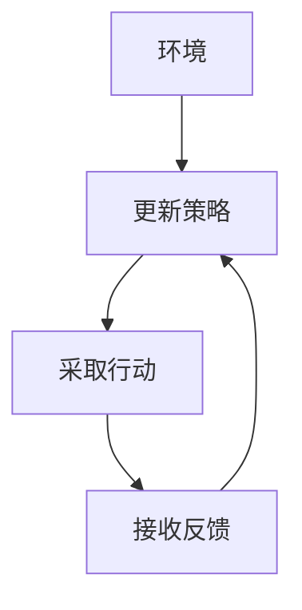
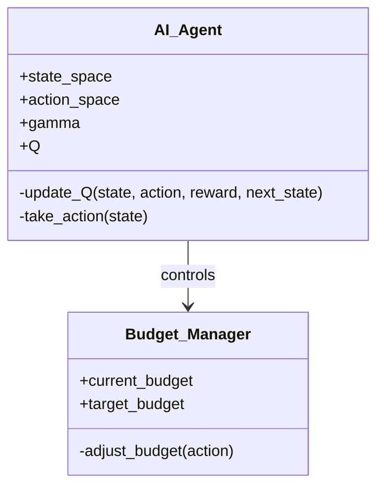
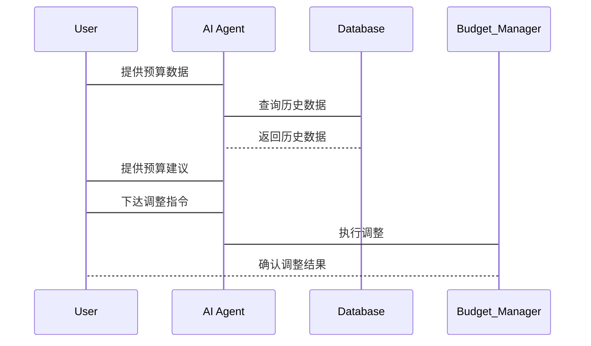

                 


# AI Agent在企业预算管理与成本控制中的应用

## 关键词：AI Agent，预算管理，成本控制，企业财务，人工智能，机器学习

## 摘要：本文详细探讨了AI Agent在企业预算管理与成本控制中的应用，从技术原理到实际案例，深入分析了AI Agent如何通过机器学习、强化学习等技术优化企业的预算管理和成本控制过程，为企业提供智能化、高效的财务解决方案。

---

# 第一部分: AI Agent与企业预算管理基础

## 第1章: AI Agent与企业预算管理概述

### 1.1 AI Agent的基本概念

#### 1.1.1 AI Agent的定义与特点
- **定义**: AI Agent（人工智能代理）是一种能够感知环境并采取行动以实现目标的智能体。它通过接收输入数据，分析并做出决策，执行任务。
- **特点**: 智能性、自主性、反应性、社交性。

#### 1.1.2 AI Agent的核心原理
- **感知与行动**: AI Agent通过传感器或数据输入感知环境，分析数据后采取行动。
- **学习与优化**: 通过机器学习算法不断优化自身的决策能力。

#### 1.1.3 AI Agent与传统预算管理的对比
- **传统预算管理**: 依赖人工分析，周期长，精度低。
- **AI Agent**: 实时分析，高精度，自动化。

### 1.2 企业预算管理的基本概念

#### 1.2.1 预算管理的定义与作用
- **定义**: 预算管理是企业对未来的收入和支出进行规划和控制的过程。
- **作用**: 优化资源配置，控制成本，提高企业盈利能力。

#### 1.2.2 企业预算管理的常见模式
- **固定预算**: 预算固定在一定期间内，不随业务变化调整。
- **滚动预算**: 每期更新预算，更具灵活性。

#### 1.2.3 预算管理的关键环节
- **预算编制**: 预测收入和支出，制定预算计划。
- **预算执行**: 监控实际支出，确保符合预算。
- **预算调整**: 根据实际情况调整预算。

### 1.3 AI Agent在企业预算管理中的应用背景

#### 1.3.1 传统预算管理的局限性
- **数据量大**: 传统预算管理依赖人工分析，效率低下。
- **实时性差**: 无法实时监控和调整预算。
- **准确性低**: 人为因素可能导致预算偏差。

#### 1.3.2 AI技术在企业管理中的潜力
- **数据处理能力**: AI能够快速处理大量数据，提高决策效率。
- **预测能力**: 利用机器学习模型进行精准预测。

#### 1.3.3 AI Agent在预算管理中的优势
- **自动化**: 自动化预算编制和调整。
- **实时监控**: 实时跟踪预算执行情况，及时调整。
- **优化决策**: 基于数据优化预算分配。

### 1.4 本章小结
本章介绍了AI Agent的基本概念及其在企业预算管理中的应用背景，强调了AI技术在预算管理中的潜力和优势。

---

# 第二部分: AI Agent在成本控制中的技术原理

## 第2章: AI Agent的核心技术与算法

### 2.1 AI Agent的核心技术

#### 2.1.1 机器学习算法在AI Agent中的应用
- **监督学习**: 用于分类和回归任务。
- **无监督学习**: 用于聚类分析。
- **强化学习**: 用于动态决策。

#### 2.1.2 自然语言处理在AI Agent中的作用
- **文本分析**: 解析财务报告和市场分析。
- **对话系统**: 与用户进行自然语言交互。

#### 2.1.3 强化学习在AI Agent中的应用
- **定义**: 强化学习是一种通过试错学习最优策略的方法。
- **应用**: 在预算管理和成本控制中优化决策。

### 2.2 AI Agent的算法原理

#### 2.2.1 强化学习算法（Q-Learning）
- **定义**: Q-Learning是一种基于价值的强化学习算法。
- **公式**: 
  $$
  Q(s, a) = Q(s, a) + \alpha \left[ r + \gamma \max Q(s', a') - Q(s, a) \right]
  $$
- **应用**: 用于动态预算调整和成本优化。

#### 2.2.2 监督学习算法（回归与分类）
- **回归**: 预测成本和收入。
- **分类**: 分类成本项目。

#### 2.2.3 聚类算法在成本控制中的应用
- **聚类分析**: 将成本项目分为不同类别，便于管理和优化。

### 2.3 AI Agent的成本控制模型

#### 2.3.1 成本预测模型
- **定义**: 基于历史数据预测未来成本。
- **数学模型**: 
  $$
  y = \beta_0 + \beta_1x + \epsilon
  $$
  其中，$y$ 是预测值，$x$ 是自变量，$\epsilon$ 是误差项。

#### 2.3.2 成本优化模型
- **定义**: 优化成本分配，降低总成本。
- **数学模型**: 使用线性规划模型进行优化。

#### 2.3.3 成本监控模型
- **定义**: 实时监控成本执行情况。
- **数学模型**: 使用时间序列分析模型进行实时预测。

### 2.4 本章小结
本章详细讲解了AI Agent的核心技术与算法，特别是强化学习和机器学习在成本控制中的应用。

---

## 第3章: AI Agent的成本控制算法实现

### 3.1 强化学习算法实现

#### 3.1.1 算法流程图（Mermaid）


#### 3.1.2 Python代码实现
```python
import numpy as np
import random

class AI_Agent:
    def __init__(self, state_space, action_space):
        self.state_space = state_space
        self.action_space = action_space
        self.gamma = 0.99  # 折扣率
        self.alpha = 0.1  # 学习率
        self.Q = np.zeros((state_space, action_space))

    def take_action(self, state):
        if random.random() < 0.1:  # 探索
            return random.randint(0, self.action_space - 1)
        else:  # 利用
            return np.argmax(self.Q[state, :])

    def update_Q(self, state, action, reward, next_state):
        self.Q[state, action] += self.alpha * (reward + self.gamma * np.max(self.Q[next_state, :]) - self.Q[state, action])

# 示例使用
state_space = 10
action_space = 4
agent = AI_Agent(state_space, action_space)
state = 0
action = agent.take_action(state)
reward = 1
next_state = 2
agent.update_Q(state, action, reward, next_state)
```

#### 3.1.3 算法实现细节
- **探索与利用**: 通过随机选择或基于Q值选择。
- **Q值更新**: 使用贝尔曼方程更新Q值。

---

# 第三部分: 企业预算管理与成本控制的系统设计

## 第4章: 企业预算管理系统的AI Agent设计

### 4.1 预算管理场景分析
- **预算编制**: 利用历史数据和市场预测。
- **预算执行**: 实时监控和调整。
- **预算分析**: 分析执行情况，优化预算。

### 4.2 系统功能设计（Mermaid 类图）


### 4.3 系统架构设计（Mermaid 架构图）
```mermaid
C4Context
    title 企业预算管理系统架构
    User->Browser: 使用预算管理系统
    Browser->API Gateway: 调用API
    API Gateway->AI Agent: 调用AI Agent服务
    AI Agent->Database: 查询数据
```

### 4.4 系统接口设计
- **输入接口**: 数据输入和用户交互。
- **输出接口**: 显示预算结果和优化建议。

### 4.5 系统交互流程（Mermaid 序列图）


---

## 第5章: 成本控制系统的AI Agent实现

### 5.1 成本控制场景分析
- **成本预测**: 预测未来成本。
- **成本监控**: 实时监控成本。
- **成本优化**: 优化成本分配。

### 5.2 成本控制模型设计（Mermaid 组件图）
```mermaid
C4Component
    title 成本控制模型
    component AI Agent {
        use Cost_Predictor
        use Cost_Optimizer
    }
    component Cost_Predictor
    component Cost_Optimizer
```

### 5.3 成本预测与优化算法
- **预测算法**: 使用线性回归模型。
- **优化算法**: 使用强化学习优化。

### 5.4 系统实现细节
- **数据预处理**: 清洗和特征工程。
- **模型训练**: 使用历史数据训练模型。
- **实时监控**: 实时更新预测结果。

---

## 第6章: 项目实战

### 6.1 环境安装与配置
- **安装Python**: 使用Anaconda或virtualenv。
- **安装库**: 安装numpy、pandas、scikit-learn、tensorflow等。

### 6.2 系统核心代码实现

#### 6.2.1 数据预处理
```python
import pandas as pd

# 读取数据
data = pd.read_csv('cost_data.csv')

# 数据清洗
data = data.dropna()
data = pd.get_dummies(data)
```

#### 6.2.2 模型训练
```python
from sklearn.linear_model import LinearRegression

# 训练模型
model = LinearRegression()
model.fit(X_train, y_train)

# 预测结果
y_pred = model.predict(X_test)
```

#### 6.2.3 模型优化
```python
import tensorflow as tf
from tensorflow.keras import layers

# 构建神经网络模型
model = tf.keras.Sequential([
    layers.Dense(64, activation='relu'),
    layers.Dense(1)
])

# 编译模型
model.compile(optimizer='adam', loss='mean_squared_error')

# 训练模型
model.fit(X_train, y_train, epochs=100, batch_size=32)
```

#### 6.2.4 结果可视化
```python
import matplotlib.pyplot as plt

plt.scatter(y_test, y_pred)
plt.xlabel('实际值')
plt.ylabel('预测值')
plt.show()
```

### 6.3 实际案例分析
- **案例背景**: 某企业成本数据。
- **数据处理**: 清洗和特征工程。
- **模型训练**: 使用线性回归和神经网络模型。
- **结果分析**: 对比模型预测结果，选择最优模型。

### 6.4 项目总结
- **项目成果**: 成功实现AI Agent在成本控制中的应用。
- **经验总结**: 数据质量和模型选择对结果影响重大。

---

## 第7章: 最佳实践与未来展望

### 7.1 最佳实践
- **数据质量**: 确保数据准确和完整。
- **模型调优**: 根据实际情况调整模型参数。
- **系统维护**: 定期更新模型和数据。

### 7.2 小结
- **回顾**: 本文详细探讨了AI Agent在预算管理和成本控制中的应用。
- **展望**: 未来，AI Agent将在企业财务管理中发挥更大的作用，结合多模态模型和边缘计算，实现更智能的预算管理和成本控制。

---

通过以上详细的内容，我们可以看到AI Agent在企业预算管理与成本控制中的巨大潜力和实际应用价值。随着技术的不断进步，AI Agent将为企业财务管理带来更多的创新和优化。

